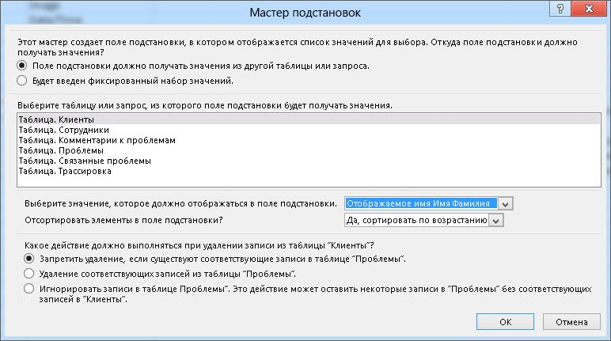
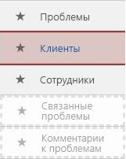
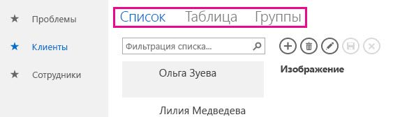
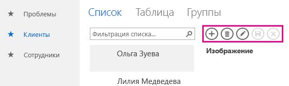
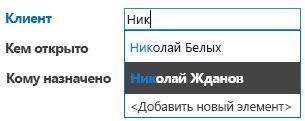
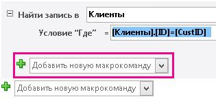
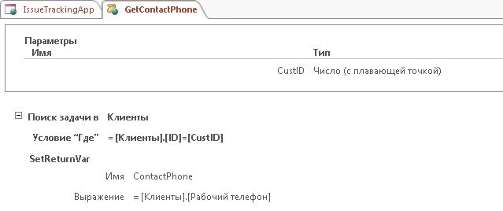
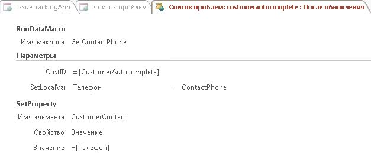
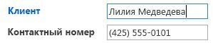

# Создание и настройка веб-приложения в AccessCreate and customize a web app in Access

> [!IMPORTANT]
> Корпорация Майкрософт больше не рекомендует создавать и использовать веб-приложения для Access в SharePoint.Microsoft no longer recommends creating and using Access web apps in SharePoint. В качестве альтернативы можно использовать [Microsoft PowerApps](https://powerapps.microsoft.com/en-us/), чтобы создавать бизнес-решения без кода для Интернета и мобильных устройств.As an alternative, consider using [Microsoft PowerApps](https://powerapps.microsoft.com/en-us/) to build no-code business solutions for the web and mobile devices. 
  
Access 2013 компонентов новая модель приложения, которая позволяет экспертов для быстрого создания веб-приложения.Access 2013 features a new application model that enables subject matter experts to quickly create web-based applications. Входит в состав доступа — это набор шаблонов, которые можно использовать для перехода приступить к созданию приложения.Included with Access are a set of templates that you can use to jump start creating your application.

## Предварительные требования для создания приложения с помощью Access 2013Prerequisites for building an app with Access 2013

Для выполнения действий, описанных в этом примере, вам потребуется следующее:To follow the steps in this example, you need the following:
  
- AccessAccess
    
- Среда разработки SharePointA SharePoint development environment
    
Дополнительные сведения о настройке среды разработки SharePoint видеть [настроить среду разработки, общие для SharePoint](https://docs.microsoft.com/sharepoint/dev/general-development/set-up-a-general-development-environment-for-sharepoint).For more information about setting up your SharePoint development environment, see [Set up a general development environment for SharePoint](https://docs.microsoft.com/sharepoint/dev/general-development/set-up-a-general-development-environment-for-sharepoint). 
  
Дополнительные сведения о получении доступа и SharePoint в разделе [файлов для загрузки](https://msdn.microsoft.com/office/apps/fp123627).For more information about obtaining Access and SharePoint, see [Downloads](https://msdn.microsoft.com/office/apps/fp123627).

## Создание приложенияCreate the app

Предположим, что вы хотите создать приложение Access, который отслеживает проблемы в бизнесе.Suppose you want to create an Access app that tracks issues for your business. Прежде чем начинать создание таблиц и представление «с нуля», необходимо найти шаблона схемы, который соответствует потребностям.Before you start creating the tables and view from scratch, you should search for a schema template that meets your needs.
  
### Чтобы создать приложение отслеживания вопросовTo create the issue tracking app

1. Откройте доступ и выберите пункт **настраиваемых веб-приложения**.Open Access and choose **Custom web app**.
    
2. Введите имя и расположение веб-приложения.Enter a name and the web location for your app. Можно выбрать расположение из **списка** и выберите команду **Создать**.You can also choose a location from the **Locations** list and choose **Create**.
    
3. **Проблемы** в **как для отслеживания?** поле и нажмите клавишу ВВОД.Type **Issues** into the **What would you like to track?** box and then press ENTER. 
    
   На рисунке 1 отображается список шаблонов, которые могут оказаться полезными для отслеживания проблем.A list of templates that might be useful for tracking issues is displayed in Figure 1.
    
   **На рисунке 1. Шаблоны, соответствующие поиску проблем****Figure 1. Templates that match the search for issues**

   ![Шаблоны, соответствующие поиску проблем] (media/odc_Access15_CreateAndCustomizeWebApp_Figure01.JPG "Шаблоны, соответствующие поиску проблем")
  
4. Выберите **проблемы**.Choose **Issues**.
    
Access создает набор таблиц и представлений.Access creates a set of tables and views.
  
## Изучение приложенияExplore the app

Чтобы понять, будет ли схемы и представления соответствии со своими потребностями, их следует проверить.To understand whether the schema and views meet your needs, you should examine them.
  
Таблицы, созданные путем выбора схемы "проблемы" отображаются в области заголовков.The tables created by selecting the Issues schema are displayed in the Tile Pane. В таблицах проблемы, клиентов и сотрудников — это основное внимание приложения.The Issues, Customer, and Employees tables are the main focus of the app. В таблице ошибок хранятся сведения о каждой проблемы.The Issues table stores information about each issue. Каждая проблема открыто с и сотруднику от имени клиента.Each issue is opened by and assigned to an employee on behalf of a customer. В таблицах связанные вопросы и комментарии проблему играют вспомогательные роль в приложении.The Related Issues and Issue Comments tables play a supporting role in the app. В таблице проблем, связанных с ними позволяет связать одна проблема в другую.The Related Issues table enables you to link one issue to another. В таблице комментариев проблему сохранение нескольких комментариев для одного проблемы.The Issue Comments table stores multiple comments for a single issue.
  
В базе данных Microsoft Access рабочего стола (.accdb) связи между таблицами осуществляется в окне **схемы** .In an Access desktop (.accdb) database, the relationships between tables are managed in the **Relationships** window. Приложения Access 2013 управление отношениями с помощью поля, установите тип данных **подстановки** .Access 2013 apps manage relationships by using fields set to the **Lookup** data type. Давайте рассмотрим связи для таблицы проблемы, щелкнув правой кнопкой мыши плитку **проблемы** и выбрав пункт **Изменение таблицы**.Let's examine the relationships for the Issues table by right-clicking the **Issues** tile and selecting **Edit Table**.
  
Поле « **клиент** » относится к таблице **Customers** .The **Customer** field is related to the **Customers** table. Для проверки связи, выберите поле **клиента** и затем выберите **Изменить операции поиска**.To examine the relationship, select the **Customer** field and then select **Modify Lookups**. Появится **Мастер подстановок** , как показано на рисунке 2.The **Lookup Wizard** is displayed, as shown in Figure 2. 
  
**На рисунке 2. Мастер подстановок, отображающий отношение к таблице Customers****Figure 2. Lookup Wizard displaying the relationship to the Customers table**

![Мастер подстановок, отображающий связь] (media/odc_Access15_CreateAndCustomizeWebApp_Figure02.jpg "Мастер подстановок, отображающий связь")
  
Диалоговое окно Мастер подстановок показывает, поле **клиента** связана к таблице **Customers** и возвращает **Отображаемое имя и фамилия** поля из таблицы **Customers** .The Lookup Wizard dialog box shows that the **Customer** field is linked to the **Customers** table and to return the **Display Name First Last** field from the **Customers** table. 
  
**Открывается**, **Назначено**и **Кем изменено** относятся к таблице **Employees** .The **Opened By**, **Assigned To**, and **Changed By** fields are related to the **Employees** table. Несколько полей, также присваивается тип данных **поиска** .Several other fields are also set to the **Lookup** data type. В таких случаях тип данных поиска используется для указания конкретного значения о предоставлении в соответствующем поле.In these cases, the Lookup data type is used to specify the specific values to allow for in the field. 
  
Закройте таблица **вопросов** и просмотрите область плиток.Close the **Issues** table and examine the Tile Pane. Верхняя трех плиток для **проблемы**, **клиентами**и таблицы **сотрудников** , отображаются иначе, чем двух заголовков нижней для таблицы **Связанные вопросы** и **Комментарии проблему** , как показано на рисунке 3.The top three tiles, for the **Issues**, **Customers**, and **Employees** tables, are displayed differently than the bottom two tiles for the **Related Issues** and **Issue Comments** table, as shown in Figure 3. 
  
**На рисунке 3. Область плиток для схемы "проблемы"****Figure 3. Tile Pane for the Issues schema**

![Область плиток для схемы проблем] (media/odc_Access15_CreateAndCustomizeWebApp_Figure03.jpg "Область плиток для схемы проблем")
  
В таблицах **Связанные вопросы** и **Комментарии проблему** недоступны, поскольку они, должны быть скрыты от пользователя в веб-браузере.The **Related Issues** and **Issue Comments** tables are dimmed because they are to be hidden from the user in the web browser. 
  
Для отслеживания некоторые проблемы воспользуемся приложения.Let's use the app to track some issues. Для этого нажмите кнопку **Запуск приложения** , чтобы открыть его в веб-браузере.To do this, click **Launch App** to open the app in your web browser. 
  
Приложение откроется представление **Списка проблем** в таблице проблемы.The app opens the **Issues List** view of the Issues table. Перед добавлением проблему, будет полезно определить для добавления некоторых клиентов и сотрудников.Before adding an issue, it would be a good idea to add some customers and employees. Щелкните плитку **клиентов** , чтобы начать добавление клиентов.Click the **Customers** tile to start adding customers. 
  
Выбор представления используйте для выберите один из трех представления, доступные в таблице **Customers** , обозначенный **списка**, **таблицы**и **группы** , как показано на рисунке 4.Use the View Selector to choose one of three views available for the **Customers** table, labeled **List**, **Datasheet**, and **Groups** as shown in Figure 4. 
  
**На рисунке 4. Выбор представления****Figure 4. View Selector**

![Выбор представления] (media/odc_Access15_CreateAndCustomizeWebApp_Figure04.jpg "Выбор представления")
  
Выбор **списка** активирует представления **Списка клиентов** , который является представлением списка сведений.Choosing **List** activates the **Customers List** view, which is a List Details view. Сведения о списке является одним из представлений, которые автоматически создается при создании таблицы.List Details is one of the views Access automatically generates when you create a table. Основной компонент, который отличает Просмотр сведений о списке является области списка, который отображается в левой части представления.The main feature that distinguishes a List Details view is the list pane that appears on the left side of the view. В области списка используется для фильтрации и перемещаться по записям, содержащихся в представлении.The list pane is used to filter and navigate the records contained in the view. Базы данных доступа к рабочему столу реализация представления списка для поиска требуется написании пользовательского кода.In an Access desktop database, implementing a searchable list view would require writing custom code. 
  
Выбор **таблицы** откроется представление **Таблицы данных клиентов** .Choosing **Datasheet** opens the **Customers Datasheet** view. Таблицы данных является другой тип представления, которое автоматически создается при создании таблицы.Datasheet is the other kind of view Access automatically generates when you create a table. Представления таблицы данных полезны для тех, кому удобным для ввода, отсортировать, и фильтрация данных в виде наподобие электронных таблиц.Datasheet views are useful for those who find it easier to enter, sort, and filter data in a spreadsheet-like manner. 
  
Выбор групп откроется представление сводки.Choosing Groups opens a Summary view. Сводного представления можно использовать для группировки записей на основе поля и при необходимости вычисление суммы или среднего.Summary views can be used to group records based on a field and optionally calculate a sum or average.
  
При добавлении пользователей, используйте панель действий для добавления записей, изменение записей, сохраните записей, удалить записи и отменить изменения.As you're adding customers, use the Action Bar to add records, edit records, save records, delete records, and cancel edits. Панель действий — настраиваемая панель инструментов, который отображается в верхней части каждого представления, как показано на рисунке 5.The Action Bar is a customizable toolbar that appears at the top of each view, as shown in Figure 5.
  
**На рисунке 5. Панель действий****Figure 5. Action Bar**

![Панель действий] (media/odc_Access15_CreateAndCustomizeWebApp_Figure05.jpg "Панель действий")
  
Один раз вы добавили некоторые клиенты и сотрудники открыть представление списка проблем и начать добавление проблемы.Once you've added some customers and employees open the Issues List view and start adding an issue. При вводе имени клиента в в поле клиента одно или несколько имен клиентов будет отображаться, как показано на рисунке 6.As you type the name of a customer into the into the Customer box, one or more of the customer names will appear, as shown in Figure 6.
  
**На рисунке 6. Элемент управления AutoComplete****Figure 6. AutoComplete control**

![Элемент управления AutoComplete] (media/odc_Access15_CreateAndCustomizeWebApp_Figure06.jpg "Элемент управления AutoComplete")
  
В поле клиентов — это элемент управления AutoComplete.The Customer box is an AutoComplete control. Элемент управления AutoComplete отображается список записей, которые соответствуют заполнять вводимые в поле.The AutoComplete control displays a list of records that match what you're typing into the box. Это позволяет обеспечить точность ввода данных.This helps ensure the accuracy of data entry.
  
## Настройка приложенияCustomize the app

Теперь, когда вы извлекли тур приложения, вы Обратите внимание на то, что представление списка проблемы не содержит контактные данные для клиента.Now that you've taken a tour of the app, you notice that the Issues List view doesn't contain contact information for the customer. Настроим приложение, чтобы добавить рабочий телефон клиента в таблицу проблемы при создании проблему.Let's customize the app to add the customer's work phone to the Issues table as the issue is being created.
  
### Добавление поля в таблице проблемыTo add a field to the Issues table

1. Откройте приложение в Access.Open the app in Access.
    
2. Выберите плитку **проблемы** , выберите значок **Параметры и действия** и выберите **Изменение таблицы**.Choose the **Issues** tile, choose the **Settings/Action** icon, and then choose **Edit Table**.
    
3. Введите **Номер контакта** в ячейку в столбце **Имя поля** .Enter **Contact Number** in the first blank cell in the **Field Name** column. 
    
4. Выберите **Короткий текст** в столбце **Тип данных** .Choose **Short Text** in the **Data Type** column. 
    
5. Нажмите кнопку **Сохранить**.Choose **Save**.
    
6. Закройте таблица вопросов.Close the Issues table.
    
Теперь, когда у нас есть поля, в которых хранятся номер телефона, давайте создадим макрос данных, чтобы найти контактные сведения.Now that we have field in which to store the phone number, let's create a data macro to look up the contact information.
  
### Чтобы создать макрос данных, чтобы найти контактные сведенияTo create the data macro to look up contact information

1. В группе **Создание** нажмите кнопку **Дополнительно**и выберите **Макрос данных**.In the **Create** group, choose **Advanced**, and then choose **Data Macro**.
    
2. Выберите **параметр Создать**.Choose **Create Parameter**.
    
3. В поле **имя** введите **CustID**.In the **Name** box, enter **CustID**. В раскрывающемся списке **Тип** выберите **(с плавающей десятичных знаков).**In the **Type** dropdown, choose **Number (Floating Decimal).**
    
4. В раскрывающемся списке **Добавить действие** выберите **макрокомандой НайтиЗапись, после**.From the **Add New Action** dropdown, choose **LookupRecord**. 
    
5. В раскрывающемся списке **Поиск копирование записи в** выберите **клиентов**.In the **Look Up A Record In** dropdown, choose **Customers**. 
    
6. В поле **Условие отбора** введите **[клиенты]. [ Идентификатор] = [CustID]**.In the **Where Condition** box, enter **[Customers].[ID]=[CustID]**. 
    
7. Выберите **SetReturnVar** из раскрывающегося списка **Добавить действие** .Choose **SetReturnVar** from the **Add New Action** dropdown. 
    
    > [!NOTE]
    > Вы увидите два **Добавления нового действия** раскрывающихся списков, один внутри блока **макрокомандой НайтиЗапись, после** и другой вне блока **макрокомандой НайтиЗапись, после** .You'll see two **Add New Action** dropdowns, one within the **LookupRecord** block, and another outside the **LookupRecord** block. Следует выбрать в раскрывающемся списке **Добавить действие** в блоке **макрокомандой НайтиЗапись, после** , как показано на рисунке 7.You should choose the **Add New Action** dropdown within the **LookupRecord** block, as shown in Figure 7. 
  
   **На рисунке 7. Добавление нового действия раскрывающийся список****Figure 7. Add New Action dropdown**

   ![Добавление нового действия раскрывающийся список] (media/odc_Access15_CreateAndCustomizeWebApp_Figure07.jpg "Добавление нового действия раскрывающийся список")
  
8. В поле **имя** введите **ContactPhone**.In the **Name** box, enter **ContactPhone**. 
    
9. Введите в поле **выражение** **[клиенты]. [ Номер рабочего телефона]**.In the **Expression** box, enter **[Customers].[Work Phone]**. 
    
10. Нажмите кнопку **Сохранить**.Choose **Save**. В поле **Имя** введите **GetContactPhone** и нажмите кнопку **ОК**.Enter **GetContactPhone** in the **Macro Name** box and then choose **OK**.
    
    Макрос должен выглядеть макрос, показано на рисунке 8.The macro should resemble the macro shown in Figure 8.
    
    **На рисунке 8. Макрос данных getcontactphone****Figure 8. GetContactPhone data macro**

    ![Макрос данных getcontactphone] (media/odc_Access15_CreateAndCustomizeWebApp_Figure08.jpg "Макрос данных getcontactphone")
  
11. Закрытие конструктора макроса.Close macro Design View.
    
Теперь мы готовы для добавления в поле **Номер контакта** к форме списка вопросов.Now we're ready to add the **Contact Number** field to the Issues List form. 
  
### Чтобы добавить поле номер контакта к форме списка вопросовTo add the Contact Number field to the Issues List form

1. Выберите таблицу **проблемы** .Choose the **Issues** table. Это выбирает формы списка проблем.This chooses the Issues list form. 
    
2. Выбор представления в выберите **список**, выберите значок **Параметры и действия** и выберите команду **Изменить**.In the View selector, choose **List**, choose the **Settings/Action** icon, and then choose **Edit**.
    
3. Перетащите элемент **Контактов номер** поля формы области **Список полей** расположения в форме место номер контакта для отображения.Drag the **Contact Number** field form the **Field List** pane to the location on the form where you want the contact number to be displayed. 
    
4. Выберите **Номер контакта** текстовое поле и нажмите кнопку **данных**.Choose the **Contact Number** text box, and then click **Data**. 
    
5. В поле **Имя элемента управления** ввода **CustomerContact** , а затем закройте меню " **данные** ".In the **Control Name** box, enter **CustomerContact** and then close the **Data** popup. 
    
6. Нажмите кнопку **Сохранить**.Choose **Save**.
    
Теперь следует написать макрос пользовательского интерфейса пользователя, который копируется в поле **Рабочий телефон** из таблицы **Customers** в поле **Телефон контакта** таблицы **проблемы** .Now we should write a user interface (UI) macro that copies the **Work Phone** field from the **Customers** table into the **Contact Phone** field of the **Issues** table. **После обновления** события элемента управления **CustomerAutocomplete** — это удобное место для макроса.The **After Update** event of the **CustomerAutocomplete** control is a good location for the macro. 
  
### Чтобы создать макрос после обновленияTo create the AfterUpdate macro

1. Выберите элемент управления **CustomerAutocomplete** , нажмите кнопку **действия** и выберите **После обновления**.Choose the **CustomerAutocomplete** control, choose the **Actions** button, and then choose **After Update**. 
    
    Пустой макрос открывается в режиме конструктора макросов.A blank macro is opened in macro Design View.
    
2. В раскрывающемся списке **Добавить действие** выберите **ЗапускМакросаДанных**.From the **Add New Action** dropdown, choose **RunDataMacro**. 
    
3. Выберите в раскрывающемся списке **Имя макроса** **GetContactPhone**.In the **Macro Name** dropdown, choose **GetContactPhone**. 
    
4. В поле **CustID** введите **[CustomerAutocomplete]**.In the **CustID** box, enter **[CustomerAutocomplete]**. 
    
5. В поле **SetLocalVar** введите **Телефон**.In the **SetLocalVar** box, enter **Phone**. 
    
    При выборе данных getcontactphone, который был создан ранее, Access автоматически введено имя параметра и возврат переменной для макроса.When you chose the GetContactPhone data macro that was created earlier, Access automatically filled in the parameter name and return variable for the macro.
    
    Номер телефона для клиента, хранящиеся в переменной с именем телефона.The phone number for the customer is stored in a variable named Phone.
    
6. В раскрывающемся списке **Добавить действие** выберите **SetProperty**.From the **Add New Action** dropdown, choose **SetProperty**. 
    
7. В поле **Имя элемента управления** введите **CustomerContact**.In the **Control Name** box, enter **CustomerContact**. 
    
8. В раскрывающемся списке **Свойства** выберите **значение**.In the **Property** dropdown, choose **Value**. 
    
9. В поле **значение** введите **= [Телефон]**.In the **Value** box, enter **=[Phone]**. 
    
10. Нажмите кнопку **Сохранить**.Choose **Save**.
    
    Макрос должен выглядеть макрос, показано на рисунке 9.The macro should resemble the macro shown in Figure 9.
    
    **На рисунке 9. Макрос после обновления****Figure 9. After Update macro**

    ![Макрос после обновления] (media/odc_Access15_CreateAndCustomizeWebApp_Figure09.jpg "Макрос после обновления")
  
11. Закрытие конструктора макроса.Close macro Design View.
    
12. Закройте представление списка проблем.Close the Issues List view. Когда вам будет предложено сохранить изменения, нажмите кнопку **Да** .Choose **Yes** when you are prompted to save your changes. 
    
Теперь мы готовы к тексту настройки.Now we're ready to text the customization. Нажмите кнопку **Запуск приложения** откройте приложение в веб-браузере и добавьте новый вопрос.Click **Launch App** to open the app in your web browser and then add a new issue. Обновления поля **Номер контакта** , автоматически после того, как введено имя клиента, как показано на рисунке 10.The **Contact Number** box updates automatically after the customer name is entered,  as shown in Figure 10. 
  
**На рисунке 10. Представление проблем с обновленным номером телефона****Figure 10. Issues view updated with phone number**

![Представление проблем с обновленным номером телефона] (media/odc_Access15_CreateAndCustomizeWebApp_Figure10.jpg "Представление проблем с обновленным номером телефона")
  
## ЗаключениеConclusion

С помощью одного из шаблонов схемы, входящих в состав — это удобный способ перехода начать создание приложение web Access.Using one of the schema templates included with is a good way to jump start the creation of an Access web app. Представления, которые автоматически создаются для вы содержать функционально Дополнительно, которые требуется пользовательский код для реализации в базе данных доступа к рабочему столу.The views that are automatically created for you contain advanced functionally that requires custom code to implement in a Access desktop database. 
  
## См. такжеSee also

- [Новые возможности для разработчиков Access 2013What's new for Access 2013 developers](https://msdn.microsoft.com/library/df778f51-d65e-4c30-b618-65003ceb39b3%28Office.15%29.aspx) 
- [Access custom web app referenceAccess custom web app reference](access-custom-web-app-reference.md)
  

