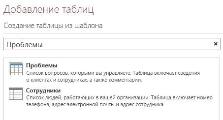
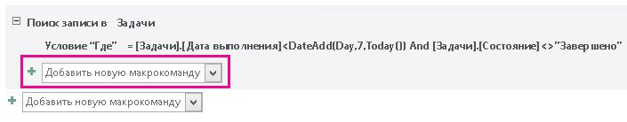
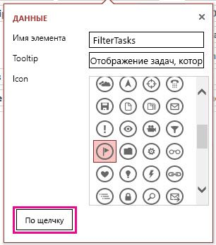
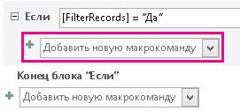
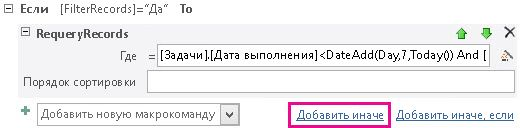
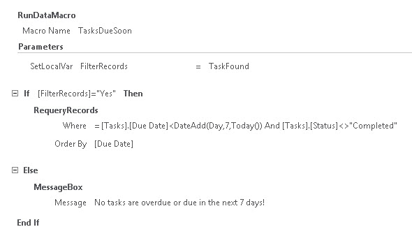

# <a name="filter-a-view-by-using-a-macro-in-an-access-app"></a>Фильтрация представления с помощью макроса в приложении Access

Узнайте, как выполнить фильтрацию представления в приложении Access с помощью макрокоманды RequeryRecords и макроса данных.
  
> [!IMPORTANT]
> Корпорация Майкрософт в настоящее время не рекомендует создавать и использовать веб-приложения Access в SharePoint. В качестве альтернативы можно использовать [Microsoft PowerApps](https://powerapps.microsoft.com/ru-RU/) для создания бизнес-решений без кода для Интернета и мобильных устройств. 

Представление стандартного списка в приложении Access позволяет отфильтровать проблемы для значений, находящихся в полях. Бывают случаи, когда вам требуется отфильтровать представление в зависимости от набора условий, а не от соответствующих значений. Для этого вам необходимо создать макрос. В этой статье показано, как создать макрос, который отфильтровывает представление для отображения задач, срок выполнения которых просрочен или наступит в течение ближайших 7 дней.
  
## <a name="prerequisites-for-building-an-app-with-access"></a>Предварительные условия для создания приложения в Access
<a name="Access2013FilterViewByUsingMacro_Prerequisites"> </a>

Для выполнения действий, описанных в этом примере, вам потребуется:
  
- Access 2013
- Среда разработки SharePoint 2013
    
> [!NOTE]
> Для получения дополнительной информации о настройке среды разработки SharePoint, см. [Настройка общей среды разработки SharePoint 2013](https://msdn.microsoft.com/library/08e4e4e1-d960-43fa-85df-f3c279ed6927%28Office.15%29.aspx). Дополнительные сведения о том, как получить Access 2013 и SharePoint 2013 см. [Загрузки](https://msdn.microsoft.com/office/apps/fp123627). 
  
## <a name="create-the-app"></a>Создание приложения
<a name="Access2013FilterViewByUsingMacro_CreateApp"> </a>

Предположим, вы хотите создать приложение Access, предназначенное для отслеживания задач вашего бизнеса. Прежде чем начать создание таблиц и представления, необходимо найти нужный шаблон схемы.
  
### <a name="to-create-the-task-tracking-app"></a>Создание приложения по отслеживанию задач

1. Запустите Access и выберите **Пользовательское веб-приложение**.
    
2. Введите имя и веб-адрес вашего приложения. Вы также можете выбрать расположение из списка **Расположения**и выбрать **Создать**.
    
3. Введите **задачи** в поле **Поиск** и затем нажмите клавишу ENTER. 
    
    Список шаблонов, которые могут быть полезны для отслеживания задач, отображен на рисунке 1.
    
   **Рисунок 1. Шаблоны, отвечающие критериям поиска для задач**

   
  
4. Выберите **Задачи**.
    
Access создает набор таблиц и представлений.
  
Введите несколько примеров задач и сотрудников в вашем приложении. Чтобы сделать это, выберите **Запустить приложение** чтобы открыть приложение в браузере. Введите значение в поле **Срок выполнения** для каждой задачи. Вернитесь в Access, когда все будет готово. 
  
## <a name="plan-the-customizations"></a>План настройки
<a name="Access2013FilterViewByUsingMacro_PlanCustomizations"> </a>

Теперь у вас есть приложение, которое содержит несколько задач. Представление по умолчанию позволяет выполнять поиск любых задач с помощью элементов, хранящихся в полях, отображаемых в представлении. Например, можно выполнить поиск первоочередных проблем или неполадок в ходе выполнения. Предположим, что вы хотите оказать первостепенное внимание в работе текущим проблемам, отображая те из них, срок для которых истекает на следующей неделе. Для этого следует создать макрос пользовательского интерфейса.
  
Команда макроса пользовательского интерфейса, которую можно использовать для фильтрации представления — [Макрокоманды RequeryRecords (пользовательское веб-приложение Access)](requeryrecords-macro-action-access-custom-web-app.md). Макрокоманда **RequeryRecords** фильтрует представление на основе аргумента * Where*, который предоставлен в форме SQL оператора WHERE. Чтобы отфильтровать представление, необходимо указать несколько фактов в определенном формате для ее фильтрации. 
  
Ниже приведены соответствующие факты:
  
- Одно или несколько полей для сравнения
    
- Как сослаться на текущую дату
    
- Как сослаться на конкретный день относительно сегодняшней даты
    
- Как определить какие задачи выполняются
    
В поле **Due Date** содержится информация о том, когда задача должна быть выполнена. В поле **Status** содержится информация о текущем состоянии каждой задачи. Чтобы обратиться к полю в макросе, используйте формат **[*TableName*].[*FieldName*]**. Используйте **[Tasks].[Due Date]**, чтобы сослаться на поле **Due Date** и **[Tasks].[Status]**, чтобы сослаться на поле **Status**. 
  
Функция [Today Function (Access custom web app)](today-function-access-custom-web-app.md) возвращает текущую дату. Функцию [DateAdd Function (Access custom web app)](dateadd-function-access-custom-web-app.md) можно использовать для вычисления даты, которая будет через определенное количество дней после указанной даты. 
  
Поле **Status** содержит несколько возможных значений. Значение **Completed** указывает на то, что задача больше не активна. 
  
Эти сведения можно объединить в следующий SQL оператор WHERE.
  
```sql
[Tasks].[Due Date]<DateAdd(Day,7,Today()) AND [Tasks].[Status]<>"Completed"
```

SQL оператор WHERE используется в макросе для фильтрации представления, чтобы отобразить активные проблемы, которые просрочены или должны быть выполнены в течение ближайших 7 дней.
  
Для запуска макроса пользовательского интерфейса, он должен быть привязан к элементу или событию, которое должно входить в состав представления. **Панель действий** является удобным местом для добавления пользовательской команды в представление. **Панель действий** – это настраиваемая панель инструментов, которая появляется в верхней части каждого представления. По умолчанию **Панель действий** содержит кнопки, позволяющие добавлять, изменять, сохранять, удалять и отменять изменения. Можно добавлять кнопки, выполняющие пользовательские макрокоманды, такие как фильтрация представления. 
  
Если представление содержит записи, которые удовлетворяют заданным условиям, то **RequeryRecords** фильтрует представление. Однако, если в представлении нет записей, удовлетворяющих условиям, то отображается новая пустая запись. Если вы не хотите чтобы отображалась пустая запись, если нет задач, срок выполнения которых истекает на следующей неделе, нужно найти способ проверки задач, прежде чем обращаться к макрокоманде в **RequeryRecords**. Для этого необходимо создать макрос данных для поиска записей, которые соответствуют условиям. 
  
Макрос пользовательского интерфейса вызовет макрос данных, который попытается найти задачу, которая должна быть выполнена на следующей неделе. Если макрос данных находит задачу, настройте приложение.
  
## <a name="customize-the-app"></a>Настройка приложения
<a name="Access2013FilterViewByUsingMacro_CustomizeApp"> </a>

Теперь, когда вы определили настройки, примените их. Сначала следует создать макрос данных. Некоторые макросы данных присоединяются непосредственно к таблицам. Однако этот макрос – это макрос автономных данных.
  
### <a name="to-create-the-data-macro"></a>Для создания макроса данных

1. Откройте приложение в Access.
    
2. В группе **Создать** выберите **Дополнительно**, а затем выберите **Макрос данных**.
    
    Пустой макрос данных открыт в режиме конструктора макросов.
    
3. В поле списка **Добавить новую макрокоманду** выберите **Найти запись**.
    
4. В поле списка **Найти запись в** выберите **Задачи**.
    
5. В окне **Условия отбора** введите **[Tasks].[Due Date]\<DateAdd(Day,7,Today()) AND [Tasks].[Status]\<\>"Completed"**. 
    
6. Выберите **SetReturnVar** в поле списка**Добавить новую макрокоманду**. 
    
    > [!NOTE]
    > Вы увидите два поля списка **Добавить новую макрокоманду**, один внутри блока **LookupRecord**, а другой снаружи блока **LookupRecord**. Следует выбирать поле списка **Добавить новую макрокоманду** внутри блока **LookupRecord**, как показано на рисунке 1. 
  
   **Рисунок 1. Поле списка Добавить новую макрокоманду**

   
  
7. В окне **Имя** введите **TaskFound**. 
    
8. В окне **Выражение** введите **"Yes"**. 
    
9. Нажмите кнопку **Сохранить**. Введите **TasksDueSoon** в окне **Название макроса** и нажмите кнопку **ОК**.
    
    Макрос должен выглядеть так, как показано на рисунке 2.
    
   **Рисунок 2. Макрос данных TasksDueSoon**

   
  
10. Закройте режим конструктора макроса.
    
Теперь мы готовы добавить пользовательскую кнопку на Панель действий.
  
### <a name="to-add-a-custom-button-to-the-action-bar"></a>Чтобы добавить пользовательскую кнопку на Панель действий

1. Выберите таблицу **Задачи**. При этом выбирается форма списка задач. 
    
2. В средстве выбора представления выберите **Список**, щелкните значок **Параметры/действие** и нажмите кнопку **Изменить**.
    
    Оно открывается в режиме конструктора.
    
3. Теперь мы готовы добавить пользовательскую кнопку на Панель действий. Для этого выберите **Добавить пользовательскую макрокоманду**, как показано на рисунке 3. 
    
   **Рисунок 3. Добавить кнопку пользовательской макрокоманды**

   
  
    Новая макрокоманда отображается в виде кнопки со звездочкой, как показано на рисунке 4.
    
   **Рисунок 4. Новая кнопка Панели действий**

   
  
4. Выберите пользовательскую кнопку Панели действий, а затем выберите значок **Данные**. 
    
    Откроется диалоговое окно **Данные**. 
    
5. В окне **Название элемента управления** введите **FilterTasks**. 
    
6. В окне **Подсказка** введите **Отображать просроченные задачи или задачи, срок выполнения которых истекает на следующей неделе**. 
    
Теперь мы готовы создать макрос пользовательского интерфейса, который будет фильтровать представление.
  
### <a name="to-create-the-ui-macro-to-filter-the-view"></a>Создание макроса пользовательского интерфейса, чтобы отфильтровать представление

1. В диалоговом окне **Данные** выберите **По щелчку**, как показано на рисунке 5. 
    
   **Рисунок 5. Диалоговое окно данных**

   
  
    Пустой макрос пользовательского интерфейса открыт в режиме конструктора.
    
2. В поле списка **Добавить новую макрокоманду** выберите **RunDataMacro**. 
    
3. В поле имени макроса введите **TasksDueSoon**. 
    
    В **SetLocalVar** введите **FilterRecords**. 
    
    Макрокоманда**RunDataMacro** вызывает макрос данных **TasksDueSoon**, созданный ранее, и сохраняет результат в переменную с именем **FilterRecords**. 
    
4. В поле списка**Добавить новую макрокоманду** выберите **If**. 
    
5. В поле **If** введите **[FilterRecords]="Yes"**. 
    
6. Из поля списка **Добавить новую макрокоманду** выберите **RequeryRecords**. 
    
    > [!NOTE]
    > Вы увидите два поля списков **Добавить новую макрокоманду**, один внутри блока **If**, а другой снаружи блока **If**. Следует выбирать поле списка **Добавить новую макрокоманду** внутри блока **If**, как показано на рисунке 6. 
  
   **Рисунок 6. Поле списка добавления новой макрокоманды**

   
  
7. В поле **Где** введите **[Tasks].[Due Date]\<DateAdd(Day,7,Today()) AND [Tasks].[Status]\<\>"Completed"**. 
    
8. В поле **Порядок сортировки** введите **[Due Date]**. 
    
9. Выберите ссылку **Add Else**, которая появляется с правой стороны поля **Добавить новую макрокоманду**, как показано на рисунке 7. 
    
   **Рисунок 7. Ссылка Add Else**

   
  
    Предложение Else будет добавлено в блок If.
    
10. Из поля списка **Добавить новую макрокоманду** выберите **MessageBox**. 
    
11. В поле **Сообщение** введите **Нет просроченных задач и задач, которые должны быть выполнены в течение ближайших 7 дней!**. 
    
12. Нажмите кнопку **Сохранить**.
    
    Макрос должен выглядеть так, как показано на рисунке 8.
    
    **Рисунок 8. Макрос пользовательского интерфейса для фильтрации представления**

    
  
13. Закройте режим конструктора макроса.
    
На этом этапе мы создали макрос пользовательского интерфейса, который фильтрует представление списка задач для отображения срочных задач. Было бы неправильно оставлять представление в отфильтрованном состоянии, не обеспечив способ для удаления фильтра. Для этого добавьте другую кнопку на Панели действий и макрос пользовательского интерфейса.
  
### <a name="to-add-an-action-bar-button-to-remove-the-filter"></a>Добавление кнопки на Панель действий для удаления фильтра

1. Выберите **Добавить пользовательскую макрокоманду**.
    
    Новая макрокоманда отображается как кнопка со звездочкой
    
2. Выберите пользовательскую кнопку на Панели действий, а затем выберите значок **Данные**. 
    
    Откроется диалоговое окно **Данные**. 
    
3. В поле**Имя элемента управления** введите **Удалить фильтр**. 
    
4. В поле **Подсказка** введите **Удалить все фильтры, которые используются для представления**. 
    
Теперь вы готовы создать макрос пользовательского интерфейса, который удалит фильтр представления.
  
### <a name="to-create-the-ui-macro-to-remove-the-filter-from-the-view"></a>Для создания макроса пользовательского интерфейса, который удаляет фильтр из представления

1. В диалоговом окне **Данные** выберите **По щелчку**.
    
    Пустой макрос пользовательского интерфейса открыт в режиме конструктора.
    
2. Из поля списка **Добавить новую макрокоманду** выберите **RequeryRecords**. 
    
    В этот раз мы оставим пустыми поля **Где** и **Порядок сортировки**. Затем с помощью макрокоманды **RequeryRecords**, вызываемой без параметров, все фильтры удаляются из представления. 
    
3. Нажмите кнопку **Сохранить**.
    
4. Закройте режим конструктора макроса.
    
5. Закройте представление списка задач. Выберите **Да**, когда будет предложено сохранить изменения. 
    
Теперь всё готово для тестирования пользовательских настроек. Выберите **Запустить приложение**, откройте приложение в браузере, а затем нажмите кнопку пользовательского фильтра задач на Панели действий. Будут отображаться все просроченные задачи и задачи, которые должны быть выполнены в течение ближайших 7 дней. Сообщение отображается в том случае, если приложение не содержит срочных задач. 
  
## <a name="conclusion"></a>Заключение

Вы можете использовать макрокоманду **RequeryRecords** в макросе пользовательского интерфейса, чтобы отфильтровать представление на основе критериев, которые были выбраны. В зависимости от того, что вы хотите, вы можете создать макрос данных, с помощью которого сможете убедиться, что запись соответствует условиям, прежде чем использовать макрокоманду**RequeryRecords**. 
  
## <a name="see-also"></a>См. также

- [Новые возможности для разработчиков Access 2013](https://msdn.microsoft.com/library/df778f51-d65e-4c30-b618-65003ceb39b3%28Office.15%29.aspx)
    

