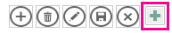

# <a name="filter-a-view-by-using-a-macro-in-an-access-app"></a><span data-ttu-id="34b34-103">Фильтрация представления с помощью макроса в приложении Access</span><span class="sxs-lookup"><span data-stu-id="34b34-103">Filter a view by using a macro in an Access app</span></span>

<span data-ttu-id="34b34-104">Узнайте, как выполнить фильтрацию представления в приложении Access с помощью макрокоманды RequeryRecords и макроса данных.</span><span class="sxs-lookup"><span data-stu-id="34b34-104">Learn how to filter a view in an Access app by using the RequeryRecords macro action and a data macro.</span></span>
  
> [!IMPORTANT]
> <span data-ttu-id="34b34-105">Корпорация Майкрософт в настоящее время не рекомендует создавать и использовать веб-приложения Access в SharePoint.</span><span class="sxs-lookup"><span data-stu-id="34b34-105">Microsoft no longer recommends creating and using Access web apps in SharePoint.</span></span> <span data-ttu-id="34b34-106">В качестве альтернативы можно использовать [Microsoft PowerApps](https://powerapps.microsoft.com/ru-RU/) для создания бизнес-решений без кода для Интернета и мобильных устройств.</span><span class="sxs-lookup"><span data-stu-id="34b34-106">As an alternative, consider using [Microsoft PowerApps](https://powerapps.microsoft.com/ru-RU/) to build no-code business solutions for the web and mobile devices.</span></span> 

<span data-ttu-id="34b34-107">Представление стандартного списка в приложении Access позволяет отфильтровать проблемы для значений, находящихся в полях.</span><span class="sxs-lookup"><span data-stu-id="34b34-107">The default list view in an Access app enables you to filter the issues on values that are contained in the fields.</span></span> <span data-ttu-id="34b34-108">Бывают случаи, когда вам требуется отфильтровать представление в зависимости от набора условий, а не от соответствующих значений.</span><span class="sxs-lookup"><span data-stu-id="34b34-108">There may be instances where you'd like to filter a view based on a set of conditions instead of by matching a value.</span></span> <span data-ttu-id="34b34-109">Для этого вам необходимо создать макрос.</span><span class="sxs-lookup"><span data-stu-id="34b34-109">To do that you must create a macro.</span></span> <span data-ttu-id="34b34-110">В этой статье показано, как создать макрос, который отфильтровывает представление для отображения задач, срок выполнения которых просрочен или наступит в течение ближайших 7 дней.</span><span class="sxs-lookup"><span data-stu-id="34b34-110">This article shows you how to create a macro that filter a view to display tasks that are past due or due in the next 7 days.</span></span>
  
## <a name="prerequisites-for-building-an-app-with-access"></a><span data-ttu-id="34b34-111">Предварительные условия для создания приложения в Access</span><span class="sxs-lookup"><span data-stu-id="34b34-111">Prerequisites for building an app with Access</span></span>
<span data-ttu-id="34b34-112"><a name="Access2013FilterViewByUsingMacro_Prerequisites"> </a></span><span class="sxs-lookup"><span data-stu-id="34b34-112"></span></span>

<span data-ttu-id="34b34-113">Для выполнения действий, описанных в этом примере, вам потребуется:</span><span class="sxs-lookup"><span data-stu-id="34b34-113">To follow the steps in this example, you need:</span></span>
  
- <span data-ttu-id="34b34-114">Access 2013</span><span class="sxs-lookup"><span data-stu-id="34b34-114">Access 2013</span></span>
- <span data-ttu-id="34b34-115">Среда разработки SharePoint 2013</span><span class="sxs-lookup"><span data-stu-id="34b34-115">A SharePoint 2013 development environment</span></span>
    
> [!NOTE]
> <span data-ttu-id="34b34-116">Для получения дополнительной информации о настройке среды разработки SharePoint, см. [Настройка общей среды разработки SharePoint 2013](https://msdn.microsoft.com/library/08e4e4e1-d960-43fa-85df-f3c279ed6927%28Office.15%29.aspx).</span><span class="sxs-lookup"><span data-stu-id="34b34-116">For more information about setting up your SharePoint development environment, see [Set up a general development environment for SharePoint 2013](https://msdn.microsoft.com/library/08e4e4e1-d960-43fa-85df-f3c279ed6927%28Office.15%29.aspx).</span></span> <span data-ttu-id="34b34-117">Дополнительные сведения о том, как получить Access 2013 и SharePoint 2013 см. [Загрузки](https://msdn.microsoft.com/office/apps/fp123627).</span><span class="sxs-lookup"><span data-stu-id="34b34-117">For more information about obtaining Access 2013 and SharePoint 2013, see [Downloads](https://msdn.microsoft.com/office/apps/fp123627).</span></span> 
  
## <a name="create-the-app"></a><span data-ttu-id="34b34-118">Создание приложения</span><span class="sxs-lookup"><span data-stu-id="34b34-118">Create the app</span></span>
<span data-ttu-id="34b34-119"><a name="Access2013FilterViewByUsingMacro_CreateApp"> </a></span><span class="sxs-lookup"><span data-stu-id="34b34-119"></span></span>

<span data-ttu-id="34b34-120">Предположим, вы хотите создать приложение Access, предназначенное для отслеживания задач вашего бизнеса.</span><span class="sxs-lookup"><span data-stu-id="34b34-120">Suppose you want to create an Access app that tracks tasks for your business.</span></span> <span data-ttu-id="34b34-121">Прежде чем начать создание таблиц и представления, необходимо найти нужный шаблон схемы.</span><span class="sxs-lookup"><span data-stu-id="34b34-121">Before you start creating the tables and view, you should search for a schema template.</span></span>
  
### <a name="to-create-the-task-tracking-app"></a><span data-ttu-id="34b34-122">Создание приложения по отслеживанию задач</span><span class="sxs-lookup"><span data-stu-id="34b34-122">To create the task tracking app</span></span>

1. <span data-ttu-id="34b34-123">Запустите Access и выберите **Пользовательское веб-приложение**.</span><span class="sxs-lookup"><span data-stu-id="34b34-123">Open Access and choose **Custom web app**.</span></span>
    
2. <span data-ttu-id="34b34-124">Введите имя и веб-адрес вашего приложения.</span><span class="sxs-lookup"><span data-stu-id="34b34-124">Enter a name and the web location for your app.</span></span> <span data-ttu-id="34b34-125">Вы также можете выбрать расположение из списка **Расположения**и выбрать **Создать**.</span><span class="sxs-lookup"><span data-stu-id="34b34-125">You can also choose a location from the **Locations** list and choose **Create**.</span></span>
    
3. <span data-ttu-id="34b34-126">Введите **задачи** в поле **Поиск** и затем нажмите клавишу ENTER.</span><span class="sxs-lookup"><span data-stu-id="34b34-126">Type **tasks** into the **Search** box and then press ENTER.</span></span> 
    
    <span data-ttu-id="34b34-127">Список шаблонов, которые могут быть полезны для отслеживания задач, отображен на рисунке 1.</span><span class="sxs-lookup"><span data-stu-id="34b34-127">A list of templates that might be useful for tracking tasks is displayed in Figure 1.</span></span>
    
   <span data-ttu-id="34b34-128">**Рисунок 1. Шаблоны, отвечающие критериям поиска для задач**</span><span class="sxs-lookup"><span data-stu-id="34b34-128">**Figure 1. Templates that match the search for tasks**</span></span>

   <span data-ttu-id="34b34-129"></span><span class="sxs-lookup"><span data-stu-id="34b34-129"></span></span>
  
4. <span data-ttu-id="34b34-130">Выберите **Задачи**.</span><span class="sxs-lookup"><span data-stu-id="34b34-130">Choose **Tasks**.</span></span>
    
<span data-ttu-id="34b34-131">Access создает набор таблиц и представлений.</span><span class="sxs-lookup"><span data-stu-id="34b34-131">Access creates a set of tables and views.</span></span>
  
<span data-ttu-id="34b34-132">Введите несколько примеров задач и сотрудников в вашем приложении.</span><span class="sxs-lookup"><span data-stu-id="34b34-132">Enter several sample tasks and employees in your app.</span></span> <span data-ttu-id="34b34-133">Чтобы сделать это, выберите **Запустить приложение** чтобы открыть приложение в браузере.</span><span class="sxs-lookup"><span data-stu-id="34b34-133">To do this, choose **Launch App** to open the app in your web browser.</span></span> <span data-ttu-id="34b34-134">Введите значение в поле **Срок выполнения** для каждой задачи.</span><span class="sxs-lookup"><span data-stu-id="34b34-134">Enter a value in the **Due Date** field for each task.</span></span> <span data-ttu-id="34b34-135">Вернитесь в Access, когда все будет готово.</span><span class="sxs-lookup"><span data-stu-id="34b34-135">Return to Access when you're done.</span></span> 
  
## <a name="plan-the-customizations"></a><span data-ttu-id="34b34-136">План настройки</span><span class="sxs-lookup"><span data-stu-id="34b34-136">Plan the customizations</span></span>
<span data-ttu-id="34b34-137"><a name="Access2013FilterViewByUsingMacro_PlanCustomizations"> </a></span><span class="sxs-lookup"><span data-stu-id="34b34-137"></span></span>

<span data-ttu-id="34b34-138">Теперь у вас есть приложение, которое содержит несколько задач.</span><span class="sxs-lookup"><span data-stu-id="34b34-138">You now have an app that contains several tasks.</span></span> <span data-ttu-id="34b34-139">Представление по умолчанию позволяет выполнять поиск любых задач с помощью элементов, хранящихся в полях, отображаемых в представлении.</span><span class="sxs-lookup"><span data-stu-id="34b34-139">The default view enables you to search for any tasks using items that are stored in the fields displayed in the view.</span></span> <span data-ttu-id="34b34-140">Например, можно выполнить поиск первоочередных проблем или неполадок в ходе выполнения.</span><span class="sxs-lookup"><span data-stu-id="34b34-140">For example, you can search for high-priority issues or issues in progress.</span></span> <span data-ttu-id="34b34-141">Предположим, что вы хотите оказать первостепенное внимание в работе текущим проблемам, отображая те из них, срок для которых истекает на следующей неделе.</span><span class="sxs-lookup"><span data-stu-id="34b34-141">Suppose you want to prioritize your work by displaying active issues that are due in the coming week.</span></span> <span data-ttu-id="34b34-142">Для этого следует создать макрос пользовательского интерфейса.</span><span class="sxs-lookup"><span data-stu-id="34b34-142">To do this, you should create a user interface (UI) macro.</span></span>
  
<span data-ttu-id="34b34-143">Команда макроса пользовательского интерфейса, которую можно использовать для фильтрации представления — [Макрокоманды RequeryRecords (пользовательское веб-приложение Access)](requeryrecords-macro-action-access-custom-web-app.md).</span><span class="sxs-lookup"><span data-stu-id="34b34-143">The UI macro command that you can use to filter the view is the [RequeryRecords Macro Action (Access custom web app)](requeryrecords-macro-action-access-custom-web-app.md).</span></span> <span data-ttu-id="34b34-144">Макрокоманда **RequeryRecords** фильтрует представление на основе аргумента \* Where\*, который предоставлен в форме SQL оператора WHERE.</span><span class="sxs-lookup"><span data-stu-id="34b34-144">The **RequeryRecords** macro action filters the view based on the  *Where*  argument, which is provided in the form of a SQL WHERE clause.</span></span> <span data-ttu-id="34b34-145">Чтобы отфильтровать представление, необходимо указать несколько фактов в определенном формате для ее фильтрации.</span><span class="sxs-lookup"><span data-stu-id="34b34-145">To filter the view, you must supply several facts in a specific format to filter the view.</span></span> 
  
<span data-ttu-id="34b34-146">Ниже приведены соответствующие факты:</span><span class="sxs-lookup"><span data-stu-id="34b34-146">The relevant facts are:</span></span>
  
- <span data-ttu-id="34b34-147">Одно или несколько полей для сравнения</span><span class="sxs-lookup"><span data-stu-id="34b34-147">The field or fields to compare</span></span>
    
- <span data-ttu-id="34b34-148">Как сослаться на текущую дату</span><span class="sxs-lookup"><span data-stu-id="34b34-148">How to refer to today's date</span></span>
    
- <span data-ttu-id="34b34-149">Как сослаться на конкретный день относительно сегодняшней даты</span><span class="sxs-lookup"><span data-stu-id="34b34-149">How to refer to a particular day relative to today's date</span></span>
    
- <span data-ttu-id="34b34-150">Как определить какие задачи выполняются</span><span class="sxs-lookup"><span data-stu-id="34b34-150">How to determine which on tasks are in progress</span></span>
    
<span data-ttu-id="34b34-151">В поле **Due Date** содержится информация о том, когда задача должна быть выполнена.</span><span class="sxs-lookup"><span data-stu-id="34b34-151">The **Due Date** field provides information about when a task is due.</span></span> <span data-ttu-id="34b34-152">В поле **Status** содержится информация о текущем состоянии каждой задачи.</span><span class="sxs-lookup"><span data-stu-id="34b34-152">The **Status** field provides status information about each task.</span></span> <span data-ttu-id="34b34-153">Чтобы обратиться к полю в макросе, используйте формат **[*TableName*].[*FieldName*]**.</span><span class="sxs-lookup"><span data-stu-id="34b34-153">To refer to a field in a macro, use the format **[*TableName*].[*FieldName*]**.</span></span> <span data-ttu-id="34b34-154">Используйте **[Tasks].[Due Date]**, чтобы сослаться на поле **Due Date** и **[Tasks].[Status]**, чтобы сослаться на поле **Status**.</span><span class="sxs-lookup"><span data-stu-id="34b34-154">Use **[Tasks].[Due Date]** to refer to the **Due Date** field and **[Tasks].[Status]** to refer to the **Status** field.</span></span> 
  
<span data-ttu-id="34b34-155">Функция [Today Function (Access custom web app)](today-function-access-custom-web-app.md) возвращает текущую дату.</span><span class="sxs-lookup"><span data-stu-id="34b34-155">The [Today Function (Access custom web app)](today-function-access-custom-web-app.md) function returns today's date.</span></span> <span data-ttu-id="34b34-156">Функцию [DateAdd Function (Access custom web app)](dateadd-function-access-custom-web-app.md) можно использовать для вычисления даты, которая будет через определенное количество дней после указанной даты.</span><span class="sxs-lookup"><span data-stu-id="34b34-156">The [DateAdd Function (Access custom web app)](dateadd-function-access-custom-web-app.md) function can be used to calculate a date that's a certain number of days after a specified date.</span></span> 
  
<span data-ttu-id="34b34-157">Поле **Status** содержит несколько возможных значений.</span><span class="sxs-lookup"><span data-stu-id="34b34-157">The **Status** field contains several possible values.</span></span> <span data-ttu-id="34b34-158">Значение **Completed** указывает на то, что задача больше не активна.</span><span class="sxs-lookup"><span data-stu-id="34b34-158">A value of **Completed** indicates that the task is no longer active.</span></span> 
  
<span data-ttu-id="34b34-159">Эти сведения можно объединить в следующий SQL оператор WHERE.</span><span class="sxs-lookup"><span data-stu-id="34b34-159">These facts can be combined into the following SQL WHERE clause.</span></span>
  
```sql
[Tasks].[Due Date]<DateAdd(Day,7,Today()) AND [Tasks].[Status]<>"Completed"
```

<span data-ttu-id="34b34-160">SQL оператор WHERE используется в макросе для фильтрации представления, чтобы отобразить активные проблемы, которые просрочены или должны быть выполнены в течение ближайших 7 дней.</span><span class="sxs-lookup"><span data-stu-id="34b34-160">This SQL WHERE clause is used in the macro to filter the view to display active issues that are due in the next 7 days or are past due.</span></span>
  
<span data-ttu-id="34b34-161">Для запуска макроса пользовательского интерфейса, он должен быть привязан к элементу или событию, которое должно входить в состав представления.</span><span class="sxs-lookup"><span data-stu-id="34b34-161">To run the UI macro, it must be attached to an item or an event that occurs in the view.</span></span> <span data-ttu-id="34b34-162">**Панель действий** является удобным местом для добавления пользовательской команды в представление.</span><span class="sxs-lookup"><span data-stu-id="34b34-162">The **Action Bar** is a convenient place to add a custom command to the view.</span></span> <span data-ttu-id="34b34-163">**Панель действий** – это настраиваемая панель инструментов, которая появляется в верхней части каждого представления.</span><span class="sxs-lookup"><span data-stu-id="34b34-163">The **Action Bar** is a customizable toolbar that appears at the top of each view.</span></span> <span data-ttu-id="34b34-164">По умолчанию **Панель действий** содержит кнопки, позволяющие добавлять, изменять, сохранять, удалять и отменять изменения.</span><span class="sxs-lookup"><span data-stu-id="34b34-164">By default, the **Action Bar** contains buttons to add, edit, save, delete, and cancel edits.</span></span> <span data-ttu-id="34b34-165">Можно добавлять кнопки, выполняющие пользовательские макрокоманды, такие как фильтрация представления.</span><span class="sxs-lookup"><span data-stu-id="34b34-165">You can add buttons that perform custom actions, such as filtering the view.</span></span> 
  
<span data-ttu-id="34b34-166">Если представление содержит записи, которые удовлетворяют заданным условиям, то **RequeryRecords** фильтрует представление.</span><span class="sxs-lookup"><span data-stu-id="34b34-166">If the view contains records that meet the specified criteria, then **RequeryRecords** filters the view.</span></span> <span data-ttu-id="34b34-167">Однако, если в представлении нет записей, удовлетворяющих условиям, то отображается новая пустая запись.</span><span class="sxs-lookup"><span data-stu-id="34b34-167">However, if the view doesn't contain any records that meet the criteria, than a new, blank record is displayed.</span></span> <span data-ttu-id="34b34-168">Если вы не хотите чтобы отображалась пустая запись, если нет задач, срок выполнения которых истекает на следующей неделе, нужно найти способ проверки задач, прежде чем обращаться к макрокоманде в **RequeryRecords**.</span><span class="sxs-lookup"><span data-stu-id="34b34-168">If you don't want a blank record to be displayed if no tasks are due in the next week, then you must find a method to check the tasks before you call the **RequeryRecords** macro action.</span></span> <span data-ttu-id="34b34-169">Для этого необходимо создать макрос данных для поиска записей, которые соответствуют условиям.</span><span class="sxs-lookup"><span data-stu-id="34b34-169">To do this, create a data macro to check for records that meet the criteria.</span></span> 
  
<span data-ttu-id="34b34-170">Макрос пользовательского интерфейса вызовет макрос данных, который попытается найти задачу, которая должна быть выполнена на следующей неделе.</span><span class="sxs-lookup"><span data-stu-id="34b34-170">The UI macro will call the data macro, which will try to find a task that's due in the next week.</span></span> <span data-ttu-id="34b34-171">Если макрос данных находит задачу, настройте приложение.</span><span class="sxs-lookup"><span data-stu-id="34b34-171">If the data macro finds the task then customize the app.</span></span>
  
## <a name="customize-the-app"></a><span data-ttu-id="34b34-172">Настройка приложения</span><span class="sxs-lookup"><span data-stu-id="34b34-172">Customize the app</span></span>
<span data-ttu-id="34b34-173"><a name="Access2013FilterViewByUsingMacro_CustomizeApp"> </a></span><span class="sxs-lookup"><span data-stu-id="34b34-173"></span></span>

<span data-ttu-id="34b34-174">Теперь, когда вы определили настройки, примените их.</span><span class="sxs-lookup"><span data-stu-id="34b34-174">Now that you've determined the customizations, implement them.</span></span> <span data-ttu-id="34b34-175">Сначала следует создать макрос данных.</span><span class="sxs-lookup"><span data-stu-id="34b34-175">The data macro should be created first.</span></span> <span data-ttu-id="34b34-176">Некоторые макросы данных присоединяются непосредственно к таблицам.</span><span class="sxs-lookup"><span data-stu-id="34b34-176">Some data macros are attached directly to tables.</span></span> <span data-ttu-id="34b34-177">Однако этот макрос – это макрос автономных данных.</span><span class="sxs-lookup"><span data-stu-id="34b34-177">However, this data macro is a stand-alone data macro.</span></span>
  
### <a name="to-create-the-data-macro"></a><span data-ttu-id="34b34-178">Для создания макроса данных</span><span class="sxs-lookup"><span data-stu-id="34b34-178">To create the data macro</span></span>

1. <span data-ttu-id="34b34-179">Откройте приложение в Access.</span><span class="sxs-lookup"><span data-stu-id="34b34-179">Open the app in Access.</span></span>
    
2. <span data-ttu-id="34b34-180">В группе **Создать** выберите **Дополнительно**, а затем выберите **Макрос данных**.</span><span class="sxs-lookup"><span data-stu-id="34b34-180">In the **Create** group, choose **Advanced**, and then choose **Data Macro**.</span></span>
    
    <span data-ttu-id="34b34-181">Пустой макрос данных открыт в режиме конструктора макросов.</span><span class="sxs-lookup"><span data-stu-id="34b34-181">A blank data macro is opened in macro Design View.</span></span>
    
3. <span data-ttu-id="34b34-182">В поле списка **Добавить новую макрокоманду** выберите **Найти запись**.</span><span class="sxs-lookup"><span data-stu-id="34b34-182">From the **Add New Action** list box, choose **LookupRecord**.</span></span>
    
4. <span data-ttu-id="34b34-183">В поле списка **Найти запись в** выберите **Задачи**.</span><span class="sxs-lookup"><span data-stu-id="34b34-183">In the **Look Up A Record In** list box, choose **Tasks**.</span></span>
    
5. <span data-ttu-id="34b34-184">В окне **Условия отбора** введите **[Tasks].[Due Date]\<DateAdd(Day,7,Today()) AND [Tasks].[Status]\<\>"Completed"**.</span><span class="sxs-lookup"><span data-stu-id="34b34-184">In the **Where Condition** box, enter **[Tasks].[Due Date]\<DateAdd(Day,7,Today()) AND [Tasks].[Status]\<\>"Completed"**.</span></span> 
    
6. <span data-ttu-id="34b34-185">Выберите **SetReturnVar** в поле списка**Добавить новую макрокоманду**.</span><span class="sxs-lookup"><span data-stu-id="34b34-185">Choose **SetReturnVar** from the **Add New Action** list box.</span></span> 
    
    > [!NOTE]
    > <span data-ttu-id="34b34-186">Вы увидите два поля списка **Добавить новую макрокоманду**, один внутри блока **LookupRecord**, а другой снаружи блока **LookupRecord**.</span><span class="sxs-lookup"><span data-stu-id="34b34-186">You'll see two **Add New Action** list boxes, one within the **LookupRecord** block, and another outside the **LookupRecord** block.</span></span> <span data-ttu-id="34b34-187">Следует выбирать поле списка **Добавить новую макрокоманду** внутри блока **LookupRecord**, как показано на рисунке 1.</span><span class="sxs-lookup"><span data-stu-id="34b34-187">You should choose the **Add New Action** list box within the **LookupRecord** block, as shown in Figure 1.</span></span> 
  
   <span data-ttu-id="34b34-188">**Рисунок 1. Поле списка Добавить новую макрокоманду**</span><span class="sxs-lookup"><span data-stu-id="34b34-188">**Figure 1. Add New Action list box**</span></span>

   <span data-ttu-id="34b34-189"></span><span class="sxs-lookup"><span data-stu-id="34b34-189"></span></span>
  
7. <span data-ttu-id="34b34-190">В окне **Имя** введите **TaskFound**.</span><span class="sxs-lookup"><span data-stu-id="34b34-190">In the **Name** box, enter **TaskFound**.</span></span> 
    
8. <span data-ttu-id="34b34-191">В окне **Выражение** введите **"Yes"**.</span><span class="sxs-lookup"><span data-stu-id="34b34-191">In the **Expression** box, enter **"Yes"**.</span></span> 
    
9. <span data-ttu-id="34b34-192">Нажмите кнопку **Сохранить**.</span><span class="sxs-lookup"><span data-stu-id="34b34-192">Choose **Save**.</span></span> <span data-ttu-id="34b34-193">Введите **TasksDueSoon** в окне **Название макроса** и нажмите кнопку **ОК**.</span><span class="sxs-lookup"><span data-stu-id="34b34-193">Enter **TasksDueSoon** in the **Macro Name** box and then choose **OK**.</span></span>
    
    <span data-ttu-id="34b34-194">Макрос должен выглядеть так, как показано на рисунке 2.</span><span class="sxs-lookup"><span data-stu-id="34b34-194">The macro should resemble the macro shown in Figure 2.</span></span>
    
   <span data-ttu-id="34b34-195">**Рисунок 2. Макрос данных TasksDueSoon**</span><span class="sxs-lookup"><span data-stu-id="34b34-195">**Figure 2. TasksDueSoon data macro**</span></span>

   <span data-ttu-id="34b34-196"></span><span class="sxs-lookup"><span data-stu-id="34b34-196"></span></span>
  
10. <span data-ttu-id="34b34-197">Закройте режим конструктора макроса.</span><span class="sxs-lookup"><span data-stu-id="34b34-197">Close macro Design View.</span></span>
    
<span data-ttu-id="34b34-198">Теперь мы готовы добавить пользовательскую кнопку на Панель действий.</span><span class="sxs-lookup"><span data-stu-id="34b34-198">Now, we're ready to add a custom button to the Action Bar.</span></span>
  
### <a name="to-add-a-custom-button-to-the-action-bar"></a><span data-ttu-id="34b34-199">Чтобы добавить пользовательскую кнопку на Панель действий</span><span class="sxs-lookup"><span data-stu-id="34b34-199">To add a custom button to the Action Bar</span></span>

1. <span data-ttu-id="34b34-200">Выберите таблицу **Задачи**.</span><span class="sxs-lookup"><span data-stu-id="34b34-200">Choose the **Tasks** table.</span></span> <span data-ttu-id="34b34-201">При этом выбирается форма списка задач.</span><span class="sxs-lookup"><span data-stu-id="34b34-201">This chooses the Tasks List form.</span></span> 
    
2. <span data-ttu-id="34b34-202">В средстве выбора представления выберите **Список**, щелкните значок **Параметры/действие** и нажмите кнопку **Изменить**.</span><span class="sxs-lookup"><span data-stu-id="34b34-202">In the View selector, choose **List**, choose the **Settings/Action** icon, and then choose **Edit**.</span></span>
    
    <span data-ttu-id="34b34-203">Оно открывается в режиме конструктора.</span><span class="sxs-lookup"><span data-stu-id="34b34-203">The view is opened in Design View.</span></span>
    
3. <span data-ttu-id="34b34-204">Теперь мы готовы добавить пользовательскую кнопку на Панель действий.</span><span class="sxs-lookup"><span data-stu-id="34b34-204">Now, we're ready to add a custom button to the Action Bar.</span></span> <span data-ttu-id="34b34-205">Для этого выберите **Добавить пользовательскую макрокоманду**, как показано на рисунке 3.</span><span class="sxs-lookup"><span data-stu-id="34b34-205">To do this, choose **Add custom action** as shown in Figure 3.</span></span> 
    
   <span data-ttu-id="34b34-206">**Рисунок 3. Добавить кнопку пользовательской макрокоманды**</span><span class="sxs-lookup"><span data-stu-id="34b34-206">**Figure 3. Add custom action button**</span></span>

   <span data-ttu-id="34b34-207"></span><span class="sxs-lookup"><span data-stu-id="34b34-207"></span></span>
  
    <span data-ttu-id="34b34-208">Новая макрокоманда отображается в виде кнопки со звездочкой, как показано на рисунке 4.</span><span class="sxs-lookup"><span data-stu-id="34b34-208">The new action is displayed as a button with a star icon as shown in Figure 4.</span></span>
    
   <span data-ttu-id="34b34-209">**Рисунок 4. Новая кнопка Панели действий**</span><span class="sxs-lookup"><span data-stu-id="34b34-209">**Figure 4. New Action Bar button**</span></span>

   <span data-ttu-id="34b34-210"></span><span class="sxs-lookup"><span data-stu-id="34b34-210"></span></span>
  
4. <span data-ttu-id="34b34-211">Выберите пользовательскую кнопку Панели действий, а затем выберите значок **Данные**.</span><span class="sxs-lookup"><span data-stu-id="34b34-211">Choose the custom Action Bar Button, and then choose the **Data** icon.</span></span> 
    
    <span data-ttu-id="34b34-212">Откроется диалоговое окно **Данные**.</span><span class="sxs-lookup"><span data-stu-id="34b34-212">The **Data** dialog box appears.</span></span> 
    
5. <span data-ttu-id="34b34-213">В окне **Название элемента управления** введите **FilterTasks**.</span><span class="sxs-lookup"><span data-stu-id="34b34-213">In the **Control Name** box, enter **FilterTasks**.</span></span> 
    
6. <span data-ttu-id="34b34-214">В окне **Подсказка** введите **Отображать просроченные задачи или задачи, срок выполнения которых истекает на следующей неделе**.</span><span class="sxs-lookup"><span data-stu-id="34b34-214">In the **Tooltip** box, enter **Display tasks past due or due in the next week**.</span></span> 
    
<span data-ttu-id="34b34-215">Теперь мы готовы создать макрос пользовательского интерфейса, который будет фильтровать представление.</span><span class="sxs-lookup"><span data-stu-id="34b34-215">Now, we're ready to create the UI macro that will filter the view.</span></span>
  
### <a name="to-create-the-ui-macro-to-filter-the-view"></a><span data-ttu-id="34b34-216">Создание макроса пользовательского интерфейса, чтобы отфильтровать представление</span><span class="sxs-lookup"><span data-stu-id="34b34-216">To create the UI macro to filter the view</span></span>

1. <span data-ttu-id="34b34-217">В диалоговом окне **Данные** выберите **По щелчку**, как показано на рисунке 5.</span><span class="sxs-lookup"><span data-stu-id="34b34-217">In the **Data** dialog box, choose **On Click** as shown in Figure 5.</span></span> 
    
   <span data-ttu-id="34b34-218">**Рисунок 5. Диалоговое окно данных**</span><span class="sxs-lookup"><span data-stu-id="34b34-218">**Figure 5. Data dialog box**</span></span>

   <span data-ttu-id="34b34-219"></span><span class="sxs-lookup"><span data-stu-id="34b34-219"></span></span>
  
    <span data-ttu-id="34b34-220">Пустой макрос пользовательского интерфейса открыт в режиме конструктора.</span><span class="sxs-lookup"><span data-stu-id="34b34-220">A blank UI macro is opened in macro Design View.</span></span>
    
2. <span data-ttu-id="34b34-221">В поле списка **Добавить новую макрокоманду** выберите **RunDataMacro**.</span><span class="sxs-lookup"><span data-stu-id="34b34-221">From the **Add New Action** list box, choose **RunDataMacro**.</span></span> 
    
3. <span data-ttu-id="34b34-222">В поле имени макроса введите **TasksDueSoon**.</span><span class="sxs-lookup"><span data-stu-id="34b34-222">In the Macro Name box, enter **TasksDueSoon**.</span></span> 
    
    <span data-ttu-id="34b34-223">В **SetLocalVar** введите **FilterRecords**.</span><span class="sxs-lookup"><span data-stu-id="34b34-223">In the **SetLocalVar** box, enter **FilterRecords**.</span></span> 
    
    <span data-ttu-id="34b34-224">Макрокоманда**RunDataMacro** вызывает макрос данных **TasksDueSoon**, созданный ранее, и сохраняет результат в переменную с именем **FilterRecords**.</span><span class="sxs-lookup"><span data-stu-id="34b34-224">The **RunDataMacro** action calls the **TasksDueSoon** data macro we created earlier and stores its result in a variable named **FilterRecords**.</span></span> 
    
4. <span data-ttu-id="34b34-225">В поле списка**Добавить новую макрокоманду** выберите **If**.</span><span class="sxs-lookup"><span data-stu-id="34b34-225">From the **Add New Action** list box, choose **If**.</span></span> 
    
5. <span data-ttu-id="34b34-226">В поле **If** введите **[FilterRecords]="Yes"**.</span><span class="sxs-lookup"><span data-stu-id="34b34-226">In the **If** box, enter **[FilterRecords]="Yes"**.</span></span> 
    
6. <span data-ttu-id="34b34-227">Из поля списка **Добавить новую макрокоманду** выберите **RequeryRecords**.</span><span class="sxs-lookup"><span data-stu-id="34b34-227">From the **Add New Action** list box, choose **RequeryRecords**.</span></span> 
    
    > [!NOTE]
    > <span data-ttu-id="34b34-228">Вы увидите два поля списков **Добавить новую макрокоманду**, один внутри блока **If**, а другой снаружи блока **If**.</span><span class="sxs-lookup"><span data-stu-id="34b34-228">You'll see two **Add New Action** list boxes, one within the **If** block, and another outside the **If** block.</span></span> <span data-ttu-id="34b34-229">Следует выбирать поле списка **Добавить новую макрокоманду** внутри блока **If**, как показано на рисунке 6.</span><span class="sxs-lookup"><span data-stu-id="34b34-229">You should choose the **Add New Action** list box within the **If** block, as shown in Figure 6.</span></span> 
  
   <span data-ttu-id="34b34-230">**Рисунок 6. Поле списка добавления новой макрокоманды**</span><span class="sxs-lookup"><span data-stu-id="34b34-230">**Figure 6. Add New Action list box**</span></span>

   <span data-ttu-id="34b34-231"></span><span class="sxs-lookup"><span data-stu-id="34b34-231"></span></span>
  
7. <span data-ttu-id="34b34-232">В поле **Где** введите **[Tasks].[Due Date]\<DateAdd(Day,7,Today()) AND [Tasks].[Status]\<\>"Completed"**.</span><span class="sxs-lookup"><span data-stu-id="34b34-232">In the **Where** box, enter **[Tasks].[Due Date]\<DateAdd(Day,7,Today()) AND [Tasks].[Status]\<\>"Completed"**.</span></span> 
    
8. <span data-ttu-id="34b34-233">В поле **Порядок сортировки** введите **[Due Date]**.</span><span class="sxs-lookup"><span data-stu-id="34b34-233">In the **Order By** box, enter **[Due Date]**.</span></span> 
    
9. <span data-ttu-id="34b34-234">Выберите ссылку **Add Else**, которая появляется с правой стороны поля **Добавить новую макрокоманду**, как показано на рисунке 7.</span><span class="sxs-lookup"><span data-stu-id="34b34-234">Choose the **Add Else** link that appears to the right side of the **Add New Action** box as shown in Figure 7.</span></span> 
    
   <span data-ttu-id="34b34-235">**Рисунок 7. Ссылка Add Else**</span><span class="sxs-lookup"><span data-stu-id="34b34-235">**Figure 7. Add Else link**</span></span>

   <span data-ttu-id="34b34-236"></span><span class="sxs-lookup"><span data-stu-id="34b34-236"></span></span>
  
    <span data-ttu-id="34b34-237">Предложение Else будет добавлено в блок If.</span><span class="sxs-lookup"><span data-stu-id="34b34-237">An Else clause is added to the If block.</span></span>
    
10. <span data-ttu-id="34b34-238">Из поля списка **Добавить новую макрокоманду** выберите **MessageBox**.</span><span class="sxs-lookup"><span data-stu-id="34b34-238">From the **Add New Action** list box, choose **MessageBox**.</span></span> 
    
11. <span data-ttu-id="34b34-239">В поле **Сообщение** введите **Нет просроченных задач и задач, которые должны быть выполнены в течение ближайших 7 дней!**.</span><span class="sxs-lookup"><span data-stu-id="34b34-239">In the **Message** box, enter **No tasks are overdue or due in the next 7 days!**.</span></span> 
    
12. <span data-ttu-id="34b34-240">Нажмите кнопку **Сохранить**.</span><span class="sxs-lookup"><span data-stu-id="34b34-240">Choose **Save**.</span></span>
    
    <span data-ttu-id="34b34-241">Макрос должен выглядеть так, как показано на рисунке 8.</span><span class="sxs-lookup"><span data-stu-id="34b34-241">The macro should resemble the macro shown in Figure 8.</span></span>
    
    <span data-ttu-id="34b34-242">**Рисунок 8. Макрос пользовательского интерфейса для фильтрации представления**</span><span class="sxs-lookup"><span data-stu-id="34b34-242">**Figure 8. UI macro to filter the view**</span></span>

    <span data-ttu-id="34b34-243"></span><span class="sxs-lookup"><span data-stu-id="34b34-243"></span></span>
  
13. <span data-ttu-id="34b34-244">Закройте режим конструктора макроса.</span><span class="sxs-lookup"><span data-stu-id="34b34-244">Close macro Design View.</span></span>
    
<span data-ttu-id="34b34-245">На этом этапе мы создали макрос пользовательского интерфейса, который фильтрует представление списка задач для отображения срочных задач.</span><span class="sxs-lookup"><span data-stu-id="34b34-245">At this point, we've created the UI macro that filters the Tasks List view to display the urgent tasks.</span></span> <span data-ttu-id="34b34-246">Было бы неправильно оставлять представление в отфильтрованном состоянии, не обеспечив способ для удаления фильтра.</span><span class="sxs-lookup"><span data-stu-id="34b34-246">It wouldn't be polite to leave the view in a filtered state without providing a method to remove the filter.</span></span> <span data-ttu-id="34b34-247">Для этого добавьте другую кнопку на Панели действий и макрос пользовательского интерфейса.</span><span class="sxs-lookup"><span data-stu-id="34b34-247">To do this, add another Action Bar button and UI Macro.</span></span>
  
### <a name="to-add-an-action-bar-button-to-remove-the-filter"></a><span data-ttu-id="34b34-248">Добавление кнопки на Панель действий для удаления фильтра</span><span class="sxs-lookup"><span data-stu-id="34b34-248">To add an Action Bar Button to remove the filter</span></span>

1. <span data-ttu-id="34b34-249">Выберите **Добавить пользовательскую макрокоманду**.</span><span class="sxs-lookup"><span data-stu-id="34b34-249">Choose **Add custom action**.</span></span>
    
    <span data-ttu-id="34b34-250">Новая макрокоманда отображается как кнопка со звездочкой</span><span class="sxs-lookup"><span data-stu-id="34b34-250">The new action is displayed as a button with a star icon</span></span>
    
2. <span data-ttu-id="34b34-251">Выберите пользовательскую кнопку на Панели действий, а затем выберите значок **Данные**.</span><span class="sxs-lookup"><span data-stu-id="34b34-251">Choose the custom Action Bar button, and then choose the **Data** icon.</span></span> 
    
    <span data-ttu-id="34b34-252">Откроется диалоговое окно **Данные**.</span><span class="sxs-lookup"><span data-stu-id="34b34-252">The **Data** dialog box appears.</span></span> 
    
3. <span data-ttu-id="34b34-253">В поле**Имя элемента управления** введите **Удалить фильтр**.</span><span class="sxs-lookup"><span data-stu-id="34b34-253">In the **Control Name** box, enter **RemoveFilter**.</span></span> 
    
4. <span data-ttu-id="34b34-254">В поле **Подсказка** введите **Удалить все фильтры, которые используются для представления**.</span><span class="sxs-lookup"><span data-stu-id="34b34-254">In the **Tooltip** box, enter **Remove all filter applied to the view**.</span></span> 
    
<span data-ttu-id="34b34-255">Теперь вы готовы создать макрос пользовательского интерфейса, который удалит фильтр представления.</span><span class="sxs-lookup"><span data-stu-id="34b34-255">Now, we're ready to create the UI macro that will remove the filter form the view.</span></span>
  
### <a name="to-create-the-ui-macro-to-remove-the-filter-from-the-view"></a><span data-ttu-id="34b34-256">Для создания макроса пользовательского интерфейса, который удаляет фильтр из представления</span><span class="sxs-lookup"><span data-stu-id="34b34-256">To create the UI macro to remove the filter from the view</span></span>

1. <span data-ttu-id="34b34-257">В диалоговом окне **Данные** выберите **По щелчку**.</span><span class="sxs-lookup"><span data-stu-id="34b34-257">In the **Data** dialog box, choose **On Click**.</span></span>
    
    <span data-ttu-id="34b34-258">Пустой макрос пользовательского интерфейса открыт в режиме конструктора.</span><span class="sxs-lookup"><span data-stu-id="34b34-258">A blank UI macro is opened in macro Design View.</span></span>
    
2. <span data-ttu-id="34b34-259">Из поля списка **Добавить новую макрокоманду** выберите **RequeryRecords**.</span><span class="sxs-lookup"><span data-stu-id="34b34-259">From the **Add New Action** list box, choose **RequeryRecords**.</span></span> 
    
    <span data-ttu-id="34b34-260">В этот раз мы оставим пустыми поля **Где** и **Порядок сортировки**.</span><span class="sxs-lookup"><span data-stu-id="34b34-260">This time, we'll leave the **Where** and **Order By** boxes empty.</span></span> <span data-ttu-id="34b34-261">Затем с помощью макрокоманды **RequeryRecords**, вызываемой без параметров, все фильтры удаляются из представления.</span><span class="sxs-lookup"><span data-stu-id="34b34-261">Then the **RequeryRecords** action is called without any parameters, all filters are removed from the view.</span></span> 
    
3. <span data-ttu-id="34b34-262">Нажмите кнопку **Сохранить**.</span><span class="sxs-lookup"><span data-stu-id="34b34-262">Choose **Save**.</span></span>
    
4. <span data-ttu-id="34b34-263">Закройте режим конструктора макроса.</span><span class="sxs-lookup"><span data-stu-id="34b34-263">Close macro Design View.</span></span>
    
5. <span data-ttu-id="34b34-264">Закройте представление списка задач.</span><span class="sxs-lookup"><span data-stu-id="34b34-264">Close the Tasks List view.</span></span> <span data-ttu-id="34b34-265">Выберите **Да**, когда будет предложено сохранить изменения.</span><span class="sxs-lookup"><span data-stu-id="34b34-265">Choose **Yes** when you are prompted to save your changes.</span></span> 
    
<span data-ttu-id="34b34-266">Теперь всё готово для тестирования пользовательских настроек.</span><span class="sxs-lookup"><span data-stu-id="34b34-266">Now, we're ready to text the customization.</span></span> <span data-ttu-id="34b34-267">Выберите **Запустить приложение**, откройте приложение в браузере, а затем нажмите кнопку пользовательского фильтра задач на Панели действий.</span><span class="sxs-lookup"><span data-stu-id="34b34-267">Choose **Launch App** to open the app in your web browser and then choose the custom FilterTasks Action Bar button.</span></span> <span data-ttu-id="34b34-268">Будут отображаться все просроченные задачи и задачи, которые должны быть выполнены в течение ближайших 7 дней.</span><span class="sxs-lookup"><span data-stu-id="34b34-268">Any tasks past due or due in the next 7 days are displayed.</span></span> <span data-ttu-id="34b34-269">Сообщение отображается в том случае, если приложение не содержит срочных задач.</span><span class="sxs-lookup"><span data-stu-id="34b34-269">A message is displayed if the app contains no urgent tasks.</span></span> 
  
## <a name="conclusion"></a><span data-ttu-id="34b34-270">Заключение</span><span class="sxs-lookup"><span data-stu-id="34b34-270">Conclusion</span></span>

<span data-ttu-id="34b34-271">Вы можете использовать макрокоманду **RequeryRecords** в макросе пользовательского интерфейса, чтобы отфильтровать представление на основе критериев, которые были выбраны.</span><span class="sxs-lookup"><span data-stu-id="34b34-271">You can use the **RequeryRecords** macro action in a UI macro to filter the view based on the criteria that you choose.</span></span> <span data-ttu-id="34b34-272">В зависимости от того, что вы хотите, вы можете создать макрос данных, с помощью которого сможете убедиться, что запись соответствует условиям, прежде чем использовать макрокоманду**RequeryRecords**.</span><span class="sxs-lookup"><span data-stu-id="34b34-272">Depending on the behavior that you want, you may want to create a data macro to verify that a record meets the criteria before you use the **RequeryRecords** macro action.</span></span> 
  
## <a name="see-also"></a><span data-ttu-id="34b34-273">См. также</span><span class="sxs-lookup"><span data-stu-id="34b34-273">See also</span></span>

- [<span data-ttu-id="34b34-274">Новые возможности для разработчиков Access 2013</span><span class="sxs-lookup"><span data-stu-id="34b34-274">What's new for Access 2013 developers</span></span>](https://msdn.microsoft.com/library/df778f51-d65e-4c30-b618-65003ceb39b3%28Office.15%29.aspx)
    

