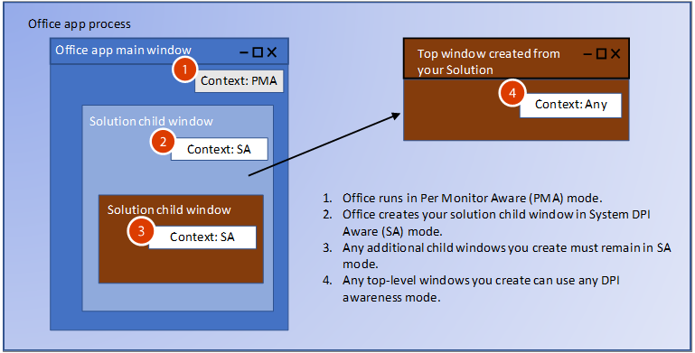
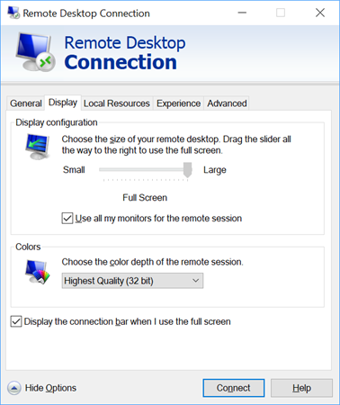

# <a name="handle-high-dpi-and-dpi-scaling-in-your-office-solution"></a><span data-ttu-id="695c4-103">Обработка высокого разрешения и масштабирования в решении для Office</span><span class="sxs-lookup"><span data-stu-id="695c4-103">Handle high DPI and DPI scaling in your Office solution</span></span>

<span data-ttu-id="695c4-104">Многие конфигурации компьютеров и мониторов теперь поддерживают высокие разрешения (количество точек на дюйм) и обеспечивают возможность подключения нескольких мониторов c разными размерами и плотностью пикселей.</span><span class="sxs-lookup"><span data-stu-id="695c4-104">Many computer and display configurations now support high DPI (dots-per-inch) resolutions, and can connect multiple monitors with different sizes and pixel densities.</span></span> <span data-ttu-id="695c4-105">Для этого приложениям требуется выполнять настройку, если пользователь перемещает их на монитор с другим разрешением или изменяет масштаб.</span><span class="sxs-lookup"><span data-stu-id="695c4-105">This requires applications to adjust when the user moves the app to a monitor with a different DPI, or changes the zoom level.</span></span> <span data-ttu-id="695c4-106">Приложения, не поддерживающие масштабирование, могут выглядеть нормально на мониторах c низким разрешением, но будут растянутыми и размытыми при отображении на мониторах с высоким разрешением.</span><span class="sxs-lookup"><span data-stu-id="695c4-106">Applications that don’t support DPI scaling might look fine on low DPI monitors, but will look stretched and blurry when shown on a high DPI monitor.</span></span> 

<span data-ttu-id="695c4-107">Приложения Office 2016, такие как Word и Excel, были обновлены, чтобы реагировать на изменения коэффициента масштаба.</span><span class="sxs-lookup"><span data-stu-id="695c4-107">Office 2016 applications, such as Word and Excel, have been updated to respond to changes in scale factor.</span></span> <span data-ttu-id="695c4-108">Однако решение для Office также должно реагировать на изменения, чтобы правильно отображаться.</span><span class="sxs-lookup"><span data-stu-id="695c4-108">However, your Office solution must also respond to changes to draw correctly when the DPI changes.</span></span> <span data-ttu-id="695c4-109">В этой статье описано, как Office поддерживает динамическое разрешение и какие действия можно предпринять, чтобы обеспечить оптимальный интерфейс просмотра для решения по расширению Office при использовании масштабирования.</span><span class="sxs-lookup"><span data-stu-id="695c4-109">This article describes how Office supports dynamic DPI, and what steps you can take to ensure the best viewing experience for your Office extensibility solution to handle DPI scaling.</span></span> 

## <a name="dpi-scaling-symptoms-in-your-solution"></a><span data-ttu-id="695c4-110">Проблемы масштабирования в решении</span><span class="sxs-lookup"><span data-stu-id="695c4-110">DPI scaling symptoms in your solution</span></span>

<span data-ttu-id="695c4-111">Windows применяет масштабирование, если приложение перемещается между мониторами с разным разрешением.</span><span class="sxs-lookup"><span data-stu-id="695c4-111">Windows applies DPI scaling when an application is moved from one display to another display with a different DPI.</span></span> <span data-ttu-id="695c4-112">Это происходит в таких случаях, как перетаскивание приложения на другой монитор или подключение ноутбука.</span><span class="sxs-lookup"><span data-stu-id="695c4-112">This happens in scenarios such as dragging an application to a different monitor or docking your laptop.</span></span> <span data-ttu-id="695c4-113">Если масштабирование негативно влияет на решение для Office, появится одна или несколько из указанных ниже проблем.</span><span class="sxs-lookup"><span data-stu-id="695c4-113">If your Office solution is adversely affected by DPI scaling, you will see one or more of the following symptoms:</span></span>

- <span data-ttu-id="695c4-114">Окно отображается в неправильном месте или с неправильным размером.</span><span class="sxs-lookup"><span data-stu-id="695c4-114">The windows draw in the wrong location or have incorrect sizing.</span></span>
- <span data-ttu-id="695c4-115">Элементы, например кнопки и подписи, отображаются в неправильном месте окна решения.</span><span class="sxs-lookup"><span data-stu-id="695c4-115">Elements such as buttons and labels appear in the wrong location in your solution’s window.</span></span>
- <span data-ttu-id="695c4-116">Шрифты и изображения отображаются слишком маленькими, слишком большими или в неправильном месте.</span><span class="sxs-lookup"><span data-stu-id="695c4-116">Fonts and images appear too small, too large or in the wrong location.</span></span>

<span data-ttu-id="695c4-117">Ниже указаны типы решений для Office, на которые может влиять масштабирование.</span><span class="sxs-lookup"><span data-stu-id="695c4-117">The following types of Office solutions can be affected by DPI scaling:</span></span>

- <span data-ttu-id="695c4-118">Надстройки VSTO</span><span class="sxs-lookup"><span data-stu-id="695c4-118">VSTO Add-ins</span></span>
- <span data-ttu-id="695c4-119">Настраиваемые области задач</span><span class="sxs-lookup"><span data-stu-id="695c4-119">Custom task panes</span></span>
- <span data-ttu-id="695c4-120">Надстройки COM</span><span class="sxs-lookup"><span data-stu-id="695c4-120">COM Add-ins</span></span>
- <span data-ttu-id="695c4-121">Элементы ActiveX</span><span class="sxs-lookup"><span data-stu-id="695c4-121">ActiveX controls</span></span>
- <span data-ttu-id="695c4-122">Расширения ленты</span><span class="sxs-lookup"><span data-stu-id="695c4-122">Ribbon extensions</span></span>
- <span data-ttu-id="695c4-123">OLE-серверы</span><span class="sxs-lookup"><span data-stu-id="695c4-123">Ole servers</span></span>
- <span data-ttu-id="695c4-124">Веб-надстройки Office</span><span class="sxs-lookup"><span data-stu-id="695c4-124">Office web add-ins</span></span>

## <a name="windows-dpi-awareness-modes"></a><span data-ttu-id="695c4-125">Режимы поддержки определения DPI Windows</span><span class="sxs-lookup"><span data-stu-id="695c4-125">Windows DPI awareness modes</span></span>

<span data-ttu-id="695c4-126">В этой статье используются режимы поддержки определения DPI, допустимые в Windows.</span><span class="sxs-lookup"><span data-stu-id="695c4-126">Throughout this article we’ll refer to the DPI awareness modes that Windows supports.</span></span> <span data-ttu-id="695c4-127">Каждый из режимов поддержки определения DPI допускает применение разных возможностей, как указано в таблице ниже.</span><span class="sxs-lookup"><span data-stu-id="695c4-127">Each DPI awareness mode supports different capabilities, as described in the following table.</span></span> <span data-ttu-id="695c4-128">Это упрощенное описание режимов для объяснения способов их поддержки решениями для Office.</span><span class="sxs-lookup"><span data-stu-id="695c4-128">This is a simplified description of the modes to explain how Office solutions support them.</span></span> <span data-ttu-id="695c4-129">Дополнительные сведения о режимах поддержки определения DPI см. в статье [Разработка классических приложений с высоким разрешением для Windows](https://docs.microsoft.com/windows/desktop/hidpi/high-dpi-desktop-application-development-on-windows).</span><span class="sxs-lookup"><span data-stu-id="695c4-129">For more information about the DPI awareness modes, see [High DPI Desktop Application Development on Windows](https://docs.microsoft.com/windows/desktop/hidpi/high-dpi-desktop-application-development-on-windows).</span></span>

|<span data-ttu-id="695c4-130">Режим</span><span class="sxs-lookup"><span data-stu-id="695c4-130">Mode</span></span>  |<span data-ttu-id="695c4-131">Описание</span><span class="sxs-lookup"><span data-stu-id="695c4-131">Description</span></span>  |<span data-ttu-id="695c4-132">При изменении разрешения</span><span class="sxs-lookup"><span data-stu-id="695c4-132">When DPI changes</span></span>  |
|---------|---------|---------|
|<span data-ttu-id="695c4-133">Без поддержки определения DPI</span><span class="sxs-lookup"><span data-stu-id="695c4-133">DPI unaware</span></span> |  <span data-ttu-id="695c4-134">Приложение всегда отображается как для дисплея со значением 96 точек на дюйм.</span><span class="sxs-lookup"><span data-stu-id="695c4-134">Application always renders as if it is on a display with a DPI value of 96.</span></span> |  <span data-ttu-id="695c4-135">Приложение — растровое изображение, растянутое до нужного размера на основном и дополнительном дисплеях.</span><span class="sxs-lookup"><span data-stu-id="695c4-135">Application is bitmap stretched to expected size on primary and secondary displays.</span></span>    |
|<span data-ttu-id="695c4-136">Поддержка определения DPI на уровне системы</span><span class="sxs-lookup"><span data-stu-id="695c4-136">System DPI aware</span></span> |  <span data-ttu-id="695c4-137">Приложения определяют разрешение основного подключенного монитора при входе в Windows, но не могут реагировать на изменение разрешения.</span><span class="sxs-lookup"><span data-stu-id="695c4-137">Application detects the DPI of the primary connected monitor at Windows login but cannot respond to DPI changes.</span></span> <span data-ttu-id="695c4-138">Для получения дополнительных сведений обратитесь к разделу [Настройка Windows для устранения размытых приложений](#configure-windows-to-fix-blurry-apps) в этой статье.</span><span class="sxs-lookup"><span data-stu-id="695c4-138">For more information, see the [Configure Windows to fix blurry apps](#configure-windows-to-fix-blurry-apps) section in this article.</span></span>  | <span data-ttu-id="695c4-139">Приложение — растровое изображение, растягиваемое при перемещении на новый дисплей с другим разрешением.</span><span class="sxs-lookup"><span data-stu-id="695c4-139">Application is bitmap stretched when moved to a new display with a different DPI.</span></span>    |
|<span data-ttu-id="695c4-140">Поддержка определения DPI на уровне монитора</span><span class="sxs-lookup"><span data-stu-id="695c4-140">Per Monitor DPI aware</span></span> |  <span data-ttu-id="695c4-141">При изменении разрешения приложение может правильно изменить свое отображение.</span><span class="sxs-lookup"><span data-stu-id="695c4-141">Application is capable of redrawing itself correctly when the DPI changes.</span></span>  |   <span data-ttu-id="695c4-142">Windows отправляет уведомления о разрешении для окон верхнего уровня в приложении, чтобы оно могло изменить отображение при изменении разрешения.</span><span class="sxs-lookup"><span data-stu-id="695c4-142">Windows will send DPI notifications to top-level windows in the application so that it can redraw when the DPI changes.</span></span>     |
|<span data-ttu-id="695c4-143">На уровне монитора версия 2</span><span class="sxs-lookup"><span data-stu-id="695c4-143">Per Monitor v2</span></span> |  <span data-ttu-id="695c4-144">При изменении разрешения приложение может правильно изменить свое отображение.</span><span class="sxs-lookup"><span data-stu-id="695c4-144">Application is capable of redrawing itself correctly when the DPI changes.</span></span>  |   <span data-ttu-id="695c4-145">Windows отправляет уведомления о разрешении для окон верхнего и дочернего уровня, чтобы приложение могло изменить отображение при изменении разрешения.</span><span class="sxs-lookup"><span data-stu-id="695c4-145">Windows will send DPI notifications to both top-level and child windows so that the application can redraw when the DPI changes.</span></span> |

## <a name="how-office-supports-dpi-scaling"></a><span data-ttu-id="695c4-146">Как Office поддерживает масштабирование</span><span class="sxs-lookup"><span data-stu-id="695c4-146">How Office supports DPI scaling</span></span>

<span data-ttu-id="695c4-147">Самый важный фактор при определении способа обработки масштабирования решением для Office состоит в том, является ли ваше решение окном верхнего или дочернего уровня.</span><span class="sxs-lookup"><span data-stu-id="695c4-147">The most significant factor in determining how your Office solution can handle DPI scaling is whether your solution is a top-level window, or a child window.</span></span> <span data-ttu-id="695c4-148">На рисунке ниже показано несколько примеров решений для Office, работающих как окна верхнего или дочернего уровня, а также применяемый ими режим поддержки определения DPI в обновлении Windows за апрель 2018 г. (1803) или более позднем.</span><span class="sxs-lookup"><span data-stu-id="695c4-148">The following picture shows a few examples of Office solutions running as top-level or child windows, and which DPI awareness mode they will use on Windows April 2018 Update (1803) and later.</span></span>


<span data-ttu-id="695c4-152">На этом рисунке:</span><span class="sxs-lookup"><span data-stu-id="695c4-152">In this image:</span></span>
- <span data-ttu-id="695c4-153">Окно верхнего уровня COM или VSTO использует поддержку определения DPI на уровне монитора.</span><span class="sxs-lookup"><span data-stu-id="695c4-153">The COM/VSTO top-level window is Per Monitor DPI aware.</span></span>
- <span data-ttu-id="695c4-154">Дочернее окно элемента ActiveX использует поддержку определения DPI на уровне системы.</span><span class="sxs-lookup"><span data-stu-id="695c4-154">The ActiveX control child window is System DPI aware.</span></span>
- <span data-ttu-id="695c4-155">Окно верхнего уровня Office использует поддержку определения DPI на уровне монитора.</span><span class="sxs-lookup"><span data-stu-id="695c4-155">The Office top-level window is Per Monitor DPI aware.</span></span>
- <span data-ttu-id="695c4-156">Дочернее окно настраиваемой области задач использует поддержку определения DPI на уровне системы.</span><span class="sxs-lookup"><span data-stu-id="695c4-156">The custom task pane child window is System DPI aware.</span></span>

## <a name="managing-thread-dpi-context"></a><span data-ttu-id="695c4-157">Управление контекстом DPI потока</span><span class="sxs-lookup"><span data-stu-id="695c4-157">Managing thread DPI context</span></span>

<span data-ttu-id="695c4-158">При запуске ведущего приложения Office его основной поток выполняется в контексте поддержки определения DPI на уровне монитора.</span><span class="sxs-lookup"><span data-stu-id="695c4-158">When the host Office app starts, its main thread runs in Per Monitor DPI aware context.</span></span> <span data-ttu-id="695c4-159">Если код решения создает потоки или получает вызовы от Office, требуется управлять контекстом DPI потока.</span><span class="sxs-lookup"><span data-stu-id="695c4-159">When your solution code creates threads, or receives calls from Office, you need to manage the thread DPI context.</span></span>

### <a name="creating-new-threads-with-the-correct-dpi-context"></a><span data-ttu-id="695c4-160">Создание новых потоков с правильным контекстом DPI</span><span class="sxs-lookup"><span data-stu-id="695c4-160">Creating new threads with the correct DPI context</span></span>

<span data-ttu-id="695c4-161">Если ваше решение создает дополнительные потоки, Office принудительно переводит эти потоки в контекст поддержки определения DPI на уровне монитора.</span><span class="sxs-lookup"><span data-stu-id="695c4-161">If your solution creates additional threads, Office will force the threads into Per Monitor DPI aware context.</span></span> <span data-ttu-id="695c4-162">Если в вашем коде предполагается другой контекст, необходимо использовать функцию [SetThreadDpiAwarenessContext](https://docs.microsoft.com/windows/desktop/api/winuser/nf-winuser-setthreaddpiawarenesscontext) для установки нужной поддержки определения DPI потока.</span><span class="sxs-lookup"><span data-stu-id="695c4-162">If your code expects a different context, you need to use the [SetThreadDpiAwarenessContext](https://docs.microsoft.com/windows/desktop/api/winuser/nf-winuser-setthreaddpiawarenesscontext) function to set the expected thread DPI awareness.</span></span> 

### <a name="build-a-context-block-for-incoming-thread-calls"></a><span data-ttu-id="695c4-163">Создание контекстного блока для входящих вызовов потока</span><span class="sxs-lookup"><span data-stu-id="695c4-163">Build a context block for incoming thread calls</span></span>


<span data-ttu-id="695c4-165">Ваше решение взаимодействует с ведущим приложением Office, поэтому в решение будут поступать входящие вызовы от Office, например обратные вызовы событий.</span><span class="sxs-lookup"><span data-stu-id="695c4-165">Your solution will interact with its host Office app, so you will have incoming calls to your solution from Office such as event callbacks.</span></span> <span data-ttu-id="695c4-166">Когда Office вызывает решение, используется контекстный блок, принудительно устанавливающий в качестве контекста потока поддержку определения DPI на уровне системы.</span><span class="sxs-lookup"><span data-stu-id="695c4-166">When Office calls your solution, it has a context block that forces the thread context to be in System DPI Aware context.</span></span> <span data-ttu-id="695c4-167">Необходимо изменить контекст потока в соответствии с поддержкой определения DPI вашего окна.</span><span class="sxs-lookup"><span data-stu-id="695c4-167">You must change the thread context to match the DPI awareness of your window.</span></span> <span data-ttu-id="695c4-168">Можно реализовать похожий контекстный блок, чтобы переключать контекст потока для входящих вызовов.</span><span class="sxs-lookup"><span data-stu-id="695c4-168">You can implement a similar context block to switch the thread context on incoming calls.</span></span> <span data-ttu-id="695c4-169">Используйте функцию [SetThreadDpiAwarenessContext](https://docs.microsoft.com/windows/desktop/api/winuser/nf-winuser-setthreaddpiawarenesscontext), чтобы изменить контекст в соответствии с контекстом вашего окна.</span><span class="sxs-lookup"><span data-stu-id="695c4-169">Use the [SetThreadDpiAwarenessContext](https://docs.microsoft.com/windows/desktop/api/winuser/nf-winuser-setthreaddpiawarenesscontext) function to change the context to match your window context.</span></span> 

> [!NOTE]
> <span data-ttu-id="695c4-170">Ваш контекстный блок должен восстановить исходный контекст DPI потока перед вызовом других компонентов за пределами кода решения.</span><span class="sxs-lookup"><span data-stu-id="695c4-170">Your context block should restore the original DPI thread context before calling other components outside of your solution code.</span></span>

#### <a name="managed-code-context-block"></a><span data-ttu-id="695c4-171">Контекстный блок управляемого кода</span><span class="sxs-lookup"><span data-stu-id="695c4-171">Managed code context block</span></span>

<span data-ttu-id="695c4-172">В приведенном ниже примере кода показано, как создать собственный контекстный блок.</span><span class="sxs-lookup"><span data-stu-id="695c4-172">The following example code shows how to construct your own context block.</span></span>

```csharp
public struct DPI_AWARENESS_CONTEXT
        {
            private IntPtr value;

            private DPI_AWARENESS_CONTEXT(IntPtr value)
            {
                this.value = value;
            }

            public static implicit operator DPI_AWARENESS_CONTEXT(IntPtr value)
            {
                return new DPI_AWARENESS_CONTEXT(value);
            }

            public static implicit operator IntPtr(DPI_AWARENESS_CONTEXT context)
            {
                return context.value;
            }

            public static bool operator ==(IntPtr context1, DPI_AWARENESS_CONTEXT context2)
            {
                return AreDpiAwarenessContextsEqual(context1, context2);
            }

            public static bool operator !=(IntPtr context1, DPI_AWARENESS_CONTEXT context2)
            {
                return !AreDpiAwarenessContextsEqual(context1, context2);
            }

            public override bool Equals(object obj)
            {
                return base.Equals(obj);
            }

            public override int GetHashCode()
            {
                return base.GetHashCode();
            }
        }

        private static DPI_AWARENESS_CONTEXT DPI_AWARENESS_CONTEXT_HANDLE = IntPtr.Zero;

        public static readonly DPI_AWARENESS_CONTEXT DPI_AWARENESS_CONTEXT_INVALID = IntPtr.Zero;
        public static readonly DPI_AWARENESS_CONTEXT DPI_AWARENESS_CONTEXT_UNAWARE = new IntPtr(-1);
        public static readonly DPI_AWARENESS_CONTEXT DPI_AWARENESS_CONTEXT_SYSTEM_AWARE = new IntPtr(-2);
        public static readonly DPI_AWARENESS_CONTEXT DPI_AWARENESS_CONTEXT_PER_MONITOR_AWARE = new IntPtr(-3);
        public static readonly DPI_AWARENESS_CONTEXT DPI_AWARENESS_CONTEXT_PER_MONITOR_AWARE_V2 = new IntPtr(-4);

        public static DPI_AWARENESS_CONTEXT[] DpiAwarenessContexts =
        {
            DPI_AWARENESS_CONTEXT_UNAWARE,
            DPI_AWARENESS_CONTEXT_SYSTEM_AWARE,
            DPI_AWARENESS_CONTEXT_PER_MONITOR_AWARE,
            DPI_AWARENESS_CONTEXT_PER_MONITOR_AWARE_V2
        };

class DPIContextBlock : IDisposable
    {
        private DPI_AWARENESS_CONTEXT resetContext;
        private bool disposed = false;

        public DPIContextBlock(DPI_AWARENESS_CONTEXT contextSwitchTo)
        {
            resetContext = SetThreadDpiAwarenessContext(contextSwitchTo);
         }

        public void Dispose()
        {
            Dispose(true);
            GC.SuppressFinalize(this);
        }

        protected virtual void Dispose(bool disposing)
        {
            if (!disposed)
            {
                if (disposing)
                {
                    SetThreadDpiAwarenessContext(resetContext);
                }
            }
            disposed = true;
        }
    }
```

#### <a name="native-code-context-block"></a><span data-ttu-id="695c4-173">Контекстный блок машинного кода</span><span class="sxs-lookup"><span data-stu-id="695c4-173">Native code context block</span></span>

```cpp
#include <winuser.h>
/* DpiAwarenessContextBlock can be used to simplify setting and resetting the DPI_AWARENESS_CONTEXT of
the current thread.  When the object is constructed, the DPI_AWARENESS_CONTEXT is set, and when the object is
destructed, the DPI awareness context is reverted to the previous awareness context at construct time.

This object allows us to write code such as:

// Thread state is currently DPI_AWARENESS_SYSTEM_AWARE
if (condition)
{
DpiAwarenessContextBlock perMonitorAware(DPI_AWARENESS_PER_MONITOR_AWARE);
... // Create a top-level hwnd with the current thread state, DPI_AWARENESS_PER_MONITOR_AWARE
}
// Thread state automatically returns to DPI_AWARENESS_SYSTEM_AWARE

*/
class DpiAwarenessContextBlock
{
public:
      DpiAwarenessContextBlock(DPI_AWARENESS_CONTEXT dpiContext) noexcept;
      ~DpiAwarenessContextBlock();

      // Copy and move are not to be used with these context objects
      DpiAwarenessContextBlock(const DpiAwarenessContextBlock&) = delete;
      DpiAwarenessContextBlock(DpiAwarenessContextBlock&&) = delete;

private:
      DPI_AWARENESS_CONTEXT m_contextReversalType;
      bool m_doContextSwitch;
};

inline DpiAwarenessContextBlock::DpiAwarenessContextBlock(DPI_AWARENESS_CONTEXT dpiContext) noexcept
{
      m_contextReversalType = SetThreadDpiAwarenessContext(dpiContext);
}

inline DpiAwarenessContextBlock::~DpiAwarenessContextBlock()
{
      SetThreadDpiAwarenessContext(m_contextReversalType);
}
```

<h2 id="top-level-window-management"><span data-ttu-id="695c4-174">Управление окнами верхнего уровня</span><span class="sxs-lookup"><span data-stu-id="695c4-174">Top-level window management</span></span></h2>

<span data-ttu-id="695c4-175">При запуске приложения Office вызывается функция [SetThreadDpiAwarenessContext](https://docs.microsoft.com/windows/desktop/api/winuser/nf-winuser-setthreaddpiawarenesscontext) как DPI_AWARENESS_CONTEXT_PER_MONITOR_AWARE.</span><span class="sxs-lookup"><span data-stu-id="695c4-175">When Office applications start, a call is made to [SetThreadDpiAwarenessContext](https://docs.microsoft.com/windows/desktop/api/winuser/nf-winuser-setthreaddpiawarenesscontext) as DPI_AWARENESS_CONTEXT_PER_MONITOR_AWARE.</span></span> <span data-ttu-id="695c4-176">В этом контексте изменения разрешения отправляются в свойство HWND любого окна верхнего уровня в процессе, выполняемом с поддержкой определения DPI на уровне монитора.</span><span class="sxs-lookup"><span data-stu-id="695c4-176">In this context, DPI changes are sent to the HWND of any top-level windows in the process that are running as Per Monitor DPI aware.</span></span> <span data-ttu-id="695c4-177">Окна верхнего уровня — это окно приложения Office и все дополнительные окна верхнего уровня, созданные вашим решением.</span><span class="sxs-lookup"><span data-stu-id="695c4-177">Top-level windows are the Office application window, and any additional top-level windows created by your solution.</span></span> <span data-ttu-id="695c4-178">При перемещении приложения Office на новый дисплей оно получает уведомление, чтобы иметь возможность динамически изменить масштаб и правильно отобразиться в разрешении нового дисплея.</span><span class="sxs-lookup"><span data-stu-id="695c4-178">When an Office application is moved to a new display, it gets notified so that it can dynamically scale and draw correctly in the DPI of the new display.</span></span> <span data-ttu-id="695c4-179">Решение для Office может создавать окна верхнего уровня с любым режимом поддержки определения DPI.</span><span class="sxs-lookup"><span data-stu-id="695c4-179">Your Office solution can create top-level windows that are in any DPI awareness mode.</span></span> <span data-ttu-id="695c4-180">Ваши окна верхнего уровня также могут реагировать на изменения разрешения, прослушивая сообщения Windows на изменения.</span><span class="sxs-lookup"><span data-stu-id="695c4-180">Your top-level windows can also respond to DPI changes by listening to Windows messages for the changes.</span></span>

<span data-ttu-id="695c4-181">Если вы создаете окна, дочерние по отношению к родительскому окну верхнего уровня, для них можно установить любой режим поддержки определения DPI.</span><span class="sxs-lookup"><span data-stu-id="695c4-181">If you create child windows that are parented to your top-level window, you can also set them to any DPI awareness mode.</span></span> <span data-ttu-id="695c4-182">Однако при использовании режима поддержки определения DPI на уровне монитора дочерние окна не будут получать уведомления об изменении разрешения.</span><span class="sxs-lookup"><span data-stu-id="695c4-182">However, if you use Per Monitor DPI aware mode, your child windows will not receive DPI change notifications.</span></span>  <span data-ttu-id="695c4-183">Дополнительные сведения о режимах поддержки определения DPI в Windows см. в статье [Разработка классических приложений с высоким разрешением для Windows](https://docs.microsoft.com/windows/desktop/hidpi/high-dpi-desktop-application-development-on-windows).</span><span class="sxs-lookup"><span data-stu-id="695c4-183">For more information about Windows DPI awareness modes, see [High DPI Desktop Application Development on Windows](https://docs.microsoft.com/windows/desktop/hidpi/high-dpi-desktop-application-development-on-windows).</span></span>

## <a name="child-window-management"></a><span data-ttu-id="695c4-184">Управление дочерними окнами</span><span class="sxs-lookup"><span data-stu-id="695c4-184">Child window management</span></span>

<span data-ttu-id="695c4-185">При работе с элементами ActiveX и настраиваемыми областями задач Office создает дочернее окно для вашего решения.</span><span class="sxs-lookup"><span data-stu-id="695c4-185">When working with ActiveX controls and custom task panes, Office creates the child window for your solution.</span></span> <span data-ttu-id="695c4-186">Вы можете создать дополнительные дочерние окна, но нужно учитывать режим поддержки определения DPI родительского окна.</span><span class="sxs-lookup"><span data-stu-id="695c4-186">You can create additional child windows, but you have to be aware of the parent window DPI awareness.</span></span> <span data-ttu-id="695c4-187">Office работает в режиме поддержки определения DPI на уровне монитора. Это означает, что ни одно дочернее окно в решении не будет получать уведомления об изменении разрешения.</span><span class="sxs-lookup"><span data-stu-id="695c4-187">Office runs in Per Monitor DPI awareness mode, which means any child windows in your solution will not get DPI change notifications.</span></span> <span data-ttu-id="695c4-188">Только режим на уровне монитора версии 2 поддерживает отправку изменений разрешения дочерним окнам (Office не поддерживает режим на уровне монитора версии 2).</span><span class="sxs-lookup"><span data-stu-id="695c4-188">Only Per Monitor v2 mode supports sending DPI changes to child windows (Office does not support Per Monitor v2).</span></span> <span data-ttu-id="695c4-189">Однако для элементов ActiveX есть обходное решение.</span><span class="sxs-lookup"><span data-stu-id="695c4-189">However, for ActiveX controls, there is a workaround.</span></span> <span data-ttu-id="695c4-190">Дополнительные сведения см. ниже в разделе [Элементы ActiveX](#activex-controls).</span><span class="sxs-lookup"><span data-stu-id="695c4-190">For more information, see the [ActiveX controls](#activex-controls) section later in this article.</span></span>

> [!NOTE]
> <span data-ttu-id="695c4-191">Если дочернее окно создает окно верхнего уровня, можно использовать любой режим поддержки определения DPI для нового окна верхнего уровня.</span><span class="sxs-lookup"><span data-stu-id="695c4-191">If your child window creates a top-level window, you can use any DPI awareness mode for the new top-level window.</span></span> <span data-ttu-id="695c4-192">Дополнительные сведения об управлении окнами верхнего уровня см. в разделе [Управление окнами верхнего уровня](#top-level-window-management) этой статьи.</span><span class="sxs-lookup"><span data-stu-id="695c4-192">For more information about managing top-level windows, see the [Top-level window management](#top-level-window-management) section in this article.</span></span>

<span data-ttu-id="695c4-193">В зависимости от версии Windows 10, на которой работает Office, к дочернему окну могут применяться два разных режима поддержки определения DPI.</span><span class="sxs-lookup"><span data-stu-id="695c4-193">You will see two different DPI modes applied to your child window, depending on which version of Windows 10 Office is running on.</span></span>

### <a name="office-dpi-behavior-on-windows-fall-creators-update-1709"></a><span data-ttu-id="695c4-194">Режим DPI для Office в Windows Fall Creators Update (1709)</span><span class="sxs-lookup"><span data-stu-id="695c4-194">Office DPI behavior on Windows Fall Creators Update (1709)</span></span>

<span data-ttu-id="695c4-195">Так как в приложениях Office используется режим поддержки определения на уровне монитора, дочерние окна вашего решения также создаются в этом режиме.</span><span class="sxs-lookup"><span data-stu-id="695c4-195">Because Office apps use Per Monitor awareness mode, your solution’s child windows will also be created in Per Monitor DPI awareness mode.</span></span> <span data-ttu-id="695c4-196">Это означает, что Windows ожидает обновления вашего решения при отображении в новом разрешении.</span><span class="sxs-lookup"><span data-stu-id="695c4-196">This means Windows expects your solution to update when drawing in a new DPI.</span></span>  <span data-ttu-id="695c4-197">Так как ваше окно не может получать уведомления об изменении разрешения, пользовательский интерфейс решения может отображаться неправильно.</span><span class="sxs-lookup"><span data-stu-id="695c4-197">Because your window cannot get DPI change notifications, your solution’s UI might be incorrect.</span></span> 


### <a name="office-dpi-behavior-on-windows-april-2018-update-1803"></a><span data-ttu-id="695c4-199">Режим DPI для Office в обновлении Windows за апрель 2018 г. (1803)</span><span class="sxs-lookup"><span data-stu-id="695c4-199">Office DPI behavior on Windows April 2018 Update (1803)</span></span>

<span data-ttu-id="695c4-200">В обновлении Windows за апрель 2018 г. (1803) и более поздних версиях в качестве режима DPI ведущего приложения Office используется смешанный режим масштабирования для некоторых сценариев.</span><span class="sxs-lookup"><span data-stu-id="695c4-200">With Windows April 2018 (1803) update and later, The Office DPI hosting behavior uses mixed-mode DPI scaling for some scenarios.</span></span> <span data-ttu-id="695c4-201">Это позволяет окнам с поддержкой определения DPI на уровне системы использовать в качестве родительских окна Office с режимом поддержки определения DPI на уровне монитора.</span><span class="sxs-lookup"><span data-stu-id="695c4-201">This allows System DPI Aware windows to be parented to Office windows set to Per Monitor DPI aware.</span></span> <span data-ttu-id="695c4-202">Это помогает улучшить совместимость при изменениях разрешения, если окна являются растянутыми растровыми изображениями.</span><span class="sxs-lookup"><span data-stu-id="695c4-202">This helps to ensure improved compatibility when the DPI changes when the windows are bitmap stretched.</span></span> <span data-ttu-id="695c4-203">Окна по-прежнему могут отображаться размыто из-за растяжения растрового изображения.</span><span class="sxs-lookup"><span data-stu-id="695c4-203">The windows might still be blurry from the bitmap stretching.</span></span>



<span data-ttu-id="695c4-205">При создании новых дочерних окон убедитесь, что их поддержка определения DPI соответствует родительскому окну.</span><span class="sxs-lookup"><span data-stu-id="695c4-205">When you create new child windows, be sure they match the DPI awareness of their parent window.</span></span> <span data-ttu-id="695c4-206">Можно использовать функцию [GetWindowdpiAwarenessContext](https://docs.microsoft.com/windows/desktop/api/winuser/nf-winuser-getwindowdpiawarenesscontext), чтобы получить режим поддержки определения DPI родительского окна.</span><span class="sxs-lookup"><span data-stu-id="695c4-206">You can use the [GetWindowdpiAwarenessContext](https://docs.microsoft.com/windows/desktop/api/winuser/nf-winuser-getwindowdpiawarenesscontext) function to get the DPI awareness of the parent window.</span></span> <span data-ttu-id="695c4-207">Дополнительные сведения о согласовании поддержки определения DPI см. в разделе "Принудительный сброс поддержки определения DPI на уровне процесса" статьи [Разработка классических приложений с высоким разрешением для Windows](https://docs.microsoft.com/windows/desktop/hidpi/high-dpi-desktop-application-development-on-windows#related-topics).</span><span class="sxs-lookup"><span data-stu-id="695c4-207">For more information about DPI awareness consistency, see the “Forced reset of process-wide DPI awareness” section in [High DPI Desktop Application Development on Windows](https://docs.microsoft.com/windows/desktop/hidpi/high-dpi-desktop-application-development-on-windows#related-topics).</span></span>

> [!NOTE]
> <span data-ttu-id="695c4-208">Нельзя полагаться на поддержку определения DPI на уровне процесса, поскольку она может вернуть значение [PROCESS_SYSTEM_DPI_AWARE](https://docs.microsoft.com/windows/desktop/api/shellscalingapi/ne-shellscalingapi-process_dpi_awareness), даже если контекст поддержки определения DPI основного потока приложения соответствует значению [DPI_AWARENESS_CONTEXT_PER_MONITOR_AWARE](https://docs.microsoft.com/windows/desktop/hidpi/dpi-awareness-context).</span><span class="sxs-lookup"><span data-stu-id="695c4-208">You can’t rely on the Process DPI Awareness as it might return [PROCESS_SYSTEM_DPI_AWARE](https://docs.microsoft.com/windows/desktop/api/shellscalingapi/ne-shellscalingapi-process_dpi_awareness) even when the application main thread DPI awareness context is [DPI_AWARENESS_CONTEXT_PER_MONITOR_AWARE](https://docs.microsoft.com/windows/desktop/hidpi/dpi-awareness-context).</span></span> <span data-ttu-id="695c4-209">Используйте функцию [GetThreadDpiAwarenessContext](https://docs.microsoft.com/windows/desktop/api/winuser/nf-winuser-getthreaddpiawarenesscontext), чтобы получить контекст поддержки определения DPI потока.</span><span class="sxs-lookup"><span data-stu-id="695c4-209">Use the [GetThreadDpiAwarenessContext](https://docs.microsoft.com/windows/desktop/api/winuser/nf-winuser-getthreaddpiawarenesscontext) function to get the thread DPI awareness context.</span></span>

## <a name="office-and-windows-dpi-compatibility-settings"></a><span data-ttu-id="695c4-210">Параметры совместимости разрешений Office и Windows</span><span class="sxs-lookup"><span data-stu-id="695c4-210">Office and Windows DPI compatibility settings</span></span>

<span data-ttu-id="695c4-211">Если надстройки или решения отображаются неправильно, можно использовать параметры совместимости, которые могут помочь исправить проблему.</span><span class="sxs-lookup"><span data-stu-id="695c4-211">When users encounter add-ins or solutions that are not rendering correctly, some compatibility settings can help correct the problem.</span></span>

<h3 id="office-compatibility"><span data-ttu-id="695c4-212">Настройка Office для оптимизации обеспечения совместимости</span><span class="sxs-lookup"><span data-stu-id="695c4-212">Configure Office to optimize for compatibility</span></span></h3>

<span data-ttu-id="695c4-213">В Office есть настройка оптимизации для обеспечения совместимости при переходе на другой масштаб на разных экранах.</span><span class="sxs-lookup"><span data-stu-id="695c4-213">Office has a setting to optimize for compatibility when moving to different DPI scales on different screens.</span></span> <span data-ttu-id="695c4-214">Режим совместимости отключает масштабирование, чтобы в качестве всех элементов Office использовалось растровое изображение, растягиваемое при перемещении на дисплей с другим масштабом.</span><span class="sxs-lookup"><span data-stu-id="695c4-214">The compatibility mode disables DPI scaling so that everything in Office is bitmap stretched when moved to a display using different DPI scaling.</span></span> 

<span data-ttu-id="695c4-215">Режим совместимости принудительно переводит Office в режим поддержки определения DPI на уровне системы.</span><span class="sxs-lookup"><span data-stu-id="695c4-215">The compatibility mode forces Office to run in System DPI aware mode.</span></span> <span data-ttu-id="695c4-216">Это приводит к растягиванию растровых изображений окон приложения и в качестве побочного эффекта может вызывать размытый внешний вид.</span><span class="sxs-lookup"><span data-stu-id="695c4-216">This causes application windows to bitmap stretch and can have a side effect of a blurry appearance.</span></span> <span data-ttu-id="695c4-217">Ваше решение для Office не может управлять этой настройкой, так как ее выбирает пользователь.</span><span class="sxs-lookup"><span data-stu-id="695c4-217">Your Office solution cannot control this setting because the user chooses it.</span></span> <span data-ttu-id="695c4-218">Использование режима совместимости дисплея решает большинство проблем отображения.</span><span class="sxs-lookup"><span data-stu-id="695c4-218">Using the display compatibility mode solves most drawing problems.</span></span> <span data-ttu-id="695c4-219">Дополнительные сведения см. в статье [Поддержка мониторов с высоким разрешением в Office](https://support.office.com/en-us/article/office-support-for-high-definition-displays-6720ca0e-be59-41f6-b629-1369f549279d).</span><span class="sxs-lookup"><span data-stu-id="695c4-219">For more information, see [Office support for high definition displays](https://support.office.com/en-us/article/office-support-for-high-definition-displays-6720ca0e-be59-41f6-b629-1369f549279d).</span></span> 

### <a name="configure-windows-to-fix-blurry-apps"></a><span data-ttu-id="695c4-220">Настройка Windows для исправления размытых приложений</span><span class="sxs-lookup"><span data-stu-id="695c4-220">Configure Windows to fix blurry apps</span></span>

<span data-ttu-id="695c4-221">В Windows 10 (версия 1803) и более поздних версиях есть настройка, исправляющая размытость приложения.</span><span class="sxs-lookup"><span data-stu-id="695c4-221">Windows 10 (Version 1803) and later has a setting to fix apps so they’re not blurry.</span></span> <span data-ttu-id="695c4-222">Это еще одна настройка, которой можно воспользоваться, если решение отображается неправильно.</span><span class="sxs-lookup"><span data-stu-id="695c4-222">This is another setting to try if your solution is not rendering correctly.</span></span> <span data-ttu-id="695c4-223">Ваше решение для Office не может управлять этой настройкой, так как ее выбирает пользователь.</span><span class="sxs-lookup"><span data-stu-id="695c4-223">Your Office solution cannot control this setting because the user chooses it.</span></span> <span data-ttu-id="695c4-224">Дополнительные сведения см. в статье [Исправление размытости приложений в Windows 10](https://support.microsoft.com/en-us/help/4091364/windows-10-fix-blurry-apps).</span><span class="sxs-lookup"><span data-stu-id="695c4-224">For more information, see [Fix apps that appear blurry in Windows 10](https://support.microsoft.com/en-us/help/4091364/windows-10-fix-blurry-apps).</span></span>

## <a name="how-to-support-dpi-scaling-in-your-solution"></a><span data-ttu-id="695c4-225">Поддержка масштабирования в решении</span><span class="sxs-lookup"><span data-stu-id="695c4-225">How to support DPI scaling in your solution</span></span>

<span data-ttu-id="695c4-226">Некоторые решения могут получать уведомления об изменениях разрешения и реагировать на них.</span><span class="sxs-lookup"><span data-stu-id="695c4-226">Some solutions can receive and respond to DPI changes.</span></span> <span data-ttu-id="695c4-227">В некоторых есть обходное решение, если они не могут получать уведомления.</span><span class="sxs-lookup"><span data-stu-id="695c4-227">Some have a workaround if they cannot receive notifications.</span></span> <span data-ttu-id="695c4-228">В таблице ниже перечислены сведения для каждого типа решения.</span><span class="sxs-lookup"><span data-stu-id="695c4-228">The following table lists the details for each solution type.</span></span>

<table>
    <thead>
        <tr>
            <th><span data-ttu-id="695c4-229">Тип решения</span><span class="sxs-lookup"><span data-stu-id="695c4-229">Solution Type</span></span></th>
            <th><span data-ttu-id="695c4-230">Тип окна</span><span class="sxs-lookup"><span data-stu-id="695c4-230">Window type</span></span></th>
            <th><span data-ttu-id="695c4-231">Возможность реакции на масштабирование</span><span class="sxs-lookup"><span data-stu-id="695c4-231">Can respond to DPI scaling</span></span></th>
            <th><span data-ttu-id="695c4-232">Дополнительные сведения</span><span class="sxs-lookup"><span data-stu-id="695c4-232">More details</span></span></th>
        </tr>
    </thead>
<tbody>
    <tr>
        <td rowspan="2"><span data-ttu-id="695c4-233"><a href="#vsto-add-ins">Надстройка VSTO</a></span><span class="sxs-lookup"><span data-stu-id="695c4-233"><a href="#vsto-add-ins">VSTO Add-in</a></span></span></td>
        <td><span data-ttu-id="695c4-234">Верхний уровень и его дочерние окна</span><span class="sxs-lookup"><span data-stu-id="695c4-234">Top and its descendants</span></span></td>
        <td><span data-ttu-id="695c4-235">Да</span><span class="sxs-lookup"><span data-stu-id="695c4-235">Yes</span></span></td>
        <td><span data-ttu-id="695c4-236">См. <a href="#vsto-add-ins">рекомендации для надстройки VSTO</a>.</span><span class="sxs-lookup"><span data-stu-id="695c4-236">See <a href="#vsto-add-ins">VSTO add-in guidance</a>.</span></span></td>
    </tr>
<tr>
        <td><span data-ttu-id="695c4-237">Дочерние для родительского окна Office</span><span class="sxs-lookup"><span data-stu-id="695c4-237">Child parented to Office window</span></span></td>
        <td><span data-ttu-id="695c4-238">Нет</span><span class="sxs-lookup"><span data-stu-id="695c4-238">No</span></span></td>
        <td><span data-ttu-id="695c4-239">См. <a href="#office-compatibility">Настройка Office для оптимизации обеспечения совместимости</a>.</span><span class="sxs-lookup"><span data-stu-id="695c4-239">See <a href="#office-compatibility">Configure Office to optimize for compatibility</a>.</span></span></td>
</tr>
    <tr>
        <td rowspan="2"><span data-ttu-id="695c4-240"><a href="#custom-task-panes">Настраиваемая область задач</a></span><span class="sxs-lookup"><span data-stu-id="695c4-240"><a href="#custom-task-panes">Custom task pane</a></span></span></td>
        <td><span data-ttu-id="695c4-241">Верхний уровень и его дочерние окна</span><span class="sxs-lookup"><span data-stu-id="695c4-241">Top and its descendants</span></span></td>
        <td><span data-ttu-id="695c4-242">Да</span><span class="sxs-lookup"><span data-stu-id="695c4-242">Yes</span></span></td>
        <td><span data-ttu-id="695c4-243">См. <a href="#top-level-window-management">рекомендации для окна верхнего уровня</a>.</span><span class="sxs-lookup"><span data-stu-id="695c4-243">See <a href="#top-level-window-management">top-level window guidance</a>.</span></span></td>
    </tr>
<tr>
        <td><span data-ttu-id="695c4-244">Дочерние для родительского окна Office</span><span class="sxs-lookup"><span data-stu-id="695c4-244">Child parented to Office window</span></span></td>
        <td><span data-ttu-id="695c4-245">Нет</span><span class="sxs-lookup"><span data-stu-id="695c4-245">No</span></span></td>
        <td><span data-ttu-id="695c4-246">См. <a href="#office-compatibility">Настройка Office для оптимизации обеспечения совместимости</a>.</span><span class="sxs-lookup"><span data-stu-id="695c4-246">See <a href="#office-compatibility">Configure Office to optimize for compatibility</a>.</span></span></td>
</tr>
    <tr>
        <td rowspan="2"><span data-ttu-id="695c4-247"><a href="#com-add-ins">Надстройка COM</a></span><span class="sxs-lookup"><span data-stu-id="695c4-247"><a href="#com-add-ins">COM Add-in</a></span></span></td>
        <td><span data-ttu-id="695c4-248">Верхний уровень и его дочерние окна</span><span class="sxs-lookup"><span data-stu-id="695c4-248">Top and its descendants</span></span></td>
        <td><span data-ttu-id="695c4-249">Да</span><span class="sxs-lookup"><span data-stu-id="695c4-249">Yes</span></span></td>
        <td><span data-ttu-id="695c4-250">См. <a href="#com-add-ins">рекомендации для надстройки COM</a>.</span><span class="sxs-lookup"><span data-stu-id="695c4-250">See <a href="#com-add-ins">COM Add-in guidance</a>.</span></span></td>
    </tr>
<tr>
        <td><span data-ttu-id="695c4-251">Дочерние для родительского окна Office</span><span class="sxs-lookup"><span data-stu-id="695c4-251">Child parented to Office window</span></span></td>
        <td><span data-ttu-id="695c4-252">Нет</span><span class="sxs-lookup"><span data-stu-id="695c4-252">No</span></span></td>
        <td><span data-ttu-id="695c4-253">См. <a href="#office-compatibility">Настройка Office для оптимизации обеспечения совместимости</a>.</span><span class="sxs-lookup"><span data-stu-id="695c4-253">See <a href="#office-compatibility">Configure Office to optimize for compatibility</a>.</span></span></td>
</tr>
    <tr>
        <td rowspan="2"><span data-ttu-id="695c4-254"><a href="#activex-controls">Элемент ActiveX</a></span><span class="sxs-lookup"><span data-stu-id="695c4-254"><a href="#activex-controls">ActiveX control</a></span></span></td>
        <td><span data-ttu-id="695c4-255">Верхний уровень и его дочерние окна</span><span class="sxs-lookup"><span data-stu-id="695c4-255">Top and its descendants</span></span></td>
        <td><span data-ttu-id="695c4-256">Да</span><span class="sxs-lookup"><span data-stu-id="695c4-256">Yes</span></span></td>
        <td><span data-ttu-id="695c4-257">См. <a href="#activex-controls">рекомендации для элемента ActiveX</a>.</span><span class="sxs-lookup"><span data-stu-id="695c4-257">See <a href="#activex-controls">ActiveX control guidance</a>.</span></span></td>
    </tr>
    <tr>
        <td><span data-ttu-id="695c4-258">Дочерние для родительского окна Office</span><span class="sxs-lookup"><span data-stu-id="695c4-258">Child parented to Office window</span></span></td>
        <td><span data-ttu-id="695c4-259">Да</span><span class="sxs-lookup"><span data-stu-id="695c4-259">Yes</span></span></td>
    </tr>
    <tr>
        <td><span data-ttu-id="695c4-260"><a href="#web-add-ins">Веб-надстройка</a></span><span class="sxs-lookup"><span data-stu-id="695c4-260"><a href="#web-add-ins">Web Add-in</a></span></span></td>
        <td><span data-ttu-id="695c4-261">Н/Д</span><span class="sxs-lookup"><span data-stu-id="695c4-261">NA</span></span></td>
        <td><span data-ttu-id="695c4-262">Да</span><span class="sxs-lookup"><span data-stu-id="695c4-262">Yes</span></span></td>
        <td><span data-ttu-id="695c4-263">См. <a href="#web-add-ins">рекомендации для веб-надстройки Office</a>.</span><span class="sxs-lookup"><span data-stu-id="695c4-263">See <a href="#web-add-ins">Office web add-in guidance</a>.</span></span></td>
    </tr>
    <tr>
        <td><span data-ttu-id="695c4-264"><a href="#ribbon-extensibility">Расширение ленты</a></span><span class="sxs-lookup"><span data-stu-id="695c4-264"><a href="#ribbon-extensibility">Ribbon extension</a></span></span></td>
        <td><span data-ttu-id="695c4-265">Недоступно</span><span class="sxs-lookup"><span data-stu-id="695c4-265">NA</span></span></td>
        <td><span data-ttu-id="695c4-266">Недоступно</span><span class="sxs-lookup"><span data-stu-id="695c4-266">NA</span></span></td>
        <td><span data-ttu-id="695c4-267">См. <a href="#ribbon-extensibility">рекомендации для расширения ленты</a>.</span><span class="sxs-lookup"><span data-stu-id="695c4-267">See <a href="#ribbon-extensibility">Ribbon extension guidance</a>.</span></span></td>
    </tr>
    <tr>
        <td><span data-ttu-id="695c4-268"><a href="#ole">OLE-сервер или клиент</a></span><span class="sxs-lookup"><span data-stu-id="695c4-268"><a href="#ole">OLE server or client</a></span></span></td>
        <td><span data-ttu-id="695c4-269">Недоступно</span><span class="sxs-lookup"><span data-stu-id="695c4-269">NA</span></span></td>
        <td><span data-ttu-id="695c4-270">Недоступно</span><span class="sxs-lookup"><span data-stu-id="695c4-270">NA</span></span></td>
        <td><span data-ttu-id="695c4-271">См. <a href="#ole">рекомендации для OLE-сервера или клиента</a>.</span><span class="sxs-lookup"><span data-stu-id="695c4-271">See <a href="#ole">OLE server/client guidance</a>.</span></span></td>
    </tr>
</tbody>
</table>

<h3 id="vsto-add-ins"><span data-ttu-id="695c4-272">Надстройка VSTO</span><span class="sxs-lookup"><span data-stu-id="695c4-272">VSTO add-in</span></span></h3>

<span data-ttu-id="695c4-273">Если надстройка VSTO создает окна, дочерние по отношению к любому родительскому окну Office, убедитесь, что их поддержка определения DPI соответствует родительскому окну.</span><span class="sxs-lookup"><span data-stu-id="695c4-273">If your VSTO add-in creates child windows that are parented to any Office windows, be sure they match the DPI awareness of their parent window.</span></span> <span data-ttu-id="695c4-274">Можно использовать функцию [GetWindowdpiAwarenessContext](https://docs.microsoft.com/windows/desktop/api/winuser/nf-winuser-getwindowdpiawarenesscontext), чтобы получить режим поддержки определения DPI родительского окна.</span><span class="sxs-lookup"><span data-stu-id="695c4-274">You can use the [GetWindowdpiAwarenessContext](https://docs.microsoft.com/windows/desktop/api/winuser/nf-winuser-getwindowdpiawarenesscontext) function to get the DPI awareness of the parent window.</span></span> <span data-ttu-id="695c4-275">Дочерние окна не будут получать уведомлений об изменении разрешения.</span><span class="sxs-lookup"><span data-stu-id="695c4-275">Your child windows will not get any DPI change notifications.</span></span> <span data-ttu-id="695c4-276">Если ваше решение отображается неправильно, пользователям нужно будет перевести Office в режим совместимости.</span><span class="sxs-lookup"><span data-stu-id="695c4-276">If your solution is not rendering correctly, users will need to put Office into compatibility mode.</span></span>

<span data-ttu-id="695c4-277">Для любого окна верхнего уровня, создаваемого надстройкой VSTO, можно установить любой режим поддержки определения DPI.</span><span class="sxs-lookup"><span data-stu-id="695c4-277">For any top-level windows your VSTO add-in creates, you can set them to any DPI awareness mode.</span></span> <span data-ttu-id="695c4-278">В приведенном ниже примере кода показано, как настроить нужную поддержку определения DPI и как реагировать на изменения разрешения.</span><span class="sxs-lookup"><span data-stu-id="695c4-278">The following sample code shows how to set up the desired DPI awareness, and how to respond to DPI changes.</span></span> <span data-ttu-id="695c4-279">Вам также потребуется настроить app.config, как описано в статье [Поддержка высокого разрешения в Windows Forms](https://docs.microsoft.com/dotnet/framework/winforms/high-dpi-support-in-windows-forms).</span><span class="sxs-lookup"><span data-stu-id="695c4-279">You will also need to adjust your app.config, as described in the [High DPI support in Windows Forms](https://docs.microsoft.com/dotnet/framework/winforms/high-dpi-support-in-windows-forms) article.</span></span> 

```csharp
using System;
using System.Diagnostics;
using System.Drawing;
using System.Runtime.InteropServices;
using System.Windows.Forms;

namespace SharedModule
{
    // DpiAwareWindowsForm
    // For any top level winform you create, derive from the DpiWindowsForm class
    // if you are creating Windows Forms with the Dpi Awareness Context set to 
    // DPI_AWARENESS_CONTEXT_PER_MONITOR_AWARE or DPI_AWARENESS_CONTEXT_PER_MONITOR_AWARE_V2
    //
    // For example, if you Window form class is defined as:
    //    public partial class TopLevelWinForm : Form
    //
    // update to:
    //    public partial class TopLevelWinForm : DpiAwareWindowsForm
    //
    // When showing the form, call SetThreadDpiAwarenessContext() or use a context block to
    // to set the desired Dpi Awareness Context.
    //
    // For example, here is code to show a Windows Form using a context block as Per Monitor Aware v2.
    //
    //    DPIContextBlock context = new DPIContextBlock(DPI_AWARENESS_CONTEXT_PER_MONITOR_AWARE_V2);
    //    TopLevelWinForm frm = new TopLevelWinForm();
    //    frm.Show();
    //
    public partial class DpiAwareWindowsForm : Form
    {
        private SizeF m_newDpi = SizeF.Empty;
        private SizeF m_oldDpi = SizeF.Empty;

        public DpiAwareWindowsForm()
        {
            this.HandleCreated += new EventHandler((sender, args) =>
            {
                m_oldDpi = m_newDpi = DPIHelper.GetDpiForWindowSizeF(this.Handle);
            });
        }

        public void OnDpiChangedEvent(RECT newRect)
        {
            this.SuspendLayout();

            // Resize form
            this.Width = newRect.Width;
            this.Height = newRect.Height;

            // Resize controls and set font sizes
            ScaleAllChildControls(this.Controls, m_oldDpi.Width, m_newDpi.Width);
            this.ResumeLayout(true);
        }

        // Additional changes may be needed for controls that set Anchor or Dock properties 
        private void ScaleAllChildControls(Control.ControlCollection controls, float oldDpi, float newDpi)
        {
            float scaleFactorChange = newDpi / oldDpi;

            foreach (Control control in controls)
            {
                control.Top = (int)(control.Top * scaleFactorChange);
                control.Left = (int)(control.Left * scaleFactorChange);
                control.Width = (int)(control.Width * scaleFactorChange);
                control.Height = (int)(control.Height * scaleFactorChange);
                control.Font = ScaleFont(control.Font, oldDpi, newDpi);
            }
        }

        private Font ScaleFont(Font font, float oldDpi, float newDpi)
        {
            float fontSizePx = 0.0f;
            float fontSizePt = 0.0f;

            fontSizePx = font.SizeInPoints / 72 * oldDpi;
            fontSizePt = fontSizePx * (newDpi / oldDpi) * 72 / oldDpi;

            return new Font(font.Name, fontSizePt, font.Style, GraphicsUnit.Point);
        }

        protected override void WndProc(ref Message m)
        {
            switch ((DPIHelper.WinMessages)m.Msg)
            {
                case DPIHelper.WinMessages.WM_DPICHANGED:
                    // Marshal the value in the lParam into a Rect.
                    RECT newDisplayRect = (RECT)Marshal.PtrToStructure(m.LParam, typeof(RECT));

                    // Remember current DPI and calculate current from WParam.
                    // Both X and Y are the same on Windows for Dpi.
                    m_oldDpi = m_newDpi;

                    m_newDpi.Width = (float)(m.WParam.ToInt32() >> 16);
                    m_newDpi.Height = (float)(m.WParam.ToInt32() & 0x0000FFFF);

                    // DPI should be the same for both width and height on Windows devices.
                    Debug.Assert(m_newDpi.Height == m_newDpi.Width);

                    if (m_oldDpi.Width != m_newDpi.Width)
                    {
                        OnDpiChangedEvent(newDisplayRect);
                    }
                    base.DefWndProc(ref m);
                    break;
                default:
                    base.WndProc(ref m);
                    break;
            }
        }
    }
}
```

<h3 id="custom-task-panes"><span data-ttu-id="695c4-280">Настраиваемые области задач</span><span class="sxs-lookup"><span data-stu-id="695c4-280">Custom task panes</span></span></h3>

<span data-ttu-id="695c4-281">Настраиваемая область задач создается приложением Office в виде дочернего окна.</span><span class="sxs-lookup"><span data-stu-id="695c4-281">A custom task pane is created as a child window by Office.</span></span> <span data-ttu-id="695c4-282">При использовании обновления Windows Fall Creators Update (1709) настраиваемая область задач запускается с использованием такого же режима поддержки определения DPI, как в Office.</span><span class="sxs-lookup"><span data-stu-id="695c4-282">When running on Windows Fall Creators Update (1709), your custom task pane will run using the same DPI awareness mode as Office.</span></span> <span data-ttu-id="695c4-283">При использовании обновления Windows за апрель 2018 г. (1803) и более поздней версии настраиваемая область задач запускается с использованием режима поддержки определения DPI на уровне системы.</span><span class="sxs-lookup"><span data-stu-id="695c4-283">When running on Windows April 2018 Update (1803) and later, your custom task pane will run using System DPI awareness mode.</span></span> 

<span data-ttu-id="695c4-284">Так как настраиваемые области являются дочерними окнами, они не могут получать уведомления о разрешении.</span><span class="sxs-lookup"><span data-stu-id="695c4-284">Because custom task panes are child windows, they cannot receive DPI notifications.</span></span> <span data-ttu-id="695c4-285">Если они отображаются неправильно, пользователю потребуется использовать [Режим совместимости разрешений в Office](https://support.office.com/en-us/article/office-support-for-high-definition-displays-6720ca0e-be59-41f6-b629-1369f549279d).</span><span class="sxs-lookup"><span data-stu-id="695c4-285">If they are drawing incorrectly, the user will need to use [Office DPI compatibility mode](https://support.office.com/en-us/article/office-support-for-high-definition-displays-6720ca0e-be59-41f6-b629-1369f549279d).</span></span>
<span data-ttu-id="695c4-286">Если настраиваемая область задач создает окна верхнего уровня, эти окна могут запускаться в любом режиме поддержки определения DPI и получать уведомления об изменении разрешения.</span><span class="sxs-lookup"><span data-stu-id="695c4-286">If your custom task pane creates top-level windows, those windows can run in any DPI awareness mode and receive DPI change notifications.</span></span> <span data-ttu-id="695c4-287">Дополнительные сведения см. в разделе [Управление окнами верхнего уровня](#top-level-window-management) этой статьи.</span><span class="sxs-lookup"><span data-stu-id="695c4-287">For more information, see the [Top-level window management](#top-level-window-management) section in this article.</span></span>

<h3 id="com-add-ins"><span data-ttu-id="695c4-288">Надстройки COM</span><span class="sxs-lookup"><span data-stu-id="695c4-288">COM add-ins</span></span></h3>

<span data-ttu-id="695c4-289">Надстройки COM, создающие окна верхнего уровня могут получать уведомления об разрешении.</span><span class="sxs-lookup"><span data-stu-id="695c4-289">COM add-ins that create top-level windows can receive DPI notifications.</span></span> <span data-ttu-id="695c4-290">Необходимо создать [контекстный блок](#build-a-context-block-for-incoming-thread-calls) и установить для потока поддержку определения DPI, необходимую для окна, а затем создать окно.</span><span class="sxs-lookup"><span data-stu-id="695c4-290">You should create a [context block](#build-a-context-block-for-incoming-thread-calls) to set the thread to the DPI awareness that you want for your window, then create your window.</span></span> <span data-ttu-id="695c4-291">Существует много нюансов для правильной обработки уведомлений о разрешении, поэтому обязательно ознакомьтесь с дополнительными сведениями в статье [Разработка классических приложений с высоким разрешением для Windows](https://docs.microsoft.com/windows/desktop/hidpi/high-dpi-desktop-application-development-on-windows#related-topics).</span><span class="sxs-lookup"><span data-stu-id="695c4-291">There’s a lot to handling the DPI notifications correctly, so be sure to read [High DPI Desktop Application Development on Windows](https://docs.microsoft.com/windows/desktop/hidpi/high-dpi-desktop-application-development-on-windows#related-topics) for more details.</span></span>

<span data-ttu-id="695c4-292">Сообщение [WM_DPICHANGED](https://docs.microsoft.com/windows/desktop/hidpi/wm-dpichanged) отправляется при изменении разрешения для окна.</span><span class="sxs-lookup"><span data-stu-id="695c4-292">The [WM_DPICHANGED](https://docs.microsoft.com/windows/desktop/hidpi/wm-dpichanged) message is sent when the DPI for a window has changed.</span></span>  <span data-ttu-id="695c4-293">В неуправляемом коде это сообщение обрабатывается с помощью [процедуры окна](https://docs.microsoft.com/windows/desktop/winmsg/using-window-procedures) для свойства HWND.</span><span class="sxs-lookup"><span data-stu-id="695c4-293">In unmanaged code, this message is handled by the [Window Procedure](https://docs.microsoft.com/windows/desktop/winmsg/using-window-procedures) for the HWND.</span></span>  <span data-ttu-id="695c4-294">Пример кода обработчика изменения разрешения можно найти в статье WM_DPICHANGED.</span><span class="sxs-lookup"><span data-stu-id="695c4-294">Sample DPI change handler code can be found in the WM_DPICHANGED article.</span></span> 

<span data-ttu-id="695c4-295">Надстройки COM, отображающие окна, дочерние по отношению к родительскому окну в Office, не могут получать уведомления о разрешении.</span><span class="sxs-lookup"><span data-stu-id="695c4-295">COM add-ins that show child windows that are parented to a window in Office cannot receive DPI notifications.</span></span> <span data-ttu-id="695c4-296">Если они отображаются неправильно, пользователю потребуется использовать [Режим совместимости разрешений в Office](https://support.office.com/article/office-support-for-high-definition-displays-6720ca0e-be59-41f6-b629-1369f549279d).</span><span class="sxs-lookup"><span data-stu-id="695c4-296">If they are drawing incorrectly, the user will need to use [Office DPI compatibility mode](https://support.office.com/article/office-support-for-high-definition-displays-6720ca0e-be59-41f6-b629-1369f549279d).</span></span>

<h3 id="activex-controls"><span data-ttu-id="695c4-297">Элементы ActiveX</span><span class="sxs-lookup"><span data-stu-id="695c4-297">ActiveX controls</span></span></h3>

<span data-ttu-id="695c4-298">Способ поддержки масштабирования в элементах ActiveX зависит от того, есть ли у элемента окна или нет.</span><span class="sxs-lookup"><span data-stu-id="695c4-298">How to support DPI scaling in ActiveX controls depends on whether the control is windowed or windowless.</span></span>

#### <a name="windowed-activex-controls"></a><span data-ttu-id="695c4-299">Элементы ActiveX с окнами</span><span class="sxs-lookup"><span data-stu-id="695c4-299">Windowed ActiveX controls</span></span>

<span data-ttu-id="695c4-300">Элементы ActiveX с окнами получают сообщение, WM_SIZE каждый раз, когда изменяется размер элемента.</span><span class="sxs-lookup"><span data-stu-id="695c4-300">Windowed ActiveX controls receive a WM_SIZE message each time the control is resized.</span></span>  <span data-ttu-id="695c4-301">При возникновении этого события код обработчика события может вызвать функцию [GetDpiForWindow](https://docs.microsoft.com/windows/desktop/api/winuser/nf-winuser-getdpiforwindow) с помощью свойства HWND элемента управления, чтобы получить значение разрешения, рассчитать разницу коэффициентов масштаба и выполнить соответствующую настройку.</span><span class="sxs-lookup"><span data-stu-id="695c4-301">When this event is triggered, the event handler code can call the [GetDpiForWindow](https://docs.microsoft.com/windows/desktop/api/winuser/nf-winuser-getdpiforwindow) function using the HWND of the control to get the DPI, calculate the scale factor differences, and adjust as needed.</span></span> 

<span data-ttu-id="695c4-302">В приведенном ниже примере включается элемент ActiveX на основе MFC, чтобы ответить на событие **OnSize**.</span><span class="sxs-lookup"><span data-stu-id="695c4-302">The following example enables an MFC-based ActiveX control to respond to the **OnSize** event.</span></span> 

```cpp
void ChangeWindowFontDPI(HWND hWnd, UINT dpi) 
{ 
LOGFONT fontInfo1 = { 0 }; 
// Calculate the font height based on the DPI. 
fontInfo1.lfHeight = -MulDiv(DESIRED_HEIGHT, dpi, 72); 
fontInfo1.lfQuality = CLEARTYPE_QUALITY; 
wcscpy_s(fontInfo1.lfFaceName, DESIRED_FONT_NAME); 
 
::SendMessage(hWnd, WM_SETFONT, (WPARAM)::CreateFontIndirectW(&fontInfo1), TRUE); 
} 
 
BOOL CALLBACK CMainDialog::EnumChildProc(HWND hWnd, LPARAM lParam) 
{ 
CMainDialog* _this = (CMainDialog*) lParam; 
if (_this != nullptr) 
{ 
// Calculate the scale factor difference between the old and new DPI changes. 
double scale = (((double) _this->m_newDPI) /  
   (((double) _this->m_currentDPI) / 100.0)) / 100; 
 
RECT rect = {}; 
::GetWindowRect(hWnd, &rect); 
 
POINT pt = { rect.left, rect.top }; 
::ScreenToClient(::GetParent(hWnd), &pt); 
 
// Adjust the window based on the scale changes. 
::MoveWindow(hWnd, 
pt.x * scale, 
pt.y * scale, 
(rect.right - rect.left) * scale, 
(rect.bottom - rect.top) * scale, 
TRUE); 
 
ChangeWindowFontDPI(hWnd, _this->m_newDPI); 
return TRUE; 
} 
return FALSE; 
} 
 
void CMainDialog::OnSize(UINT nType, int cx, int cy) 
{ 
CDialog::OnSize(nType, cx, cy); 
 
// Get the new DPI and enumerate the child windows that will use that value. 
m_currentDPI = ::GetDpiForWindow(this->GetSafeHwnd()); 
::EnumChildWindows(this->GetSafeHwnd(), EnumChildProc, (LPARAM)this); 
} 
```

#### <a name="windowless-activex-controls"></a><span data-ttu-id="695c4-303">Элементы ActiveX без окон</span><span class="sxs-lookup"><span data-stu-id="695c4-303">Windowless ActiveX controls</span></span>

<span data-ttu-id="695c4-304">Для элементов ActiveX без окон не гарантировано наличие свойства HWND.</span><span class="sxs-lookup"><span data-stu-id="695c4-304">Windowless ActiveX controls are not guaranteed have an HWND.</span></span>  <span data-ttu-id="695c4-305">Когда элемент ActiveX добавляется на холст документа, он переводится в режим конструктора.</span><span class="sxs-lookup"><span data-stu-id="695c4-305">When an ActiveX control is inserted onto a document canvas, it is put into design mode.</span></span>  <span data-ttu-id="695c4-306">В приложениях Office размещающий контейнер возвращает 0 при вызове hDC -> GetWindow() в событии ::OnDraw, если элемент управления находится в режиме конструктора.</span><span class="sxs-lookup"><span data-stu-id="695c4-306">In Office applications, the hosting container will return 0 for the call to hDC->GetWindow() in the ::OnDraw event when the control is in design mode.</span></span>  <span data-ttu-id="695c4-307">В этом случае нельзя получить надежное значение разрешения.</span><span class="sxs-lookup"><span data-stu-id="695c4-307">A reliable DPI cannot be retrieved in this case.</span></span> 

<span data-ttu-id="695c4-308">Однако если элемент управления находится в режиме выполнения, Office вернет свойство HWND, где должен отображаться элемент управления.</span><span class="sxs-lookup"><span data-stu-id="695c4-308">However, when the control is in runtime mode, Office will return the HWND where the control is to be drawn.</span></span>  <span data-ttu-id="695c4-309">В этом случае разработчик элемента управления может вызвать функцию [GetDpiForWindow](https://docs.microsoft.com/windows/desktop/api/winuser/nf-winuser-getdpiforwindow) и получить текущее разрешение, а также шрифты масштабирования, элементы управления и т. д.</span><span class="sxs-lookup"><span data-stu-id="695c4-309">In this case, the control developer can call [GetDpiForWindow](https://docs.microsoft.com/windows/desktop/api/winuser/nf-winuser-getdpiforwindow) and get the current DPI and scale fonts, controls, and so on.</span></span> 

<h3 id="ribbon-extensibility"><span data-ttu-id="695c4-310">Возможности расширения настраиваемой ленты</span><span class="sxs-lookup"><span data-stu-id="695c4-310">Custom ribbon extensibility</span></span></h3>

<span data-ttu-id="695c4-311">Любые обратные вызовы из Office для элементов управления настраиваемой ленты будут выполняться в потоке с поддержкой определения DPI на уровне системы.</span><span class="sxs-lookup"><span data-stu-id="695c4-311">Any callbacks from Office for custom ribbon controls will be in a DPI thread awareness of System DPI aware.</span></span>  <span data-ttu-id="695c4-312">Если решение ожидает другой режим поддержки определения DPI потока, следует внедрить контекстный блок, чтобы установить нужный режим поддержки определения для потока.</span><span class="sxs-lookup"><span data-stu-id="695c4-312">If your solution is expecting a different DPI thread awareness, you should implement a context block to set the thread awareness as expected.</span></span> <span data-ttu-id="695c4-313">Дополнительные сведения см. в разделе [Создание контекстного блока](#build-a-context-block-for-incoming-thread-calls).</span><span class="sxs-lookup"><span data-stu-id="695c4-313">For more information, see [Build a context block](#build-a-context-block-for-incoming-thread-calls).</span></span>

<h3 id="ole"><span data-ttu-id="695c4-314">OLE-серверы и клиенты</span><span class="sxs-lookup"><span data-stu-id="695c4-314">OLE clients and servers</span></span></h3>

<span data-ttu-id="695c4-315">Если OLE-сервер размещен в контейнере OLE клиента, в настоящее время нельзя предоставить сведения о текущем или поддерживаемом разрешении.</span><span class="sxs-lookup"><span data-stu-id="695c4-315">When an OLE server is hosted within an OLE client container, you currently can’t provide current or supported DPI information.</span></span> <span data-ttu-id="695c4-316">Это может привести к проблемам, так как некоторые сочетания родительского и дочернего окон с разными режимами не поддерживаются в текущей архитектуре Windows.</span><span class="sxs-lookup"><span data-stu-id="695c4-316">This can cause problems because some combinations of parent to child window mixed modes are not supported by the current Windows architecture.</span></span> <span data-ttu-id="695c4-317">Если Word или Excel обнаруживают наличие нескольких мониторов с разными масштабами, они не будут поддерживать встроенную активацию.</span><span class="sxs-lookup"><span data-stu-id="695c4-317">If Word or Excel detect that there are multiple monitors with different DPI scales, they will not support in-place activation.</span></span> <span data-ttu-id="695c4-318">Активация OLE-сервера выполняется "не на месте".</span><span class="sxs-lookup"><span data-stu-id="695c4-318">Your OLE server will activate out-of-place.</span></span> <span data-ttu-id="695c4-319">Если возникают проблемы при взаимодействии с OLE-сервером, пользователю потребуется использовать [Режим совместимости разрешений в Office](https://support.office.com/article/office-support-for-high-definition-displays-6720ca0e-be59-41f6-b629-1369f549279d).</span><span class="sxs-lookup"><span data-stu-id="695c4-319">If you are experiencing issues with OLE server interactions, the user will need to use [Office DPI compatibility mode](https://support.office.com/article/office-support-for-high-definition-displays-6720ca0e-be59-41f6-b629-1369f549279d).</span></span>

<h3 id="web-add-ins"><span data-ttu-id="695c4-320">Веб-надстройки Office</span><span class="sxs-lookup"><span data-stu-id="695c4-320">Office Web Add-ins</span></span></h3>

<span data-ttu-id="695c4-321">Веб-надстройки Office созданные с помощью API JavaScript для Office, запускаются внутри элемента управления браузера.</span><span class="sxs-lookup"><span data-stu-id="695c4-321">Office Add-ins built using the Office JavaScript API run inside a browser control.</span></span> <span data-ttu-id="695c4-322">Обрабатывать масштабирование можно с помощью тех же методов, которые используются при разработке любого веб-приложения.</span><span class="sxs-lookup"><span data-stu-id="695c4-322">You can handle DPI scaling using the same techniques used in any web app design.</span></span> <span data-ttu-id="695c4-323">Существует много сетевых ресурсов, помогающих разработать веб-страницу для экранов с высоким разрешением.</span><span class="sxs-lookup"><span data-stu-id="695c4-323">Many online resources are available to help design a web page for high resolution screens.</span></span>

## <a name="verify-that-your-solution-supports-dpi-scaling"></a><span data-ttu-id="695c4-324">Проверка того, что решение поддерживает масштабирование</span><span class="sxs-lookup"><span data-stu-id="695c4-324">Verify that your solution supports DPI scaling</span></span>

<span data-ttu-id="695c4-325">После обновления приложения для поддержки масштабирования необходимо проверить изменения в среде с разными разрешениями.</span><span class="sxs-lookup"><span data-stu-id="695c4-325">After you have updated your application to support DPI scaling, you should validate your changes in a mixed-DPI environment.</span></span> <span data-ttu-id="695c4-326">Убедитесь, что ваш код пользовательского интерфейса правильно реагирует на изменения разрешения, когда окно решения перемещается между дисплеями с разными значениями разрешений.</span><span class="sxs-lookup"><span data-stu-id="695c4-326">Validate that your UI code responds properly to DPI changes when your solution’s windows are moved from one display to another that has different DPI values.</span></span> <span data-ttu-id="695c4-327">Дополнительные сведения о методах проверки масштабирования см. в статье [Разработка классических приложений с высоким разрешением для Windows](https://docs.microsoft.com/windows/desktop/hidpi/high-dpi-desktop-application-development-on-windows#related-topics).</span><span class="sxs-lookup"><span data-stu-id="695c4-327">For more information about DPI scaling testing techniques, see [High DPI Desktop Application Development on Windows](https://docs.microsoft.com/windows/desktop/hidpi/high-dpi-desktop-application-development-on-windows#related-topics).</span></span>

<span data-ttu-id="695c4-328">Вы также могут пригодиться эти дополнительные методы:</span><span class="sxs-lookup"><span data-stu-id="695c4-328">You might also find these additional techniques helpful:</span></span>

- <span data-ttu-id="695c4-329">При использовании ноутбука можно установить основной монитор на внешнем мониторе, затем отсоединить ноутбук.</span><span class="sxs-lookup"><span data-stu-id="695c4-329">With a laptop, you can set the primary monitor to an external monitor, then undock the laptop.</span></span> <span data-ttu-id="695c4-330">Это приведет к принудительному переключению основного монитора на дисплей ноутбука.</span><span class="sxs-lookup"><span data-stu-id="695c4-330">This will force the primary monitor to change to the laptop display.</span></span>
- <span data-ttu-id="695c4-331">Используйте [средство WinSpy ++](https://github.com/BissetJ/winspy/releases) с открытым кодом для помощи в отладке.</span><span class="sxs-lookup"><span data-stu-id="695c4-331">Use the open source [WinSpy++ tool](https://github.com/BissetJ/winspy/releases) to help debug.</span></span> <span data-ttu-id="695c4-332">Его можно использовать для просмотра настройки поддержки определения DPI любого окна.</span><span class="sxs-lookup"><span data-stu-id="695c4-332">You can use it to see the DPI awareness setting of any window.</span></span>
- <span data-ttu-id="695c4-333">Также можно использовать удаленный рабочий стол, чтобы протестировать использование нескольких мониторов на удаленном компьютере, выбрав пункт "Использовать все мои мониторы для удаленного сеанса" на вкладке "Экран", как показано на снимке экрана ниже.</span><span class="sxs-lookup"><span data-stu-id="695c4-333">You can use remote desktop to test multiple monitors on a remote computer by selecting Use all my monitors for the remote session on the Display tab, as shown in the following screenshot.</span></span>



## <a name="see-also"></a><span data-ttu-id="695c4-335">См. также</span><span class="sxs-lookup"><span data-stu-id="695c4-335">See also</span></span>

### <a name="articles"></a><span data-ttu-id="695c4-336">Статьи</span><span class="sxs-lookup"><span data-stu-id="695c4-336">Articles</span></span>

- <span data-ttu-id="695c4-337">[Разработка приложения WPF с поддержкой dpi для каждого монитора](https://docs.microsoft.com/windows/desktop/hidpi/declaring-managed-apps-dpi-aware) предоставляет общий обзор и руководство по написанию приложений Win32 для настольных ПК.</span><span class="sxs-lookup"><span data-stu-id="695c4-337">[Developing a Per-Monitor DPI-Aware WPF Application](https://docs.microsoft.com/windows/desktop/hidpi/declaring-managed-apps-dpi-aware) provides a general overview and guide for writing Win32 desktop applications.</span></span> <span data-ttu-id="695c4-338">Многие из методов, описанных в этой статье применяются для решений по расширению Office.</span><span class="sxs-lookup"><span data-stu-id="695c4-338">Many of the same techniques described in this article will apply to Office extensibility solutions.</span></span>
- <span data-ttu-id="695c4-339">
  [API для смешанного использования режимов масштабирования и поддержки определения DPI.](https://docs.microsoft.com/windows/desktop/hidpi/high-dpi-improvements-for-desktop-applications) Содержит список API, относящихся к разрешению.</span><span class="sxs-lookup"><span data-stu-id="695c4-339">[Mixed-Mode DPI Scaling and DPI-aware APIs](https://docs.microsoft.com/windows/desktop/hidpi/high-dpi-improvements-for-desktop-applications) has a list of APIs related to DPI.</span></span>
- <span data-ttu-id="695c4-340">[Руководство для разработчиков — DPI на уровне монитора — просмотр WPF.](https://github.com/Microsoft/WPF-Samples/blob/master/PerMonitorDPI/Developer%20Guide%20-%20Per%20Monitor%20DPI%20-%20WPF%20Preview.docx) Содержит руководство по разработке приложения WPF для создания приложений WPF с поддержкой определения DPI.</span><span class="sxs-lookup"><span data-stu-id="695c4-340">[Developer Guide - Per Monitor DPI - WPF Preview](https://github.com/Microsoft/WPF-Samples/blob/master/PerMonitorDPI/Developer%20Guide%20-%20Per%20Monitor%20DPI%20-%20WPF%20Preview.docx) covers the WPF app development guide for building DPI-aware WPF apps.</span></span>
- <span data-ttu-id="695c4-341">[Поддержка мониторов с высоким разрешением в Office.](https://support.office.com/article/Office-support-for-high-definition-displays-6720ca0e-be59-41f6-b629-1369f549279d) Содержит сведения о том, как пользователь может настроить Office для оптимизации обеспечения совместимости, если решение для Office не поддерживается надлежащим образом при изменении разрешения.</span><span class="sxs-lookup"><span data-stu-id="695c4-341">[Office support for high definition displays](https://support.office.com/article/Office-support-for-high-definition-displays-6720ca0e-be59-41f6-b629-1369f549279d) provides information about how a user can set Office to optimize for compatibility if your Office solution is not supported properly when the DPI changes.</span></span>
- <span data-ttu-id="695c4-342">[Изменение масштаба экрана для юбилейного обновления Windows 10.](https://blogs.technet.microsoft.com/askcore/2016/08/16/display-scaling-changes-for-the-windows-10-anniversary-update/) Это запись блога, описывающая изменения, которые добавлены в юбилейном обновлении Windows 10.</span><span class="sxs-lookup"><span data-stu-id="695c4-342">[Display Scaling changes for the Windows 10 Anniversary Update](https://blogs.technet.microsoft.com/askcore/2016/08/16/display-scaling-changes-for-the-windows-10-anniversary-update/) is a blog post that covers changes introduce with the Windows 10 Anniversary update.</span></span> 
- <span data-ttu-id="695c4-343">[Маркер DPI_AWARENESS_CONTEXT](https://docs.microsoft.com/windows/desktop/hidpi/dpi-awareness-context). Содержит сведения о значениях и определениях DPI_AWARENESS_CONTEXT для программирования.</span><span class="sxs-lookup"><span data-stu-id="695c4-343">[DPI_AWARENESS_CONTEXT handle](https://docs.microsoft.com/windows/desktop/hidpi/dpi-awareness-context) has programming details on the DPI_AWARENESS_CONTEXT values and definitions.</span></span>
- <span data-ttu-id="695c4-344">[Разработка классических приложений с высоким разрешением для Windows.](https://docs.microsoft.com/windows/desktop/hidpi/high-dpi-desktop-application-development-on-windows#testing-your-changes) Содержит сведения о тестировании в разделе "Тестирование изменений".</span><span class="sxs-lookup"><span data-stu-id="695c4-344">[High DPI Desktop Application Development on Windows](https://docs.microsoft.com/windows/desktop/hidpi/high-dpi-desktop-application-development-on-windows#testing-your-changes) includes information about testing in the Testing Your Changes section.</span></span>

### <a name="code-samples"></a><span data-ttu-id="695c4-345">Примеры кода</span><span class="sxs-lookup"><span data-stu-id="695c4-345">Code samples</span></span>

- [<span data-ttu-id="695c4-346">Пример поддержки определения DPI на уровне окна</span><span class="sxs-lookup"><span data-stu-id="695c4-346">Per-window DPI Awareness sample</span></span>](https://github.com/Microsoft/Windows-classic-samples/tree/master/Samples/DPIAwarenessPerWindow)
- [<span data-ttu-id="695c4-347">Пример динамического разрешения</span><span class="sxs-lookup"><span data-stu-id="695c4-347">Dynamic DPI sample</span></span>](https://github.com/Microsoft/Windows-classic-samples/tree/master/Samples/DynamicDPI)
- [<span data-ttu-id="695c4-348">Пример WPF c поддержкой определения на уровне монитора</span><span class="sxs-lookup"><span data-stu-id="695c4-348">Per-Monitor Aware WPF sample</span></span>](https://github.com/Microsoft/Windows-classic-samples/tree/master/Samples/PerMonitorDPIAware)
