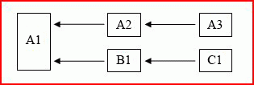

# Многопотоковый пересчет в Excel

**Относится к**: Excel 2013 | Office 2013 | Visual Studio 
  
Многопотоковый пересчет листов впервые появился в Microsoft Office Excel 2007. Вы можете настроить до 1024 одновременных потоков, которые Excel будет использовать при пересчете, независимо от количества процессоров или ядер на компьютере. 
  
> [!NOTE]
> С каждым потоком связаны затраты ресурсов операционной системы, поэтому не настраивайте больше потоков, чем нужно. 
  
Если компьютер имеет несколько процессоров или ядер, за эффективное распределение потоков между процессорами отвечает операционная система.
  
## Обзор многопотокового пересчета листов в Excel

Excel пытается определить части цепочки вычисления, которые можно пересчитывать одновременно в разных потоках. Ниже в качестве примера приведено очень простое дерево (где "x ← y" означает, что y зависит только от x).
  
**Рисунок 1. Параллельные вычисления в разных потоках**

  
Когда выполнено вычисление для ячейки A1, можно последовательно выполнить вычисление для ячеек A2 и A3 в одном потоке, в то время как в другом потоке последовательно выполняются вычисления для B1 и C1. Это возможно при условии, что все ячейки потокобезопасны. 
  
> [!NOTE]
> Термин "Потокобезопасная ячейка" обозначает ячейку, содержащую только потокобезопасные функции. Список потоконебезопасных елементов см. в [Какие элементы в Excel считаются потокобезопасными, а какие — нет](#xl2007xllsdk_threadsafe). 
  
Большинство используемых на практике книг содержат гораздо более сложные деревья зависимостей, чем этот пример. Кроме того, время пересчета ячейки не известно до завершения вычисления и может варьироваться в широких пределах в зависимости от аргументов функции. Чтобы получить наилучшие результаты, Excel пытается улучшить порядок вычисления после каждого вычисления, пока это возможно.
  
Excel использует один основной поток, чтобы запускать или выполнять:
  
- встроенные команды;
    
- команды XLL;
    
- функции интерфейса диспетчера надстроек XLL (функция **xlAutoOpen** и т. д.) 
    
- пользовательские команды Microsoft Visual Basic для приложений (Microsoft Visual Basic for Applications, VBA), часто именуемые макросами;
    
- пользовательские функции VBA;
    
- встроенные потоконебезопасные функции листа (см. список в следующем разделе);
    
- пользовательские команды и функции листа макросов XLM;
    
- функции и команды надстроек COM;
    
- функции и операторов в выражениях условного форматирования;
    
- функции и операторы в определениях определенных имен, используемых в формулах листа;
    
- принудительную оценку выражения в поле редактирования формулы с помощью клавиши **F9**. 
    
Вычисления по всем формулам листа, независимо от того, потокобезопасны функции или нет, выполняются в основном потоке, если не настроено использование нескольких потоков в Excel. Когда пользователь указывает, что следует использовать несколько потоков, дополнительные потоки используются для потокобезопасных ячеек. Обратите внимание, что основной поток также может использоваться для потокобезопасных ячеек, когда это целесообразно для балансировки нагрузки.
  
Стоит отметить, что Excel не выполняет более одной команды за раз, поэтому необязательно применять те же меры предосторожности, что и при написании потокобезопасных функций, например использовать локальную память потока и критические секции.
  
## Какие элементы в Excel считаются потокобезопасными, а какие — нет

Excel считает покобезопасными только следующие элементы:
  
- Все унарные и двоичные операторы в Excel.
    
- Почти все встроенные функции листа, начиная с Excel 2007 (см. список исключений).
    
- Функции надстроек XLL, которые явным образом зарегистрированы как потокобезопасные.
    
Потоконебезопасные встроенные функции листа:
  
- **PHONETIC**
    
- **CELL**, когда используется аргумент "format" или "address" 
    
- **INDIRECT**
    
- **GETPIVOTDATA**
    
- **CUBEMEMBER**
    
- **CUBEVALUE**
    
- **CUBEMEMBERPROPERTY**
    
- **CUBESET**
    
- **CUBERANKEDMEMBER**
    
- **CUBEKPIMEMBER**
    
- **CUBESETCOUNT**
    
- **ADDRESS**, когда указывается пятый параметр (sheet_name) 
    
- Любая функция базы данных (**DSUM**, **DAVERAGE**, и т. д.), которая ссылается на сводную таблицу
    
- **ERROR.TYPE**
    
- **HYPERLINK**
    
Указанные ниже действия считаются небезопасными:
  
- пользовательские функции VBA;
    
- пользовательские функции надстроек COM;
    
- пользовательские функции листа макросов XLM;
    
- функции надстроек XLL, не зарегистрированные как потокобезопасные.
    
Вывод: следующие операции и функции потоконебезопасны и дают сбой при вызове из функции XLL, зарегистрированной как потокобезопасная.
  
- Вызов информационных функций XLM, например **xlfGetCell** (**GET.CELL**).
    
- Вызов **xlfSetName** (**SET.NAME**) для определения или удаления внутренних имен XLL.
    
- Вызов потоконебезопасных пользовательских функций с помощью **xlUDF**.
    
- Вызов функции [xlfEvaluate](xlfevaluate.md) для выражений, содержащих потоконебезопасные функции или определенные имена, определения которых содержат потоконебезопасные функции. 
    
- Вызов функции [xlAbort](xlabort.md) для сброса условия останова. 
    
- Вызов функции [xlCoerce](xlcoerce.md) для получения значения невычисленной ссылки на ячейку. 
    
> [!NOTE]
> Функции листа XLL не могут вызывать команды C API, например **xlcSave**, независимо от того, зарегистрированы они как потокобезопасные или нет. 
  
Если функции XLL, объявленные потокобезопасными, не могут вызывать информационные функции XLM или ссылаться на невычисленные ячейки, Excel не допускает регистрацию функций XLL, зарегистрированных в качестве эквивалентов листа макросов, как потокобезопасных. Поэтому получить значение невычисленной ссылки на ячейку с помощью **xlCoerce** не удастся из-за ошибки **xlretUncalced**. Вызов информационной функции XLM приведет к ошибке **xlretFailed**. Другие указанные ранее точки завершают работу с кодом ошибки, упомянутым в C API Excel: **xlretNotThreadSafe**. 
  
Функции обратного вызова для C API — потокобезопасные:
  
- **xlCoerce** (кроме случаев, когда не удается выполнить приведение невычисленных ссылок на ячейки) 
    
- **xlFree**
    
- **xlStack**
    
- **xlSheetId**
    
- **xlSheetNm**
    
- **xlAbort** (кроме случаев сброса состояния останова) 
    
- **xlGetInst**
    
- **xlGetHwnd**
    
- **xlGetBinaryName**
    
- **xlDefineBinaryName**
    
Единственное исключение — функция **xlSet**, которая является эквивалентом команды и, поэтому, не может вызываться из функций листа. 
  
Функцию листа XLL можно зарегистрировать в Excel как потокобезопасную. В этом случае Excel будет знать, что вызов функции безопасен и возможен одновременно в нескольких потоках. Но необходимо убедиться, что это действительно так. Работа Excel может быть нарушена, если функция, зарегистрированная как потокобезопасная, окажется небезопасной.
  
## Регистрация функций XLL как потокобезопасных

Ниже приведены правила, которые необходимо соблюдать разработчикам при создании потокобезопасных функций.
  
- Не вызывайте ресурсы в других библиотеках DLL, которые могут быть потоконебезопасными.
    
- Не осуществляйте потоконебезопасные вызовы с помощью C API или COM.
    
- Защищайте ресурсы, которые могут использоваться одновременно несколькими потоками, с помощью критических секций.
    
- Используйте локальную память потока для хранения данных потока и заменяйте статические переменные в функциях локальными переменными потока.
    
В Excel действует дополнительное ограничение: потокобезопасные функции невозможно зарегистрировать как эквивалентные функциям листа макросов, поэтому они не могут вызывать информационные функции XLM и получать значения непересчитанных ячеек.
  
## Состязание за память

Многопоковые системы должны решать две основные проблемы:
  
- Как защитить память, с которой выполняется чтение или на которую выполняется запись, с помощью нескольких потоков.
    
- Как создать память, связанную с выполняемым потоком и доступную только ему, и получить к ней доступ.
    
В операционной системе Windows и пакете Windows SDK есть средства для их решения: критические секции и API для локального хранилища потока (TLS) соответственно. Дополнительные сведения см. в статье [Управление памятью в Excel](memory-management-in-excel.md).
  
Первая проблема может возникнуть, например, когда двум функциям листа (или двум параллельно выполняемым экземплярам одной функции) нужен доступ к глобальной переменной в проекте DLL (например, для ее изменения). Помните, что эта переменная может быть скрыта в глобально доступном экземпляре объекта класса.
  
Вторая проблема может возникнуть, например, когда функция листа объявляет статическую переменную или объект в коде функции. Компилятор C/C++ создает только одну копию, которую используют все потоки. Это означает, что один экземпляр функции может изменить значение, а другой (в другом потоке) может использовать ранее заданное значение.
  
## Примеры применения MTR

Любой XLL-модуль, который экспортирует функции листа, может использовать многопотоковый пересчет (MTR) в Excel, если эти функции не должны выполнять потоконебезопасные действия. Это позволяет Excel максимально быстро выполнять пересчет в книгах, в которых они используются, и поэтому MTR рекомендуется применять всегда.
  
В частности, MTR имеет большое влияние на время пересчета книг, которые вызывают пользовательские функции (UDF), которые в свою очередь вызывают внешние процессы для получения желаемых результатов. Рассмотрим функцию UDF, вызывающую удаленный сервер, который может обрабатывать большое количество запросов одновременно, и книгу, содержащую большое количество вызовов такой функции. Если пересчет книги однопотоковый, следующий вызов UDF и удаленного сервера не может начаться, пока не завершится предыдущий. В результате возможность сервера обрабатывать сразу несколько вызовов не используется. Если пересчет книги многопотоковый, Excel может совершать несколько вызовов одновременно или в быстрой последовательности.
  
Если в Excel и на сервере настроено использование одинакового количества потоков (N), при этом топология дерева зависимостей книги позволяет это, общее время пересчета можно сократить до значения, которое стремится к 1/N. Это возможно, даже если у клиентского компьютера (на котором обрабатывается книга) всего один процессор, особенно если время вызова сервера невелико по сравнению с временем обработки вызова сервером. 
  
С каждым дополнительным потоком связаны затраты ресурсов операционной системы. Поэтому оптимальное количество потоков, которое должно использовать приложение Excel, для каждой книги, сервера и клиентского компьютера определяется опытным путем. 
  
Рассмотрим компьютер с одним процессором, на котором запущено приложение Excel и обрабатывается книга, содержащая 1000 ячеек. Она вызывает функцию UDF, которая, в свою очередь, вызывает один или несколько удаленных серверов. Предположим, что 1000 ячеек не зависят друг от друга, поэтому Excel не нужно ожидать завершения одного вызова для совершения другого. (Это условие можно нарушить без последствий для этого примера.) Если серверы могут обрабатывать 100 запросов одновременно, а в Excel настроено использование 100 потоков, время выполнения можно сократить до 1/100 (сотой части от времени выполнения однопотокового пересчета). Чтобы приложение Excel могло распределять вызовы между потоками, а операционная система могла управлять 100 потоками, требуются значительные ресурсы. Это показывает, что на практике такого значительного сокращения времени не будет. Мы также предполагаем, что сервер характеризуется хорошей масштабируемостью, и что одновременная обработка 100 задач сильно не повлияет на время выполнения отдельных задач.
  
Пример практического применения, при котором этот способ дает отличные результаты, — использование методов Монте-Карло, а также выполнение других ресурсоемких задач, которые можно разделить на более мелкие подзадачи и обработать на серверах.
  
## Рекомендации по использованию служб Excel

Службы Excel поддерживают загрузку, вычисление и обработку электронных таблиц Excel на сервере. Пользователи могут получить доступ к электронным таблицам и работать с ними, используя стандартные средства браузера.
  
Пользовательские функции служб Excel созданы с использованием управляемого кода Microsoft .NET Framework и доступны благодаря сборке .NET. XLL-модули не поддерживаются в службах Excel. Ресурс UDF сервера управляемого кода может вызывать XLL-модуль для доступа к его функциональности, что обеспечивает одинаковую функциональность при работе с книгами, загруженными на сервер и локальный компьютер.
  
Чтобы функции XLL были доступны, необходимо упаковать их в сборку .NET, преобразующую аргументы и возвращаемые значения из собственных типов данных в управляемые типы данных .NET Framework, и вызывающую функции XLL. Программа-оболочка .NET экспортирует один ресурс UDF сервера для каждой функции XLL, к которой обращается сборка. Дополнительное требование: все вызываемые таким образом функции XLL должны быть потокобезопасными. Так как функции XLL не регистрируются так, как в клиенте Excel, сервер и программа-оболочка .NET не могут обеспечить их потокобезопасность. За это несет ответственность разработчик XLL.
  
## См. также

- [Пересчет в Excel](excel-recalculation.md)  
- [Управление памятью в Excel](memory-management-in-excel.md) 
- [Доступ к коду XLL в Excel](accessing-xll-code-in-excel.md)  
- [Понятия, связанные с программированием для Excel](excel-programming-concepts.md)  
- [Справочник по функциям API SDK XLL для Excel](excel-xll-sdk-api-function-reference.md)

