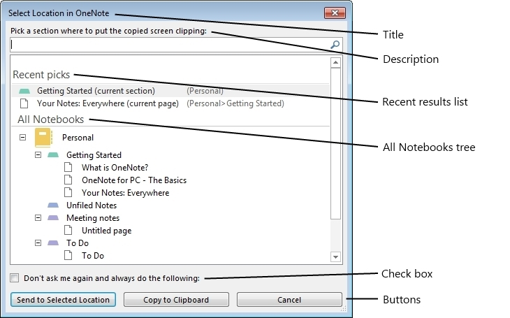

# <a name="quick-filing-dialog-box-interfaces-onenote"></a><span data-ttu-id="f8a04-103">Интерфейсы поле диалоговое окно быстрого хранения (OneNote)</span><span class="sxs-lookup"><span data-stu-id="f8a04-103">Quick Filing dialog box interfaces (OneNote)</span></span>

<span data-ttu-id="f8a04-104">В этом разделе описываются интерфейсы, которые можно использовать для задания программным путем диалоговое окно быстрого контроля над заполнением записей в OneNote 2013.</span><span class="sxs-lookup"><span data-stu-id="f8a04-104">This topic describes the interfaces that you can use to programmatically customize the Quick Filing dialog box in OneNote 2013.</span></span>
  
## <a name="quick-filing-dialog-box"></a><span data-ttu-id="f8a04-105">Диалоговое окно Быстрая подготовка файлов</span><span class="sxs-lookup"><span data-stu-id="f8a04-105">Quick Filing dialog box</span></span>

<span data-ttu-id="f8a04-106">Диалоговое окно быстрого контроля над заполнением записей в OneNote 2013 — это настраиваемое диалоговое окно, которое позволяет пользователям выбирать расположение в структуре иерархии OneNote.</span><span class="sxs-lookup"><span data-stu-id="f8a04-106">The Quick Filing dialog box in OneNote 2013 is a customizable dialog box that allows users to select a location within the OneNote hierarchy structure.</span></span> <span data-ttu-id="f8a04-107">Доступно для выбора расположения включают записные книжки, групп разделов, разделы, страницы и вложенные страницы.</span><span class="sxs-lookup"><span data-stu-id="f8a04-107">Selectable locations include notebooks, section groups, sections, pages, and subpages.</span></span> <span data-ttu-id="f8a04-108">Диалоговое окно используется как в приложении OneNote, так и с внешних приложений с помощью API-интерфейса OneNote 2013.</span><span class="sxs-lookup"><span data-stu-id="f8a04-108">The dialog box is used both within the OneNote application and by external applications through the OneNote 2013 API.</span></span> <span data-ttu-id="f8a04-109">На рисунке 1 показано диалоговое окно быстрого контроля над заполнением записей в состояние по умолчанию.</span><span class="sxs-lookup"><span data-stu-id="f8a04-109">Figure 1 shows the Quick Filing dialog box in its default state.</span></span>
  
<span data-ttu-id="f8a04-110">**На рисунке 1. Быстрый диалоговое окно хранения без настройки**</span><span class="sxs-lookup"><span data-stu-id="f8a04-110">**Figure 1. Quick Filing dialog box without customizations**</span></span>

<span data-ttu-id="f8a04-111">![Быстрый контроля над заполнением записей диалоговое окно без настройки] (media/ON15Con_quick_filing_dialog.jpg "Быстрый контроля над заполнением записей диалоговое окно без настройки")</span><span class="sxs-lookup"><span data-stu-id="f8a04-111"></span></span>
  
<span data-ttu-id="f8a04-112">В диалоговом окне пользователи могут переходить иерархии всех записных книжек искать определенные расположения или поиска в древовидной структуре OneNote, введя в текстовом поле.</span><span class="sxs-lookup"><span data-stu-id="f8a04-112">Within the dialog box, users can navigate the All Notebooks hierarchy to look for specific locations or search the OneNote tree structure by typing into the text box.</span></span> <span data-ttu-id="f8a04-113">Заголовок, описание, список последних результатов, флажок текст и состояний, глубина вложенности, кнопок и типов доступно для выбора размещения следующие аспекты диалогового окна, который можно настроить.</span><span class="sxs-lookup"><span data-stu-id="f8a04-113">Aspects of the dialog box that can be customized include the title, description, recent results list, check box text and state, tree depth, buttons, and selectable location types.</span></span>

<span data-ttu-id="f8a04-114">Можно получить доступ к функциональности диалогового окна быстрого контроля над заполнением записей через два интерфейса OneNote 2013.</span><span class="sxs-lookup"><span data-stu-id="f8a04-114">You can access the Quick Filing dialog box functionality through two OneNote 2013 interfaces.</span></span> <span data-ttu-id="f8a04-115">Интерфейс **IQuickFilingDialog** позволяет пользователям создать, настроить и запустить диалоговое окно.</span><span class="sxs-lookup"><span data-stu-id="f8a04-115">The **IQuickFilingDialog** interface allows users to instantiate, set up, and run the dialog box.</span></span> <span data-ttu-id="f8a04-116">Интерфейс **IQuickFilingDialogCallback** вызывается после диалоговое окно закрывается.</span><span class="sxs-lookup"><span data-stu-id="f8a04-116">The **IQuickFilingDialogCallback** interface is called after the dialog box is closed.</span></span> <span data-ttu-id="f8a04-117">Запустите окно в процессе OneNote, чтобы механизм необходимо хранить потоке, диалоговое окно "" и затем запись Выбор пользователя и состояние диалогового окна при ее закрытии.</span><span class="sxs-lookup"><span data-stu-id="f8a04-117">The dialog box is run in the OneNote process, so a mechanism is needed to keep the dialog box's thread running and then to capture the user's selection and the state of the dialog box when it is closed.</span></span> 
  
## <a name="iquickfilingdialog-interface"></a><span data-ttu-id="f8a04-118">Интерфейс IQuickFilingDialog</span><span class="sxs-lookup"><span data-stu-id="f8a04-118">IQuickFilingDialog interface</span></span>
<span data-ttu-id="f8a04-119"><a name="odc_IQuickFilingDialog"> </a></span><span class="sxs-lookup"><span data-stu-id="f8a04-119"></span></span>

<span data-ttu-id="f8a04-120">Этот интерфейс позволяет пользователю настраивать и запустите диалоговое окно.</span><span class="sxs-lookup"><span data-stu-id="f8a04-120">This interface allows the user to customize and run the dialog box.</span></span> <span data-ttu-id="f8a04-121">Пользователя можно создать экземпляр диалоговое окно с помощью класса **приложения** с помощью метода **Application.QuickFilingDialog** .</span><span class="sxs-lookup"><span data-stu-id="f8a04-121">The user can instantiate a dialog box through the **Application** class by using the **Application.QuickFilingDialog** method.</span></span> <span data-ttu-id="f8a04-122">Метод возвращает экземпляр диалогового окна.</span><span class="sxs-lookup"><span data-stu-id="f8a04-122">The method returns an instance of the dialog box.</span></span> <span data-ttu-id="f8a04-123">После задания свойств диалоговое окно метод **IQuickFilingDialog.Run** используется для запуска диалоговое окно.</span><span class="sxs-lookup"><span data-stu-id="f8a04-123">Once the properties of the dialog box are set, the **IQuickFilingDialog.Run** method is used to run the dialog box.</span></span> <span data-ttu-id="f8a04-124">Этот метод запускает диалоговое окно в новом потоке.</span><span class="sxs-lookup"><span data-stu-id="f8a04-124">This method runs the dialog box on a new thread.</span></span> 
  
<span data-ttu-id="f8a04-125">**Свойства**</span><span class="sxs-lookup"><span data-stu-id="f8a04-125">**Properties**</span></span>

|<span data-ttu-id="f8a04-126">**Имя**</span><span class="sxs-lookup"><span data-stu-id="f8a04-126">**Name**</span></span>|<span data-ttu-id="f8a04-127">**Тип**</span><span class="sxs-lookup"><span data-stu-id="f8a04-127">**Type**</span></span>|<span data-ttu-id="f8a04-128">**Описание**</span><span class="sxs-lookup"><span data-stu-id="f8a04-128">**Description**</span></span>|
|:-----|:-----|:-----|
|<span data-ttu-id="f8a04-129">**Название**</span><span class="sxs-lookup"><span data-stu-id="f8a04-129">**Title**</span></span> <br/> |<span data-ttu-id="f8a04-130">string</span><span class="sxs-lookup"><span data-stu-id="f8a04-130">string</span></span>  <br/> |<span data-ttu-id="f8a04-131">Получает или задает текст заголовка, который отображается в строке заголовка диалогового окна.</span><span class="sxs-lookup"><span data-stu-id="f8a04-131">Gets or sets the title text that appears in the title bar of the dialog box window.</span></span>  <br/> |
|<span data-ttu-id="f8a04-132">**Описание**</span><span class="sxs-lookup"><span data-stu-id="f8a04-132">**Description**</span></span> <br/> |<span data-ttu-id="f8a04-133">string</span><span class="sxs-lookup"><span data-stu-id="f8a04-133">string</span></span>  <br/> |<span data-ttu-id="f8a04-134">Получает или задает текстовое описание, чтобы указать пользователя о том, что для выбора.</span><span class="sxs-lookup"><span data-stu-id="f8a04-134">Gets or sets the text description to instruct the user about what to select.</span></span> <span data-ttu-id="f8a04-135">Это значение может быть несколько строк текста.</span><span class="sxs-lookup"><span data-stu-id="f8a04-135">This value can be multiple-line text.</span></span>  <br/> |
|<span data-ttu-id="f8a04-136">**CheckboxText**</span><span class="sxs-lookup"><span data-stu-id="f8a04-136">**CheckboxText**</span></span> <br/> |<span data-ttu-id="f8a04-137">string</span><span class="sxs-lookup"><span data-stu-id="f8a04-137">string</span></span>  <br/> |<span data-ttu-id="f8a04-138">Получает или задает текст, который следует за этот флажок.</span><span class="sxs-lookup"><span data-stu-id="f8a04-138">Gets or sets the text that follows the check box.</span></span> <span data-ttu-id="f8a04-139">Если задано это значение к типу string непустые флажок отображается в диалоговом окне.</span><span class="sxs-lookup"><span data-stu-id="f8a04-139">If this value is set to a non-empty string, a check box appears in the dialog box.</span></span> <span data-ttu-id="f8a04-140">Если значение равно пустой строке, отсутствуют не будет.</span><span class="sxs-lookup"><span data-stu-id="f8a04-140">If the value is an empty string, no check box appears.</span></span>  <br/> |
|<span data-ttu-id="f8a04-141">**CheckboxState**</span><span class="sxs-lookup"><span data-stu-id="f8a04-141">**CheckboxState**</span></span> <br/> |<span data-ttu-id="f8a04-142">bool</span><span class="sxs-lookup"><span data-stu-id="f8a04-142">bool</span></span>  <br/> |<span data-ttu-id="f8a04-143">Получает или задает состояние флажка.</span><span class="sxs-lookup"><span data-stu-id="f8a04-143">Gets or sets the state of the check box.</span></span> <span data-ttu-id="f8a04-144">Если значение задано значение **false**, этот флажок снят, при запуске диалоговое окно.</span><span class="sxs-lookup"><span data-stu-id="f8a04-144">If value is set to **false**, the check box is cleared when the dialog box is started.</span></span> <span data-ttu-id="f8a04-145">Если значение задано значение **true**, флажок при запуске, пока **CheckboxText** — это строка непустые диалоговое окно.</span><span class="sxs-lookup"><span data-stu-id="f8a04-145">If the value is set to **true**, the check box is selected when the dialog box is started as long as **CheckboxText** is a non-empty string.</span></span>  <br/> |
|<span data-ttu-id="f8a04-146">**WindowHandle**</span><span class="sxs-lookup"><span data-stu-id="f8a04-146">**WindowHandle**</span></span> <br/> |<span data-ttu-id="f8a04-147">ulong</span><span class="sxs-lookup"><span data-stu-id="f8a04-147">ulong</span></span>  <br/> |<span data-ttu-id="f8a04-148">Получает идентификатор дескриптор быстрого контроля над заполнением записей диалогового окна.</span><span class="sxs-lookup"><span data-stu-id="f8a04-148">Gets the handle ID of the Quick Filing dialog box window.</span></span>  <br/> |
|<span data-ttu-id="f8a04-149">**TreeDepth**</span><span class="sxs-lookup"><span data-stu-id="f8a04-149">**TreeDepth**</span></span> <br/> |<span data-ttu-id="f8a04-150">**HierarchyElement**</span><span class="sxs-lookup"><span data-stu-id="f8a04-150">**HierarchyElement**</span></span> <br/> |<span data-ttu-id="f8a04-151">Получает или задает глубину дерева OneNote должно отображаться в разделе всех записных книжек.</span><span class="sxs-lookup"><span data-stu-id="f8a04-151">Gets or sets how deep the OneNote tree should be displayed in the All Notebooks section.</span></span> <span data-ttu-id="f8a04-152">По умолчанию отображается дерево до раздела.</span><span class="sxs-lookup"><span data-stu-id="f8a04-152">By default, the tree is displayed up to the sections.</span></span> <span data-ttu-id="f8a04-153">Это свойство не влияет на элементы какого типа может быть выбран.</span><span class="sxs-lookup"><span data-stu-id="f8a04-153">This property does not affect what type of elements can be selected.</span></span>  <br/> <span data-ttu-id="f8a04-154">Если элемент **TreeDepth** ниже в иерархии OneNote не может быть выбран по любой из кнопок, глубина отображаемого дерева будет наименьший возможный элемент доступно для выбора.</span><span class="sxs-lookup"><span data-stu-id="f8a04-154">If **TreeDepth** is set to an element lower in the OneNote hierarchy than can be selected by any of the buttons, the displayed tree depth will be the lowest possible selectable element.</span></span> <span data-ttu-id="f8a04-155">То есть если глубина вложенности настроен для отображения вниз до страниц, но низший доступно для выбора элемента посвящен отдельный раздел, вниз до раздела отображения дерева.</span><span class="sxs-lookup"><span data-stu-id="f8a04-155">That is, if tree depth is set to display down to pages, but the lowest selectable element is a section, the tree is displayed down to sections.</span></span>  <br/> |
|<span data-ttu-id="f8a04-156">**ParentWindowHandle**</span><span class="sxs-lookup"><span data-stu-id="f8a04-156">**ParentWindowHandle**</span></span> <br/> |<span data-ttu-id="f8a04-157">ulong</span><span class="sxs-lookup"><span data-stu-id="f8a04-157">ulong</span></span>  <br/> |<span data-ttu-id="f8a04-158">Получает или задает код дескриптора родительского окна диалогового окна.</span><span class="sxs-lookup"><span data-stu-id="f8a04-158">Gets or sets the handle ID of the parent window of the dialog box.</span></span> <span data-ttu-id="f8a04-159">Если задано это свойство, диалоговое окно быстрого контроля над заполнением записей будет модальное назначенный родительского окна при открытии диалогового окна.</span><span class="sxs-lookup"><span data-stu-id="f8a04-159">If this property is set, the Quick Filing dialog box will be modal to the assigned parent window when the dialog box opens.</span></span> <span data-ttu-id="f8a04-160">То есть пользователь, не сможет получить доступ к родительского окна до закрытия диалоговое окно быстрого контроля над заполнением записей.</span><span class="sxs-lookup"><span data-stu-id="f8a04-160">That is, a user will not be able to access the parent window until the Quick Filing dialog box is closed.</span></span>  <br/> |
|<span data-ttu-id="f8a04-161">**Position**</span><span class="sxs-lookup"><span data-stu-id="f8a04-161">**Position**</span></span> <br/> |<span data-ttu-id="f8a04-162">tagPOINT</span><span class="sxs-lookup"><span data-stu-id="f8a04-162">tagPOINT</span></span>  <br/> |<span data-ttu-id="f8a04-163">Получает или задает позицию окна, при использовании экрана.</span><span class="sxs-lookup"><span data-stu-id="f8a04-163">Gets or sets the position of the window in relation to the screen.</span></span> <span data-ttu-id="f8a04-164">По умолчанию диалоговое окно отображается в центре родительского окна или с рабочего стола.</span><span class="sxs-lookup"><span data-stu-id="f8a04-164">By default, the dialog box appears in the middle of the parent window or the desktop.</span></span>  <br/> |
|<span data-ttu-id="f8a04-165">**SelectedItem**</span><span class="sxs-lookup"><span data-stu-id="f8a04-165">**SelectedItem**</span></span> <br/> |<span data-ttu-id="f8a04-166">string</span><span class="sxs-lookup"><span data-stu-id="f8a04-166">string</span></span>  <br/> |<span data-ttu-id="f8a04-167">Получает идентификатор объекта расположения OneNote, выбранный пользователем, когда диалоговое окно закрывается.</span><span class="sxs-lookup"><span data-stu-id="f8a04-167">Gets the object ID of the OneNote location selected by the user when the dialog box is closed.</span></span> <span data-ttu-id="f8a04-168">При нажатии кнопки **Отмена** объекта задано значение null.</span><span class="sxs-lookup"><span data-stu-id="f8a04-168">If the user clicks the **Cancel** button, the object is set to null.</span></span>  <br/> |
|<span data-ttu-id="f8a04-169">**PressedButton**</span><span class="sxs-lookup"><span data-stu-id="f8a04-169">**PressedButton**</span></span> <br/> |<span data-ttu-id="f8a04-170">ulong</span><span class="sxs-lookup"><span data-stu-id="f8a04-170">ulong</span></span>  <br/> |<span data-ttu-id="f8a04-171">Получает, какая кнопка была нажата при закрытии диалоговое окно.</span><span class="sxs-lookup"><span data-stu-id="f8a04-171">Gets which button was clicked when the dialog box was closed.</span></span> <span data-ttu-id="f8a04-172">Если была нажата кнопка **Отмена** , данное свойство возвращает значение -1.</span><span class="sxs-lookup"><span data-stu-id="f8a04-172">If the **Cancel** button was clicked, this property returns a value of -1.</span></span> <span data-ttu-id="f8a04-173">Все другие кнопки присваиваются значения целое число от 0, увеличивается на 1 для каждого кнопка, добавленная в диалоговое окно.</span><span class="sxs-lookup"><span data-stu-id="f8a04-173">All other buttons are assigned integer values from 0, incremented by 1 for each button added to the dialog box.</span></span> <span data-ttu-id="f8a04-174">Целое число от кнопки **ОК** по умолчанию равно 0.</span><span class="sxs-lookup"><span data-stu-id="f8a04-174">The integer value of the default **OK** button is 0.</span></span>  <br/> |
   
### <a name="methods"></a><span data-ttu-id="f8a04-175">Методы</span><span class="sxs-lookup"><span data-stu-id="f8a04-175">Methods</span></span>

<span data-ttu-id="f8a04-176">**SetRecentResults**</span><span class="sxs-lookup"><span data-stu-id="f8a04-176">**SetRecentResults**</span></span>

|||
|:-----|:-----|
|<span data-ttu-id="f8a04-177">**Описание**</span><span class="sxs-lookup"><span data-stu-id="f8a04-177">**Description**</span></span> <br/> |<span data-ttu-id="f8a04-178">Задает, какой список последних результатов будет отображаться в диалоговом окне быстрого контроля над заполнением записей и указывает, следует ли включать некоторые специальные хранения расположения в списке.</span><span class="sxs-lookup"><span data-stu-id="f8a04-178">Sets what recent result list will be displayed in the Quick Filing dialog box, and indicates whether to include some special filing locations in the list.</span></span> <span data-ttu-id="f8a04-179">Пользователи могут выбрать список последних результатов из перечисления [RecentResultType](enumerations-onenote-developer-reference.md#odc_RecentResultType) .</span><span class="sxs-lookup"><span data-stu-id="f8a04-179">Users can select a recent result list from the [RecentResultType](enumerations-onenote-developer-reference.md#odc_RecentResultType) enumeration.</span></span> <span data-ttu-id="f8a04-180">Пользователи также могут выбрать для добавьте следующие параметры в список: текущий раздел, текущей страницы или раздела.</span><span class="sxs-lookup"><span data-stu-id="f8a04-180">Users can also choose to add the following options to the list: Current Section, Current Page, or Unfiled Notes.</span></span> <span data-ttu-id="f8a04-181">Если выбрано **RecentResultType.rrtNone** , будет показан не список последних результатов.</span><span class="sxs-lookup"><span data-stu-id="f8a04-181">If **RecentResultType.rrtNone** is selected, no recent result list is shown.</span></span>  <br/> |
|<span data-ttu-id="f8a04-182">**Синтаксис**</span><span class="sxs-lookup"><span data-stu-id="f8a04-182">**Syntax**</span></span> <br/> | `HRESULT SetRecentResults (`<br/>`[in]RecentResultType recentResults,`<br/>`[in]VARIANT_BOOL fShowCurrentSection,`<br/>`[in]VARIANT_BOOL fShowCurrentPage,`<br/>`[in]VARIANT_BOOL fShowUnfiledNotes);` <br/> |
|<span data-ttu-id="f8a04-183">**Параметры**</span><span class="sxs-lookup"><span data-stu-id="f8a04-183">**Parameters**</span></span> <br/> | <span data-ttu-id="f8a04-184">_recentResults_ &ndash; Объект типа **RecentResultType** , которое указывает, какой список последних результатов, если они существуют, должны отображаться.</span><span class="sxs-lookup"><span data-stu-id="f8a04-184">_recentResults_ &ndash; An object of type **RecentResultType** that indicates which recent result list, if any, should appear.</span></span> <span data-ttu-id="f8a04-185">Если выбрано **rrtNone** , не список последних результатов отображается в диалоговом окне.</span><span class="sxs-lookup"><span data-stu-id="f8a04-185">If **rrtNone** is selected, no recent result list appears in the dialog box.</span></span><br/><br/>  <span data-ttu-id="f8a04-186">_fShowCurrentSection_ &ndash; Логическое значение, указывающее, включены ли текущего раздела в список последних результатов.</span><span class="sxs-lookup"><span data-stu-id="f8a04-186">_fShowCurrentSection_ &ndash; A Boolean value that indicates whether the current section should be included in the recent result list.</span></span><br/><br/>  <span data-ttu-id="f8a04-187">_fShowCurrentPage_ &ndash; Логическое значение, указывающее, включены ли текущей страницы в список последних результатов.</span><span class="sxs-lookup"><span data-stu-id="f8a04-187">_fShowCurrentPage_ &ndash; A Boolean value that indicates whether the current page should be included in the recent result list.</span></span><br/><br/>  <span data-ttu-id="f8a04-188">_fShowUnfiledNotes_ &ndash; Логическое значение, указывающее, включены ли в разделе раздела в список последних результатов.</span><span class="sxs-lookup"><span data-stu-id="f8a04-188">_fShowUnfiledNotes_ &ndash; A Boolean value that indicates whether the Unfiled Notes section should be included in the recent result list.</span></span>  <br/> |
   
> [!NOTE]
> <span data-ttu-id="f8a04-189">Невозможно выбрать расположение специальные хранения можно использовать любой из кнопок в диалоговом окне, не отображается в списке.</span><span class="sxs-lookup"><span data-stu-id="f8a04-189">If a special filing location cannot be selected by using any of the buttons in the dialog box, it is not shown in the list.</span></span> <span data-ttu-id="f8a04-190">Если не доступно для выбора в списке последние результатов найден элемент, отображается список не последних результатов.</span><span class="sxs-lookup"><span data-stu-id="f8a04-190">If no selectable item in the recent results list is found, no recent result list is displayed.</span></span> 
  
<span data-ttu-id="f8a04-191">В следующем примере метод **SetRecentResults** используется для отображения текущего раздела, текущей страницы и в разделе раздела в список последних результатов.</span><span class="sxs-lookup"><span data-stu-id="f8a04-191">The following example uses the **SetRecentResults** method to display the current section, current page, and the Unfiled Notes section in the recent result list.</span></span> 
  
```cs
        static void Main(string[] args)
        {
            Microsoft.Office.Interop.OneNote.Application app = 
                new Microsoft.Office.Interop.OneNote.Application();
            ... 
            // RECENT RESULTS
            qfDialog.SetRecentResults(RecentResultType.rrtFiling,
                /*Current Section*/ true,
                /*Current Page*/ true,
                /*Unfiled Notes*/ true);
            ...
        }

```

<span data-ttu-id="f8a04-192">**AddButton**</span><span class="sxs-lookup"><span data-stu-id="f8a04-192">**AddButton**</span></span>

|||
|:-----|:-----|
|<span data-ttu-id="f8a04-193">**Описание**</span><span class="sxs-lookup"><span data-stu-id="f8a04-193">**Description**</span></span> <br/> |<span data-ttu-id="f8a04-194">Пользователи могут добавлять и настраивать кнопки в диалоговом окне.</span><span class="sxs-lookup"><span data-stu-id="f8a04-194">Allows users to add and customize buttons in the dialog box.</span></span> <span data-ttu-id="f8a04-195">Пользователи могут указать текст для кнопок и какие элементы в иерархии OneNote можно выбирать с кнопками.</span><span class="sxs-lookup"><span data-stu-id="f8a04-195">Users can specify the text on the buttons and what elements of the OneNote hierarchy can be selected by each button.</span></span>  <br/> |
|<span data-ttu-id="f8a04-196">**Синтаксис**</span><span class="sxs-lookup"><span data-stu-id="f8a04-196">**Syntax**</span></span> <br/> | `HRESULT AddButton (`<br/>`[in]BSTR bstrText,`<br/>`[in]HierarchyElement allowedElements,`<br/>`[in]HierarchyElement allowedReadOnlyElements,`<br/>`[in]VARIANT_BOOL fDefault);` <br/> |
|<span data-ttu-id="f8a04-197">**Параметры**</span><span class="sxs-lookup"><span data-stu-id="f8a04-197">**Parameters**</span></span> <br/> | <span data-ttu-id="f8a04-198">_bstrText_ &ndash; Строку, которая определяет текст, который отображается на кнопке.</span><span class="sxs-lookup"><span data-stu-id="f8a04-198">_bstrText_ &ndash; A string that specifies the text to appear on the button.</span></span> <span data-ttu-id="f8a04-199">Чтобы настроить кнопки **ОК** по умолчанию, передайте значение null в качестве **bstrText**.</span><span class="sxs-lookup"><span data-stu-id="f8a04-199">To customize the default **OK** button, pass in a null value as **bstrText**.</span></span>  <br/><br/><span data-ttu-id="f8a04-200">_allowedElements_ &ndash; **HierarchyElement** , которое указывает, какие элементы иерархии OneNote не только для чтения пользователь может выбрать с помощью кнопки.</span><span class="sxs-lookup"><span data-stu-id="f8a04-200">_allowedElements_ &ndash; A **HierarchyElement** that indicates what non-read-only OneNote hierarchy elements a user is allowed to select by using the button.</span></span> <span data-ttu-id="f8a04-201">Для выбора нескольких элементов, пользователь должен передавать оператор **или** для всех uint эквивалентные значения типов **HierarchyElement** , разрешенных в качестве **HierarchyElement**.</span><span class="sxs-lookup"><span data-stu-id="f8a04-201">For selecting multiple items, the user should pass in the **OR** operator for all the uint equivalent values of the **HierarchyElement** types allowed as a **HierarchyElement**.</span></span><br/><br/>  <span data-ttu-id="f8a04-202">_allowedReadOnlyElements_ &ndash; **HierarchyElement** , которое указывает, какие элементы иерархии только для чтения OneNote пользователь может выбрать с помощью кнопки.</span><span class="sxs-lookup"><span data-stu-id="f8a04-202">_allowedReadOnlyElements_ &ndash; A **HierarchyElement** that indicates what OneNote read-only hierarchy elements a user is allowed to select by using the button.</span></span> <span data-ttu-id="f8a04-203">Для выбора нескольких элементов, пользователь должен передавать оператор **или** для всех значений эквивалентами **uint** типов **HierarchyElement** , разрешенных в качестве **HierarchyElement**.</span><span class="sxs-lookup"><span data-stu-id="f8a04-203">For selecting multiple items, the user should pass in the **OR** operator for all the **uint** equivalents values of the **HierarchyElement** types allowed as a **HierarchyElement**.</span></span><br/><br/>  <span data-ttu-id="f8a04-204">_fDefault_ &ndash; Логическое значение, указывающее, следует ли эта кнопка кнопкой по умолчанию.</span><span class="sxs-lookup"><span data-stu-id="f8a04-204">_fDefault_ &ndash; A Boolean value that specifies whether this button should be the default button.</span></span> <span data-ttu-id="f8a04-205">Если несколько кнопок устанавливается по умолчанию, последний указанный кнопка становится кнопкой по умолчанию.</span><span class="sxs-lookup"><span data-stu-id="f8a04-205">If multiple buttons are set as default, the last specified button becomes the default button.</span></span>  <br/> |
   
<span data-ttu-id="f8a04-206">В следующем примере добавляется три кнопки в диалоговое окно быстрого контроля над заполнением записей.</span><span class="sxs-lookup"><span data-stu-id="f8a04-206">The following example adds three buttons to the Quick Filing dialog box.</span></span> <span data-ttu-id="f8a04-207">Первый из них, **все**, можно выбрать, все элементы в дереве иерархии OneNote.</span><span class="sxs-lookup"><span data-stu-id="f8a04-207">The first one, **All**, can be selected by all elements in the OneNote hierarchy tree.</span></span> <span data-ttu-id="f8a04-208">Другие, **записные книжки** и **страниц**, можно выбрать только в том случае, если выбраны соответствующие элементы, записные книжки и страницы.</span><span class="sxs-lookup"><span data-stu-id="f8a04-208">The others, **Notebooks** and **Pages**, can be selected only if their corresponding elements, Notebooks and Pages, are selected.</span></span>
  
```cs
        static void Main(string[] args)
        {
            Microsoft.Office.Interop.OneNote.Application app = 
                new Microsoft.Office.Interop.OneNote.Application();
            ... 
            
            // BUTTONS
            HierarchyElement heAll = (HierarchyElement) 
                ((uint)HierarchyElement.heNotebooks | 
                (uint)HierarchyElement.heSectionGroups | 
                (uint)HierarchyElement.heSections |  
                (uint)HierarchyElement.hePages);
            
            qfDialog.AddButton("All", heAll, heAll, true);
            qfDialog.AddButton("Notebooks", HierarchyElement.heNotebooks, 
                HierarchyElement.heNotebooks, false);
            qfDialog.AddButton("Pages", HierarchyElement.hePages, 
                HierarchyElement.hePages, false);
            ... 
        }

```

<span data-ttu-id="f8a04-209">**Run**</span><span class="sxs-lookup"><span data-stu-id="f8a04-209">**Run**</span></span>

|||
|:-----|:-----|
|<span data-ttu-id="f8a04-210">**Описание**</span><span class="sxs-lookup"><span data-stu-id="f8a04-210">**Description**</span></span> <br/> |<span data-ttu-id="f8a04-211">Отображает диалоговое окно быстрого контроля над заполнением записей из нового потока.</span><span class="sxs-lookup"><span data-stu-id="f8a04-211">Displays the Quick Filing dialog box from a new thread.</span></span> <span data-ttu-id="f8a04-212">Требуемое ссылку на интерфейс **IQuickFilingDialogCallback** , будет вызван метод которого **OnDialogClosed** после диалоговое окно закрывается.</span><span class="sxs-lookup"><span data-stu-id="f8a04-212">It takes a reference to the **IQuickFilingDialogCallback** interface, whose **OnDialogClosed** method will be called once the dialog box closes.</span></span>  <br/> |
|<span data-ttu-id="f8a04-213">**Синтаксис**</span><span class="sxs-lookup"><span data-stu-id="f8a04-213">**Syntax**</span></span> <br/> | `HRESULT Run (`<br/>`[in]IQuickFilingDialogCallback piCallback);` <br/> |
|<span data-ttu-id="f8a04-214">**Параметры**</span><span class="sxs-lookup"><span data-stu-id="f8a04-214">**Parameters**</span></span> <br/> | <span data-ttu-id="f8a04-215">_piCallback_ &ndash; Ссылку на интерфейс **IQuickFilingDialogCallback** , который будет создан после диалоговое окно закрывается.</span><span class="sxs-lookup"><span data-stu-id="f8a04-215">_piCallback_ &ndash; A reference to the **IQuickFilingDialogCallback** interface that will be instantiated once the dialog box closes.</span></span>  <br/> |
   
<span data-ttu-id="f8a04-216">В следующем примере метод **Run** для отображения диалогового окна быстрого контроля над заполнением записей из нового потока.</span><span class="sxs-lookup"><span data-stu-id="f8a04-216">The following example uses the **Run** method to display the Quick Filing dialog box from a new thread.</span></span> 
  
```cs
    class OpenQuickFilingDialog
    {
            ... 
        static void Main(string[] args)
        {
            Microsoft.Office.Interop.OneNote.Application app = 
                new Microsoft.Office.Interop.OneNote.Application();
            ... 
            // Display Quick Filing UI
            qfDialog.Run(new Callback());
            ... 
        }
    }

```

<span data-ttu-id="f8a04-217">**TreeCollapsedState**</span><span class="sxs-lookup"><span data-stu-id="f8a04-217">**TreeCollapsedState**</span></span>

|||
|:-----|:-----|
|<span data-ttu-id="f8a04-218">**Описание**</span><span class="sxs-lookup"><span data-stu-id="f8a04-218">**Description**</span></span> <br/> |<span data-ttu-id="f8a04-219">Указывает, следует ли разворачивать и сворачивать дерева иерархии.</span><span class="sxs-lookup"><span data-stu-id="f8a04-219">Indicates whether the hierarchy tree should be expanded or collapsed.</span></span>  <br/> |
|<span data-ttu-id="f8a04-220">**Синтаксис**</span><span class="sxs-lookup"><span data-stu-id="f8a04-220">**Syntax**</span></span> <br/> | `HRESULT TreeCollapsedState(`<br/>`[in] TreeCollapsedStateType tcs);` <br/> |
|<span data-ttu-id="f8a04-221">**Параметры**</span><span class="sxs-lookup"><span data-stu-id="f8a04-221">**Parameters**</span></span> <br/> | <span data-ttu-id="f8a04-222">_tcs_ - указывает, будет ли дерево развернут или свернут.</span><span class="sxs-lookup"><span data-stu-id="f8a04-222">_tcs_ - Specifies whether the tree is expanded or collapsed.</span></span>  <br/> |
   
<span data-ttu-id="f8a04-223">**NotebookFilterOut**</span><span class="sxs-lookup"><span data-stu-id="f8a04-223">**NotebookFilterOut**</span></span>

|||
|:-----|:-----|
|<span data-ttu-id="f8a04-224">**Описание**</span><span class="sxs-lookup"><span data-stu-id="f8a04-224">**Description**</span></span> <br/> |<span data-ttu-id="f8a04-225">Фильтрация списка записных книжек показано по типу.</span><span class="sxs-lookup"><span data-stu-id="f8a04-225">Filters the list of notebooks shown by type.</span></span>  <br/> |
|<span data-ttu-id="f8a04-226">**Синтаксис**</span><span class="sxs-lookup"><span data-stu-id="f8a04-226">**Syntax**</span></span> <br/> | `HRESULT NotebookFilterOut(`<br/>`[in] NotebookFilterOutType nfo);` <br/> |
|<span data-ttu-id="f8a04-227">**Параметры**</span><span class="sxs-lookup"><span data-stu-id="f8a04-227">**Parameters**</span></span> <br/> | <span data-ttu-id="f8a04-228">_nfo_ - указывает набор записные книжки, которые должны быть отфильтрованы из списка</span><span class="sxs-lookup"><span data-stu-id="f8a04-228">_nfo_ - Specifies the set of notebooks that are to be filtered out of the list</span></span>  <br/> |
   
<span data-ttu-id="f8a04-229">**ShowCreateNewNotebook**</span><span class="sxs-lookup"><span data-stu-id="f8a04-229">**ShowCreateNewNotebook**</span></span>

|||
|:-----|:-----|
|<span data-ttu-id="f8a04-230">**Описание**</span><span class="sxs-lookup"><span data-stu-id="f8a04-230">**Description**</span></span> <br/> |<span data-ttu-id="f8a04-231">Отображает записной книжки параметр создать в диалоговом окне.</span><span class="sxs-lookup"><span data-stu-id="f8a04-231">Displays the create new notebook option in the dialog.</span></span>  <br/> |
|<span data-ttu-id="f8a04-232">**Синтаксис**</span><span class="sxs-lookup"><span data-stu-id="f8a04-232">**Syntax**</span></span> <br/> | `HRESULT ShowCreateNewNotebook ();` <br/> |
|<span data-ttu-id="f8a04-233">**Параметры**</span><span class="sxs-lookup"><span data-stu-id="f8a04-233">**Parameters**</span></span> <br/> |<span data-ttu-id="f8a04-234">Нет</span><span class="sxs-lookup"><span data-stu-id="f8a04-234">None</span></span>  <br/> |
   
<span data-ttu-id="f8a04-235">**AddInitialEditor**</span><span class="sxs-lookup"><span data-stu-id="f8a04-235">**AddInitialEditor**</span></span>

|||
|:-----|:-----|
|<span data-ttu-id="f8a04-236">**Описание**</span><span class="sxs-lookup"><span data-stu-id="f8a04-236">**Description**</span></span> <br/> |<span data-ttu-id="f8a04-237">Добавляет пользователя как начальное редактора в записной книжке в диалоговом окне быстрого контроля над заполнением записей.</span><span class="sxs-lookup"><span data-stu-id="f8a04-237">Adds a user as an initial editor to a notebook in the Quick Filing dialog box.</span></span>  <br/> |
|<span data-ttu-id="f8a04-238">**Синтаксис**</span><span class="sxs-lookup"><span data-stu-id="f8a04-238">**Syntax**</span></span> <br/> | `HRESULT AddInitialEditor (BSTR initialEditor);` <br/> |
|<span data-ttu-id="f8a04-239">**Параметры**</span><span class="sxs-lookup"><span data-stu-id="f8a04-239">**Parameters**</span></span> <br/> | <span data-ttu-id="f8a04-240">_initialEditor_ - адрес электронной почты пользователя, которого вы хотите добавить как редактор в блокноте.</span><span class="sxs-lookup"><span data-stu-id="f8a04-240">_initialEditor_ - The email address of the user you wish to add as an editor to the notebook.</span></span> <span data-ttu-id="f8a04-241">При создании записной книжки через диалоговое окно быстрого контроля над заполнением записей, автоматически становятся доступными все начальные редакторы.</span><span class="sxs-lookup"><span data-stu-id="f8a04-241">When the notebook is created via the Quick Filing dialog box, it is automatically shared with all Initial Editors.</span></span>  <br/> |
   
<span data-ttu-id="f8a04-242">**ClearInitialEditors**</span><span class="sxs-lookup"><span data-stu-id="f8a04-242">**ClearInitialEditors**</span></span>

|||
|:-----|:-----|
|<span data-ttu-id="f8a04-243">**Описание**</span><span class="sxs-lookup"><span data-stu-id="f8a04-243">**Description**</span></span> <br/> |<span data-ttu-id="f8a04-244">Удаляет все начальные редакторы из диалогового окна быстрого контроля над заполнением записей.</span><span class="sxs-lookup"><span data-stu-id="f8a04-244">Removes all initial editors from the Quick Filing dialog box.</span></span>  <br/> |
|<span data-ttu-id="f8a04-245">**Синтаксис**</span><span class="sxs-lookup"><span data-stu-id="f8a04-245">**Syntax**</span></span> <br/> | `HRESULT ClearInitialEditors ();` <br/> |
|<span data-ttu-id="f8a04-246">**Параметры**</span><span class="sxs-lookup"><span data-stu-id="f8a04-246">**Parameters**</span></span> <br/> |<span data-ttu-id="f8a04-247">Нет</span><span class="sxs-lookup"><span data-stu-id="f8a04-247">None</span></span>  <br/> |
   
<span data-ttu-id="f8a04-248">**ShowSharingHyperlink**</span><span class="sxs-lookup"><span data-stu-id="f8a04-248">**ShowSharingHyperlink**</span></span>

|||
|:-----|:-----|
|<span data-ttu-id="f8a04-249">**Описание**</span><span class="sxs-lookup"><span data-stu-id="f8a04-249">**Description**</span></span> <br/> |<span data-ttu-id="f8a04-250">Отображает гиперссылку общего доступа к раздела справки в диалоговом окне быстрого контроля над заполнением записей.</span><span class="sxs-lookup"><span data-stu-id="f8a04-250">Displays the Sharing Help Topic Hyperlink in the Quick Filing dialog box.</span></span>  <br/> |
|<span data-ttu-id="f8a04-251">**Синтаксис**</span><span class="sxs-lookup"><span data-stu-id="f8a04-251">**Syntax**</span></span> <br/> | `HRESULT ShowSharingHyperlink();` <br/> |
|<span data-ttu-id="f8a04-252">**Параметры**</span><span class="sxs-lookup"><span data-stu-id="f8a04-252">**Parameters**</span></span> <br/> |<span data-ttu-id="f8a04-253">Нет</span><span class="sxs-lookup"><span data-stu-id="f8a04-253">None</span></span>  <br/> |
   
## <a name="iquickfilingdialogcallback-interface"></a><span data-ttu-id="f8a04-254">Интерфейс IQuickFilingDialogCallback</span><span class="sxs-lookup"><span data-stu-id="f8a04-254">IQuickFilingDialogCallback interface</span></span>
<span data-ttu-id="f8a04-255"><a name="odc_IQuickFilingDialog"> </a></span><span class="sxs-lookup"><span data-stu-id="f8a04-255"></span></span>

<span data-ttu-id="f8a04-256">Этот интерфейс позволяет пользователям получать доступ к диалогового окна Свойства поля после диалоговое окно закрывается.</span><span class="sxs-lookup"><span data-stu-id="f8a04-256">This interface allows the user to access the dialog box properties after the dialog box closes.</span></span> <span data-ttu-id="f8a04-257">После закрытия диалогового окна OneNote 2013 вызывает метод **IQuickFilingDialogCallback.OnDialogClose** в этот интерфейс.</span><span class="sxs-lookup"><span data-stu-id="f8a04-257">Once the dialog box closes, OneNote 2013 calls the **IQuickFilingDialogCallback.OnDialogClose** method in this interface.</span></span> 
  
<span data-ttu-id="f8a04-258">Класс, который наследует этот интерфейс должен быть определен.</span><span class="sxs-lookup"><span data-stu-id="f8a04-258">A class that inherits this interface has to be defined.</span></span>
  
### <a name="methods"></a><span data-ttu-id="f8a04-259">Методы</span><span class="sxs-lookup"><span data-stu-id="f8a04-259">Methods</span></span>

<span data-ttu-id="f8a04-260">В следующем разделе описываются методы, связанные с интерфейсов, описанных ранее.</span><span class="sxs-lookup"><span data-stu-id="f8a04-260">The following section describes the methods associated with the interfaces detailed previously.</span></span>
  
<span data-ttu-id="f8a04-261">**OnDialogClosed**</span><span class="sxs-lookup"><span data-stu-id="f8a04-261">**OnDialogClosed**</span></span>

|||
|:-----|:-----|
|<span data-ttu-id="f8a04-262">**Описание**</span><span class="sxs-lookup"><span data-stu-id="f8a04-262">**Description**</span></span> <br/> |<span data-ttu-id="f8a04-263">Позволяет пользователям добавлять функциональные возможности захвата и использовать в диалоговом окне Выбор пользователей.</span><span class="sxs-lookup"><span data-stu-id="f8a04-263">Enables users to add functionality to capture and use the user selection from the dialog box.</span></span> <span data-ttu-id="f8a04-264">Этот метод вызывается после закрытия диалоговое окно быстрого контроля над заполнением записей.</span><span class="sxs-lookup"><span data-stu-id="f8a04-264">This method is called after the Quick Filing dialog box is closed.</span></span> <span data-ttu-id="f8a04-265">Этот метод является функцией, для которого **IQuickFilingDialogCallback** интерфейсы для определения.</span><span class="sxs-lookup"><span data-stu-id="f8a04-265">This method is a function that **IQuickFilingDialogCallback** interfaces have to define.</span></span>  <br/> |
|<span data-ttu-id="f8a04-266">**Синтаксис**</span><span class="sxs-lookup"><span data-stu-id="f8a04-266">**Syntax**</span></span> <br/> | `HRESULT OnDialogClosed (`<br/>`[in]IQuickFilingDialog dialog);` <br/> |
|<span data-ttu-id="f8a04-267">**Параметры**</span><span class="sxs-lookup"><span data-stu-id="f8a04-267">**Parameters**</span></span> <br/> | <span data-ttu-id="f8a04-268">_диалоговое окно_ &ndash; **IQuickFilingDialog** объекта, который вызвал метод **OnDialogClose** .</span><span class="sxs-lookup"><span data-stu-id="f8a04-268">_dialog_ &ndash; The **IQuickFilingDialog** object that called the **OnDialogClose** method.</span></span>  <br/> |
   
<span data-ttu-id="f8a04-269">Следующий пример является интерфейсом **IQuickFilingDialogCallback** образца.</span><span class="sxs-lookup"><span data-stu-id="f8a04-269">The following example is a sample **IQuickFilingDialogCallback** interface.</span></span> <span data-ttu-id="f8a04-270">Метод **OnDialogClose** печатает Выбор пользователя из диалогового окна быстрого контроля над заполнением записей на консоль.</span><span class="sxs-lookup"><span data-stu-id="f8a04-270">The **OnDialogClose** method prints the user's selection from the Quick Filing dialog box to the console.</span></span> 
  
```cs
    class Callback : IQuickFilingDialogCallback
    {
        public Callback(){}
        public void OnDialogClosed(IQuickFilingDialog qfDialog)
        {
            Console.WriteLine(qfDialog.SelectedItem);
            Console.WriteLine(qfDialog.PressedButton);
            Console.WriteLine(qfDialog.CheckboxState);
        }
    }

```

## <a name="example"></a><span data-ttu-id="f8a04-271">Пример</span><span class="sxs-lookup"><span data-stu-id="f8a04-271">Example</span></span>
<span data-ttu-id="f8a04-272"><a name="odc_IQuickFilingDialog"> </a></span><span class="sxs-lookup"><span data-stu-id="f8a04-272"></span></span>

<span data-ttu-id="f8a04-273">В следующем примере кода открывается быстрого контроля над заполнением записей диалоговое окно, которое содержит настраиваемый заголовок, описание, список последних результатов, глубина вложенности, флажок и кнопки.</span><span class="sxs-lookup"><span data-stu-id="f8a04-273">The following code example opens a Quick Filing dialog box that has a customized title, description, recent result list, tree depth, check box, and buttons.</span></span> <span data-ttu-id="f8a04-274">Пользователя выбранного элемента, нажата кнопка, и состояние флажка будет отображаться в окне консоли, когда диалоговое окно закрывается.</span><span class="sxs-lookup"><span data-stu-id="f8a04-274">The user's selected item, pressed button, and check-box state will be displayed in a console window when the dialog box is closed.</span></span> <span data-ttu-id="f8a04-275">Для просмотра кнопки страницы включено, пользователь будет иметь для поиска для страницы и выберите его, так как глубина вложенности задано значение разделах.</span><span class="sxs-lookup"><span data-stu-id="f8a04-275">To see the page button enabled, the user will have to search for a page and select it, because the tree depth is set down to sections.</span></span> <span data-ttu-id="f8a04-276">Диалоговое окно не является дочерним любого окна.</span><span class="sxs-lookup"><span data-stu-id="f8a04-276">The dialog box is not a child of any window.</span></span>
  
```cs
using System;
using System.Collections.Generic;
using System.Linq;
using System.Text;
using System.Threading;
using Microsoft.Office.Interop.OneNote;
namespace SampleQFD
{
    class OpenQuickFilingDialog
    {
        private static EventWaitHandle wh = new AutoResetEvent(false);
        private static IQuickFilingDialog qfDialog;
        private static String strTitle = "Sample Title";
        private static String strDescription = "Sample Description";
        private static String strCheckboxText = "Sample Checkbox";
        static void Main(string[] args)
        {
            Microsoft.Office.Interop.OneNote.Application app = 
                new Microsoft.Office.Interop.OneNote.Application();
            // Instantiate Quick Filing UI
            qfDialog = app.QuickFiling();
            #region//SET API PARAMETERS
            // TITLE
            qfDialog.Title = strTitle;
            // DESCRIPTION
            qfDialog.Description = strDescription;
            // RECENT RESULTS
            qfDialog.SetRecentResults(RecentResultType.rrtFiling,
                /*Current Section*/ true,
                /*Current Page*/ true,
                /*Unfiled Notes*/ true);
            // TREE DEPTH
            qfDialog.TreeDepth = HierarchyElement.heSections;
            // CHECKBOX
            qfDialog.CheckboxText = strCheckboxText;
            qfDialog.CheckboxState = false;
            // BUTTONS
            HierarchyElement heAll = (HierarchyElement) 
                ((uint)HierarchyElement.heNotebooks | 
                (uint)HierarchyElement.heSectionGroups | 
                (uint)HierarchyElement.heSections |  
                (uint)HierarchyElement.hePages);
            
            qfDialog.AddButton("All", heAll, heAll, true);
            qfDialog.AddButton("Notebooks", HierarchyElement.heNotebooks, 
                HierarchyElement.heNotebooks, false);
            qfDialog.AddButton("Pages", HierarchyElement.hePages, 
                HierarchyElement.hePages, false);
            // PARENTWINDOW
            #endregion
            // Display Quick Filing UI
            qfDialog.Run(new Callback());
            // Clean up and Wait so console window does not close
            qfDialog = null;
            wh.WaitOne();
        }
    }
    class Callback : IQuickFilingDialogCallback
    {
        public Callback(){}
        public void OnDialogClosed(IQuickFilingDialog qfDialog)
        {
            Console.WriteLine(qfDialog.SelectedItem);
            Console.WriteLine(qfDialog.PressedButton);
            Console.WriteLine(qfDialog.CheckboxState);
        }
    }
}

```

## <a name="see-also"></a><span data-ttu-id="f8a04-277">См. также</span><span class="sxs-lookup"><span data-stu-id="f8a04-277">See also</span></span>

- [<span data-ttu-id="f8a04-278">Справочник разработчика для OneNote</span><span class="sxs-lookup"><span data-stu-id="f8a04-278">OneNote developer reference</span></span>](onenote-developer-reference.md)

