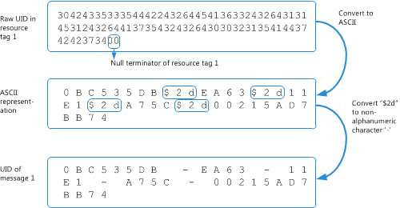

# Синтаксический анализ журнала загрузки сообщений для учетной записи POP3Parsing the message download history for a POP3 account

В этом разделе описываются структуры BLOB POP3, представляющий журнала загрузки сообщений учетной записи POP3 для идентификации сообщения, которые загружаются или удалении для этой учетной записи.This topic describes the structure of the POP3 BLOB that represents the message download history of a POP3 account, to identify the messages that have been downloaded or deleted on that account.

## Почему синтаксический анализ журнала загрузки сообщений?Why parse the message download history?

Поставщик протокол POP (Post Office) для Outlook позволяет пользователям для получения и загрузки новых сообщений электронной почты для своих локальных устройств и впоследствии оставьте или удалять эти сообщения электронной почты на почтовом сервере.The Post Office Protocol (POP) provider for Outlook allows users to retrieve and download new email messages on their local device, and subsequently to leave or delete these email messages on the mail server. При почтового клиента проверяет наличие новых сообщений для загрузки, она должна быть возможность определения и загружать только новые сообщения для этой папки "Входящие".When the mail client checks for new messages to download, it has to be able to identify and download only the new messages for that Inbox. Почтовый клиент делает это с помощью команды UIDL (уникальный идентификатор со списком) для получения карты каждого сообщения, когда-либо было доставлено для этой папки "Входящие" с уникальным идентификатором (UID).The mail client does this by first using the UIDL (Unique ID Listing) command to obtain a map of each message that has ever been delivered to that Inbox to a unique identifier (UID). Клиент получает журнала загрузки сообщений для сообщений, которые загружаются или удалены для папки "Входящие" на клиента.The client also gets the message download history for messages that have been downloaded or deleted for the Inbox on that client. С помощью сообщения UID карты и журнал загрузки, клиент может затем определите сообщения, отсутствующих в журнале как новый и, следовательно, необходимо загрузить.Using the message UID map and download history, the client can then identify those messages that are absent from the history as new and, hence, should be downloaded.
  
Для получения журнала загрузки сообщений для папки "Входящие":To get the messages download history for an Inbox:
  
- Выполните действия, описанные в [Поиск сообщения журнала для учетной записи POP3 загрузки](locating-the-message-download-history-for-a-pop3-account.md) для поиска свойства [PidTagAttachDataBinary](http://msdn.microsoft.com/library/3b0a8b28-863e-4b96-a4c0-fdb8f40555b9%28Office.15%29.aspx) , который содержит больших двоичных объектов (BLOB), который представляет журнал сообщений для учетной записи POP3.Follow the steps in [Locating the message download history for a POP3 account](locating-the-message-download-history-for-a-pop3-account.md) to find the [PidTagAttachDataBinary](http://msdn.microsoft.com/library/3b0a8b28-863e-4b96-a4c0-fdb8f40555b9%28Office.15%29.aspx) property, which contains a binary large object (BLOB) that represents the message history for a POP3 account. 
    
- Прочтите этот раздел, который описывает структуру больших двоичных ОБЪЕКТОВ и показан пример больших двоичных ОБЪЕКТОВ для идентификации сообщений, которые загружаются или удалены для папки "Входящие" учетной записи POP3.Read this topic, which describes the structure of the BLOB, and shows an example BLOB to identify messages that have been downloaded or deleted for the Inbox of the POP3 account.

## Структура POP больших двоичных ОБЪЕКТОВPOP BLOB structure

POP больших двоичных ОБЪЕКТОВ, как описано в таблице 1 начинается с два поля, **версии** и **Count**, за которым следует номер **Count** тегов ресурсов, каждый из которых является символом null.The POP BLOB structure, as described in Table 1, begins with two fields, **Version** and **Count**, followed by a **Count** number of resource tags, each of which is null-terminated. 
  
**В таблице 1. Структура больших двоичных ОБЪЕКТОВ, представляющий сообщение загрузить журнал учетной записи POP3****Table 1. Structure of the BLOB that represents the message download history of a POP3 account**

|**Поля в больших двоичных ОБЪЕКТОВ****Field in BLOB**|**Размер****Size**|**Описание****Description**|
|:-----|:-----|:-----|
|**Версия****Version**   |2 байта2 bytes    |Должен быть 3 (**PBLOB_VERSION_NUM**).Must be 3 (**PBLOB_VERSION_NUM**).    |
|**Count****Count**   |2 байта2 bytes    |Количество ресурсов теги в этом больших двоичных ОБЪЕКТОВ.The number of resource tags in this BLOB.    |
|Тег ресурсаResource tag    |ПеременнаяVariable    |0 или более символом null строки UTF-8, кодирование теги ресурсов.0 or more null-terminated UTF-8 strings that encode the resource tags. Количество строк символом null должно соответствовать **Count**.The number of null-terminated strings must match **Count**.    |
   
Каждый ресурс тег определяет операцию, которая применяется к сообщению некоторых метаданных даты и времени операции и кодировка ИД пользователя сообщения.Each resource tag specifies the operation that is applied to a message, some date-time metadata about the operation, and encodes the UID of the message. Формат строки тега ресурсов разбита следующим образом и дальнейшей описываются в таблице 2.The format of a resource tag string is broken down as follows, and is further explained in Table 2. 
  
`Ocyyyymmddhhmmssuuu...`
  
**В таблице 2. Структура тега ресурсов****Table 2. Structure of a resource tag**

|**Поля в теге ресурсов****Field in a resource tag**|**Размер****Size**|**Описание****Description**|
|:-----|:-----|:-----|
| `O`   |1 знак1 character    |Операции в окне сообщения электронной почты.The operation performed on the email message. Значение должно быть «+», «-», или "&amp;«, который означает успешное get, удалить или операцию get-delete, соответственно.The value must be "+", "-", or "&amp;", which indicates a successful get, delete, or get-and-delete operation, respectively.    |
| `c`   |1 знак1 character    |Часть содержимого сообщения, участвующих в данной операции.The part of the message content involved in the operation. Значение должно быть "«, «h» или «b», который указывает содержимое none, или заголовков, соответственно.The value must be " ", "h", or "b", which indicates the content of none, header, or body, respectively.    |
| `yyyy`   |4 символов4 characters    |Год из четырех цифр операции.The four-digit year of the operation.    |
| `MM`   |2 символов2 characters    |Месяца из двух цифр операции.The two-digit month of the operation.    |
| `dd`   |2 символов2 characters    |День из двух цифр операции.The two-digit day of the operation.    |
| `hh`   |2 символов2 characters    |Час из двух цифр операции.The two-digit hour of the operation.    |
| `mm`   |2 символов2 characters    |Минуту из двух цифр операции.The two-digit minute of the operation.    |
| `ss`   |2 символов2 characters    |Второй из двух цифр операции.The two-digit second of the operation.    |
| `uuu…`   |Переменной длиныVariable length    |Закодированный уникальный идентификатор сообщения.The encoded UID of a message.    |

## ПримерExample

На рисунке 1 показан пример больших двоичных ОБЪЕКТОВ, представляющий журнала загрузки сообщений учетной записи POP.Figure 1 shows an example of a BLOB that represents the message download history of a POP account. 
  
**На рисунке 1. Пример структуры больших двоичных ОБЪЕКТОВ для сообщения загрузить журнал учетной записи POP3****Figure 1. Example BLOB structure for the message download history of a POP3 account**

  
На основе структуры описано в таблице 1 и 2, в этом больших двоичных ОБЪЕКТОВ представляет журнала загрузки 23 сообщений электронной почты.Based on the structure described in Table 1 and Table 2, this BLOB represents the download history of 23 email messages.
  
Синтаксический анализ необработанного ИД пользователя в каждом теге ресурсов, необходимо учитывать, что UID исходя из кодировку: символов в UID являются преимущественно буквенно-цифровых символов и всех не являющиеся буквенно-цифровых символов предшествует ASCII символ «$» (0x24).To parse the raw UID in each resource tag, be aware that the UID follows this encoding: characters in a UID are mostly alphanumeric characters, and each non-alphanumeric character is preceded by the ASCII character "$" (0x24). Поэтому символов ASCII, значение 2d представляют, не являющиеся буквенно-цифровыми символ $ «-».So the ASCII characters $2d represent the non-alphanumeric character "-". На рисунке 2 показан пример сначала преобразование необработанного ИД пользователя в теге ресурсов 1 в ТЕКСТОВОМ виде, а затем преобразование любой не являющиеся буквенно-цифровых символов, начинаются с символа «$» для создания фактический ИД пользователя:Figure 2 shows an example of first converting the raw UID in resource tag 1 to the ASCII representation, then converting any non-alphanumeric character preceded by "$" to produce the actual UID:
  
`0BC535DB-EA63-11E1-A75C-00215AD7BB74`
  
**На рисунке 2. Преобразование необработанного ИД пользователя в теге ресурсов в фактический ИД пользователя сообщения****Figure 2. Converting the raw UID in a resource tag to the actual message UID**

  
Интерпретация ресурсов тег 1 в этом больших двоичных ОБЪЕКТОВ: сообщения с UID `0BC535DB-EA63-11E1-A75C-00215AD7BB74` был успешно извлечен на 6 сентября 2012 г., в 13:11:38.To interpret resource tag 1 in this BLOB: the message with the UID  `0BC535DB-EA63-11E1-A75C-00215AD7BB74` was successfully retrieved on September 6, 2012, at 13:11:38. 
  
Аналогичным образом может проанализировать оставшиеся теги 22 ресурсов для этого больших двоичных ОБЪЕКТОВ.You can similarly parse the remaining 22 resource tags for that BLOB.
  
## См. такжеSee also

- [Загружаемые файлы для управления сообщения для учетных записей POP3Managing message downloads for POP3 accounts](managing-message-downloads-for-pop3-accounts.md)    
- [Поиск журнала загрузки сообщений для учетной записи POP3Locating the message download history for a POP3 account](locating-the-message-download-history-for-a-pop3-account.md)    
- [Синтаксический анализ журнала UIDL POP3Parsing the POP3 UIDL History](http://blogs.msdn.com/b/stephen_griffin/archive/2012/12/04/parsing-the-pop3-uidl-history.aspx)
    

