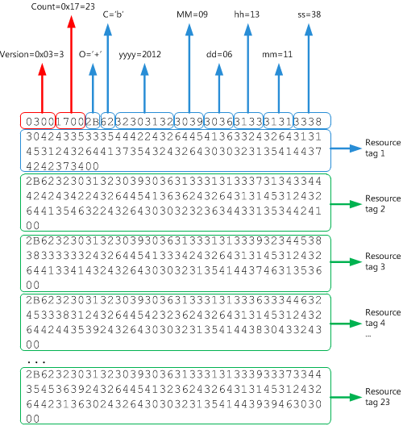

# Анализ журнала скачивания сообщений для учетной записи POP3Parsing the message download history for a POP3 account

В этом разделе описывается структура BLOB-приложения POP3, который представляет историю загрузки сообщений учетной записи POP3, чтобы определить сообщения, которые были загружены или удалены из этой учетной записи.This topic describes the structure of the POP3 BLOB that represents the message download history of a POP3 account, to identify the messages that have been downloaded or deleted on that account.

## Зачем проавнозить историю скачивания сообщения?Why parse the message download history?

Поставщик протокола POP для Outlook позволяет пользователям получать и загружать новые сообщения электронной почты на локальном устройстве, а затем оставлять или удалять эти сообщения на почтовом сервере.The Post Office Protocol (POP) provider for Outlook allows users to retrieve and download new email messages on their local device, and subsequently to leave or delete these email messages on the mail server. Когда почтовый клиент проверяет наличие новых сообщений для скачивания, он должен иметь возможность идентифицировать и загружать только новые сообщения для этого почтового ящика.When the mail client checks for new messages to download, it has to be able to identify and download only the new messages for that Inbox. Почтовый клиент сначала использует команду UIDL (Unique ID Listing), чтобы получить карту каждого сообщения, которое когда-либо было доставлено в этот почтовый ящик, с уникальным идентификатором (UID).The mail client does this by first using the UIDL (Unique ID Listing) command to obtain a map of each message that has ever been delivered to that Inbox to a unique identifier (UID). Клиент также получает историю скачивания сообщений, загруженных или удаленных для почтового ящика на этом клиенте.The client also gets the message download history for messages that have been downloaded or deleted for the Inbox on that client. Используя карту UID сообщения и историю скачивания, клиент может идентифицировать сообщения, отсутствующих в истории, как новые и, следовательно, их следует скачать.Using the message UID map and download history, the client can then identify those messages that are absent from the history as new and, hence, should be downloaded.
  
Чтобы получить историю скачивания сообщений для почтового ящика:To get the messages download history for an Inbox:
  
- Выполните действия по поиску истории скачивания сообщений для учетной записи [POP3,](locating-the-message-download-history-for-a-pop3-account.md) чтобы найти свойство [PidTagAttachDataBinary,](https://msdn.microsoft.com/library/3b0a8b28-863e-4b96-a4c0-fdb8f40555b9%28Office.15%29.aspx) которое содержит большой двоичный объект (BLOB), представляюящий историю сообщений для учетной записи POP3.Follow the steps in [Locating the message download history for a POP3 account](locating-the-message-download-history-for-a-pop3-account.md) to find the [PidTagAttachDataBinary](https://msdn.microsoft.com/library/3b0a8b28-863e-4b96-a4c0-fdb8f40555b9%28Office.15%29.aspx) property, which contains a binary large object (BLOB) that represents the message history for a POP3 account. 
    
- Прочитайте этот раздел, в котором описывается структура BLOB- и показан пример BLOB-приложения для определения сообщений, загруженных или удаленных для почтового ящика учетной записи POP3.Read this topic, which describes the structure of the BLOB, and shows an example BLOB to identify messages that have been downloaded or deleted for the Inbox of the POP3 account.

## Структура BLOB POPPOP BLOB structure

Структура BLOB POP, как описано в таблице 1, начинается с двух  полей, **Version** и **Count,** за которыми следует число тегов ресурсов, каждое из которых о конце null.The POP BLOB structure, as described in Table 1, begins with two fields, **Version** and **Count**, followed by a **Count** number of resource tags, each of which is null-terminated. 
  
**Таблица 1. Структура BLOB-приложения, который представляет историю скачивания сообщений учетной записи POP3****Table 1. Structure of the BLOB that represents the message download history of a POP3 account**

|**Поле в BLOB****Field in BLOB**|**Размер****Size**|**Описание****Description**|
|:-----|:-----|:-----|
|**Версия****Version**   |2 байта2 bytes    |Должно быть 3 (**PBLOB_VERSION_NUM).**Must be 3 (**PBLOB_VERSION_NUM**).    |
|**Count****Count**   |2 байта2 bytes    |Количество тегов ресурсов в этом BLOB-ресурсе.The number of resource tags in this BLOB.    |
|Тег ресурсаResource tag    |ПеременнаяVariable    |0 или более строк UTF-8 с нулью, кодируемых тегами ресурсов.0 or more null-terminated UTF-8 strings that encode the resource tags. Количество строк, о завершаемом нулом, должно соответствовать **числу.**The number of null-terminated strings must match **Count**.    |
   
Каждый тег ресурса указывает операцию, применяемую к сообщению, некоторые метаданные даты и времени, а также кодирует UID сообщения.Each resource tag specifies the operation that is applied to a message, some date-time metadata about the operation, and encodes the UID of the message. Формат строки тега ресурса разбит по следующим строкам и более подробно объясняется в таблице 2.The format of a resource tag string is broken down as follows, and is further explained in Table 2. 
  
`Ocyyyymmddhhmmssuuu...`
  
**Таблица 2. Структура тега ресурса****Table 2. Structure of a resource tag**

|**Поле в теге ресурса****Field in a resource tag**|**Размер****Size**|**Описание****Description**|
|:-----|:-----|:-----|
| `O`   |1 символ1 character    |Операция, выполненная с сообщением электронной почты.The operation performed on the email message. Значение должно быть "+", "-" или ", которое указывает на успешную операцию получения, удаления или получения &amp; и удаления соответственно.The value must be "+", "-", or "&amp;", which indicates a successful get, delete, or get-and-delete operation, respectively.    |
| `c`   |1 символ1 character    |Часть содержимого сообщения, задействованного в операции.The part of the message content involved in the operation. Значение должно быть ", h" или "b", которое указывает содержимое none, header или body соответственно.The value must be " ", "h", or "b", which indicates the content of none, header, or body, respectively.    |
| `yyyy`   |4 символа4 characters    |Год операции из четырех цифр.The four-digit year of the operation.    |
| `MM`   |2 символа2 characters    |Месяц операции из двух цифр.The two-digit month of the operation.    |
| `dd`   |2 символа2 characters    |Двухзначный день операции.The two-digit day of the operation.    |
| `hh`   |2 символа2 characters    |Двухзначный час операции.The two-digit hour of the operation.    |
| `mm`   |2 символа2 characters    |Двухзначная минута операции.The two-digit minute of the operation.    |
| `ss`   |2 символа2 characters    |Двухзначная секунда операции.The two-digit second of the operation.    |
| `uuu…`   |Переменная длинаVariable length    |Закодированный UID сообщения.The encoded UID of a message.    |

## ПримерExample

На рисунке 1 показан пример BLOB-приложения, который представляет историю скачивания сообщений учетной записи POP.Figure 1 shows an example of a BLOB that represents the message download history of a POP account. 
  
**Рисунок 1. Пример структуры BLOB для истории скачивания сообщений учетной записи POP3****Figure 1. Example BLOB structure for the message download history of a POP3 account**

  
На основе структуры, описанной в таблицах 1 и 2, этот BLOB-файл представляет историю скачивания 23 сообщений электронной почты.Based on the structure described in Table 1 and Table 2, this BLOB represents the download history of 23 email messages.
  
Чтобы проанализировать необработанные UID в каждом теге ресурса, следует помнить, что код UID следует за этой кодикой: символы в UID в основном буквы и цифры, а перед каждым не букво-цифрой стоит символ ASCII "$" (0x24).To parse the raw UID in each resource tag, be aware that the UID follows this encoding: characters in a UID are mostly alphanumeric characters, and each non-alphanumeric character is preceded by the ASCII character "$" (0x24). Поэтому символы ASCII $2d представляют не буквы и цифры "-".So the ASCII characters $2d represent the non-alphanumeric character "-". На рисунке 2 показан пример первого преобразования необработанных UID в теге ресурсов 1 в представление ASCII, а затем преобразования любых не букв и цифр, предшествующих "$", для получения фактического UID:Figure 2 shows an example of first converting the raw UID in resource tag 1 to the ASCII representation, then converting any non-alphanumeric character preceded by "$" to produce the actual UID:
  
`0BC535DB-EA63-11E1-A75C-00215AD7BB74`
  
**Рисунок 2. Преобразование необработанных UID в теге ресурса в фактический UID сообщения****Figure 2. Converting the raw UID in a resource tag to the actual message UID**

  
Чтобы интерпретировать тег ресурса 1 в этом BLOB-ресурсе, сообщение с UID было успешно извлечено 6 сентября 2012 г. в  `0BC535DB-EA63-11E1-A75C-00215AD7BB74` 13:11:38.To interpret resource tag 1 in this BLOB: the message with the UID  `0BC535DB-EA63-11E1-A75C-00215AD7BB74` was successfully retrieved on September 6, 2012, at 13:11:38. 
  
Для этого BLOB-ресурса можно аналогичным образом проаицировать оставшиеся 22 тега ресурсов.You can similarly parse the remaining 22 resource tags for that BLOB.
  
## См. такжеSee also

- [Управление скачиванием сообщений для учетных записей POP3Managing message downloads for POP3 accounts](managing-message-downloads-for-pop3-accounts.md)    
- [Поиск журнала скачивания сообщений для учетной записи POP3Locating the message download history for a POP3 account](locating-the-message-download-history-for-a-pop3-account.md)    
- [Parsing the POP3 UIDL HistoryParsing the POP3 UIDL History](https://blogs.msdn.com/b/stephen_griffin/archive/2012/12/04/parsing-the-pop3-uidl-history.aspx)
    

