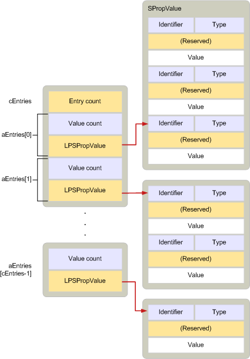

# <a name="adrlist"></a><span data-ttu-id="382ea-103">ADRLIST</span><span class="sxs-lookup"><span data-stu-id="382ea-103">ADRLIST</span></span>

<span data-ttu-id="382ea-104">**Область применения**: Outlook 2013 | Outlook 2016</span><span class="sxs-lookup"><span data-stu-id="382ea-104">**Applies to**: Outlook 2013 | Outlook 2016</span></span> 
  
<span data-ttu-id="382ea-105">Описывает нулевые или несколько свойств, принадлежащих одному или более получателям.</span><span class="sxs-lookup"><span data-stu-id="382ea-105">Describes zero or more properties that belong to one or more recipients.</span></span> 
  
|||
|:-----|:-----|
|<span data-ttu-id="382ea-106">Файл заголовка:</span><span class="sxs-lookup"><span data-stu-id="382ea-106">Header file:</span></span>  <br/> |<span data-ttu-id="382ea-107">Mapidefs.h</span><span class="sxs-lookup"><span data-stu-id="382ea-107">Mapidefs.h</span></span>  <br/> |
|<span data-ttu-id="382ea-108">Связанные макрос:</span><span class="sxs-lookup"><span data-stu-id="382ea-108">Related macros:</span></span>  <br/> |<span data-ttu-id="382ea-109">[CbADRLIST](cbadrlist.md), [CbNewADRLIST](cbnewadrlist.md), [CbNewADRLIST](cbnewadrlist.md)</span><span class="sxs-lookup"><span data-stu-id="382ea-109">[CbADRLIST](cbadrlist.md), [CbNewADRLIST](cbnewadrlist.md), [CbNewADRLIST](cbnewadrlist.md)</span></span> <br/> |
   
```cpp
typedef struct _ADRLIST
{
  ULONG cEntries;
  ADRENTRY aEntries[MAPI_DIM];
} ADRLIST, FAR *LPADRLIST;

```

## <a name="members"></a><span data-ttu-id="382ea-110">"Участники"</span><span class="sxs-lookup"><span data-stu-id="382ea-110">Members</span></span>

<span data-ttu-id="382ea-111">**cEntries**</span><span class="sxs-lookup"><span data-stu-id="382ea-111">**cEntries**</span></span>
  
> <span data-ttu-id="382ea-112">Количество записей в массиве, указанном участником **aEntries.**</span><span class="sxs-lookup"><span data-stu-id="382ea-112">Count of entries in the array specified by the **aEntries** member.</span></span> 
    
<span data-ttu-id="382ea-113">**aEntries**</span><span class="sxs-lookup"><span data-stu-id="382ea-113">**aEntries**</span></span>
  
> <span data-ttu-id="382ea-114">Массив [структур ADRENTRY,](adrentry.md) одна структура для каждого получателя.</span><span class="sxs-lookup"><span data-stu-id="382ea-114">Array of [ADRENTRY](adrentry.md) structures, one structure for each recipient.</span></span> 
    
## <a name="remarks"></a><span data-ttu-id="382ea-115">Примечания</span><span class="sxs-lookup"><span data-stu-id="382ea-115">Remarks</span></span>

<span data-ttu-id="382ea-116">Структура **ADRLIST** содержит одну или несколько структур **ADRENTRY,** каждая из которых описывает свойства получателя.</span><span class="sxs-lookup"><span data-stu-id="382ea-116">An **ADRLIST** structure contains one or more **ADRENTRY** structures, each describing the properties of a recipient.</span></span> <span data-ttu-id="382ea-117">Получатель может быть неурегулирован.</span><span class="sxs-lookup"><span data-stu-id="382ea-117">A recipient can be unresolved.</span></span> <span data-ttu-id="382ea-118">Это означает, что в массиве значений свойств отсутствует идентификатор входа.</span><span class="sxs-lookup"><span data-stu-id="382ea-118">This means that it is lacking an entry identifier in its array of property values.</span></span> <span data-ttu-id="382ea-119">Разрешенный получатель означает, что **свойство PR \_ ENTRYID** [(PidTagEntryId)](pidtagentryid-canonical-property.md)включено.</span><span class="sxs-lookup"><span data-stu-id="382ea-119">A resolved recipient means that the **PR\_ENTRYID** ([PidTagEntryId](pidtagentryid-canonical-property.md)) property is included.</span></span> <span data-ttu-id="382ea-120">Как правило, у разрешенных получателей также есть **адрес электронной** почты PR_EMAIL_ADDRESS [(Свойство PidTagEmailAddress).](pidtagemailaddress-canonical-property.md)</span><span class="sxs-lookup"><span data-stu-id="382ea-120">Typically, resolved recipients also have an email address the **PR_EMAIL_ADDRESS** ([PidTagEmailAddress](pidtagemailaddress-canonical-property.md)) property.</span></span> <span data-ttu-id="382ea-121">Однако адрес электронной почты не требуется.</span><span class="sxs-lookup"><span data-stu-id="382ea-121">However, the email address is not required.</span></span> <span data-ttu-id="382ea-122">**Структуры ADRLIST** используются, например, для описания списка получателей исходя из сообщения и mapI для отображения записей в адресной книге.</span><span class="sxs-lookup"><span data-stu-id="382ea-122">**ADRLIST** structures are used, for example, to describe the recipient list for an outgoing message and by MAPI to display the entries in the address book.</span></span> 
  
<span data-ttu-id="382ea-123">**Структуры ADRLIST** напоминают [структуры SRowSet,](srowset.md) используемые для представления строк в таблицах.</span><span class="sxs-lookup"><span data-stu-id="382ea-123">**ADRLIST** structures resemble [SRowSet](srowset.md) structures the structures used for representing rows in tables.</span></span> <span data-ttu-id="382ea-124">На самом деле эти две структуры разработаны таким образом, чтобы их можно было использовать взаимозаменяемо.</span><span class="sxs-lookup"><span data-stu-id="382ea-124">In fact, these two structures are designed so that they can be used interchangeably.</span></span> <span data-ttu-id="382ea-125">Оба содержат массив структур, описывающих группу свойств, и количество значений в массиве.</span><span class="sxs-lookup"><span data-stu-id="382ea-125">Both contain an array of structures describing a group of properties and a count of the values in the array.</span></span> <span data-ttu-id="382ea-126">Если в структуре **ADRLIST** массив содержит структуры [ADRENTRY,](adrentry.md) то в **структуре SRowSet** массив содержит [структуры SRow.](srow.md)</span><span class="sxs-lookup"><span data-stu-id="382ea-126">Whereas in the **ADRLIST** structure, the array contains [ADRENTRY](adrentry.md) structures, in the **SRowSet** structure the array contains [SRow](srow.md) structures.</span></span> <span data-ttu-id="382ea-127">**Структуры ADRENTRY** и **структуры SRow** идентичны в макете.</span><span class="sxs-lookup"><span data-stu-id="382ea-127">**ADRENTRY** structures and **SRow** structures are identical in layout.</span></span> <span data-ttu-id="382ea-128">Так как структуры **ADRLIST** и **SRowSet** следуют одним и тем же правилам распределения, структура **SRowSet,** извлекаемая из таблицы содержимого контейнера адресной книги, может быть отлита в структуру **ADRLIST** и использоваться как есть.</span><span class="sxs-lookup"><span data-stu-id="382ea-128">Because **ADRLIST** and **SRowSet** structures follow the same allocation rules, an **SRowSet** structure that is retrieved from the contents table of an address book container can be cast to an **ADRLIST** structure and used as is.</span></span> 
  
<span data-ttu-id="382ea-129">На следующем рисунке показан макет **структуры ADRLIST.**</span><span class="sxs-lookup"><span data-stu-id="382ea-129">The following illustration shows the layout of an **ADRLIST** structure.</span></span> 
  
<span data-ttu-id="382ea-130">**Компоненты ADRLIST**</span><span class="sxs-lookup"><span data-stu-id="382ea-130">**ADRLIST components**</span></span>
  
<span data-ttu-id="382ea-131"></span><span class="sxs-lookup"><span data-stu-id="382ea-131"></span></span>
  
<span data-ttu-id="382ea-132">Части **ADRENTRY** и [SPropValue](spropvalue.md) в структуре **ADRLIST** должны быть выделены и освобождены независимо от других частей.</span><span class="sxs-lookup"><span data-stu-id="382ea-132">The **ADRENTRY** and [SPropValue](spropvalue.md) portions in an **ADRLIST** structure must be allocated and freed independently of the other parts.</span></span> <span data-ttu-id="382ea-133">То есть каждая структура **SPropValue** должна выделяться отдельно после того, как память для структуры **ADRENTRY** была выделена и освобождена до того, как структура **ADRENTRY** будет освобождена.</span><span class="sxs-lookup"><span data-stu-id="382ea-133">That is, each **SPropValue** structure must be allocated individually after memory for the **ADRENTRY** structure has been allocated and freed before the **ADRENTRY** structure is freed.</span></span> <span data-ttu-id="382ea-134">Эта независимость в обработке памяти позволяет получателям и отдельным свойствам получателей свободно добавляться или удаляться из списка адресов.</span><span class="sxs-lookup"><span data-stu-id="382ea-134">This independence in handling memory allows recipients and individual recipient properties to be freely added or deleted from the address list.</span></span> 
  
<span data-ttu-id="382ea-135">Функции [MAPIAllocateBuffer](mapiallocatebuffer.md) и [MAPIFreeBuffer](mapifreebuffer.md) должны использоваться для выделения и бесплатного выделения структуры **ADRLIST** и всех ее частей.</span><span class="sxs-lookup"><span data-stu-id="382ea-135">The [MAPIAllocateBuffer](mapiallocatebuffer.md) and [MAPIFreeBuffer](mapifreebuffer.md) functions must be used to allocate and free the **ADRLIST** structure and all its parts.</span></span> 
  
<span data-ttu-id="382ea-136">Если список получателей слишком велик, чтобы вписаться в память, клиенты могут вызвать [метод IMessage::ModifyRecipients](imessage-modifyrecipients.md) для работы с подмножество списка.</span><span class="sxs-lookup"><span data-stu-id="382ea-136">If a recipient list is too large to fit in memory, clients can call the [IMessage::ModifyRecipients](imessage-modifyrecipients.md) method to work with a subset of the list.</span></span> <span data-ttu-id="382ea-137">Клиенты не должны использовать общие диалоговое окно адресной книги в этой ситуации.</span><span class="sxs-lookup"><span data-stu-id="382ea-137">Clients should not use the address book common dialog boxes in this situation.</span></span> 
  
<span data-ttu-id="382ea-138">Дополнительные сведения о выделении памяти для структур **ADRENTRY** см. в рубрике Управление памятью [для структур ADRLIST и SRowSet.](managing-memory-for-adrlist-and-srowset-structures.md)</span><span class="sxs-lookup"><span data-stu-id="382ea-138">For more information about how to allocate memory for **ADRENTRY** structures, see [Managing Memory for ADRLIST and SRowSet Structures](managing-memory-for-adrlist-and-srowset-structures.md).</span></span> 
  
## <a name="see-also"></a><span data-ttu-id="382ea-139">См. также</span><span class="sxs-lookup"><span data-stu-id="382ea-139">See also</span></span>

- [<span data-ttu-id="382ea-140">ADRENTRY</span><span class="sxs-lookup"><span data-stu-id="382ea-140">ADRENTRY</span></span>](adrentry.md)  
- [<span data-ttu-id="382ea-141">CbNewADRLIST</span><span class="sxs-lookup"><span data-stu-id="382ea-141">CbNewADRLIST</span></span>](cbnewadrlist.md) 
- [<span data-ttu-id="382ea-142">IMessage::ModifyRecipients</span><span class="sxs-lookup"><span data-stu-id="382ea-142">IMessage::ModifyRecipients</span></span>](imessage-modifyrecipients.md) 
- [<span data-ttu-id="382ea-143">SRowSet</span><span class="sxs-lookup"><span data-stu-id="382ea-143">SRowSet</span></span>](srowset.md)
- [<span data-ttu-id="382ea-144">Структуры MAPI</span><span class="sxs-lookup"><span data-stu-id="382ea-144">MAPI Structures</span></span>](mapi-structures.md)

