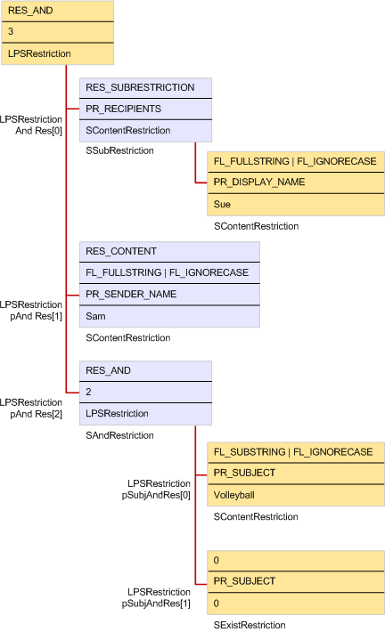

# Создание ограниченияBuilding a restriction

**Относится к**: Outlook 2013 | Outlook 2016**Applies to**: Outlook 2013 | Outlook 2016 
  
Чтобы создать ограничение, клиентское приложение создает иерархию одной или нескольких структур ограничений различных типов и передает указатель в иерархию методу [IMAPITable:: restrict](imapitable-restrict.md) или [IMAPITable:: FindRow](imapitable-findrow.md) .To build a restriction, a client application creates a hierarchy of one or more restriction structures of various types and passes a pointer to the hierarchy to the [IMAPITable::Restrict](imapitable-restrict.md) or [IMAPITable::FindRow](imapitable-findrow.md) method. На приведенном ниже рисунке и образце кода в [примере кода ограничения](sample-restriction-code.md) показано, как типичное ограничение реализовано со связанными структурами ограничений различных типов.The illustration that follows and the code sample in [Sample Restriction Code](sample-restriction-code.md) demonstrate how a typical restriction is implemented with linked restriction structures of different types. 

В этом примере пользователь клиентского приложения пытается найти все сообщения, содержащие слово "воллэйбалл" в строке темы и отправленные в Сью из диспетчера учетных записей.In this example, a user of a client application is trying to find all messages that contain the word "volleyball" in the subject line and were sent to Sue from Sam. Сначала выделяется общая структура [срестриктион](srestriction.md) .First, a generic [SRestriction](srestriction.md) structure is allocated. Эта структура становится основой для других вызовов функции [мапиаллокатеморе](mapiallocatemore.md) для создания связанных структур [срестриктион](srestriction.md) и [спропвалуе](spropvalue.md) , которые можно освободить с помощью одного вызова [мапифрибуффер](mapifreebuffer.md).This structure becomes the basis for other calls to the [MAPIAllocateMore](mapiallocatemore.md) function to create linked [SRestriction](srestriction.md) and [SPropValue](spropvalue.md) structures that can be freed with a single call to [MAPIFreeBuffer](mapifreebuffer.md). Так как критерии, применяемые к набору сообщений, находятся в трех частях, структура ограничений верхнего уровня является **и** ограничением.Because the criteria to apply to the set of messages is in three parts, the top level restriction structure is an **AND** restriction. Для элемента **Крес** структуры [сандрестриктион](sandrestriction.md) задано значение 3, которое указывает три ограничения, которые необходимо оценить, а для его элемента **лпрес** задано три массива элементов **срестриктион** структуры.The [SAndRestriction](sandrestriction.md) structure's **cRes** member is set to 3 to indicate the three restrictions to evaluate and its **lpRes** member is set to a three member array of **SRestriction** structures. 
  
Для поиска сообщений, отправленных определенному получателю, необходимо выполнить поиск в таблице получателей для каждого сообщения, а не самого сообщения.To search for messages that are sent to a particular recipient, it is necessary to search the recipient table for each message rather than the message itself. Ограничение подобъекта используется для выполнения поиска в таблице получателей.A subobject restriction is used to perform the recipient table search. Таким образом, первый элемент массива указывает на структуру [ссубрестриктион](ssubrestriction.md) с набором элементов **улсубобжект** , равным **PR_MESSAGE_RECIPIENTS** ([PidTagMessageRecipients](pidtagmessagerecipients-canonical-property.md)).Therefore, the first member of the array points to an [SSubRestriction](ssubrestriction.md) structure with its **ulSubObject** member set to **PR_MESSAGE_RECIPIENTS** ([PidTagMessageRecipients](pidtagmessagerecipients-canonical-property.md)). Затем, чтобы указать, что искать в таблице получателей, используется ограничение содержимого.Then, to specify what to look for in the recipient table, a content restriction is used. 
  
Второй и третий элементы массива более просты.The second and third members of the array are more straightforward. Они оба настраиваются на структуры ограничения содержимого, один — для поиска сообщений, у которых для свойства **PR_SENDER_NAME** ([PidTagSenderName](pidtagsendername-canonical-property.md)) задано значение "Sam", а для другого свойства **PR_SUBJECT** ([PidTagSubject](pidtagsubject-canonical-property.md)) задано значение "воллэйбалл".They both point to content restriction structures, one to search for messages that have a **PR_SENDER_NAME** ([PidTagSenderName](pidtagsendername-canonical-property.md)) property set to "Sam" and another that has a **PR_SUBJECT** ([PidTagSubject](pidtagsubject-canonical-property.md)) property set to "volleyball."
  
**Внедрение ограничения****Restriction implementation**
  
(media/amapi_61.gif "Реализация ограничения") ![реализации ограничения]
  
## См. такжеSee also

- [Таблицы MAPIMAPI Tables](mapi-tables.md)

