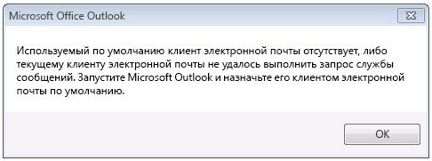

# Построение приложений MAPI на 32-разрядной и 64-разрядных платформахBuilding MAPI applications on 32-bit and 64-bit platforms

**Относится к**: Outlook 2013 | Outlook 2016**Applies to**: Outlook 2013 | Outlook 2016 
  
В этом разделе описываются действия, которые MAPI разработчикам следует изменять и перестроение 32-разрядных приложений MAPI для запуска на 64-разрядной платформе и 64-разрядных приложений для запуска на 32-разрядной платформы.This topic describes the actions that MAPI developers should take to change and rebuild 32-bit MAPI applications to run on a 64-bit platform, and 64-bit applications to run on a 32-bit platform. В этом разделе 64-разрядной платформы — это компьютер с 64-разрядная версия Microsoft Outlook и 64-разрядная версия Windows и 32-разрядной платформе — это компьютер с 32-разрядного приложения Outlook и 32-разрядная или 64-разрядная версия Windows.In this topic, a 64-bit platform is a computer installed with 64-bit Microsoft Outlook and 64-bit Windows, and a 32-bit platform is a computer installed with a 32-bit Outlook and 32-bit or 64-bit Windows. 
  
## Операционная система и техническая поддержка Office для 64-разрядного приложения OutlookOperating system and Office support for 64-bit Outlook

> [!NOTE]
> Разрядности термин относится к различие между 32-разрядной и 64-разрядных процессоров архитектуры и связанные совместимости приложений.The term bitness refers to the distinction between 32-bit and 64-bit processor architectures and the associated compatibility of applications. В этом разделе разрядности используется в рамках программы версии Windows, Microsoft Office, Outlook, или приложения MAPI, созданных в соответствии с архитектуру 32-разрядная или 64-разрядных процессора компьютера и возможно других приложений, которые запускаются на этом компьютере.In this topic, bitness is used to qualify the version of Windows, Microsoft Office, Outlook, or a MAPI application built to suit a 32-bit or 64-bit processor architecture of a computer, and possibly other applications that run on that computer. 
  
Начиная с Microsoft Office 2010, Outlook доступна как 32-разрядных и 64-разрядного приложения.Starting in Microsoft Office 2010, Outlook is available as a 32-bit and a 64-bit application. На одном компьютере разрядности версий Outlook, зависит от разрядности операционной системы Windows (x86 или x64) и Microsoft Office, если Office уже установлены на этом компьютере.On the same computer, the bitness of Outlook depends on the bitness of the Windows operating system (x86 or x64), and of Microsoft Office, if Office is already installed on that computer. Ниже приведены некоторые факторы, которые следует при выборе 32-разрядная или 64-разрядная версия Outlook.The following are some of the factors that determine the feasibility of installing a 32-bit or a 64-bit version of Outlook:
  
- 32-разрядную версию Office (и 32-разрядное приложение Outlook) можно установить на компьютер с 32-разрядной или 64-разрядной версией операционной системы Windows. 64-разрядную версию Office (и 64-разрядное приложение Outlook) можно установить только на компьютер с 64-разрядной операционной системой.32-bit Office (and 32-bit Outlook) can be installed on a 32-bit or 64-bit version of the Windows operating system. 64-bit Office (and 64-bit Outlook) can be installed only on a 64-bit operating system.
    
- По умолчанию на компьютере с 64-разрядной версией операционной системы Windows устанавливается 32-разрядная версия Office.The default installation of Office on a 64-bit version of the Windows operating system is 32-bit Office.
    
- Разрядности установленной версии Outlook всегда является то же, что разрядности версий Office, если Office устанавливается на том же компьютере.The bitness of an installed version of Outlook is always the same as the bitness of Office, if Office is installed on the same computer. Другими словами 32-разрядная версия Outlook нельзя установить на одном компьютере, которые уже имеют 64-разрядных версиях другие приложения Office, таких как Microsoft Word 64-разрядная или 64-разрядная версия Microsoft Excel.In other words, a 32-bit version of Outlook cannot be installed on the same computer that already has 64-bit versions of other Office applications installed, such as 64-bit Microsoft Word or 64-bit Microsoft Excel. Аналогично 64-разрядная версия Outlook нельзя установить на одном компьютере, который уже содержит 32-разрядные версии другие приложения Office.Similarly, a 64-bit version of Outlook cannot be installed on the same computer that already has 32-bit versions of other Office applications installed.
    
## Подготовка приложений MAPI для 32-разрядной и 64-разрядных платформахPreparing MAPI applications for 32-bit and 64-bit platforms

Приложения MAPI включают автономных приложений, таких как Microsoft Communicator и mfcmapi (en), а также поставщиков услуг, например адресной книги, хранения и поставщиками транспорта.MAPI applications include standalone applications such as Microsoft Communicator and MFCMAPI, and service providers such as address book, store, and transport providers. Для метода MAPI и функции звонков для работы в приложении MAPI (за исключением одного Simple MAPI функция, MAPISendMail), разрядности версий приложений MAPI должен совпадать с разрядности подсистемы MAPI на компьютере для целевого приложения Запустите на.For MAPI method and function calls to work in a MAPI application (with the exception of one Simple MAPI function, MAPISendMail), the bitness of the MAPI application must be the same as the bitness of the MAPI subsystem on the computer that the application is targeted to run on. Разрядности подсистемы MAPI, в свою очередь, определяется по и всегда совпадает с разрядности установленной версии Outlook.The bitness of the MAPI subsystem, in turn, is determined by and always the same as the bitness of the installed version of Outlook. В следующей таблице перечислены действия, необходимые для подготовки приложений MAPI для запуска на конечных компьютерах, настроенных с помощью Office и Windows различных разрядности.The following table summarizes the necessary actions to prepare MAPI applications to run on targeted computers configured with Office and Windows of various bitness.
  
|Разрядности версий приложений MAPIBitness of MAPI application|Разрядности версий Outlook на компьютереBitness of Outlook on targeted computer|Разрядности версий Windows на компьютереBitness of Windows on targeted computer|Необходимые действия для запуска на компьютере приложенияNecessary action to enable application to run on targeted computer|
|:-----|:-----|:-----|:-----|
|32-���������32-bit    |32-���������32-bit    |32-разрядная или 64-разрядная версия32-bit or 64-bit    |Нет определенных действий не требуется.No specific action is necessary.    |
|32-���������32-bit    |64-разрядная версия64-bit    |64-разрядная версия64-bit    |Перестроение приложения как 64-разрядное приложение.Rebuild the application as a 64-bit application. В противном случае не удастся всех MAPI метода и функции звонков (за исключением **MAPISendMail**).Otherwise, all MAPI method and function calls (except for **MAPISendMail**) will fail.    |
|64-разрядная версия64-bit    |64-разрядная версия64-bit    |64-разрядная версия64-bit    |Нет определенных действий не требуется.No specific action is necessary.    |
|64-разрядная версия64-bit    |32-���������32-bit    |32-разрядная или 64-разрядная версия32-bit or 64-bit    |Перестроение приложения как 32-разрядное приложение.Rebuild the application as a 32-bit application. В противном случае не удастся всех MAPI метода и функции звонков (за исключением **MAPISendMail**).Otherwise, all MAPI method and function calls (except for **MAPISendMail**) will fail.    |
   
Далее в следующих разделах описывается каждого сценария.The following sections further explain each scenario. Для сценариев, которые требуют перестроения приложения MAPI видеть [ссылка на функции MAPI](how-to-link-to-mapi-functions.md) для получения дополнительных сведений о связывание и вызов функций MAPI.For scenarios that require rebuilding the MAPI application, see [Link to MAPI Functions](how-to-link-to-mapi-functions.md) for additional information regarding linking to and calling MAPI functions. 
  
### 32-разрядная версия приложения MAPI и 32-разрядного приложения Outlook32-bit MAPI application and 32-bit Outlook

Приложения MAPI, скомпилированные для 32-разрядной подсистемы MAPI, который доступен в 32-разрядных версиях Outlook, включая этих версий до Microsoft Outlook 2013 по-прежнему поддерживается на компьютерах с 32-разрядного приложения Outlook и 32-разрядная или 64-разрядная версия Windows Операционная система.MAPI applications compiled for a 32-bit MAPI subsystem that is available in 32-bit versions of Outlook, including those versions prior to Microsoft Outlook 2013, continue to be supported on computers installed with 32-bit Outlook and a 32-bit or 64-bit Windows operating system. Нет определенных действий, необходимых для разработчиков приложений.There is no specific action necessary for the application developers.
  
### приложения MAPI 32-разрядной и 64-разрядного приложения Outlook32-bit MAPI application and 64-bit Outlook

32-разрядных приложений MAPI не поддерживается для запуска на компьютер с 64-разрядного приложения Outlook и 64-разрядная версия Windows.32-bit MAPI applications are not supported to run on a computer installed with 64-bit Outlook and 64-bit Windows. Разработчик приложений необходимо обновить и перестроение приложения как 64-разрядных приложений для 64-разрядной платформы.The application developer must update and rebuild the application as a 64-bit application for the 64-bit platform. Это так, как 32-разрядное приложение не удалось загрузить файл Msmapi32.dll 64-разрядная версия.This is because a 32-bit application cannot load a 64-bit Msmapi32.dll file. Существует небольшое число изменений API, которые разработчики приложений необходимо использовать для построения кода успешно на 64-разрядную среду.There are a small number of API changes that application developers must incorporate to build their code successfully for a 64-bit environment. Файлы заголовков MAPI обновлены для поддержки 64-разрядной платформе эти изменения.MAPI header files have been updated with these changes to support the 64-bit platform. Вы можете загрузить эти файлы в [Outlook 2010: файлы заголовков MAPI](https://www.microsoft.com/downloads/details.aspx?FamilyID=f8d01fc8-f7b5-4228-baa3-817488a66db1).You can download these header files at [Outlook 2010: MAPI Header Files](https://www.microsoft.com/downloads/details.aspx?FamilyID=f8d01fc8-f7b5-4228-baa3-817488a66db1). Разработчики могут использовать этот же набор файлов заголовков MAPI для создания 32-разрядной и 64-разрядных приложений MAPI.Developers can use this same set of MAPI header files to build both 32-bit and 64-bit MAPI applications.
  
### приложения MAPI 64-разрядных и 64-разрядного приложения Outlook64-bit MAPI application and 64-bit Outlook

64-разрядные приложения MAPI, поддерживаются на компьютерах с 64-разрядного приложения Outlook и 64-разрядная версия Windows.64-bit MAPI applications are supported on computers installed with 64-bit Outlook and 64-bit Windows. Нет определенных действий, необходимых для разработчиков приложений.There is no specific action necessary for the application developers.
  
### 64-разрядного приложения MAPI и 32-разрядного приложения Outlook64-bit MAPI application and 32-bit Outlook

64-разрядных приложений MAPI не поддерживается для запуска на компьютере с 32-разрядного приложения Outlook и 32-разрядная или 64-разрядная версия Windows.64-bit MAPI applications are not supported to run on a computer installed with 32-bit Outlook and 32-bit or 64-bit Windows. Разработчик приложений необходимо обновить и перестроение приложения как 32-разрядное приложение для работы с 32-разрядного приложения Outlook.The application developer must update and rebuild the application as a 32-bit application to work with 32-bit Outlook. Используйте обновленные файлы заголовков MAPI, которые можно загрузить по [Outlook 2010: файлы заголовков MAPI](https://www.microsoft.com/downloads/details.aspx?FamilyID=f8d01fc8-f7b5-4228-baa3-817488a66db1).Use the updated MAPI header files, which you can download at [Outlook 2010: MAPI Header Files](https://www.microsoft.com/downloads/details.aspx?FamilyID=f8d01fc8-f7b5-4228-baa3-817488a66db1). Разработчики могут использовать этот же набор файлов заголовков MAPI для создания 32-разрядной и 64-разрядных приложений MAPI.Developers can use this same set of MAPI header files to build both 32-bit and 64-bit MAPI applications.
  
### Исключение: MAPISendMailException: MAPISendMail

Как правило, не следует использовать 32-разрядного приложения MAPI на 64-разрядной платформы (64-разрядная версия Outlook на 64-разрядная версия Windows) не первый восстановленном как приложения 64-разрядных и 64-разрядного приложения MAPI не должен выполнить на компьютере, установленные вместе с 32-разрядного приложения Outlook и 32-разрядная или 64-разрядная версия Windows без предварительного перестраивать как 32-разрядное приложение.In general, a 32-bit MAPI application must not run on a 64-bit platform (64-bit Outlook on 64-bit Windows) without first being rebuilt as a 64-bit application, and a 64-bit MAPI application must not run on a computer installed with 32-bit Outlook and 32-bit or 64-bit Windows without first being rebuilt as a 32-bit application. На рисунке 1 показано диалоговое окно оповещения, которое будет отображаться, если любой из этих сценариев происходит.Figure 1 shows an alert dialog box that would be displayed if either of these scenarios occurs.
  
**На рисунке 1. Сообщение об ошибке для большинства MAPI различной разрядности вызывает.****Figure 1. Error message for most cross-bitness MAPI calls.**

![Сообщение об ошибке для вызовов MAPI с различной разрядности наиболее] (media/738905fb-57ae-4af7-b54b-a1676c80d3c3.JPG "Сообщение об ошибке для вызовов MAPI с различной разрядности наиболее")
  
Тем не менее, бы успешно один вызов функции среди всех Simple MAPI и MAPI элементов **MAPISendMail**в сценарии Windows-64-bit-on-Windows-32-bit (WOW32) или Windows-32-bit-on-Windows-64-bit (WOW64) и не приведет к выше оповещение.However, one function call among all Simple MAPI and MAPI elements, **MAPISendMail**, would succeed in a Windows-32-bit-on-Windows-64-bit (WOW64) or Windows-64-bit-on-Windows-32-bit (WOW32) scenario and would not result in the above alert. В этом сценарии WOW64 применяется только к Windows 7.This WOW64 scenario only applies to Windows 7. 

На рисунке 2 показано сценарии WOW64, в котором 32-разрядного приложения MAPI вызывает **MAPISendMail** на компьютер с 64-разрядная версия Windows 7.Figure 2 shows a WOW64 scenario in which a 32-bit MAPI application calls **MAPISendMail** on a computer installed with 64-bit Windows 7. В этом сценарии библиотеки MAPI совершает вызов COM для запуска 64-разрядного приложения Fixmapi.In this scenario, the MAPI library makes a COM call to launch a 64-bit Fixmapi application. Приложение Fixmapi неявно ссылки на библиотеку MAPI, который направляет вызов функции заглушка Windows MAPI, который в свою очередь перенаправляет вызов заглушка Outlook MAPI, включив вызов функции **MAPISendMail** для успешного выполнения.The Fixmapi application implicitly links to the MAPI library, which routes the function call to the Windows MAPI stub, which in turn forwards the call to the Outlook MAPI stub, enabling the **MAPISendMail** function call to succeed. 
  
**На рисунке 2. Обработка MAPISendMail в сценарии WOW64.****Figure 2. Processing MAPISendMail in a WOW64 scenario.**

![Обработка MAPISendMail в сценарии WOW64] (media/346ba974-4844-4b64-9dd1-d0f829ab99b3.gif "Обработка MAPISendMail в сценарии WOW64")
  
## См. такжеSee also

- [Ссылки на функции MAPILink to MAPI Functions](how-to-link-to-mapi-functions.md)

