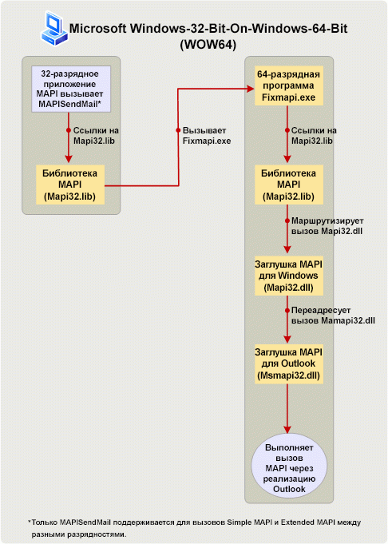

# Создание приложений MAPI на 32- и 64-разрядных платформах

**Область применения**: Outlook 2013 | Outlook 2016 
  
В этой статье описаны действия, которые следует выполнять разработчикам MAPI, чтобы изменить и перестроить 32-разрядные приложения MAPI для запуска на 64-разрядных платформах и 64-разрядные приложения для запуска на 32-разрядных платформах. В этой статье 64-разрядная платформа — это компьютер с установленной 64-разрядной версией Microsoft Outlook и 64-разрядной версией Windows, а 32-разрядная платформа — компьютер с установленной 32-разрядной версией Outlook и 32- или 64-разрядной версией Windows. 
  
## Поддержка, предоставляемая операционной системой и Office для 64-разрядного приложения Outlook

> [!NOTE]
> Термин "разрядность" указывает на различия между 32- и 64-разрядной архитектурой процессоров и соответствующую совместимость приложений. В этой статье термин "разрядность" используется для указания версии Windows, Microsoft Office, Outlook, или MAPI приложения, предназначенных для 32- и 64-разрядной архитектуры процессора компьютера и, возможно, других приложений, запускаемых на этом компьютере. 
  
Начиная с Microsoft Office 2010, приложение Outlook доступно как в 32-разрядной, так и 64-разрядной версии. На одном компьютере разрядность Outlook зависит от разрядности операционной системы Windows (x86 или x64) и Microsoft Office, если набор Office уже установлен на этом компьютере. Ниже указаны некоторые факторы, на которые следует обратить внимание при выборе 32-разрядной или 64-разрядной версии Outlook:
  
- 32-разрядную версию Office (и 32-разрядное приложение Outlook) можно установить на компьютер с 32-разрядной или 64-разрядной версией операционной системы Windows. 64-разрядную версию Office (и 64-разрядное приложение Outlook) можно установить только на компьютер с 64-разрядной операционной системой.
    
- По умолчанию при установке Office в 64-разрядной версии операционной системы Windows устанавливается 32-разрядная версия Office.
    
- Разрядность установленной версии Outlook всегда совпадает с разрядностью Office, если набор Office установлен на том же компьютере. Другими словами, 32-разрядную версию Outlook нельзя установить на том же компьютере, на котором уже установлены 64-разрядные версии других приложений Office, например 64-разрядная версии Microsoft Word или 64-разрядная версия Microsoft Excel. Аналогичным образом, 64-разрядную версию Outlook нельзя установить на том же компьютере, на котором уже установлены 32-разрядные версии других приложений Office.
    
## Подготовка приложений MAPI для 32- и 64-разрядных платформ

Приложениями MAPI являются автономные приложения, такие как Microsoft Communicator и MFCMAPI, а также поставщики служб, такие как поставщики адресной книги, хранилища и транспорта. Чтобы вызовы методов и функций MAPI работали в приложении MAPI (за исключением одной функции Simple MAPI, MAPISendMail), разрядность приложения MAPI должна совпадать с разрядностью подсистемы MAPI на компьютере, на котором должно использоваться это приложение. Разрядность подсистемы MAPI, в свою очередь, определяется разрядностью установленной версии Outlook и всегда совпадает с ней. В приведенной ниже таблице перечислены необходимые действия для подготовки запуска приложений MAPI на целевых компьютерах с Office и Windows разных разрядностей.
  
|Разрядность версии приложения MAPI|Разрядность версии Outlook на целевом компьютере|Разрядность версии Windows на целевом компьютере|Необходимое действие, позволяющее запустить приложение на целевом компьютере|
|:-----|:-----|:-----|:-----|
|32-разрядная    |32-разрядная    |32- или 64-разрядная    |Специальных действий не требуется.    |
|32-разрядная    |64-разрядная    |64-разрядная    |Перестройка приложения в виде 64-разрядной версии. В противном случае все вызовы методов и функций MAPI (кроме **MAPISendMail**) завершатся сбоем.    |
|64-разрядная    |64-разрядная    |64-разрядная    |Специальных действий не требуется.    |
|64-разрядная    |32-разрядная    |32- или 64-разрядная    |Перестройка приложения в виде 32-разрядной версии. В противном случае все вызовы методов и функций MAPI (кроме **MAPISendMail**) завершатся сбоем.    |
   
В разделах ниже каждый сценарий объясняется подробнее. Дополнительные сведения о связывании и вызове функций MAPI для сценариев, требующих перестройки приложения MAPI, см. в статье [Ссылки на функции MAPI](how-to-link-to-mapi-functions.md) 
  
### 32-разрядное приложение MAPI и 32-разрядная версия Outlook

Приложения MAPI, созданные для 32-разрядной подсистемы MAPI, доступной в 32-разрядных версиях Outlook, включая версии ранее Microsoft Outlook 2013, по-прежнему поддерживается на компьютерах с установленной 32-разрядной версией Outlook и 32- или 64-разрядной версией операционной системы Windows. От разработчиков приложений не требуется специальных действий.
  
### 32-разрядное приложение MAPI и 64-разрядная версия Outlook

32-разрядные приложения MAPI не поддерживаются на компьютерах с установленной 64-разрядной версией Outlook и 64-разрядной версией Windows. Разработчик приложения должен обновить и перестроить приложение в виде 64-разрядной версии для 64-разрядной платформы. Это связано с тем, что 32-разрядное приложение не может загрузить 64-разрядный файл Msmapi32.dll. Есть небольшое количество изменений в API, которые разработчикам приложений необходимо включить при создании кода, правильно работающего в 64-разрядной среде. Эти изменения добавлены в файлы заголовков MAPI для поддержки 64-разрядной платформы. Эти файлы заголовков можно скачать на странице [Outlook 2010: файлы заголовков MAPI](https://www.microsoft.com/downloads/details.aspx?FamilyID=f8d01fc8-f7b5-4228-baa3-817488a66db1). Разработчики могут использовать этот набор файлов заголовков MAPI для создания как 32-разрядных, так и 64-разрядных приложений MAPI.
  
### 64-разрядное приложение MAPI и 64-разрядная версия Outlook

64-разрядные приложения MAPI поддерживаются на компьютерах с установленной 64-разрядной версией Outlook и 64-разрядной версией Windows. От разработчиков приложений не требуется специальных действий.
  
### 64-разрядное приложение MAPI и 32-разрядная версия Outlook

64-разрядные приложения MAPI не поддерживаются на компьютерах с установленной 32-разрядной версией Outlook и 32- или 64-разрядной версией Windows. Разработчик приложения должен обновить и перестроить приложение в виде 32-разрядной версии для работы с 32-разрядным приложением Outlook. Используйте обновленные файлы заголовков MAPI, которые можно скачать на странице [Outlook 2010: файлы заголовков MAPI](https://www.microsoft.com/downloads/details.aspx?FamilyID=f8d01fc8-f7b5-4228-baa3-817488a66db1). Разработчики могут использовать этот набор файлов заголовков MAPI для создания как 32-разрядных, так и 64-разрядных приложений MAPI.
  
### Исключение: MAPISendMail

Обычно 32-разрядное приложение MAPI не должно запускаться на 64-разрядной платформе (64-разрядное приложение Outlook на 64-разрядной версии Windows) без предварительной перестройки в виде 64-разрядного приложения, и 64-разрядное приложение MAPI не должно запускаться на компьютере с установленной 32-разрядной версией Outlook и 32- или 64-разрядной версией Windows без предварительной перестройки в виде 32-разрядного приложения. На рисунке 1 показано диалоговое окно с оповещением, отображаемое при возникновении любого из этих сценариев.
  
**Рисунок 1. Сообщение об ошибке для большинства вызовов MAPI с различной разрядностью.**

  
Однако одна функция (**MAPISendMail**) из всех элементов Simple MAPI и MAPI выполняется успешно в сценарии WOW64 (Windows-32-bit-on-Windows-64-bit) или WOW32 (Windows-64-bit-on-Windows-32-bit) и не приводит к появлению указанного выше оповещения. Этот сценарий WOW64 относится только к Windows 7. 

На рисунке 2 показан сценарий WOW64, в котором 32-разрядное приложение MAPI вызывает функцию **MAPISendMail** на компьютере с установленной 64-разрядной версией Windows 7. В этом сценарии библиотека MAPI осуществляет вызов COM, чтобы запустить 64-разрядное приложение Fixmapi. Приложение Fixmapi неявно связывается с библиотекой MAPI, направляющей вызов функции в заглушку Windows MAPI, которая, в свою очередь, направляет вызов в заглушку Outlook MAPI, позволяя успешно выполнить вызов функции **MAPISendMail**. 
  
**Рисунок 2. Обработка MAPISendMail в сценарии WOW64.**

  
## См. также

- [Ссылки на функции MAPI](how-to-link-to-mapi-functions.md)

