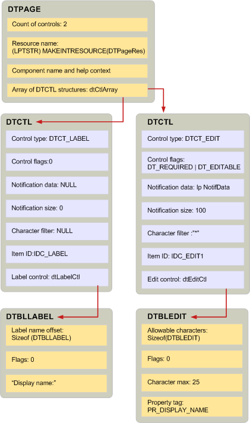

# Создание таблиц отображения и соответствующих структурCreating display tables and related structures
  
**Относится к**: Outlook 2013 | Outlook 2016**Applies to**: Outlook 2013 | Outlook 2016 
  
Создание таблицы отображения аналогично написанию программы с использованием языка сценариев.Creating a display table is similar to writing a program with a scripting language. Вы можете создать таблицу отображения, вызвав [буилддисплайтабле](builddisplaytable.md) или записав пользовательский код, чтобы заполнить строки и столбцы таблицы.You can create a display table either by calling [BuildDisplayTable](builddisplaytable.md) or writing custom code to populate the rows and columns of the table. В общем случае следует использовать метод **буилддисплайтабле** , так как это проще.In general, you should use the **BuildDisplayTable** technique because it is simpler. 
  
Прежде чем можно будет вызвать **буилддисплайтабле** для запроса MAPI для создания таблицы отображения, необходимо создать иерархию структур.Before you can call **BuildDisplayTable** to prompt MAPI to create a display table, there is a hierarchy of structures that you must build. Структура верхнего уровня, [дтпаже](dtpage.md), описывает одну страницу свойств с вкладками.The top-level structure, [DTPAGE](dtpage.md), describes a single tabbed property page. В каждой структуре **дтпаже** — это структура [дтктл](dtctl.md) , в которой описывается один элемент управления, например поле редактирования или переключатель.In every **DTPAGE** structure is a [DTCTL](dtctl.md) structure that describes a single control, such as an edit box or an option button. Каждая структура **дтктл** содержит структуру, относящуюся к типу элемента управления.Each **DTCTL** structure contains a structure that is specific to the type of control. Например, если структура **дтктл** описывает элемент управления "поле ввода", она будет содержать структуру **дтбледит** .For example, if the **DTCTL** structure describes an edit box control, it will contain a **DTBLEDIT** structure. Структура **дтктл** для переключателя содержит структуру **дтблрадиобуттон** .The **DTCTL** structure for an option button contains a **DTBLRADIOBUTTON** structure. 
  
Эти структуры относятся непосредственно к **буилддисплайтабле**; у них нет смысла вне контекста этой функции.These structures relate directly to **BuildDisplayTable**; they have no meaning outside the context of this function. При вызове **буилддисплайтабле**одна или несколько структур **дтпаже** передаются в качестве входных параметров.When you call **BuildDisplayTable**, you pass one or more **DTPAGE** structures as input parameters. Структуры **дтпаже** содержат массив структур **дтктл** и число структур **дтктл** в массиве.The **DTPAGE** structures contain an array of **DTCTL** structures and a count of the number of **DTCTL** structures in the array. Для каждого элемента управления отображается одна структура в диалоговом окне.There is one structure for every control to display in the dialog box. В структурах **дтпаже** также есть строка символов, представляющая имя соответствующего файла справки и ресурса диалогового окна.**DTPAGE** structures also have a character string that represents the name of a corresponding Help file and dialog box resource. 
  
Каждая структура **дтктл** в структуре **дтпаже** содержит следующие данные, которые используются для задания свойств элемента управления:Each **DTCTL** structure in a **DTPAGE** structure contains the following data that is used to set properties for the control: 
  
- Тип элемента управления для настройки **PR_CONTROL_TYPEа** ([PidTagControlType](pidtagcontroltype-canonical-property.md)).The control type for setting **PR_CONTROL_TYPE** ([PidTagControlType](pidtagcontroltype-canonical-property.md)).
    
- Контрольные флаги для настройки **PR_CONTROL_FLAGS** ([PidTagControlFlags](pidtagcontrolflags-canonical-property.md)).Control flags for setting **PR_CONTROL_FLAGS** ([PidTagControlFlags](pidtagcontrolflags-canonical-property.md)).
    
- Данные уведомления для настройки **PR_CONTROL_ID** ([PidTagControlId](pidtagcontrolid-canonical-property.md)).Notification data for setting **PR_CONTROL_ID** ([PidTagControlId](pidtagcontrolid-canonical-property.md)).
    
- Структура управления для настройки **PR_CONTROL_STRUCTURE** ([PidTagControlStructure](pidtagcontrolstructure-canonical-property.md)).The control structure for setting **PR_CONTROL_STRUCTURE** ([PidTagControlStructure](pidtagcontrolstructure-canonical-property.md)).
    
Структуры **дтктл** также содержат идентификатор ресурса и, для элементов управления "поле со списком" и "поле со списком", фильтр знаков.**DTCTL** structures also contain a resource identifier and, for edit and combo box controls, a character filter. 
  
Элемент структуры элемента управления структуры **дтктл** описывает данные, которые уникальны для типа элемента управления.The control structure member of a **DTCTL** structure describes the data that is unique for the type of control. MAPI определяет различные структуры для каждого типа элемента управления.MAPI defines a different structure for each control type. Например, данные элемента управления редактирования представлены структурой **дтбледит** ; данные в списке представлены структурой **дтбллбкс** .For example, the data of an edit control is represented by a **DTBLEDIT** structure; the data of a list box is represented by a **DTBLLBX** structure. 
  
Связь между тремя типами структур таблицы отображения показана на следующем рисунке.The relationship between the three types of display table structures is shown in the following illustration. Диалоговое окно, описываемое этой таблицей отображения, состоит из двух элементов управления: метки и элемента управления "поле ввода".The dialog box described by this display table has two controls: a label and an edit control. Структура **дтбллбкс** имеет элемент смещения меток, а также несколько структур элементов управления, которые описывают, где начинается строка символов для метки.The **DTBLLBX** structure has a label offset member, as do several of the control structures, that describes where the character string for the label begins. Строки символов меток обычно размещаются в памяти сразу после структуры.Label character strings are typically placed in memory immediately following the structure. 
  
**Отображение структур таблицы****Display table structures**
  
Отображение 
  
## См. такжеSee also

- [Реализация таблицы отображенияDisplay table implementation](display-table-implementation.md)

