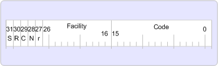

# Обработка ошибок в MAPIError handling in MAPI

**Относится к**: Outlook 2013 | Outlook 2016**Applies to**: Outlook 2013 | Outlook 2016 
  
Значения "успех", "предупреждение" и "ошибка" возвращаются с помощью 32 бит, который называется дескриптором результатов, или HRESULT.Success, warning, and error values are returned using a 32-bit number known as a result handle, or HRESULT. Значение HRESULT фактически не является дескриптором для какого-либо объекта; Это просто 32-разрядное значение с несколькими полями, закодированными в значении.An HRESULT is really not a handle to anything; it is merely a 32-bit value with several fields encoded in the value. Нулевой результат указывает на успешность выполнения, а ненулевое значение указывает на ошибку.A zero result indicates success and a nonzero result indicates failure.
  
MAPI на 32 разрядных платформах работает исключительно со значениями HRESULT.MAPI on 32-bit platforms works solely with HRESULT values.
  
На следующем рисунке показан формат HRESULT для 32 разрядных платформ.The following illustration shows the HRESULT format for 32-bit platforms.
  
**Формат HRESULT****HRESULT format**
  
Формат(media/amapi_49.gif "HRESULT для") ![формата]HRESULT
  
Бит высокого порядка в значении HRESULT указывает, представляет ли возвращаемое значение успешное или неудачное.The high order bit in the HRESULT indicates whether the return value represents success or failure. Если задано значение 0, значение указывает на успешное выполнение.If set to zero, the value indicates success. Если задано значение 1, это указывает на ошибку.If set to 1, it indicates failure.
  
Биты R, C, N и r зарезервированы в значении HRESULT.The R, C, N, and r bits are reserved in the HRESULT.
  
Поле "оборудование" в обеих версиях указывает область ответственности для ошибки.The facility field in both versions indicates the area of responsibility for the error. Существует несколько возможностей, но подавляющее большинство ошибок MAPI используют FACILITY_ITF для представления ошибок в интерфейсе.There are several facilities, but the vast majority of MAPI errors use FACILITY_ITF to represent interface errors. Наиболее распространенными используемыми в настоящее время функциями являются: FACILITY_NULL, FACILITY_ITF, FACILITY_DISPATCH, FACILITY_RPC и FACILITY_STORAGE.The most common facilities that are currently used are: FACILITY_NULL, FACILITY_ITF, FACILITY_DISPATCH, FACILITY_RPC, and FACILITY_STORAGE. При необходимости в новых средствах Майкрософт выделяет их, так как они должны быть уникальными.If new facilities are necessary, Microsoft allocates them because they need to be unique. В следующей таблице описываются различные поля средств.The following table describes the various facility fields.
  
|FacilityFacility|ОписаниеDescription|
|:-----|:-----|
|FACILITY_NULLFACILITY_NULL    |Для широко применяемых стандартных кодов состояния, таких как S_OK или E_OUTOF_MEMORY; значение равно нулю.For broadly applicable common status codes such as S_OK or E_OUTOF_MEMORY; the value is zero.    |
|FACILITY_ITFFACILITY_ITF    |Для большинства кодов состояния, возвращаемых методами интерфейса; значение определяется интерфейсом.For most status codes returned from interface methods; the value is defined by the interface. То есть два значения HRESULT с точно одинаковым 32-битным значением, возвращенные из двух разных интерфейсов, могут иметь разные значения.That is, two HRESULT values with exactly the same 32-bit value returned from two different interfaces might have different meanings.    |
|FACILITY_DISPATCHFACILITY_DISPATCH    |Для позднего связывания ошибок интерфейса [IDispatch](https://msdn.microsoft.com/library/ms221608.aspx) .For late binding [IDispatch](https://msdn.microsoft.com/library/ms221608.aspx) interface errors.    |
|FACILITY_RPCFACILITY_RPC    |Для кодов состояния, возвращаемых из удаленных вызовов процедур.For status codes returned from remote procedure calls.    |
|FACILITY_STORAGEFACILITY_STORAGE    |Для кодов состояния, возвращаемых из вызовов метода [IStorage](https://msdn.microsoft.com/library/aa380015%28VS.85%29.aspx) или [IStream](https://msdn.microsoft.com/library/aa380034%28VS.85%29.aspx) , относящихся к структурированному хранилищу.For status codes returned from [IStorage](https://msdn.microsoft.com/library/aa380015%28VS.85%29.aspx) or [IStream](https://msdn.microsoft.com/library/aa380034%28VS.85%29.aspx) method calls relating to structured storage. Коды состояния с кодом (младшие 16 бит) в диапазоне кодов ошибок Windows (то есть меньше 256) имеют то же значение, что и соответствующие ошибки Windows.Status codes with code (lower 16 bits) values in the range of Windows error codes (that is, less than 256) have the same meaning as the corresponding Windows errors.    |
   
Поле Code — это уникальный номер, который назначается для представления ошибки или предупреждения.The code field is a unique number that is assigned to represent the error or warning.
  

