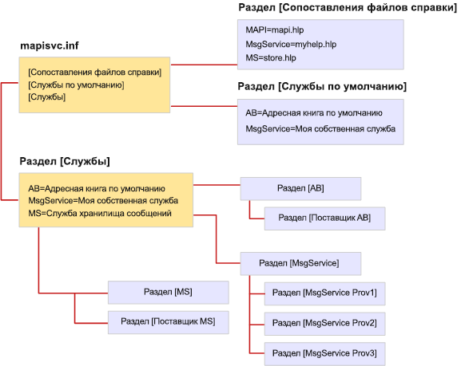

# Формат файла MapiSvc.inf

**Область применения**: Outlook 2013 | Outlook 2016 
  
Файл MapiSvc.inf выступает в роли центральной базы данных для сведений о настройках службы сообщений MAPI. Файл MapiSvc.inf содержит сведения о каждой из служб сообщений, установленной на рабочей станции, сведения о поставщиках служб, относящиеся к каждой службе сообщений и сведения о подсистеме MAPI. Файл MapiSvc.inf является основным источником информации для профилей. То есть при создании нового профиля или изменении существующего важная информация для каждой службы сообщений или поставщика службы копируются из файла MapiSvc.inf. 
  
MapiSvc.inf разделен на связанные иерархические разделы:
  
1. Раздел со сведениями, применяющимися ко всем профилям. Этот раздел состоит из трех частей:
    
   - раздел **[Службы]**, обеспечивающий связь с последующими разделами службы сообщений; 
    
   - раздел **[Сопоставления файлов справки]**, содержащий сведения о файлах HLP, предоставляемых службами сообщений; 
    
   - раздел **[Службы по умолчанию]** со списком служб сообщений, образующих установку по умолчанию. 
    
2. Раздел со сведениями, применяющимися к отдельным службам сообщений. Записи в этих разделах содержат ссылки на последующие разделы поставщика службы.
    
3. Раздел со сведениями, применяющимися к отдельным поставщикам службы в службе сообщений.
    
На рисунке ниже показана организация типового файла MapiSvc.inf. Используется три службы сообщений: AB, MsgService и MS. Имя с правой стороны знака равенства для каждой службы сообщений — это отображаемое имя службы. У каждой службы сообщений есть свой раздел в другом месте файла, связанный с одним или несколькими разделами поставщиков службы. Существует один раздел для каждого поставщика службы, относящийся к службе сообщений. Службы сообщений AB и MS — это службы с одним поставщиком, а к службе MsgService относятся три поставщика.
  
**Организация файла MapiSvc.inf**
  

  
MAPI предоставляет базовую версию файла MapiSvc.inf, содержащую записи для подсистемы MAPI. Каждый специалист по внедрению службы сообщений добавляет записи, подходящие как для собственной службы, так и для поставщиков служб, относящихся к этой службе. Одни записи являются обязательными, а другие — нет. Например, для MAPI требуется указать имя и путь каждого поставщика в службе сообщений. Без этих сведений их нельзя загрузить.
  
Можно добавить обязательные и необязательные сведения в разделе для службы сообщений и/или в разделах поставщиков службы. Место размещения сведений с описанием службы сообщений зависит от количества поставщиков в службе. Эти сведения применяются к каждому поставщику в службе, поэтому они должны быть доступны для всех поставщиков. Сохраните их в разделе службы сообщений (предпочтительный вариант) или во всех разделах поставщиков службы. Сохраняйте сведения один раз, чтобы избежать ненужной репликации и необходимости поддержания синхронизации нескольких копий.
  
Если ваша служба сообщений является службой с одним поставщиком, храните все сведения о службе сообщений в разделе поставщика службы, а не в разделе службы. Доступ к разделу поставщика службы выполняется быстрее и целенаправленнее, чем доступ к разделу службы сообщений. 
  
Храните в файле MapiSvc.inf только данные общедоступной конфигурации. Частная или требующая дополнительной защиты информация, например пароли и другие учетные данные, не должны быть включены в этот файл. Вместо этого либо вообще не храните такую информацию, либо храните ее в профиле в виде свойств безопасности. У свойств безопасности есть встроенные функции защиты, например шифрование.
  
## Справочные материалы

Дополнительные сведения об устранении ошибок, если MAPI блокирует DLL поставщика, см. в статье [Как разрешить MAPI загружать незарегистрированные DLL поставщика](https://support.microsoft.com/topic/how-to-allow-mapi-to-load-unregistered-provider-dlls-18d9a1cd-d3d7-fa10-473e-5dfd62d38b0d).

