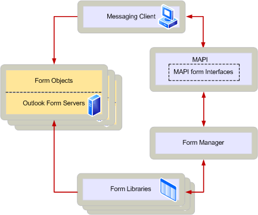

# Обработка форм MAPI

**Область применения**: Outlook 2013 | Outlook 2016 
  
Форма MAPI — это зритель для сообщения определенного класса. Клиенты, которые позволяют пользователям работать с сообщениями, принадлежащими к различным классам сообщений, должны быть написаны для обработки различных форм MAPI. Чтобы обрабатывать несколько форм, клиенты реализуют компонент, известный как зритель форм, который содержит следующие три объекта:
  
- Объект сайта сообщений, который поддерживает [интерфейс IMAPIMessageSite: IUnknown.](imapimessagesiteiunknown.md) 
    
- Представление советую раковину, которая поддерживает [интерфейс IMAPIViewAdviseSink: IUnknown.](imapiviewadvisesinkiunknown.md) 
    
- Объект контекста представления, поддерживаюший [интерфейс IMAPIViewContext: IUnknown.](imapiviewcontextiunknown.md) 
    
Каждый из этих объектов используется компонентом, называемым сервером форм, который реализует каждую форму, обработку ее хранения и уведомлений, созданных клиентами, которые выполняют представление. Еще один компонент, поставщик библиотеки форм, реализует диспетчер форм. Администратор формы управляет библиотеками форм, в которых хранятся файлы, исполняемые на сервере форм. Это администрирование включает загрузку соответствующего сервера форм и обработку начальной связи между сервером и клиентом.
  
На следующей схеме показана связь между клиентом и другими частями архитектуры форм MAPI.
  
## Архитектура формы MAPI
  

  
Если клиент планирует обрабатывать формы MAPI, вы будете использовать интерфейс [IMAPIFormMgr руководителя форм: IUnknown](imapiformmgriunknown.md) для выполнения пяти основных задач: 
  
- Запустите соответствующий сервер форм MAPI при открываемом или составленном сообщении.
    
- Отображение значков серверов форм в таблицах содержимого папок.
    
- Отправка и получение уведомлений о форме. Дополнительные сведения см. в [рублях Отправка и получение уведомлений о форме.](sending-and-receiving-form-notifications.md)
    
- Разрешить пользователям устанавливать или удалять серверы форм из библиотек форм. Дополнительные сведения см. [в дополнительных сведениях о сохранении библиотеки форм.](maintaining-a-form-library.md)
    
- Разрешить пользователям связывать серверы форм с определенными папками.
    
Чтобы получить доступ к диспетчеру форм, во время инициализации позвоните в [функцию MAPIOpenFormMgr.](mapiopenformmgr.md) 
  
## В этом разделе

- [Реализация viewer form Viewer](implementing-a-form-viewer.md): Описывает, как реализовать просмотр формы с помощью раковины представления, сайта сообщений и контекста представления.
    
- [Реализация стандартных глаголов формы:](implementing-standard-form-verbs.md)описывает, как реализовать глаголы для меню пользователя или нажатие кнопки на формах MAPI.
    
- [Отправка и получение уведомлений о форме.](sending-and-receiving-form-notifications.md)Описывает, как отправлять и получать уведомления о форме.
    
- [Ведение библиотеки форм.](maintaining-a-form-library.md)Описывает, как поддерживать библиотеку, в которую вмещаются все важные сведения о форме.
    
- [Загрузка сообщения в форму](loading-a-message-into-a-form.md): Описывает, как загрузить сообщение в форму.
    
- [Сочинение нового сообщения с помощью формы](composing-a-new-message-by-using-a-form.md): Описывает, как составить сообщение с помощью формы.
    
- [Отображение значков форм.](displaying-form-icons.md)Описывает действия для отображения значка с формой.
    
## См. также

- [Формы MAPI](mapi-forms.md)
- [Разработка серверов форм MAPI](developing-mapi-form-servers.md)

