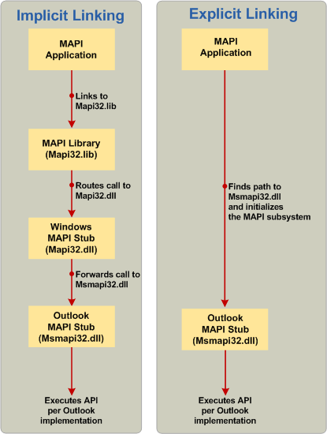

# <a name="link-to-mapi-functions"></a><span data-ttu-id="3e073-103">Ссылки на функции MAPI</span><span class="sxs-lookup"><span data-stu-id="3e073-103">Link to MAPI functions</span></span>

<span data-ttu-id="3e073-104">**Область применения**: Outlook 2013 | Outlook 2016</span><span class="sxs-lookup"><span data-stu-id="3e073-104">**Applies to**: Outlook 2013 | Outlook 2016</span></span> 
  
<span data-ttu-id="3e073-105">Существует три метода компоновки: неявное связывание, явного связывания и новая модель гибридного использования библиотеки заглушка MAPI.</span><span class="sxs-lookup"><span data-stu-id="3e073-105">There are three methods of linking: implicit linking, explicit linking, and a new hybrid model using the MAPI Stub Library.</span></span>
  
## <a name="implicit-linking"></a><span data-ttu-id="3e073-106">Неявное связывание</span><span class="sxs-lookup"><span data-stu-id="3e073-106">Implicit linking</span></span>

<span data-ttu-id="3e073-107">С исторической точки зрения вызов функции MAPI в приложение для обмена сообщениями всегда задействованных ссылки на библиотеку Mapi32.lib.</span><span class="sxs-lookup"><span data-stu-id="3e073-107">Historically, calling MAPI functions in a messaging application always involved linking to the Mapi32.lib library.</span></span> <span data-ttu-id="3e073-108">Это включенные маршрутизации вызовов MAPI в библиотеку заглушка Windows MAPI Mapi32.dll, который затем передается вызовы реализации клиента MAPI по умолчанию во время выполнения.</span><span class="sxs-lookup"><span data-stu-id="3e073-108">This included routing MAPI calls to the Windows MAPI stub library, Mapi32.dll, which then forwarded the calls to the default MAPI client implementation at run time.</span></span> <span data-ttu-id="3e073-109">Этот процесс вызова называется неявное связывание.</span><span class="sxs-lookup"><span data-stu-id="3e073-109">This call process is known as implicit linking.</span></span> <span data-ttu-id="3e073-110">В левой части на следующем рисунке показан пример неявного связывания в процесс вызова функции MAPI.</span><span class="sxs-lookup"><span data-stu-id="3e073-110">The left side of the following figure shows an example of implicit linking used in a MAPI function call process.</span></span> <span data-ttu-id="3e073-111">Процесс инициируется приложения MAPI и состоит из библиотеки MAPI (Mapi32.lib) и заглушка Windows MAPI (Mapi32.dll) и завершения реализации клиент Outlook MAPI заглушка MAPI (Msmapi32.dll).</span><span class="sxs-lookup"><span data-stu-id="3e073-111">The process is initiated by a MAPI application and involves the MAPI library (Mapi32.lib) and the Windows MAPI stub (Mapi32.dll) and is completed by the Outlook MAPI client implementation of the MAPI stub (Msmapi32.dll).</span></span>
  
<span data-ttu-id="3e073-112">**Сравнение неявного и явного связывания.**</span><span class="sxs-lookup"><span data-stu-id="3e073-112">**Comparison of implicit and explicit linking.**</span></span>

<span data-ttu-id="3e073-113">![Сравнение неявного и явного связывания] (media/09d9c49a-a52d-4407-9013-d0d14c8f63f6.gif "Сравнение неявного и явного связывания")</span><span class="sxs-lookup"><span data-stu-id="3e073-113"></span></span>
  
## <a name="explicit-linking"></a><span data-ttu-id="3e073-114">Связывание Explicit</span><span class="sxs-lookup"><span data-stu-id="3e073-114">Explicit linking</span></span>

<span data-ttu-id="3e073-115">Так как клиент MAPI по умолчанию поддерживает установку по запросу с помощью установщика Windows (MSI), вы можете создавать приложений для обмена сообщениями непосредственно на заглушка Outlook MAPI вместо использования библиотеки MAPI и заглушка Windows MAPI.</span><span class="sxs-lookup"><span data-stu-id="3e073-115">Because the default MAPI client supports on-demand installation using the Windows Installer (MSI), you can develop messaging applications directly on the Outlook MAPI stub instead of using the MAPI library and Windows MAPI stub.</span></span> <span data-ttu-id="3e073-116">В правой части на предыдущем рисунке показан пример MAPI процесс вызова функции, начиная с приложения MAPI ищете путь и имя DLL-Библиотеку Outlook MAPI заглушка (шаг 2 в следующем разделе) и вызовов функций в (заглушку Outlook MAPI Шаг 3 в следующем разделе).</span><span class="sxs-lookup"><span data-stu-id="3e073-116">The right side of the previous figure shows an example of a MAPI function call process, starting with a MAPI application looking for the path and DLL name for the Outlook MAPI stub (step 2 in the following section), and making function calls into the Outlook MAPI stub (step 3 in the following section).</span></span> <span data-ttu-id="3e073-117">Следующей процедуре показано, как вызывать функции MAPI с помощью явного связывания.</span><span class="sxs-lookup"><span data-stu-id="3e073-117">The following procedure shows how to call MAPI functions by using explicit linking.</span></span> 
  
> [!NOTE]
> <span data-ttu-id="3e073-118">Эти сведения о явного связывания может быть избыточным в соответствии с потребностями с введением MAPIStubLibrary.lib, обсуждаемые в следующем разделе.</span><span class="sxs-lookup"><span data-stu-id="3e073-118">This information about explicit linking may be superfluous to your needs with the introduction of the MAPIStubLibrary.lib discussed in the following section.</span></span> <span data-ttu-id="3e073-119">Как неявные модели новую библиотеку управляет всех компонентов и реализует явного связывания логику, которая загружает Outlook MAPI напрямую.</span><span class="sxs-lookup"><span data-stu-id="3e073-119">Like the implicit model, the new library manages everything and implements the explicit linking logic that loads Outlook's MAPI directly.</span></span> 
  
<span data-ttu-id="3e073-120">Дополнительные сведения о явного связывания можно явно ссылки.</span><span class="sxs-lookup"><span data-stu-id="3e073-120">For more information about explicit linking, see Linking Explicitly.</span></span>
  
### <a name="to-call-mapi-api-elements-without-the-mapi-library-and-the-windows-mapi-stub"></a><span data-ttu-id="3e073-121">Чтобы вызвать элементы API-интерфейса MAPI без библиотеки MAPI и заглушка Windows MAPI</span><span class="sxs-lookup"><span data-stu-id="3e073-121">To call MAPI API elements without the MAPI library and the Windows MAPI stub</span></span>

1. <span data-ttu-id="3e073-122">В файле программы создания глобального списка указатели на функции для каждого элемента MAPI API, которое используется.</span><span class="sxs-lookup"><span data-stu-id="3e073-122">In your program file, create a global list of function pointers for each MAPI API element that you are using.</span></span> 
    
   <span data-ttu-id="3e073-123">В следующем примере показано это действие.</span><span class="sxs-lookup"><span data-stu-id="3e073-123">The following example shows this step.</span></span>
    
   ```cpp
    //Global MAPI function pointers
    LPMAPIINITIALIZE pfnMAPIInitialize = NULL;
    LPMAPIUNINITIALIZE pfnMAPIUninitialize = NULL;
   ```

2. <span data-ttu-id="3e073-124">Создание функции, инициализирует функции MAPI для ссылки на библиотеку DLL MAPI клиент MAPI по умолчанию (например, Msmapi32.dll из Microsoft Outlook).</span><span class="sxs-lookup"><span data-stu-id="3e073-124">Create a function that initializes MAPI functions to link to the MAPI DLL of the default MAPI client (for example, Msmapi32.dll of Microsoft Outlook).</span></span> <span data-ttu-id="3e073-125">В этой функции выполните следующие действия.</span><span class="sxs-lookup"><span data-stu-id="3e073-125">In this function, do the following:</span></span> 
    
    1. <span data-ttu-id="3e073-126">Загрузите mapi32.dll из каталога, соответствующую систему.</span><span class="sxs-lookup"><span data-stu-id="3e073-126">Load mapi32.dll from the appropriate system directory.</span></span> 
        
       |||
       |:-----|:-----|
       |<span data-ttu-id="3e073-127">x64 или x86 изначально</span><span class="sxs-lookup"><span data-stu-id="3e073-127">x64 or x86 natively</span></span>  <br/> |<span data-ttu-id="3e073-128">**%windir%\system32\mapi32.dll**</span><span class="sxs-lookup"><span data-stu-id="3e073-128">**%windir%\system32\mapi32.dll**</span></span> <br/> |
       |<span data-ttu-id="3e073-129">x86 в режиме WoW</span><span class="sxs-lookup"><span data-stu-id="3e073-129">x86 on WoW mode</span></span>  <br/> |<span data-ttu-id="3e073-130">**%windir%\syswow64\mapi32.dll**</span><span class="sxs-lookup"><span data-stu-id="3e073-130">**%windir%\syswow64\mapi32.dll**</span></span> <br/> |
    
    2. <span data-ttu-id="3e073-131">Вызовите функцию [FGetComponentPath](fgetcomponentpath.md) для получения путь и имя библиотеки DLL, который реализует подсистемы MAPI.</span><span class="sxs-lookup"><span data-stu-id="3e073-131">Call the [FGetComponentPath](fgetcomponentpath.md) function to get the path and DLL name that implements the MAPI subsystem.</span></span> <span data-ttu-id="3e073-132">Дополнительные сведения можно [выбрать определенные версии MAPI для загрузки](how-to-choose-a-specific-version-of-mapi-to-load.md).</span><span class="sxs-lookup"><span data-stu-id="3e073-132">For more information, see [Choose a Specific Version of MAPI to Load](how-to-choose-a-specific-version-of-mapi-to-load.md).</span></span>
        
    3. <span data-ttu-id="3e073-133">Загрузите DLL путем вызова функции LoadLibrary.</span><span class="sxs-lookup"><span data-stu-id="3e073-133">Load the DLL by calling the LoadLibrary function.</span></span> 
        
    4. <span data-ttu-id="3e073-134">Инициализация массива указатель функции MAPI путем вызова функции GetProcAddress.</span><span class="sxs-lookup"><span data-stu-id="3e073-134">Initialize the MAPI function pointer array by calling the GetProcAddress function.</span></span> 
        
    <span data-ttu-id="3e073-135">В следующем примере показано предыдущие действия:</span><span class="sxs-lookup"><span data-stu-id="3e073-135">The following example shows the previous steps:</span></span>
        
   ```cpp
    void InitializeMapiFunctions()
    {
    {
        // Get the DLL path and name of the actual MAPI implementation.
        FGetComponentPath(g_szMapiComponentGUID, NULL, szMAPIDLL, MAX_PATH);
        // Load the DLL.
        hMod = LoadLibrary(szMAPIDLL);
        // Initialize MAPI functions.
        pfnMAPIInitialize = GetProcAddress(hMod, "MAPIInitialize");
        pfnMAPIUninitialize = GetProcAddress(hMod, "MAPIUninitialize");
    }
   ```

3. <span data-ttu-id="3e073-136">И, наконец вызовите функцию, созданный на шаге 2 в приложение для обмена сообщениями прежде чем выполнять вызовы к элементам API-интерфейса MAPI.</span><span class="sxs-lookup"><span data-stu-id="3e073-136">Finally, call the function that you created in step 2 in your messaging application before you make calls to MAPI API elements.</span></span> 
    
   > [!CAUTION]
   > <span data-ttu-id="3e073-137">Необходимо выполнении отмены инициализации подсистемы MAPI перед закрытием приложения.</span><span class="sxs-lookup"><span data-stu-id="3e073-137">You must uninitialize the MAPI subsystem before closing your application.</span></span> 
  
   <span data-ttu-id="3e073-138">В следующем примере показано это действие:</span><span class="sxs-lookup"><span data-stu-id="3e073-138">The following example shows this step:</span></span> 
    
   ```cpp
    int main()
    {
        HRESULT hr;
        InitializeMapiFunctions();
        // Initialize the MAPI subsystem.
        hr = (*pfnMAPIInitialize)(NULL);
        if (hr!= S_OK)
        {
            // Handle the error case.
        }
        // Here is where you make calls to other MAPI interfaces.
        // Uninitialize the MAPI subsystem.
        (*pfnMAPIUninitialize)();
    return (0);
    }
   ```

## <a name="mapistublibrarylib"></a><span data-ttu-id="3e073-139">MAPIStubLibrary.lib</span><span class="sxs-lookup"><span data-stu-id="3e073-139">MAPIStubLibrary.lib</span></span>

<span data-ttu-id="3e073-140">После выпуска Microsoft Outlook 2010 и 64-разрядная версия MAPI, теперь расширение для Microsoft Outlook 2013 требуется больше, чем традиционные API 32-разрядная версия для полная реализация.</span><span class="sxs-lookup"><span data-stu-id="3e073-140">The advent of Microsoft Outlook 2010 and 64-bit MAPI, now extending to the Microsoft Outlook 2013, requires more than the traditional 32-bit API for full implementation.</span></span> <span data-ttu-id="3e073-141">Новый проект в библиотеку заглушка MAPI, размещенные на веб-сайте CodePlex предоставляет замены сборка для Mapi32.lib, поддерживающего построение приложений MAPI в 32- и 64-разрядная версия.</span><span class="sxs-lookup"><span data-stu-id="3e073-141">A new project, the MAPI Stub Library, posted on the CodePlex website provides a drop-in replacement for Mapi32.lib that supports building both 32-bit and 64-bit MAPI applications.</span></span> <span data-ttu-id="3e073-142">MAPIStubLibrary.lib устраняет необходимость явного связывания MAPI и построения, можно удалить Mapi32.lib из параметры настройки компоновщика, заменив MAPIStubLibrary.lib; следует необходимые дополнительные изменения в коде.</span><span class="sxs-lookup"><span data-stu-id="3e073-142">MAPIStubLibrary.lib eliminates the need to explicitly link to MAPI, and having built it, you can remove Mapi32.lib from your linker settings, replacing it with MAPIStubLibrary.lib; no further modifications to your code should be needed.</span></span> <span data-ttu-id="3e073-143">Он также позволяет отказаться от писать код **LoadLibrary** **GetProcAddress**и **FreeLibrary** обрабатывать новые экспорта, включенные в этот файл библиотеки, но не в Mapi32.lib, который может потребоваться при использовании явного связывания.</span><span class="sxs-lookup"><span data-stu-id="3e073-143">It also eliminates the need to write **LoadLibrary**, **GetProcAddress**, and **FreeLibrary** code to handle newer exports included in this library file but not in Mapi32.lib, which would be needed if you used explicit linking.</span></span> 
  
<span data-ttu-id="3e073-144">Ниже перечислены некоторые из новых функций, связанные с этой библиотеки, которые не доступны в Mapi32.lib:</span><span class="sxs-lookup"><span data-stu-id="3e073-144">Some of the new functions linked from this library that are not available in Mapi32.lib include the following:</span></span>
  
- [<span data-ttu-id="3e073-145">GetDefCachedMode</span><span class="sxs-lookup"><span data-stu-id="3e073-145">GetDefCachedMode</span></span>](getdefcachedmode.md)    
- [<span data-ttu-id="3e073-146">HrGetGALFromEmsmdbUID</span><span class="sxs-lookup"><span data-stu-id="3e073-146">HrGetGALFromEmsmdbUID</span></span>](hrgetgalfromemsmdbuid.md)   
- [<span data-ttu-id="3e073-147">HrOpenOfflineObj</span><span class="sxs-lookup"><span data-stu-id="3e073-147">HrOpenOfflineObj</span></span>](hropenofflineobj.md)    
- [<span data-ttu-id="3e073-148">MAPICrashRecovery</span><span class="sxs-lookup"><span data-stu-id="3e073-148">MAPICrashRecovery</span></span>](mapicrashrecovery.md)   
- [<span data-ttu-id="3e073-149">OpenStreamOnFileW</span><span class="sxs-lookup"><span data-stu-id="3e073-149">OpenStreamOnFileW</span></span>](openstreamonfilew.md)    
- [<span data-ttu-id="3e073-150">WrapCompressedRTFStreamEx</span><span class="sxs-lookup"><span data-stu-id="3e073-150">WrapCompressedRTFStreamEx</span></span>](wrapcompressedrtfstreamex.md)
    
<span data-ttu-id="3e073-151">Другой способ включения библиотеки заглушка MAPI — это скопировать исходные файлы MapiStubLibrary.cpp и StubUtils.cpp, непосредственно в проект и удаление любое взаимодействие Mapi32.lib и любой код, который явно связано MAPI.</span><span class="sxs-lookup"><span data-stu-id="3e073-151">An alternate method of incorporating the MAPI Stub Library is to copy the source files, MapiStubLibrary.cpp and StubUtils.cpp, directly into your project and remove any linkage to Mapi32.lib and any code that explicitly links to MAPI.</span></span>
  
<span data-ttu-id="3e073-152">Доступ к файлам библиотеки заглушка MAPI и сведения о создании и интегрировать в проект, а также вопросы об этой библиотеки например, когда и почему его использование, см в [Библиотеке заглушка MAPI](https://mapistublibrary.codeplex.com/documentation) на сайте CodePlex.</span><span class="sxs-lookup"><span data-stu-id="3e073-152">To access the MAPI Stub Library files and for information about how to build and integrate it into your project, as well as questions about this library such as when and why to use it, see the [MAPI Stub Library](https://mapistublibrary.codeplex.com/documentation) on the CodePlex site.</span></span> 
  
## <a name="see-also"></a><span data-ttu-id="3e073-153">См. также</span><span class="sxs-lookup"><span data-stu-id="3e073-153">See also</span></span>

- [<span data-ttu-id="3e073-154">����� �������� � ���������������� MAPI</span><span class="sxs-lookup"><span data-stu-id="3e073-154">MAPI Programming Overview</span></span>](mapi-programming-overview.md)
- [<span data-ttu-id="3e073-155">Установка подсистемы MAPI</span><span class="sxs-lookup"><span data-stu-id="3e073-155">Installing the MAPI Subsystem</span></span>](installing-the-mapi-subsystem.md)
- [<span data-ttu-id="3e073-156">Установить файлы заголовков MAPI</span><span class="sxs-lookup"><span data-stu-id="3e073-156">Install MAPI Header Files</span></span>](how-to-install-mapi-header-files.md)
- [<span data-ttu-id="3e073-157">Выбор определенной версии MAPI для загрузки</span><span class="sxs-lookup"><span data-stu-id="3e073-157">Choose a Specific Version of MAPI to Load</span></span>](how-to-choose-a-specific-version-of-mapi-to-load.md)
- [<span data-ttu-id="3e073-158">Определение подходящего метода связывания для использования</span><span class="sxs-lookup"><span data-stu-id="3e073-158">Determining Which Linking Method to Use</span></span>](https://msdn.microsoft.com/library/253b8k2c.aspx)
- [<span data-ttu-id="3e073-159">Связывание исполняемого файла для библиотеки DLL</span><span class="sxs-lookup"><span data-stu-id="3e073-159">Linking an Executable to a DLL</span></span>](https://msdn.microsoft.com/library/9yd93633.aspx)
- [<span data-ttu-id="3e073-160">Настройка разделов MSI для библиотеки DLL MAPI</span><span class="sxs-lookup"><span data-stu-id="3e073-160">Setting Up the MSI Keys for Your MAPI DLL</span></span>](https://msdn.microsoft.com/library/ee909494%28v=VS.85%29.aspx)

