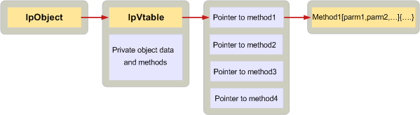

# <a name="implementing-objects-in-c"></a><span data-ttu-id="04116-103">Внедрение объектов в C</span><span class="sxs-lookup"><span data-stu-id="04116-103">Implementing objects in C</span></span>

<span data-ttu-id="04116-104">**Применимо к**: Outlook 2013 | Outlook 2016</span><span class="sxs-lookup"><span data-stu-id="04116-104">**Applies to**: Outlook 2013 | Outlook 2016</span></span> 
  
<span data-ttu-id="04116-105">Клиентские приложения и поставщиков услуг, написанных на языке C определяется путем создания структуры данных и массив указателей упорядоченном функций, известных как таблицы виртуальной функции или vtable объектов MAPI.</span><span class="sxs-lookup"><span data-stu-id="04116-105">Client applications and service providers written in C define MAPI objects by creating a data structure and an array of ordered function pointers known as a virtual function table, or vtable.</span></span> <span data-ttu-id="04116-106">Указатель vtable должен быть первый элемент структуры данных.</span><span class="sxs-lookup"><span data-stu-id="04116-106">A pointer to the vtable must be the first member of the data structure.</span></span>
  
<span data-ttu-id="04116-107">В vtable самого существует один указатель для каждого метода каждого интерфейса поддерживается объектом.</span><span class="sxs-lookup"><span data-stu-id="04116-107">In the vtable itself, there is one pointer for every method in each interface supported by the object.</span></span> <span data-ttu-id="04116-108">Порядок указатели должны соответствовать порядок методов в спецификации интерфейса, опубликованной в файл заголовка Mapidefs.h.</span><span class="sxs-lookup"><span data-stu-id="04116-108">The order of the pointers must follow the order of the methods in the interface specification published in the Mapidefs.h header file.</span></span> <span data-ttu-id="04116-109">Каждый указатель на функцию в таблице vtable задано значение адрес фактическую реализацию метода.</span><span class="sxs-lookup"><span data-stu-id="04116-109">Each function pointer in the vtable is set to the address of the actual implementation of the method.</span></span> <span data-ttu-id="04116-110">В C++ компилятора автоматически выполняет настройку vtable.</span><span class="sxs-lookup"><span data-stu-id="04116-110">In C++, the compiler automatically sets up the vtable.</span></span> <span data-ttu-id="04116-111">В C нет.</span><span class="sxs-lookup"><span data-stu-id="04116-111">In C, it does not.</span></span> 
  
<span data-ttu-id="04116-112">На следующем рисунке показана, как это работает.</span><span class="sxs-lookup"><span data-stu-id="04116-112">The following illustration shows how this works.</span></span> <span data-ttu-id="04116-113">Поле слева представляет клиента, которую необходимо использовать объект поставщика службы.</span><span class="sxs-lookup"><span data-stu-id="04116-113">The box on the far left represents a client that needs to use a service provider object.</span></span> <span data-ttu-id="04116-114">Через сеанс клиент получает указатель на объект **lpObject**.</span><span class="sxs-lookup"><span data-stu-id="04116-114">Through the session, the client obtains a pointer to the object, **lpObject**.</span></span> <span data-ttu-id="04116-115">Vtable отображается первым в объекте, а затем личных данных и методы.</span><span class="sxs-lookup"><span data-stu-id="04116-115">The vtable appears first in the object followed by private data and methods.</span></span> <span data-ttu-id="04116-116">Указатель vtable указывает на фактический vtable, который содержит указатели на каждой реализации методов в интерфейсе.</span><span class="sxs-lookup"><span data-stu-id="04116-116">The vtable pointer points to the actual vtable, which contains pointers to each of the implementations of the methods in the interface.</span></span> 
  
<span data-ttu-id="04116-117">**Реализация объекта**</span><span class="sxs-lookup"><span data-stu-id="04116-117">**Object implementation**</span></span>
  
<span data-ttu-id="04116-118">![Реализация объекта] (media/amapi_42.gif "Реализация объекта")</span><span class="sxs-lookup"><span data-stu-id="04116-118"></span></span>
  
<span data-ttu-id="04116-119">В следующем примере кода показано, как поставщик службы C можно определить простой состояние объекта.</span><span class="sxs-lookup"><span data-stu-id="04116-119">The following code example shows how a C service provider can define a simple status object.</span></span> <span data-ttu-id="04116-120">Первый элемент является указателя vtable; Остальная часть объекта состоит из элементов данных.</span><span class="sxs-lookup"><span data-stu-id="04116-120">The first member is the vtable pointer; the rest of the object is made up of data members.</span></span> 
  
```C
typedef struct _MYSTATUSOBJECT
{
    const STATUS_Vtbl FAR *lpVtbl;
    ULONG              cRef;
    ANOTHEROBJ        *pObj;
    LPMAPIPROP         lpProp;
    LPFREEBUFFER       lpFreeBuf;
} MYSTATUSOBJECT, *LPMYSTATUSOBJ;
 
```

<span data-ttu-id="04116-121">Поскольку этот объект является объектом состояния, vtable содержит указатели на реализацию каждого из методов в [IMAPIStatus: IMAPIProp](imapistatusimapiprop.md) интерфейс, а также указатели на реализацию каждого из методов в базовые интерфейсы — **IUnknown **и **IMAPIProp**.</span><span class="sxs-lookup"><span data-stu-id="04116-121">Because this object is a status object, the vtable includes pointers to implementations of each of the methods in the [IMAPIStatus : IMAPIProp](imapistatusimapiprop.md) interface, as well as pointers to implementations of each of the methods in the base interfaces — **IUnknown** and **IMAPIProp**.</span></span> <span data-ttu-id="04116-122">Порядок методов в таблице vtable совпадает с указанным порядком, определенных в файле заголовка Mapidefs.h.</span><span class="sxs-lookup"><span data-stu-id="04116-122">The order of methods in the vtable matches the specified order as defined in the Mapidefs.h header file.</span></span>
  
```js
static const MYOBJECT_Vtbl vtblSTATUS =
{
    STATUS_QueryInterface,
    STATUS_AddRef,
    STATUS_Release,
    STATUS_GetLastError,
    STATUS_SaveChanges,
    STATUS_GetProps,
    STATUS_GetPropList,
    STATUS_OpenProperty,
    STATUS_SetProps,
    STATUS_DeleteProps,
    STATUS_CopyTo,
    STATUS_CopyProps,
    STATUS_GetNamesFromIDs,
    STATUS_GetIDsFromNames,
    STATUS_ValidateState,
    STATUS_SettingsDialog,
    STATUS_ChangePassword,
    STATUS_FlushQueues
};
 
```

<span data-ttu-id="04116-123">Клиенты и поставщиков услуг, написанных на языке C используйте объекты косвенно через vtable и добавьте указателя на объект в качестве первого параметра в каждого вызова.</span><span class="sxs-lookup"><span data-stu-id="04116-123">Clients and service providers written in C use objects indirectly through the vtable and add an object pointer as the first parameter in every call.</span></span> <span data-ttu-id="04116-124">Каждый вызов метода интерфейса MAPI требуется указатель на объект, вызываемый в качестве первого параметра.</span><span class="sxs-lookup"><span data-stu-id="04116-124">Every call to a MAPI interface method requires a pointer to the object being called as its first parameter.</span></span> <span data-ttu-id="04116-125">C++ определяет специальные указатель, известных как **Этот** указатель для этой цели.</span><span class="sxs-lookup"><span data-stu-id="04116-125">C++ defines a special pointer known as the **this** pointer for this purpose.</span></span> <span data-ttu-id="04116-126">Компилятор C++ неявно добавляет **Этот** указатель мыши в качестве первого параметра для каждого вызова метода.</span><span class="sxs-lookup"><span data-stu-id="04116-126">The C++ compiler implicitly adds the **this** pointer as the first parameter to every method call.</span></span> <span data-ttu-id="04116-127">В C — нет такого указатель; она должна быть явно добавлена.</span><span class="sxs-lookup"><span data-stu-id="04116-127">In C there is no such pointer; it must be explicitly added.</span></span> 
  
<span data-ttu-id="04116-128">В следующем коде показано, как клиент может позвонить в экземпляр MYSTATUSOBJECT:</span><span class="sxs-lookup"><span data-stu-id="04116-128">The following code demonstrates how a client can make a call to an instance of MYSTATUSOBJECT:</span></span>
  
```C
lpMyObj->lpVtbl->ValidateState(lpMyObj, ulUIParam, ulFlags);
 
```

## <a name="see-also"></a><span data-ttu-id="04116-129">См. также</span><span class="sxs-lookup"><span data-stu-id="04116-129">See also</span></span>

- [<span data-ttu-id="04116-130">Реализация объектов MAPI</span><span class="sxs-lookup"><span data-stu-id="04116-130">Implementing MAPI Objects</span></span>](implementing-mapi-objects.md)

