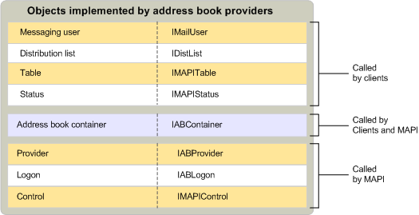

# Объекты поставщика MAPI адресной книгиMAPI address book provider objects
  
**Применимо к**: Outlook 2013 | Outlook 2016**Applies to**: Outlook 2013 | Outlook 2016 
  
В дополнение к стандартный поставщик и входа в систему объекты реализуемые поставщиками адресных книг контейнеров адресной книги, списки рассылки, обмена мгновенными сообщениями пользователи, таблиц, состояние объектов и элементов управления.In addition to the standard provider and logon objects, address book providers implement address book containers, distribution lists, messaging users, tables, status objects, and controls.
  
На следующем рисунке показана этих объектов, их соответствующие интерфейсы и компоненты MAPI, их использования.The following illustration shows these objects, their corresponding interfaces, and the MAPI components that use them.
  
![Объекты, реализуемые поставщиками адресных книг] (media/amapi_64.gif "Объекты, реализуемые поставщиками адресных книг")
  
## См. такжеSee also

- [Объекты поставщика службы MAPIMAPI Service Provider Objects](mapi-service-provider-objects.md)

