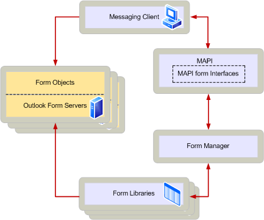

# Общие сведения о формах MAPIMAPI forms overview
  
**Относится к**: Outlook**Applies to**: Outlook 
  
Формы MAPI — это средство просмотра для сообщения.A MAPI form is a viewer for a message. Каждое сообщение имеет класс сообщений, который определяет определенной формы, которая используется в качестве его просмотра.Every message has a message class that dictates the particular form that is used as its viewer. MAPI определяет несколько классов сообщений и производитель реализовал формы для просмотра сообщений из этих классов.MAPI defines several message classes and has implemented the forms for viewing messages of these classes. Разработчики клиентских приложений можно создать новые классы сообщений и настраиваемые формы для просмотра сообщений, созданных с помощью новых классов.Client software developers can create new message classes and custom forms for viewing messages created by using the new classes.
  
Каждые настраиваемая форма реализует набор стандартных команд меню, такие как **Open**, **Создание**, **Удаление**и **ответ**и набор команд, которые специфичны для определенной формы.Every custom form implements a set of standard menu commands, such as **Open**, **Create**, **Delete**, and **Reply**, and a set of commands that are specific to the particular form. Некоторые команды формы интегрированы с пользовательским интерфейсом в клиентском приложении, если форма активна; другие команды формы полностью заменить команды клиента.Some of the form commands are integrated with the user interface of the client application when the form is active; other form commands completely replace the client commands. 
  
На следующем рисунке показана связь между компонентами MAPI, связанные с использованием форм.The following illustration shows the relationship between the MAPI components involved in using forms. 
  
**Архитектура формы MAPI****MAPI form architecture**
  
![Архитектура формы MAPI] (media/forms01.gif "Архитектура формы MAPI")
  
На схеме Обратите внимание на то, что диспетчер форм играет роль, похожие на других поставщиков служб MAPI, хотя это не самого поставщика услуг.In the diagram, notice that the form manager plays a role that is similar to other MAPI service providers, although it is not a service provider itself. Диспетчер форм — заменяемый DLL-Библиотеку, который реализует некоторые интерфейсы MAPI.The form manager is a replaceable DLL that implements some of the MAPI interfaces. Несмотря на то, что разработчики могут реализовать собственные диспетчер форм, большинство сред будет использовать диспетчер форм, предоставляемым корпорацией Майкрософт из-за сложности диспетчер форм.Although developers can implement their own form manager, most environments will use the form manager provided by Microsoft due to the form manager's complexity.
  
В следующем списке описываются компоненты в схему и их связи с другими компонентами:The following list describes the components in the diagram and their relationship to other components:
  
- Клиент обмена сообщениями: приложение, которое можно использовать объекты формы.Messaging client: An application that can use form objects. Клиент обмена мгновенными сообщениями использует интерфейсы формы MAPI для связи с диспетчер форм для загрузки сообщения в виде объектов.The messaging client uses the MAPI form interfaces to communicate with the form manager to load messages into form objects.
    
- Интерфейсы формы MAPI: определенный стандарт для взаимодействия между компонентами MAPI, которые связаны с форм.MAPI form interfaces: A defined standard for communication between MAPI components that are related to forms.
    
- Диспетчер форм: DLL, обмена мгновенными сообщениями клиенты будут использовать для обработки установки формы в библиотеки форм, загрузки формы серверов и начальной связи между обмена сообщениями клиентов и серверов формы.Form manager: The DLL that messaging clients use to handle installation of forms in form libraries, loading of form servers, and initial communication between messaging clients and form servers.
    
- Библиотеки форм: постоянное хранилище для исполняемых файлов, связанных с серверами формы.Form libraries: Permanent storage for the executable files associated with form servers.
    
- Форма серверы: исполняемые файлы, которые реализуют формы.Form servers: Executable files that implement a form. Серверы формы создания объектов формы и пользовательских интерфейсов для работы с определенного сообщения.Form servers create form objects and user interfaces to deal with specific messages. Этот исполняемый файл также является сервером OLE и соответствующий обычными соглашениями OLE.This executable is also an OLE server and adheres to the usual OLE conventions.
    
- Форма объектов: объекты во время выполнения, созданные формы серверы, которые соответствуют конкретные сообщения.Form objects: Run-time objects created by form servers that correspond to specific messages. Объекты формы выполняются в контексте процесса их сервера форм.Form objects run in the same process context as their form server.
    
Дополнительные сведения о компонентах формы MAPI просмотрите [Формы MAPI](mapi-forms.md).For more information about MAPI form components, see [MAPI Forms](mapi-forms.md).
  
## См. такжеSee also

- [Функции MAPI и архитектураMAPI Features and Architecture](mapi-features-and-architecture.md)

