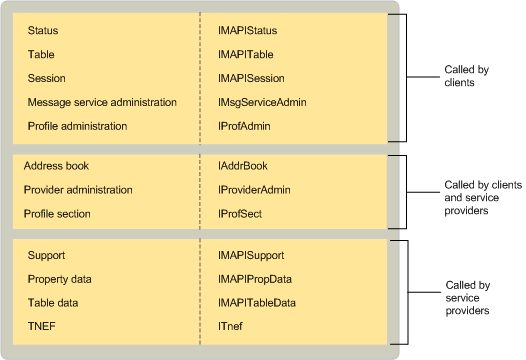

# Объекты, реализуемые MAPIMAPI-implemented objects
  
**Относится к**: Outlook**Applies to**: Outlook 
  
Несколько объектов для использования клиентскими приложениями и поставщиками услуг, реализуемые программным интерфейсом MAPI.MAPI implements several objects for use by client applications and service providers. Объект сеанса позволяет клиентам использовать сеанса служб для доступа к таблицам, а также для связи с поставщиками услуг.The session object allows clients to use session services, to access tables, and to communicate with service providers. Объект адресной книги предоставляет клиентам для интегрированной доступ ко всем поставщиками различных адресной книги.The address book object provides clients with integrated access to all of the different address book providers. 
  
MAPI предоставляет несколько объектов в таблице и состояние для клиентов использовать для просмотра и мониторинг сеанса и службы сведения о поставщике.MAPI supplies multiple table and status objects for clients to use for viewing and monitoring session and service provider information. Например MAPI предоставляет таблица профиля с сведения о всех профилей, установленных на компьютере и таблица службы сообщений с сведения обо всех служб сообщение в текущий профиль.For example, MAPI provides a profile table with information about all of the profiles that are installed on the computer and a message service table with information about all of the message services in the current profile. MAPI предоставляет три различных состояния объектов: одно, который представляет общий подсистемы, одно для очереди MAPI и для интегрированной адресной книги.MAPI provides three different status objects: one that represents the overall subsystem, one for the MAPI spooler, and one for the integrated address book. 
  
Четыре разных объектов для управления конфигурацией службы сообщений, поставщиков услуг и профилей, реализуемые программным интерфейсом MAPI.MAPI implements four different objects for managing the configuration of message services, service providers, and profiles. Клиенты и поставщики услуг используйте администрирования поставщика и объекты раздела профиля; Эти объекты включить их для настройки поставщиков услуг и доступа к свойствам профилей.Both clients and service providers use provider administration and profile section objects; these objects enable them to configure service providers and access profile properties. Клиенты используют только службы сообщений и объекты администрирования профиля, объекты, которые поддерживают администрирования службы сообщений и профилей.Clients use only message service and profile administration objects, the objects that support the administration of message services and profiles. 
  
MAPI предоставляет два объекта для поставщиков услуг: поддержка объектов и TNEF.MAPI provides two objects for service providers: a support object and a TNEF object. Все поставщики услуг использовать один или несколько объектов поддержки; Существует четыре реализации поддержки различных объектов.All service providers use one or more support objects; there are four different support object implementations. MAPI предоставляет реализацию для поддержки конфигурации, а также определенных реализаций для поддержки адресной книги, хранилища сообщений и поставщиками транспорта.MAPI supplies an implementation to support configuration as well as specific implementations to support address book, message store, and transport providers. Объект TNEF используется поставщиками транспорта, которые поддерживают транспорта Neutral Encapsulation формата TNEF.The TNEF object is used by transport providers that support the Transport Neutral Encapsulation Format (TNEF).
  
Два объекта служебной программы, в таблице данных и данных свойства, обычно используется поставщиками услуг.Two utility objects, table data and property data, are typically used by service providers. Объекты данных в таблице помощи в реализации объектов в таблице; Справка объекты данных свойства для доступа к свойству set и представления и помощь в реализации [IMAPIProp: IUnknown](imapipropiunknown.md), интерфейс базового свойства.Table data objects help in the implementation of table objects; property data objects help to set and view property access and help in the implementation of [IMAPIProp : IUnknown](imapipropiunknown.md), the base property interface. 
  
В следующей таблице обобщаются назначения для каждого объекта, который реализует MAPI.The following table summarizes the purpose for each object that MAPI implements.
  
|**Объект MAPI****MAPI object**|**Описание****Description**|
|:-----|:-----|
|Адресная книгаAddress book    |Предоставляет доступ к интегрированное представление сведений для получателя, которому принадлежит со всеми поставщиками адресной книги в текущей конфигурации.Provides access to the integrated view of recipient information that belongs to all of the address book providers in the active profile.    |
|Администрирование службы сообщенийMessage service administration    |Предоставляет доступ к сведения о службе сообщений для конфигурации.Provides access to message service information for configuration.    |
|Администрирование профилейProfile administration    |Предоставляет доступ к информации профилей для конфигурации.Provides access to profile information for configuration.    |
|Раздел профиляProfile section    |Часть профиля, используемого для описания службы конкретное сообщение или поставщика услуг.A part of a profile used to describe a particular message service or service provider.    |
|Свойство данныхProperty data    |Поддерживает доступ к свойствам и приводятся рекомендации по реализации **IMAPIProp**.Maintains access to properties and helps implement **IMAPIProp**.    |
|Администрирование поставщикаProvider administration    |Предоставляет доступ к сведения о поставщике услуг для конфигурации.Provides access to service provider information for configuration.    |
|СеансSession    |Представляет подключение к базовым систем обмена сообщениями и предоставляет клиентам доступ к ресурсам MAPI.Represents a connection to underlying messaging systems and provides clients with access to MAPI resources.    |
|StatusStatus    |Предоставляет доступ к состоянию подсистемы MAPI, адресной книги или диспетчер очереди MAPI.Provides access to the state of the MAPI subsystem, the address book, or the MAPI spooler.    |
|ПоддержкаSupport    |Эта статья поможет поставщиков услуг обработки запросов клиентов.Helps service providers handle client requests.    |
|ТаблицаTable    |Предоставляет доступ к сводное представление данных объекта в формате строк и столбцов, аналогичную таблицы базы данных.Provides access to a summary view of object data in row and column format, similar to a database table.    |
|Таблицы данныхTable data    |Поддерживает доступ к данным таблицы и реализует объекты в таблице.Maintains access to underlying table data and implements table objects.    |
|ФОРМАТ TNEFTNEF    |Поддерживает использование из транспорта Neutral Encapsulation формата TNEF.Supports the use of the Transport Neutral Encapsulation Format (TNEF).    |
   
На следующем рисунке показана связь между объекты, внедряемые MAPI, интерфейсы, с которых они наследуют и компоненты, которые их использования.The following illustration shows the relationship between the objects that MAPI implements, the interfaces from which they inherit, and the components that use them. 
  
**Объекты, внедряемые MAPI****Objects that MAPI implements**
  
![Объекты, внедряемые MAPI] (media/amapi_68.gif "Объекты, внедряемые MAPI")
  
## См. такжеSee also

- [IMAPIProp : IUnknownIMAPIProp : IUnknown](imapipropiunknown.md)
- [Обзор интерфейса и объект MAPIMAPI Object and Interface Overview](mapi-object-and-interface-overview.md)

