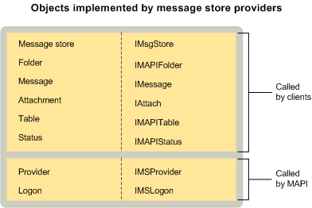

# Объекты поставщика хранилища сообщений MAPIMAPI message store provider objects
  
**Область применения**: Outlook 2013 | Outlook 2016**Applies to**: Outlook 2013 | Outlook 2016 
  
Поставщики хранилищ сообщений реализуют объекты поставщика и входа, как и все поставщики услуг.Message store providers implement provider and logon objects, as do all service providers. Кроме того, они реализуют объект хранилища сообщений, папки, сообщения, вложения и таблицы.They also implement a message store object, folders, messages, attachments, and tables. В качестве параметра некоторые поставщики хранилищ сообщений реализуют объекты состояния.As an option, some message store providers implement status objects.
  
На следующем рисунке показаны каждый объект хранилища сообщений с соответствующим им интерфейсом и компонентом MAPI, который его использует.The following illustration shows each message store object with its corresponding interface and the MAPI component that uses it.
  
![Объекты, реализуемые поставщиками хранилищ сообщений] (media/amapi_63.gif "Объекты, реализуемые поставщиками хранилищ сообщений")
  
## См. такжеSee also

- [Объекты поставщика службы MAPIMAPI Service Provider Objects](mapi-service-provider-objects.md)

