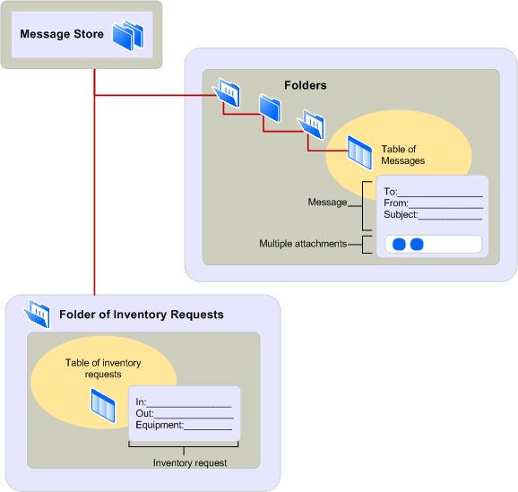

# Общие сведения о поставщике хранилища сообщений MAPIMAPI message store provider overview
  
**Применимо к**: Outlook 2013 | Outlook 2016**Applies to**: Outlook 2013 | Outlook 2016 
  
Поставщики хранилища сообщений обрабатывать хранения и извлечения сообщений и других сведений для пользователей из клиентских приложений.Message store providers handle the storage and retrieval of messages and other information for the users of client applications. Сведения о сообщении организован с помощью иерархической системы, известных как хранилища сообщений.The message information is organized by using a hierarchical system known as a message store. Хранилище сообщений реализована в несколько уровней контейнеры содержат сообщения различных типов папок.The message store is implemented in multiple levels, with containers called folders holding messages of different types. Нет ограничений на количество уровней в хранилище сообщений; может содержать множество вложенные папки.There is no limit to the number of levels in a message store; folders can contain many subfolders. 
  
На следующем рисунке показана архитектура хранилища иерархических сообщений.The following illustration shows the hierarchical message store architecture.
  
**Архитектура хранилища сообщений****Message store architecture**
  
![Архитектура хранилища сообщений] (media/amapi_03.gif "Архитектура хранилища сообщений")
  
На рисунке показаны две папки с вложенной папке.The figure shows two folders, one with a subfolder. Пользователей клиентского приложения можно получить доступ к сводное представление сообщений, содержащихся в каждой папке или просматривать их по отдельности с формой.Client application users can access a summary view of the messages contained in each folder or view them individually with a form. Отображает ли клиент стандартной формы, которая предоставляет MAPI или настраиваемую форму, которая предоставляет разработчик формы зависит от типа или класса сообщения.Whether the client displays a standard form that MAPI supplies or a custom form that a form developer supplies depends on the type, or class, of the message. Первая папка содержит примечаний и использует стандартные Примечание формы MAPI.The first folder contains note messages and uses the MAPI standard note form. Второй папка содержит сообщения запроса на инвентаризации и используется форма настраиваемой инвентаризации.The second folder contains inventory request messages and uses a custom inventory form. Сведения о обе формы представляет свойства сообщения.The information on both forms represents the properties of the message.
  
Можно использовать данные хранилища сообщений в различными способами.You can use message store data in a variety of ways. С помощью данных для традиционных электронной почты, можно использовать папки форум для общих обсуждений, как репозиторий документов с ссылку или контейнером для голосовой почты, календарь, контакты или задачи, например.In addition to using data for traditional electronic mail, you can use folders as a forum for public discussion, as a repository for reference documents, or as a container for voice mail, calendar, contacts, or tasks, for example. Хранилище одно сообщение может содержать различные типы данных.A single message store can hold many types of information. Несколько клиентов можно установить из одного хранилища сообщений.Multiple clients can install the same message store. Таким образом, общий доступ к данным легко и быстро.This makes the sharing of data easy and fast. 
  
Папки хранилища сообщений позволяет сортировать и фильтровать сообщения и для настройки отображения сообщения в пользовательском интерфейсе.Message store folders enable you to sort and filter messages and to customize the message display in a user interface. Ссылки на отфильтрованные сообщения хранятся в специальных папках, имя папки результатов поиска.Links to filtered messages are held in special folders called search-results folders. Клиентское приложение пользователем критерии фильтрации, которые MAPI называется ограничение и критерии применяется к сообщениям, хранящиеся в одной или нескольких папок.The user of a client application enters filtering criteria, which MAPI refers to as a restriction, and the criteria is applied to the messages stored in one or more folders. Например пользователь может потребоваться просматривать только сообщения, которые относятся к конкретной темы и датой поступления, более ранние, чем прошлую неделю.For example, a user might want to view only those messages that deal with a particular subject and have arrival dates that are more recent than last week. Справочные материалы, которые соответствуют критериям перечислены в папке поиска, и реальные сообщения остаются в своих папок, регулярные.References to the messages that match the criteria are listed in the search folder, and the real messages remain in their regular folders.
  
Сообщения, единиц измерения данных, которые переносятся из одного пользователя или приложения для другого пользователя или приложения.Messages are the units of data that are transferred from one user or application to another user or application. Каждое сообщение содержит некоторые текста сообщения, с помощью простых и сложных форматирование и сведения о конверт сообщения, используемый для передачи данных.Every message contains some message text, with simple or complex formatting, and message envelope information that is used for transmission. Некоторые сообщения включать одно или несколько вложений и дополнительные данные связанные с и транспортируются сообщение в виде файла, другое сообщение или объекта OLE.Some messages include one or more attachments, or additional data related to and transported with a message in the form of a file, another message, or an OLE object. 
  
В зависимости от сообщения хранилища поставщика, пользователь может сохранить новое сообщение, в настоящее время записывается в дополнение к сообщениям, которые отправку и получение.Depending on the message store provider, a user can save a new message currently being written in addition to messages that have been sent or received. Сообщения можно скопировать или переместить из одной папки в другую для каждой копии становится отдельное сообщение, который можно скопировать, удалить или изменить по отдельности.Messages can be copied or moved from one folder to another with each copy becoming a separate message that can be copied, deleted, or modified individually. Другого компонента, что некоторые сообщения хранения enable поставщиков является возможность изменять сообщение после его получения и сохраните ее обратно в его папки.Another feature that some message store providers enable is the ability to change a message after it has been received and to store it back in its folder. Пользователь может использовать эту функцию для вращающимся факсов сообщение, которое было доставлено сверху вниз.A user might take advantage of this feature for rotating a fax message that arrived upside down. Правильный режим можно сохранять в папке для последующего просмотра.The user can store the correct view in the folder for later viewing. 
  
## См. такжеSee also

- [Функции MAPI и архитектураMAPI Features and Architecture](mapi-features-and-architecture.md)

