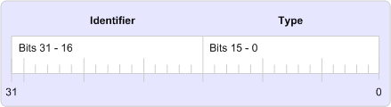

# Теги свойств MAPIMAPI property tags
  
**Относится к**: Outlook 2013 | Outlook 2016**Applies to**: Outlook 2013 | Outlook 2016 
  
Тег свойства — это 32-битное число, которое содержит уникальный идентификатор свойства в битах от 16 до 31, а тип свойства — в битах от 0 до 15, как показано на следующем рисунке.A property tag is a 32-bit number that contains a unique property identifier in bits 16 through 31 and a property type in bits 0 through 15 as shown in the following illustration. 
  
**Элементы тега свойства****Property tag elements**
  

  
Теги свойств используются для идентификации свойств MAPI, и каждое свойство должно иметь одно свойство независимо от того, определяется ли свойство с помощью MAPI, клиента или поставщика услуг.Property tags are used to identify MAPI properties and every property must have one, regardless of whether the property is defined by MAPI, a client, or a service provider. MAPI определяет набор констант тегов свойств для своих свойств в файле загона Mapitags.h; эти свойства называются "свойствами, определенными в MAPI".MAPI defines a set of property tag constants for its properties in the Mapitags.h header file; these properties are referred to as the "MAPI-defined properties". 
  
Константы тегов свойств следуют соглашению об именовке для единообразия и удобства использования.The property tag constants follow a naming convention for consistency and ease of use. Имя каждого тега свойства имеет две части: префикс PR_ и одна или несколько строк символов, описывающих содержимое свойства.There are two parts to the name of each property tag: a PR_ prefix and one or more character strings that describe the contents of the property. Несколько строк символов разделяются символами подчеркиваия.Multiple character strings are separated by underscores. Например, тегом свойства для типа адреса получателя сообщения является **PR \_ ADDRTYPE** ([PidTagOrgAddrtype),](https://msdn.microsoft.com/library/d40b5707-e4d5-4746-88d4-8616a3789789%28Office.15%29.aspx)а идентификатором записи для папки, предназначенной для получения копии каждого исходящие сообщения, является **PR_IPM_SENTMAIL_ENTRYID** ([PidTagIpmSentMailEntryId).](pidtagipmsentmailentryid-canonical-property.md)For example, the property tag for the address type of a message recipient is **PR\_ADDRTYPE** ([PidTagOrgAddrtype](https://msdn.microsoft.com/library/d40b5707-e4d5-4746-88d4-8616a3789789%28Office.15%29.aspx)) and the entry identifier for the folder designated to receive a copy of every outbound message is **PR_IPM_SENTMAIL_ENTRYID** ([PidTagIpmSentMailEntryId](pidtagipmsentmailentryid-canonical-property.md)).
  
Для работы с тегами свойств доступно несколько макроса, в том числе [PROP_TYPE,](prop_type.md) [PROP_ID](prop_id.md)и [PROP_TAG.](prop_tag.md)A few macros are available to help work with property tags, among them [PROP_TYPE](prop_type.md), [PROP_ID](prop_id.md), and [PROP_TAG](prop_tag.md). **PROP \_ TYPE** извлекает тип свойства из тега свойства; **PROP \_ Идентификатор извлекает** идентификатор.**PROP\_TYPE** extracts the property type from the property tag; **PROP\_ID** extracts the identifier. **PROP_TAG** создает тег свойства из типа и идентификатора свойства.**PROP_TAG** builds a property tag from a property type and identifier. 
  
## См. такжеSee also

- [Обзор свойств MAPIMAPI Property Overview](mapi-property-overview.md)

