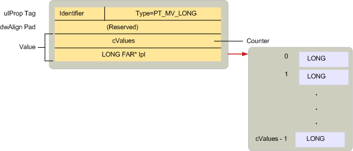

# Общие сведения о типе свойства MAPI
  
**Относится к**: Outlook 2013 | Outlook 2016 
  
Типы свойств — это константы, определенные MAPI в MAPIDEFS. Файл h-загона, который указывает на тип данных, который является значением свойства. Все свойства, которые определяются с помощью MAPI, клиентских приложений или поставщиков услуг, используют один из этих типов. 
  
Типы свойств следуют соглашению об именовке, аналогичному соглашению, используемой для тегов свойств. Многие типы свойств имеют версию с одним и нескольким значением. Свойства с одним значением содержат одно значение своего типа, например одно значение или строку символов. Константа, используемая для представления одного свойства значения, имеет две части: префикс PT_ и строка, описывающие фактический тип, например LONG или STRING8. 
  
Свойства с несколькими значениями содержат несколько значений своего типа. В отличие от массивов вариантов OLE каждое значение в многоценном свойстве имеет один и тот же тип. Константа, используемая для представления многоценных свойств, создается путем объединения флага MV_FLAG с соответствующей константой одного значения, представляющей базовый тип. Существует три части: префикс PT_ за которым следует MV_ строка, описывающие тип. Например, тип свойства, содержащего несколько PT_MV_LONG, а для нескольких строк символов PT_MV_STRING8.
  
На следующем рисунке показана структура [структуры SPropValue](spropvalue.md) для описания нескольких значений в виде PT_MV_LONG. Расширение **члена** value включает число значений в свойстве и указатель на массив этих значений. 
  
**Свойства с несколькими значениями**
  

  
Хотя поддержка свойств с несколькими значениями является необязательной, MAPI рекомендует, чтобы клиенты и поставщики услуг могли поддерживать оба типа свойств, так как это обеспечивает большее взаимодействие между компонентами, совместимыми с MAPI.
  
На следующем рисунке перечислены все константы различных типов свойств, показывая, где они хранятся в **структуре SPropValue.** Размер члена **value** зависит от конкретного типа. Обратите внимание, что не все типы с одним значением имеют эквиваленты с несколькими значениями. 
  
**Константы типа свойств**
  

  
Клиенты и поставщики услуг, работающие со свойством, должны выполнять два действия:
  
1. Определите, доступно ли свойство.
    
2. Если доступно, извлекаете значение свойства.
    
Иногда клиенту или поставщику услуг требуется только проверить наличие свойства; в других случаях необходимо проверить определенное значение. Например, у поставщиков транспорта есть три разных курса действий по обработке свойства **PR \_ SEND_RICH_INFO** ([PidTagSendRichInfo),](pidtagsendrichinfo-canonical-property.md)что является boolean значением, которое указывает, следует ли передавать сообщение с форматированный текст. Если **для \_ SEND_RICH_INFO** pr установлено true, поставщик транспорта передает форматированный текст. Если за установлено false, форматированный текст удаляется перед передачей. Если **PR_SEND_RICH_INFO** недоступен, поставщик транспорта будет выполнять действия по умолчанию независимо от конкретного поставщика. 
  
MAPI определяет особый тип PT_UNSPECIFIED, который клиент или поставщик услуг может использовать для получения свойства, если тип свойства неизвестен. Чтобы получить свойство без предварительного знания о его типе, клиент или поставщик услуг вызывает метод [IMAPIProp::GetProps](imapiprop-getprops.md) объекта и передает тег свойства, который состоит из идентификатора свойства и PT_UNSPECIFIED типа свойства. **GetProps** возвращает структуру [SPropValue](spropvalue.md) для свойства, заменяя PT_UNSPECIFIED соответствующим типом. Поставщики услуг, **реализующие GetProps,** необходимы для поддержки PT_UNSPECIFIED. 
  
Некоторые объекты MAPI поддерживают свойства, которые сами являются объектами. Свойства объекта имеют тип PT_OBJECT. Вместо использования **IMAPIProp::GetProps** для доступа к этим свойствам клиенты и поставщики услуг обычно используют либо метод [IMAPIProp::OpenProperty,](imapiprop-openproperty.md) указав соответствующий интерфейс для доступа, либо метод для объекта, поддерживающих свойство. 
  
Поскольку при доступе к значению свойства объекта используется один из интерфейсов для объекта, **GetProps** не подходит. При **помощи GetProps** вызываемая объекты получают доступ к значению свойства через **структуру SPropValue.** С **помощью IMAPIProp::OpenProperty** вызываемая точка извлекает указатель на интерфейс, который может получить доступ к объекту. **OpenProperty** всегда можно использовать для получения свойства объекта. Другой вариант, вызов метода для объекта, доступен не для каждого свойства объекта. 
  
Например, каждая папка поддерживает две таблицы: таблицу иерархии и таблицу содержимого. Эти таблицы являются свойствами папки; их теги свойств **PR_CONTAINER_HIERARCHY** ([PidTagContainerHierarchy)](pidtagcontainerhierarchy-canonical-property.md)и **PR_CONTAINER_CONTENTS** ([PidTagContainerContents).](pidtagcontainercontents-canonical-property.md) Таблицы — это объекты, для доступа к которые **требуется интерфейс IMAPITable.** Клиент может вызвать метод [IMAPIContainer::GetHierarchyTable](imapicontainer-gethierarchytable.md) папки для доступа к таблице иерархии, метод [IMAPIContainer::GetContentsTable](imapicontainer-getcontentstable.md) папки для доступа к таблице содержимого или метод [IMAPIProp::OpenProperty](imapiprop-openproperty.md) папки для доступа к любой из таблиц. Чтобы вызвать **OpenProperty,** клиент передает тег свойства в качестве первого параметра и идентификатор интерфейса, который будет использоваться для доступа в качестве второго параметра. Эти параметры **будут** PR_CONTAINER_HIERARCHY или **PR_CONTAINER_CONTENTS** и **IID_IMAPITable.**
  
Полный список типов свойств с одним значением и несколькими значениями см. в [списке "Типы свойств".](property-types.md) 
  
## См. также

- [Обзор свойств MAPI](mapi-property-overview.md)

