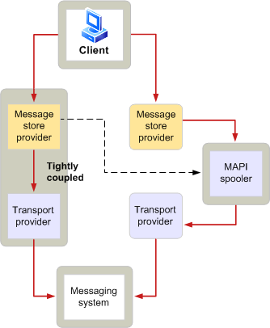

# Общие сведения о системе буферизации MAPIMAPI spooler overview
  
**Область применения**: Outlook 2013 | Outlook 2016**Applies to**: Outlook 2013 | Outlook 2016 
  
Spooler MAPI — это функция процесса Microsoft Office Outlook, который отвечает за отправку сообщений и получение сообщений из системы обмена сообщениями.MAPI spooler is a function of the Microsoft Office Outlook process that is responsible for sending messages to and receiving messages from a messaging system. Шпалер MAPI играет жизненно важную роль в получении и доставке сообщений.MAPI spooler plays a vital role in message receipt and delivery. Когда система обмена сообщениями недоступна, пульпер MAPI сохраняет сообщения и автоматически передает их в более позднее время.When a messaging system is unavailable, MAPI spooler stores the messages and automatically forwards them at a later time. Эта возможность хранения или отправки данных при необходимости называется хранилищем и перенаправками, что является важной функцией в средах, где удаленные подключения являются общими, а сетевой трафик — высоким.This ability to hold on to or send data when necessary is known as store and forward, a critical feature in environments where remote connections are common and network traffic is high. Шпалер MAPI выполняется в качестве фонового потока в Outlook.MAPI spooler runs as a background thread within Outlook.
  
У шпалеров MAPI есть дополнительные обязанности, связанные с распространением сообщений.MAPI spooler has additional responsibilities related to message distribution. Эти дополнительные обязанности включают следующие:These extra duties include the following:
  
- Отслеживание типов получателей, которые обрабатываются конкретными поставщиками транспорта.Keeping track of the recipient types that are handled by specific transport providers.
    
- Информирование клиентского приложения при доставке нового сообщения.Informing a client application when a new message has been delivered.
    
- Обращение к предварительной и постпроцессинговой подготовке сообщений.Invoking message preprocessing and postprocessing.
    
- Создание отчетов, которые указывают на то, что произошла доставка сообщений.Generating reports that indicate that message delivery has occurred.
    
- Сохранение состояния обрабатываемых получателей.Maintaining status on processed recipients.
    
На следующем рисунке на высоком уровне показано, как сообщение перетекает из клиента в систему обмена сообщениями.The following illustration shows at a high level how a message flows from a client to the messaging system.
  
**Поток обработки исходящих сообщений****Outgoing message flow**
  

  
Пользователь клиентского приложения отправляет сообщение одному или более получателям.The user of a client application sends a message to one or more recipients. Поставщик магазина сообщений инициирует процесс отправки, форматирование сообщения с помощью дополнительных сведений, необходимых для передачи.The message store provider initiates the sending process, formatting the message with additional information needed for transmission.
  
Spooler MAPI получает сообщение для обработки, если возникает любое из следующих условий:MAPI spooler receives the message to process if any of the following conditions occur:
  
- Поставщик хранения сообщений не тесно совмещение с поставщиком транспорта.The message store provider is not tightly coupled with a transport provider.
    
- Сообщение требует предварительной подготовки.The message requires preprocessing.
    
- Хранилище сообщений и поставщик транспорта тесно совмещение, но они не могут обрабатывать всех получателей, к которым адресовано сообщение.The message store and transport provider are tightly coupled, but they cannot handle all the recipients to whom the message is addressed.
    
Если шпалер MAPI получает сообщение, он выполняет все необходимые препроцессы и передает сообщение соответствующему поставщику транспорта.If MAPI spooler receives the message, it performs any required preprocessing and delivers the message to the appropriate transport provider. Поставщик транспорта передает сообщение своей системе обмена сообщениями, которая отправляет его своему получателю.The transport provider gives the message to its messaging system, which sends it to its intended recipient.
  
При входящих сообщениях поток будет обратным.With incoming messages, the flow is reversed. Поставщик транспорта получает сообщение из своей системы обмена сообщениями и сообщает о spooler MAPI.The transport provider receives a message from its messaging system and notifies MAPI spooler. Spooler выполняет все необходимые постпроцессы и сообщает поставщику магазина сообщений о том, что пришло новое сообщение.Spooler performs any necessary postprocessing and informs the message store provider that a new message has arrived. Это уведомление заставляет клиента обновить отображение сообщений, что позволяет пользователю читать новое сообщение.This notification causes the client to refresh its message display, enabling the user to read the new message.
  
## См. такжеSee also

- [Функции и архитектура MAPIMAPI Features and Architecture](mapi-features-and-architecture.md)

