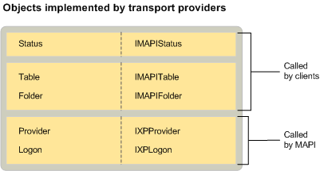

# Объекты поставщика транспорта MAPI
  
**Относится к**: Outlook 2013 | Outlook 2016 
  
Помимо стандартных объектов provider и logon, реализованных всеми поставщиками услуг, для реализации объекта Status необходимы поставщики транспорта. Для других типов поставщиков услуг реализация объекта Status является необязательной. Однако для поставщиков транспорта требуется MAPI. Поставщики транспорта, поддерживающие загрузку заголовков сообщений с удаленного сервера, также реализуют папку и таблицу. 
  
На следующем рисунке показаны все объекты, которые поставщики транспорта могут реализовать с помощью соответствующих интерфейсов. На рисунке также показано, является ли MAPI или клиент пользователем объекта.
  

  
## См. также

- [Объекты поставщика службы MAPI](mapi-service-provider-objects.md)

