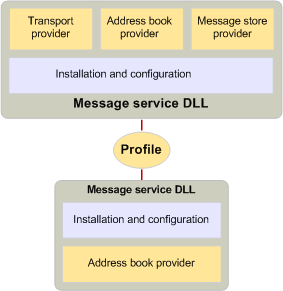

# Службы сообщений и профилямMessage services and profiles
  
**Относится к**: Outlook**Applies to**: Outlook 
  
Некоторые пользователи требуются службы несколько систем обмена сообщениями, каждый из которых одного или нескольких поставщиков услуг.Some users require the services of several messaging systems, each with one or more service providers. Так как это сложный для установки и настройки каждого из этих поставщиков услуг по отдельности, а так как сервер обмена сообщениями обычно требуется группа связанных поставщиков для предоставления его функциональные возможности, MAPI включает в себя понятие службы сообщений.Because it is cumbersome to install and configure each of these service providers individually, and because a messaging server usually requires a group of related providers to expose all its functionality, MAPI includes the concept of a message service. Службы сообщений помогают пользователям установить и настроить их поставщиков услуг.Message services help users install and configure their service providers.
  
Чтобы создать службы сообщений, разработчик пишет к программе службы сообщений запись точки управления конфигурацией каждый поставщик в службе и программы установки для выполнения следующих:To create a message service, a developer writes a message-service entry point program to handle the configuration of each provider in the service and a setup program to do the following:
  
- Установка каждого поставщика в службе.Install each provider in the service.
    
- Создание реестра и инициализации записей файла.Create registry and initialization file entries.
    
- Создание записей в файле конфигурации MAPI Mapisvc.inf.Create entries in the MAPI configuration file, Mapisvc.inf.
    
Файла Mapisvc.inf содержит сведения, связанные с конфигурацией все службы сообщений и поставщиков услуг, установленный на компьютере.The Mapisvc.inf file contains information that relates to the configuration of all message services and service providers installed on the computer. Организован в иерархической разделы с каждым уровнем, связанной со следующей.It is organized in hierarchical sections, with each level linked to the next. В верхней состоит из трех разделов, которые содержат следующие:At the top are three sections that contain the following: 
  
- Список файлов справки службы сообщений.A list of message service Help files.
    
- Список наиболее важные или по умолчанию, службы сообщений.A list of the most important, or default, message services.
    
- Список всех служб на компьютере.A list of all the services on the computer.
    
Следующий уровень содержит разделы для каждой службы сообщений и последний уровень содержит разделы для каждого поставщика служб в службе.The next level contains sections for each message service, and the last level contains sections for each service provider in a service. Требует MAPI, что разработчики поставщиков услуг и службы сообщений добавлять определенные элементы в Mapisvc.inf; Разработчики могут добавлять другие элементы на свой собственный риск.MAPI requires that developers of service providers and message services add certain entries to Mapisvc.inf; developers can add other entries at their own discretion. Большинство данных в заканчивается Mapisvc.inf вверх на одно или несколько профилей, коллекции параметров конфигурации для пользователя предпочтительный набор служб сообщения.Most of the information in Mapisvc.inf ends up in one or more profiles, a collection of configuration information for a user's preferred set of message services. Поскольку компьютер может иметь несколько пользователей и одного пользователя может иметь несколько наборов параметров, числа профилей могут существовать на компьютере.Because a computer can have multiple users and a single user can have multiple sets of preferences, many profiles can exist on a computer. Каждый профиль описывает на другой набор службы сообщений.Each profile describes a different set of message services. Наличие нескольких профилей позволяет пользователю работать, например, дома с помощью одного набора служб сообщения и в офисе с другим набором.Having multiple profiles enables a user to work, for example, at home with one set of message services and at the office with a different set.
  
Профили создаются во время входа в систему или установки службы сообщений клиентским приложением, которое предоставляет поддержку конфигурации.Profiles are created at message service installation or logon time by a client application that provides configuration support. MAPI предоставляет два клиентских приложений: мастер профилей и элемент панели управления.MAPI provides two such client applications: a Control Panel item and the Profile Wizard. Элемент панели управления — это проверка всех составляющих конфигурации приложение, с помощью которой пользователи могут создание, удаление, изменить и скопируйте профили, а также вносить изменения в записи в профиле.The Control Panel item is a full-service configuration application with which users can create, delete, edit, and copy profiles, as well as make modifications to the entries in a profile. Мастер профиля — это простое приложение предназначено для Добавление службы сообщений в профиль упростить.The Profile Wizard is a simple application designed to make adding a message service to a profile as easy as possible. Мастер профиля состоит из нескольких диалоговых окон, называется страницы свойств, которые запрашивать у пользователя через процесс установки и настройки службы.The Profile Wizard consists of a series of dialog boxes, called property pages, that prompt the user through the process of installing and configuring a service. Пользователь должен будет ввести только значения для наиболее важные параметры; все другие параметры наследуют значения по умолчанию.The user is prompted only for values for the most critical settings; all other settings inherit default values. После создания профилей пользователей не разрешены для внесения изменений.Once the profile has been created, users are not allowed to make changes. 
  
В то время как элемент управления панели всегда вызывается с помощью панели управления, существует множество сценариев, которые могут вызвать мастер профиля для вызова.Whereas the Control Panel item is always invoked through the Control Panel, there are a variety of scenarios that can cause the Profile Wizard to be called. Клиентские приложения можно вызвать мастер профилей, чтобы создать профиль по умолчанию во время входа в систему, когда один еще не был создан.Client applications can call the Profile Wizard to create a default profile at logon time when one has not yet been created. Вместо воссоздание код, чтобы добавить профиль, элемент панели управления или другого клиентского приложения можно использовать функциональность уже в мастере профилей.Rather than reimplementing code to add a profile, the Control Panel item or another client application can rely on the functionality already in the Profile Wizard. Служба сообщений, в его функции точки входа при можно вызывать мастер профиля службы необходимо добавить в профиль по умолчанию.A message service, in its entry point function, can call the Profile Wizard when the service needs to be added to the default profile. Службы сообщений, с помощью мастера профилей необходимо создать дополнительные функцию и стандартная процедура Windows диалогового окна.Message services that use the Profile Wizard must write an extra entry point function and a standard Windows dialog box procedure. Мастер профиля вызывает функцию точки входа для получения диалоговое окно настройки службы, пока процедура диалогового окна обрабатывает сообщения, которые создаются при использовании этого диалоговое окно.The Profile Wizard calls the entry point function to retrieve the service's configuration dialog box while the dialog box procedure handles the messages that are generated when this dialog box is in use. 
  
Профили организованы аналогично для файла Mapisvc.inf.Profiles are organized in a similar way to the Mapisvc.inf file. Профили связаны иерархических разделов; службы поставщиков собственные разделов в нижнем уровне службы сообщений владельцем разделах на среднем уровне и MAPI несет ответственность за разделах на верхнем уровне.Profiles have linked hierarchical sections; service providers own sections in the lowest level, message services own sections in the middle level, and MAPI owns sections in the highest level. В каждом разделе определяется с помощью уникального идентификатора, называемого [MAPIUID](mapiuid.md).Each section is identified with a unique identifier known as a [MAPIUID](mapiuid.md). В разделах MAPI внутренние MAPI, такие как идентификаторы всех разделах профиля службы сообщений и ссылки на других разделах.The MAPI sections contain information internal to MAPI, such as the identifiers of all of the message service profile sections and links to each of the other sections. Каждый раздел службы сообщений сохранение ссылки на разделы его поставщика и каждый раздел поставщика сохраняет ссылку на раздел его службы.Each message service section stores links to its provider sections, and each provider section stores a link to its service section. 
  
На следующем рисунке показана содержимое двух типичного профилей.The following illustration shows the contents of two typical profiles. Сэм имеет двух профилей на свой компьютер, одно для домашнего использования, а другое для использования office.Sam has two profiles on his computer, one for home use and one for office use. Домашняя страница профиля содержит три службы сообщений.The home profile contains three message services. Сообщение службы X — это служба единого поставщика для управления адресной книгой.Message Service X is a single provider service for address book management. Сообщение служб Y и Z иметь три поставщика — поставщика адресных книг, поставщика хранилища сообщений и поставщика транспорта.Message Services Y and Z have three providers — an address book provider, a message store provider, and a transport provider. Профиль рабочего элемента SAM содержит две службы другое сообщение, каждый из которых содержит поставщика адресных книг, поставщика хранилища сообщений и поставщика транспорта.Sam's Work Profile contains two different message services, each of which has an address book provider, a message store provider, and a transport provider. 
  
**Пример профиля****Profile example**
  
![Пример профиля] (media/amapi_56.gif "Пример профиля")
  
На следующем рисунке показана профиля, которая включает в себя две службы сообщений.The following illustration shows a profile that includes two message services. Код для установки и настройки поставщиков услуг, относящихся к службе сообщение находится в этой Библиотеке код для поставщиков.The code for installing and configuring the service providers that belong to the message service resides in the same DLL as the code for the providers. Этот код считывает сведения из профиля во время входа в систему для настройки поставщиков услуг и его запрос пользователя, если это возможно и необходимости отсутствующие сведения.This code reads information from the profile at logon time to configure the service providers, and it prompts the user, if possible and necessary, for missing information. Запросы от клиента, чтобы просмотреть или изменить параметры конфигурации для каких-либо из поставщиков также обрабатывается этот общий код.Requests from a client to view or change configuration settings for any of the providers are also handled by this common code.
  
**Установка и настройка поставщиков услуг****Installing and configuring service providers**
  
![Установка и настройка поставщиков услуг] (media/amapi_55.gif "Установка и настройка поставщиков услуг")
  
## См. такжеSee also

- [MAPIUIDMAPIUID](mapiuid.md)
- [����� �������� � ���������������� MAPIMAPI Programming Overview](mapi-programming-overview.md)

