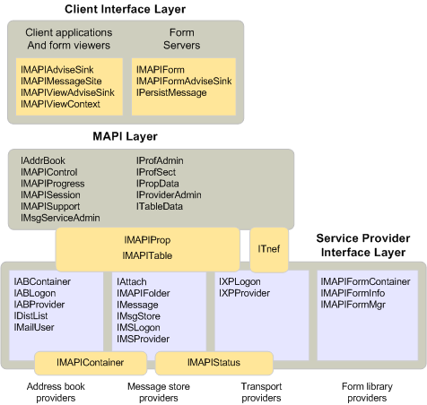

# Объекты и архитектура MAPIObjects and the MAPI architecture

**Относится к**: Outlook 2013 | Outlook 2016**Applies to**: Outlook 2013 | Outlook 2016 
  
Все объекты, которые определяются MAPI могут быть разделены на один или несколько уровней в архитектуре MAPI.All of the objects that MAPI defines fall into one or more layers in the MAPI architecture. На уровне клиента интерфейс содержит все объекты, которые можно реализовать клиентского приложения, средство просмотра формы или формы сервера.The client interface layer contains all the objects that a client application, form viewer, or form server can implement. Уровень интерфейса поставщика службы содержит объекты, которые можно реализовать поставщика услуг любого типа.The service provider interface layer contains the objects that a service provider of any type can implement. Этот уровень включает в себя объектов, реализованных адресных книг, хранилищ сообщений, поставщиками транспорта и библиотеки форм.This layer includes objects implemented by address books, message stores, transport providers, and form libraries. Уровень, представляющий подсистемы MAPI находится между уровнями интерфейса поставщика клиента и службы.The layer that represents the MAPI subsystem is positioned between the client and service provider interface layers. Уровень MAPI содержит все объекты, внедряемые MAPI для клиентов или поставщиков услуг для использования.The MAPI layer contains all of the objects that MAPI implements for clients or service providers to use. 
  
На следующем рисунке показано, где каждый объект MAPI умещается в архитектуре MAPI.The following illustration shows where each of the MAPI objects fits into the MAPI architecture. Объекты, представленные с именами их производные интерфейсы.The objects are represented with the names of their derived interfaces. Например, объект приемника уведомлений отображается как [IMAPIAdviseSink: IUnknown](imapiadvisesinkiunknown.md), интерфейс, который является производным от [IUnknown](https://msdn.microsoft.com/library/33f1d79a-33fc-4ce5-a372-e08bda378332%28Office.15%29.aspx) , который реализует каждый объект приемник уведомлений.For example, an advise sink object is shown as [IMAPIAdviseSink : IUnknown](imapiadvisesinkiunknown.md), the interface that derives from [IUnknown](https://msdn.microsoft.com/library/33f1d79a-33fc-4ce5-a372-e08bda378332%28Office.15%29.aspx) and that every advise sink object implements. Интерфейсы, мост слои используется или реализован в нескольких компонентах.The interfaces that bridge layers are either used or implemented by multiple components. Несмотря на то, что отображается на уровне MAPI для разделения уровней клиента и поставщиком, подразумевает, что все соединения должен проходить через MAPI, это не так.Although the MAPI layer appears to separate the client and provider layers, implying that all communication must flow through MAPI, this is not the case. Клиенты могут и связаны непосредственно с объектов поставщика службы.Clients can and do communicate directly to service provider objects. 
  
**Уровни объектов в MAPI****Object layers in MAPI**
  
![Слои объекта в MAPI] (media/amapi_38.gif "Слои объекта в MAPI")
  
## См. такжеSee also

- [IMAPIAdviseSink : IUnknownIMAPIAdviseSink : IUnknown](imapiadvisesinkiunknown.md)
- [Обзор интерфейса и объект MAPIMAPI Object and Interface Overview](mapi-object-and-interface-overview.md)

