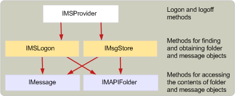

# Структура поставщиков хранилища сообщенийStructure of message store providers
  
**Относится к**: Outlook**Applies to**: Outlook 
  
Поставщик хранилища сообщений, при работе в памяти, — [IMSProvider: IUnknown](imsprovideriunknown.md) интерфейса.A message store provider, when it is running in memory, is an [IMSProvider : IUnknown](imsprovideriunknown.md) interface. Интерфейс **IMSProvider** позволяет клиентских приложений и диспетчер очереди MAPI для входа и из хранилища сообщений.The **IMSProvider** interface allows client applications and the MAPI spooler to log on to and off of the message store. Интерфейсы, которые клиентских приложений и диспетчер очереди MAPI для доступа к папкам и сообщения в хранилище сообщений, [IMSLogon](imslogoniunknown.md) и [IMsgStore](imsgstoreimapiprop.md) интерфейсов.The interfaces that client applications and the MAPI spooler use to access folders and messages in the message store are [IMSLogon](imslogoniunknown.md) and [IMsgStore](imsgstoreimapiprop.md) interfaces. Эти интерфейсы обычно создаются при хранилища сообщений сначала вход в систему, несмотря на то, что точка входа [MSProviderInit](msproviderinit.md) сообщения хранения DLL-Библиотека может также создать их.These interfaces are typically created when the message store is first logged on to, although the [MSProviderInit](msproviderinit.md) entry point of the message store DLL could also create them. 
  
Так как **IMSLogon** и **IMsgStore** интерфейсов совместно использовать несколько методов, может быть проще создавать один объект класса, наследуемого от этих интерфейсов.Because the **IMSLogon** and **IMsgStore** interfaces share some methods, it may be easier to create one class object that inherits from both of these interfaces. Также можно реализовать эти интерфейсы в отдельные объекты и запись вспомогательные функции для внутренних библиотеки DLL, которые реализуют общих методов, которые можно вызвать из методов в интерфейсах **IMSLogon** и **IMsgStore** .You can also implement these interfaces in separate objects, and write helper functions internal to your DLL that implement the shared methods that can then be called from the methods in the **IMSLogon** and **IMsgStore** interfaces. 
  
На следующем рисунке показана высокоуровневая структура иерархии объектов в запущенном хранилища сообщений.The following illustration shows a high-level outline of the object hierarchy within a running message store.
  
**Иерархия объектов хранилища сообщений****Message store object hierarchy**
  
![Иерархия объектов хранилища сообщений] (media/storeobj.gif "Иерархия объектов хранилища сообщений")
  
## См. такжеSee also

- [���������� ���������� ��������� ��������� MAPIDeveloping a MAPI Message Store Provider](developing-a-mapi-message-store-provider.md)

