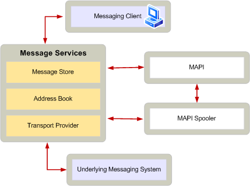

# Роль поставщика транспорта в подсистеме MAPITransport provider role in the MAPI subsystem
  
**Область применения**: Outlook 2013 | Outlook 2016**Applies to**: Outlook 2013 | Outlook 2016 
  
Библиотеки динамической компоновки поставщика транспорта (DLL) предоставляют интерфейс между диспетчером очереди MAPI и частью системы обмена сообщениями, ответственной за отправку и получение сообщений.Transport provider dynamic-link libraries (DLLs) provide the interface between the MAPI spooler and the part of a messaging system responsible for message sending and receiving. Диспетчер очереди MAPI и поставщик транспорта работают вместе для обработки обязанностей отправки сообщения или получения сообщения.The MAPI spooler and the transport provider work together to handle the responsibilities of sending a message or receiving a message. Диспетчер очереди MAPI загружает БИБЛИОТЕКУ поставщика транспорта при первом использовании и освобождает ее, когда он больше не нужен.The MAPI spooler loads the transport provider DLL when it is first used and releases it when it is no longer needed. Несколько поставщиков транспорта можно установить в одной системе, но MAPI предоставляет один и тот же диспетчер очереди.Multiple transport providers can be installed on the same system, but MAPI supplies the one spooler required.
  
Клиентские приложения обычно не связываются напрямую с поставщиком транспорта.Client applications do not typically communicate directly with the transport provider. Вместо этого клиенты отправляют сообщения через поставщика магазина, а диспетчер очереди MAPI отправляет исходящие сообщения соответствующему поставщику транспорта и доставляет входящие сообщения в соответствующее хранилище сообщений.Rather, clients submit messages through a store provider and the MAPI spooler sends outgoing messages to the appropriate transport provider and delivers incoming messages to the appropriate message store. Диспетчер очереди MAPI выполняет свою работу и выполняет звонки поставщикам транспорта, когда фоновые приложения простаивают.The MAPI spooler does its work and makes its calls to transport providers when foreground applications are idle. После необязательного отображения диалоговых окон при первом входе в систему поставщика транспорта, поставщики транспорта работают в фоновом режиме, если клиент не вызывает сброс очередей отправки и получения.After optionally displaying dialog boxes when the transport provider is first logged on, transport providers operate in the background unless called by the client to flush send and receive queues. 
  
Поставщики транспорта имеют следующие обязанности в системе обмена сообщениями MAPI:Transport providers have the following responsibilities in a MAPI messaging system:
  
- ЗаРегистрируйте типы адресов, которые они могут принимать с помощью диспетчера очереди MAPI, чтобы диспетчер очереди MAPI мог передавать сообщения соответствующему поставщику транспорта в зависимости от адреса назначения сообщений.Register the address types they can accept with the MAPI spooler so the MAPI spooler can submit messages to the appropriate transport provider depending on the destination address of the messages. Один поставщик транспорта может зарегистрировать несколько типов адресов.One transport provider can register more than one address type. Поставщики транспорта также могут регистрировать адреса определенных получателей с помощью диспетчера очереди MAPI.Transport providers can also register specific recipients' addresses with the MAPI spooler. Сообщения, адресованные одному из этих адресов, отправляются в поставщик транспорта, который зарегистрирует адрес с помощью диспетчера очереди MAPI.Messages addressed to one of these addresses will be submitted to the transport provider that registered the address with the MAPI spooler. Для получения дополнительных сведений см .For more information, see [Transport Provider and MAPI Spooler Operational Model](transport-provider-and-mapi-spooler-operational-model.md).
    
- Доставка входящих сообщений в Диспетчер очереди MAPI.Deliver incoming messages to the MAPI spooler. В зависимости от природы системы обмена сообщениями поставщик транспорта может напрямую уведомить Диспетчер очереди MAPI о поступлении нового сообщения или запросить, чтобы диспетчер очереди MAPI мог периодически опрашивать поставщик транспорта для проверки наличия новых сообщений.Depending on the nature of the messaging system, a transport provider can either directly notify the MAPI spooler when a new message arrives, or it can request that the MAPI spooler poll the transport provider periodically to check for new messages.
    
- Преобразование свойств сообщения MAPI в собственные свойства сообщения в систему обмена сообщениями.Convert MAPI message properties to and from message properties native to the messaging system. Например, поставщику транспорта может потребоваться преобразовать адреса отправителя и получателя в исходящих сообщениях в форму, допустимую для системы обмена сообщениями.For example, the transport provider might have to convert the sender's and recipient's addresses in an outgoing message to a form that is acceptable to the messaging system. Некоторые системы обмена сообщениями не поддерживают все свойства сообщений MAPI.Some messaging systems do not support all of the MAPI message properties. Дополнительные сведения о том, как сохранить свойства сообщений MAPI при доставке сообщений в систему обмена сообщениями, можно узнать в статье [Разработка поставщика транспорта с поддержкой TNEF](developing-a-tnef-enabled-transport-provider.md).For more information about preserving MAPI message properties when delivering messages to a messaging system, see [Developing a TNEF-Enabled Transport Provider](developing-a-tnef-enabled-transport-provider.md).
    
- ЗаРегистрируйте параметры сообщений и получателей, относящиеся к поставщику транспорта.Register message and recipient options specific to the transport provider.
    
- Выполните проверку учетных данных, необходимых для системы обмена сообщениями.Perform any verification of credentials required by the messaging system.
    
- Получать доступ к исходящим сообщениям, используя объект Message, переданный им с помощью диспетчера очереди MAPI.Access outbound messages using the message object passed to it by the MAPI spooler.
    
- Перевести Формат сообщений в соответствии с требованиями базовой системы обмена сообщениями.Translate message format as required by the underlying messaging system.
    
- Уведомите Диспетчер очереди MAPI, какие получатели исходящего сообщения от поставщика транспорта приняли ответственность за обработку путем установки свойства **пр_респонсибилити** ([PidTagResponsibility](pidtagresponsibility-canonical-property.md)) для этих получателей.Notify the MAPI spooler which recipients of an outgoing message the transport provider has accepted responsibility for handling by setting the **PR_RESPONSIBILITY** ([PidTagResponsibility](pidtagresponsibility-canonical-property.md)) property for those recipients.
    
- Сообщите о почтовых сообщениях MAPI о необходимости обработки входящего сообщения.Inform the MAPI spooler when an incoming message needs to be handled.
    
- Передача данных входящих сообщений в Диспетчер очереди MAPI с помощью объектов Message.Pass incoming message data to the MAPI spooler by using message objects.
    
- Назначьте значения всем необходимым свойствам сообщения MAPI для входящих сообщений.Assign values to all required MAPI message properties on incoming messages.
    
- При необходимости удалите сообщение из базовой системы обмена сообщениями после доставки.Delete the message from the underlying messaging system after delivery, if necessary.
    
- Предоставьте сведения о состоянии для диспетчера очереди MAPI и клиентских приложений.Provide status information for the MAPI spooler and client applications.
    
На следующем рисунке показана роль поставщика транспорта по отношению к другим компонентам архитектуры MAPI.The following illustration shows a transport provider's role with respect to the other components of the MAPI architecture.
  
**Роль поставщика транспорта в системе обмена сообщениями****Transport provider role in a messaging system**
  
![Роль поставщика транспорта в системе обмена сообщениями] (media/xp01.gif "Роль поставщика транспорта в системе обмена сообщениями")
  

