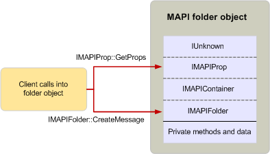

# Использование объектов MAPIUsing MAPI objects

**Применимо к**: Outlook 2013 | Outlook 2016**Applies to**: Outlook 2013 | Outlook 2016 
  
Клиенты и поставщики услуг используйте объекты MAPI с помощью методов в их реализации интерфейса.Clients and service providers use MAPI objects by calling the methods in their interface implementations. Это является единственным способом, можно использовать объекты MAPI; методы, реализованных с помощью объекта за пределами интерфейса MAPI не общего доступа.This is the only way that MAPI objects can be used; methods that are implemented by an object outside of a MAPI interface are not publicly accessible. Так как все интерфейсы объекта связаны через наследование, объекта пользователя можно вызвать методы в основной интерфейс или из наследуемых интерфейсов, как если бы они принадлежат тот же интерфейс.Because all of an object's interfaces are related through inheritance, an object's user can call methods in either the base interface or one of the inherited interfaces as if they belong to the same interface. 
  
При объекта пользователю необходимо вызвать метод и этот объект реализует несколько интерфейсов, связанных с помощью наследования, пользователь не требуется знать, интерфейс, который принадлежит метод.When an object's user wants to make a call to a method and that object implements several interfaces related through inheritance, the user need not know to which interface the method belongs. Можно использовать любой из способов на любом из интерфейсов с одним указатель на объект.The user can call any of the methods on any of the interfaces with a single pointer to the object. Например на следующем рисунке показана как клиентское приложение использует объект folder.For example, the following illustration shows how a client application uses a folder object. Реализация объектов папок [IMAPIFolder: IMAPIContainer](imapifolderimapicontainer.md) интерфейс, который наследует от [IUnknown](http://msdn.microsoft.com/library/33f1d79a-33fc-4ce5-a372-e08bda378332%28Office.15%29.aspx) косвенно через [IMAPIProp: IUnknown](imapipropiunknown.md) и [IMAPIContainer: IMAPIProp](imapicontainerimapiprop.md).Folder objects implement the [IMAPIFolder : IMAPIContainer](imapifolderimapicontainer.md) interface, which inherits from [IUnknown](http://msdn.microsoft.com/library/33f1d79a-33fc-4ce5-a372-e08bda378332%28Office.15%29.aspx) indirectly through [IMAPIProp : IUnknown](imapipropiunknown.md) and [IMAPIContainer : IMAPIProp](imapicontainerimapiprop.md). Клиент может вызвать один из методов **IMAPIProp** , такие как [IMAPIProp::GetProps](imapiprop-getprops.md)и один из [IMAPIFolder: IMAPIContainer](imapifolderimapicontainer.md) методы, такие как [IMAPIFolder::CreateMessage](imapifolder-createmessage.md), так же, как с помощью одной указателя на объект.A client can call one of the **IMAPIProp** methods, such as [IMAPIProp::GetProps](imapiprop-getprops.md), and one of the [IMAPIFolder : IMAPIContainer](imapifolderimapicontainer.md) methods, such as [IMAPIFolder::CreateMessage](imapifolder-createmessage.md), in the same way with the same object pointer. Клиент не принять во внимание или степени зависит от того, что эти вызовы принадлежащих разных интерфейсов.A client is not aware of or affected by the fact that these calls belong to different interfaces.
  
**Использование объекта папки клиентом****Client use of a folder object**
  
![Использование клиентского объекта папки] (media/amapi_40.gif "Использование клиентского объекта папки")
  
Эти вызовы преобразования в коде по-разному в зависимости от написана ли клиента, выполнение вызовов в C или C++.These calls translate into code differently depending on whether the client making the calls is written in C or C++. Прежде чем будет выполнено любой вызов метода, должны быть получены указатель реализации интерфейса.Before any call to a method can be made, a pointer to the interface implementation must be retrieved. Указатели интерфейса можно получить следующими способами:Interface pointers can be obtained in the following ways:
  
- Вызов метода на другой объект.Calling a method on a different object.
    
- Вызов функции API.Calling an API function.
    
- Вызов метода [IUnknown::QueryInterface](http://msdn.microsoft.com/library/54d5ff80-18db-43f2-b636-f93ac053146d%28Office.15%29.aspx) на целевой объект.Calling the [IUnknown::QueryInterface](http://msdn.microsoft.com/library/54d5ff80-18db-43f2-b636-f93ac053146d%28Office.15%29.aspx) method on the target object. 
    
MAPI предоставляет несколько методов и функций API, которые возвращают указатели для реализации интерфейсов.MAPI provides several methods and API functions that return pointers to interface implementations. Например, клиенты могут вызывать метод [IMAPISession::GetMsgStoresTable](imapisession-getmsgstorestable.md) для извлечения указателя на объект в таблице, который предоставляет доступ к информации поставщика хранилища сообщений через [IMAPITable: IUnknown](imapitableiunknown.md) интерфейса.For example, clients can call the [IMAPISession::GetMsgStoresTable](imapisession-getmsgstorestable.md) method to retrieve a pointer to a table object that provides access to message store provider information through the [IMAPITable : IUnknown](imapitableiunknown.md) interface. Поставщиков услуг можно вызвать функцию API [CreateTable](createtable.md) получить указатель на объект данных в таблице.Service providers can call the API function [CreateTable](createtable.md) to retrieve a pointer to a table data object. Если нет функция или метод доступен с клиентами или поставщиками услуг уже указателя на объект, они могут вызывать метод **QueryInterface** объекта для извлечения указатель на другой объект реализации интерфейсов.When there is no function or method available and clients or service providers already have a pointer to an object, they can call the object's **QueryInterface** method to retrieve a pointer to another of the object's interface implementations. 
  
## См. такжеSee also

- [Обзор интерфейса и объект MAPIMAPI Object and Interface Overview](mapi-object-and-interface-overview.md)

