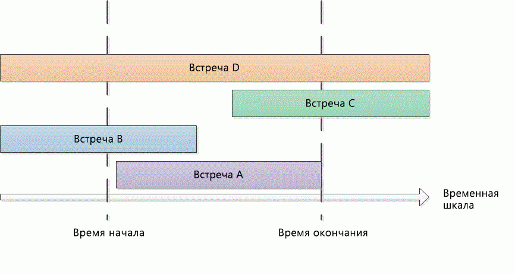

# <a name="search-and-obtain-appointments-in-a-time-range"></a><span data-ttu-id="6e6ff-102">Поиск и получение встреч в диапазоне времени</span><span class="sxs-lookup"><span data-stu-id="6e6ff-102">Search and obtain appointments in a time range</span></span>

<span data-ttu-id="6e6ff-103">Этот пример возвращает встречи в определенном диапазоне времени в календаре по умолчанию Microsoft Outlook.</span><span class="sxs-lookup"><span data-stu-id="6e6ff-103">This example returns appointments in a specific time range in the default Microsoft Outlook calendar.</span></span>

## <a name="example"></a><span data-ttu-id="6e6ff-104">Пример</span><span class="sxs-lookup"><span data-stu-id="6e6ff-104">Example</span></span>

<span data-ttu-id="6e6ff-105">Этот пример кода содержит два метода: DemoAppointmentsInRange и GetAppointmentsInRange.</span><span class="sxs-lookup"><span data-stu-id="6e6ff-105">This code example contains two methods: DemoAppointmentsInRange and GetAppointmentsInRange.</span></span> <span data-ttu-id="6e6ff-106">DemoAppointmentsInRange получает календарь по умолчанию для текущего профиля Outlook, вошедшего в систему, устанавливает диапазон дат на 5 дней с 12:00</span><span class="sxs-lookup"><span data-stu-id="6e6ff-106">DemoAppointmentsInRange obtains the default calendar for the current signed-in Outlook profile, sets a date range of 5 days from 12:00 A.M.</span></span> <span data-ttu-id="6e6ff-107">сегодняшнего дня, вызывает GetAppointmentsInRange для получения встреч, которые находятся в этом диапазоне времени, и отображает тему и время начала для каждой из возвращенных встреч.</span><span class="sxs-lookup"><span data-stu-id="6e6ff-107">today, calls GetAppointmentsInRange to obtain appointments that fall in that time range, and displays the subject and start time of each of the returned appointments.</span></span>

<span data-ttu-id="6e6ff-108">GetAppointmentsInRange принимает папку Outlook и значения **DateTime** начала и окончания диапазона времени в качестве входных параметров.</span><span class="sxs-lookup"><span data-stu-id="6e6ff-108">GetAppointmentsInRange accepts an Outlook folder, and the start and end **DateTime** values of the time range as input parameters.</span></span> <span data-ttu-id="6e6ff-109">В этом методе используется метод [Restrict(String)](https://msdn.microsoft.com/library/bb612531\(v=office.15\)) и фильтр строк в формате Jet, который возвращает встречи, начинающиеся и оканчивающиеся в указанном диапазоне времени.</span><span class="sxs-lookup"><span data-stu-id="6e6ff-109">This method uses the [Restrict(String)](https://msdn.microsoft.com/library/bb612531\(v=office.15\)) method and a string filter in Jet format that returns appointments that start and end within the specified time range.</span></span> <span data-ttu-id="6e6ff-110">Принимая \[Start\] и \[End\] в качестве времени начала и окончания встречи, а startTime и endTime в качестве начала и окончания указанного диапазона времени, метод GetAppointmentsInRange настраивает фильтр для поиска встреч с параметрами `[Start]>=startTime` и `[End]<=endTime`.</span><span class="sxs-lookup"><span data-stu-id="6e6ff-110">Assuming \[Start\] and \[End\] are the start time and end time of an appointment, and startTime and endTime are the beginning and end time of the specified time range, GetAppointmentsInRange sets up a filter  that looks for appointments with `[Start]>=startTime`, and `[End]<=endTime`.</span></span> <span data-ttu-id="6e6ff-111">Ниже показан фильтр Jet в C\#.</span><span class="sxs-lookup"><span data-stu-id="6e6ff-111">The following code shows the Jet filter in C\#.</span></span>

```csharp
string filter = "[Start] >= '"
    + startTime.ToString("g")
    + "' AND [End] <= '"
    + endTime.ToString("g") + "'";
```

<span data-ttu-id="6e6ff-112">До вызова метода **Items.Restrict** для поиска встреч GetAppointmentsInRange выполняет другие два действия, чтобы включить повторяющиеся встречи, которые происходят в указанном диапазоне времени:</span><span class="sxs-lookup"><span data-stu-id="6e6ff-112">Before calling the **Items.Restrict** method to search for appointments, GetAppointmentsInRange does two other things to include recurring appointments that occur in the specified time range:</span></span>

- <span data-ttu-id="6e6ff-113">Задание свойства [IncludeRecurrences](https://msdn.microsoft.com/library/bb646522\(v=office.15\)) коллекции [Items](https://msdn.microsoft.com/library/bb645287\(v=office.15\)).</span><span class="sxs-lookup"><span data-stu-id="6e6ff-113">Sets the [IncludeRecurrences](https://msdn.microsoft.com/library/bb646522\(v=office.15\)) property of the [Items](https://msdn.microsoft.com/library/bb645287\(v=office.15\)) collection.</span></span>

- <span data-ttu-id="6e6ff-114">Сортировка элементов встреч в заданной папке календаря с помощью свойства [Start](https://msdn.microsoft.com/library/bb647263\(v=office.15\)).</span><span class="sxs-lookup"><span data-stu-id="6e6ff-114">Sorts the appointment items in the given calendar folder by the [Start](https://msdn.microsoft.com/library/bb647263\(v=office.15\)) property.</span></span>

<span data-ttu-id="6e6ff-115">Либо, если вас также интересуют встречи, частично или полностью перекрывающие указанный диапазон времени, можно задать разные фильтры, чтобы получить дополнительные типы встреч (как показано на рисунке 1):</span><span class="sxs-lookup"><span data-stu-id="6e6ff-115">Alternatively, if you are also interested in appointments that overlap partially or entirely with the specified time range, you would specify a different filter to return additional types of appointments (as shown in Figure 1):</span></span>

- <span data-ttu-id="6e6ff-116">Встречи, начинающиеся и оканчивающиеся в указанном диапазоне времени (например, встреча A):</span><span class="sxs-lookup"><span data-stu-id="6e6ff-116">Appointments that start and end within the specified time range (for example, appointment A):</span></span><br/><br/>`[Start]>=startTime and [End]<=endTime`

- <span data-ttu-id="6e6ff-117">Встречи, начинающиеся до указанного диапазона времени, но заканчивающиеся в нем (например, встреча B):</span><span class="sxs-lookup"><span data-stu-id="6e6ff-117">Appointments that start before the specified time range but end within the time range (for example, appointment B):</span></span><br/><br/>`[Start]<startTime and [End]<=endTime`

- <span data-ttu-id="6e6ff-118">Встречи, начинающиеся в указанном диапазоне времени, но заканчивающиеся после него (например, встреча C):</span><span class="sxs-lookup"><span data-stu-id="6e6ff-118">Appointments that start within the specified time range but end after the time range (for example, appointment C):</span></span><br/><br/>`[Start]>=startTime and [End]>endTime`

- <span data-ttu-id="6e6ff-119">Встречи, начинающиеся до указанного диапазона времени и заканчивающиеся после него (например, встреча D):</span><span class="sxs-lookup"><span data-stu-id="6e6ff-119">Appointments that start before the specified time range and end after the time range (for example, appointment D):</span></span><br/><br/>`[Start]<startTime and [End]>endTime`

<span data-ttu-id="6e6ff-120">**Рис. 1. Типы встреч, которые происходят в определенном диапазоне времени или перекрывают его**</span><span class="sxs-lookup"><span data-stu-id="6e6ff-120">**Figure 1. Types of appointments that occur within a time range, or overlap with that time range**</span></span>


 

<span data-ttu-id="6e6ff-122">Поскольку в любом диапазоне времени `startTime<=endTime`, в фильтр с параметрами `[Start]<=endTime` и `[End]>=startTime` попадут указанные выше типы встреч из этого диапазона времени.</span><span class="sxs-lookup"><span data-stu-id="6e6ff-122">Because in any time range `startTime<=endTime`, a filter with `[Start]<=endTime` and `[End]>=startTime` would capture the preceding types of appointments in that time range.</span></span>

<span data-ttu-id="6e6ff-123">В C\# фильтр Jet можно представить следующим образом.</span><span class="sxs-lookup"><span data-stu-id="6e6ff-123">In C\#, you can express the Jet filter as follows.</span></span>

```csharp
string filter = "[Start] <= '"
    + endTime.ToString("g")
    + "' AND [End] >= '"
    + startTime.ToString("g") + "'";
```

<span data-ttu-id="6e6ff-124">Ниже показан полный пример.</span><span class="sxs-lookup"><span data-stu-id="6e6ff-124">The following code shows the complete example.</span></span> <span data-ttu-id="6e6ff-125">Если вы используете Visual Studio для тестирования этого примера кода, сначала добавьте ссылку на компонент Microsoft Outlook 15.0 Object Library и задайте переменную Outlook при импорте пространства имен **Microsoft.Office.Interop.Outlook**.</span><span class="sxs-lookup"><span data-stu-id="6e6ff-125">If you use Visual Studio to test this code example, you must first add a reference to the Microsoft Outlook 15.0 Object Library component and specify the Outlook variable when you import the **Microsoft.Office.Interop.Outlook** namespace.</span></span> <span data-ttu-id="6e6ff-126">Инструкция **Imports** или **using** не должна идти непосредственно перед функциями в примере кода, но ее нужно добавить перед открытым объявлением Class.</span><span class="sxs-lookup"><span data-stu-id="6e6ff-126">The **Imports** or **using** statement must not occur directly before the functions in the code example but must be added before the public Class declaration.</span></span> <span data-ttu-id="6e6ff-127">В следующих строках кода показано, как выполнить импорт и назначение в Visual Basic и C\#.</span><span class="sxs-lookup"><span data-stu-id="6e6ff-127">The following lines of code show how to do the import and assignment in Visual Basic and C\#.</span></span>

```vb
Imports Outlook = Microsoft.Office.Interop.Outlook
```


```csharp
using Outlook = Microsoft.Office.Interop.Outlook;
```


```csharp
private void DemoAppointmentsInRange()
{
    Outlook.Folder calFolder =
        Application.Session.GetDefaultFolder(
        Outlook.OlDefaultFolders.olFolderCalendar)
        as Outlook.Folder;
    DateTime start = DateTime.Now;
    DateTime end = start.AddDays(5);
    Outlook.Items rangeAppts = GetAppointmentsInRange(calFolder, start, end);
    if (rangeAppts != null)
    {
        foreach (Outlook.AppointmentItem appt in rangeAppts)
        {
            Debug.WriteLine("Subject: " + appt.Subject 
                + " Start: " + appt.Start.ToString("g"));
        }
    }
}

/// <summary>
/// Get recurring appointments in date range.
/// </summary>
/// <param name="folder"></param>
/// <param name="startTime"></param>
/// <param name="endTime"></param>
/// <returns>Outlook.Items</returns>
private Outlook.Items GetAppointmentsInRange(
    Outlook.Folder folder, DateTime startTime, DateTime endTime)
{
    string filter = "[Start] >= '"
        + startTime.ToString("g")
        + "' AND [End] <= '"
        + endTime.ToString("g") + "'";
    Debug.WriteLine(filter);
    try
    {
        Outlook.Items calItems = folder.Items;
        calItems.IncludeRecurrences = true;
        calItems.Sort("[Start]", Type.Missing);
        Outlook.Items restrictItems = calItems.Restrict(filter);
        if (restrictItems.Count > 0)
        {
            return restrictItems;
        }
        else
        {
            return null;
        }
    }
    catch { return null; }
}
```

## <a name="see-also"></a><span data-ttu-id="6e6ff-128">См. также</span><span class="sxs-lookup"><span data-stu-id="6e6ff-128">See also</span></span>

- [<span data-ttu-id="6e6ff-129">Поиск и фильтрация</span><span class="sxs-lookup"><span data-stu-id="6e6ff-129">Search and filter</span></span>](search-and-filter.md)

