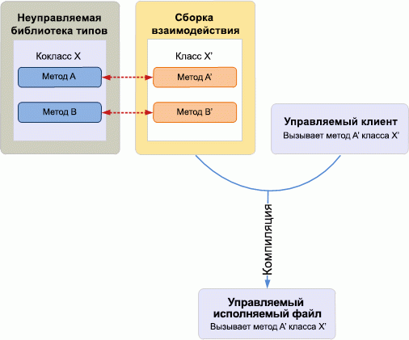
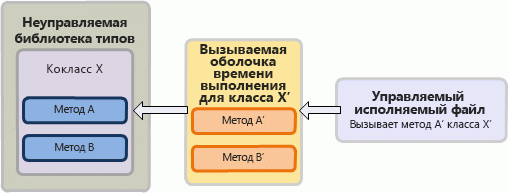

# Введение во взаимодействие между COM и .NET

При разработке в COM и .NET используются сильно отличающиеся системы типов и механизмы управления временем жизни объектов, созданием и наследованием интерфейсов. 

Например, тип **Variant** в COM соответствует типу данных **System.Object** в .NET Framework. Чтобы создать объект, клиент COM вызывает функцию [CoCreateInstance](https://docs.microsoft.com/windows/desktop/api/combaseapi/nf-combaseapi-cocreateinstance), а управляемый клиент может использовать такие ключевые слова, как new или New, встроенные в управляемый язык программирования. 

В то время как COM не поддерживает классическое наследование, и клиент COM для освобождения компонентного класса управляет внутренним счетчиком ссылок, предоставленным в интерфейсе [IUnknown](https://docs.microsoft.com/windows/desktop/api/unknwn/nn-unknwn-iunknown), управляемый клиент использует для освобождения объекта сборщик мусора среды CLR, предоставленный платформой .NET Framework. 

При таких различиях между COM и .NET разработка управляемого клиента для объектной модели COM требует использования механизма, разрешающего эти различия. Оболочка времени выполнения (Runtime Callable Wrapper, RCW) — это механизм, обеспечивающий прозрачное взаимодействие между COM и управляемой моделью программирования.

В этой статье приведено высокоуровневое описание того, как RCW облегчает взаимодействие между COM и управляемой моделью программирования. Обратите внимание, что хотя в этом разделе для иллюстрирования механизма работы этой оболочки используется Visual Studio, разрабатывать управляемый клиент, используя сборку взаимодействия, можно и не в Visual Studio.

## Упрощение взаимодействия: сборка взаимодействия и оболочка времени выполнения

### Время компиляции

Сборка взаимодействия определяет управляемые интерфейсы, сопоставляемые с библиотекой типов на основе COM, с которыми может взаимодействовать управляемый клиент. Чтобы использовать сборку взаимодействия в Visual Studio, сначала добавьте ссылку на соответствующий компонент COM. Visual Studio автоматически создаст локальную копию сборки взаимодействия. Сборка взаимодействия содержит одно пространство имен, в котором имеется управляемый эквивалентный интерфейс каждого COM-объекта в объектной модели COM. 

На рисунке 1 показан управляемый клиент, который хочет использовать библиотеку типов COM, определяющую компонентный класс X. Управляемый клиент вызывает класс X, который является управляемым эквивалентным интерфейсом для компонентного класса X, как определено в сборке взаимодействия. Во время компиляции управляемый проект компилируется сведениями о классе X из сборки взаимодействия.

**Рисунок 1. Управляемое приложение, скомпилированное со сборкой взаимодействия, взаимодействующей с неуправляемой библиотекой типов**

  
В общем случае, как только задается ссылка на библиотеку типов, Visual Studio создает копию сборки взаимодействия для этой библиотеки типов. Может существовать любое количество сборок взаимодействия, описывающих один и тот же тип COM. Но у библиотеки типов может быть только одна основная сборка взаимодействия (PIA), которая является сборкой взаимодействия, опубликованной библиотекой типов. В отличие от других сборок взаимодействия PIA не создается при каждом добавлении ссылки на библиотеку типов в Visual Studio. Вместо этого PIA устанавливается в глобальный кэш сборок на компьютере только один раз. При добавлении ссылки на библиотеку типов в Visual Studio автоматически загружается PIA.

Чтобы запрограммировать управляемое решение для Outlook, следует использовать Outlook PIA. Чтобы включить сведения из Outlook PIA в управляемую надстройку, сначала необходимо установить Outlook PIA в глобальный кэш сборок. При использовании Visual Studio для создания управляемого проекта PIA загружается в Visual Studio после добавления ссылки на библиотеку типов Outlook. В обозревателе объектов (в пространстве имен Microsoft.Office.Interop.Outlook) можно видеть управляемые интерфейсы, имена которых соответствуют объектам в объектной модели Outlook. Например, интерфейс Account соответствует объекту **Account** в объектной модели Outlook. При компиляции управляемого проекта эти сведения вносятся в исполняемый файл.

### Время выполнения

Во время выполнения, используя сведения, предоставленные сборкой взаимодействия, среда CLR .NET Framework создает оболочку времени выполнения для каждого компонентного класса, с которым взаимодействует управляемый клиент. Обратите внимание, что среда выполнения создает для каждого компонентного класса только одну оболочку времени выполнения, независимо от количества интерфейсов, полученных клиентом от этого компонентного класса. Оболочка времени выполнения является типом класса .NET Framework, служащим оболочкой компонентного класса COM. Оболочка времени выполнения отслеживает экземпляры компонентного класса и освобождает ссылки на них, только когда клиенту больше не нужна оболочка времени выполнения. Таким образом, управляемому клиенту, в отличие от неуправляемого клиента, не нужно управлять временем жизни объекта COM.

На рисунке 2 показано, как во время выполнения оболочка времени выполнения перехватывает вызов API из управляемого клиента и, используя сведения из сборки взаимодействия, прозрачно сопоставляет вызов с соответствующим API в компонентном классе COM. Этот процесс происходит следующим образом:

1.  Управляемый клиент вызывает метод A' класса X', как определено в сборке взаимодействия для библиотеки типов COM.

2.  Если оболочка времени выполнения для класса X' еще не существует, среда выполнения .NET Framework использует сведения из сборки взаимодействия и создает эту оболочку для класса X'.

3.  Оболочка времени выполнения перехватывает вызов метода A', преобразует аргументы в соответствующие типы COM и вызывает метод A компонентного класса X, определенного в библиотеке типов COM.

**Рисунок 2. Оболочка времени выполнения перехватывает вызов из управляемого исполняемого файла и сопоставляет его с компонентным классом в неуправляемой библиотеке типов**

  

## См. также

- [Причины использования Outlook PIA](why-use-the-outlook-pia.md)
- [Установка и создание ссылок на Outlook PIA](installing-and-referencing-the-outlook-pia.md)

