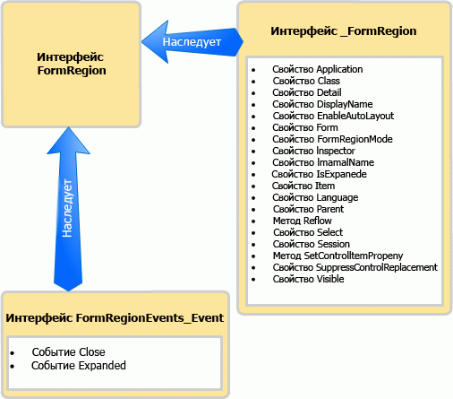

# <a name="methods-and-properties-in-the-outlook-pia"></a><span data-ttu-id="c18fa-102">Методы и свойства в Outlook PIA</span><span class="sxs-lookup"><span data-stu-id="c18fa-102">Methods and properties in the Outlook PIA</span></span>

<span data-ttu-id="c18fa-103">В этой статье описано, как получить доступ к методам и свойствам объекта в управляемом коде с помощью основной сборки взаимодействия Outlook (PIA).</span><span class="sxs-lookup"><span data-stu-id="c18fa-103">This topic describes how to access methods and properties of an object in managed code by using the Outlook Primary Interop Assembly (PIA).</span></span>

## <a name="where-helper-objects-come-from"></a><span data-ttu-id="c18fa-104">Откуда поступают объекты модуля поддержки</span><span class="sxs-lookup"><span data-stu-id="c18fa-104">Where Helper objects come from</span></span>

<span data-ttu-id="c18fa-p101">При создании PIA в Outlook применяется программа импорта библиотек типов (TLBIMP) в .NET Framework, преобразующая определения типов в библиотеке типа COM в эквивалентные определения из сборки среды CLR. В рамках COM объект фактически является компонентным классом, который состоит из следующих компонентов:</span><span class="sxs-lookup"><span data-stu-id="c18fa-p101">To create the Outlook PIA, Outlook uses the Type Library Importer (TLBIMP) in the .NET Framework to convert type definitions in the COM type library into equivalent definitions in a common language runtime (CLR) assembly. In COM, an object is actually a coclass that consists of the following:</span></span>

- <span data-ttu-id="c18fa-107">основной интерфейс (например, интерфейс [\_FormRegion](https://msdn.microsoft.com/library/bb645761\(v=office.15\)));</span><span class="sxs-lookup"><span data-stu-id="c18fa-107">The primary interface (for example, the [\_FormRegion](https://msdn.microsoft.com/library/bb645761\(v=office.15\)) interface).</span></span>

- <span data-ttu-id="c18fa-108">интерфейс события (например, интерфейс [FormRegionEvents](https://msdn.microsoft.com/library/bb611940\(v=office.15\))).</span><span class="sxs-lookup"><span data-stu-id="c18fa-108">The event interface (for example, the [FormRegionEvents](https://msdn.microsoft.com/library/bb611940\(v=office.15\)) interface).</span></span>

<span data-ttu-id="c18fa-109">TLBIMP импортирует основной интерфейс и интерфейс события для каждого объекта и создает ряд интерфейсов, делегатов и классов, среди которых встречаются следующие:</span><span class="sxs-lookup"><span data-stu-id="c18fa-109">TLBIMP imports the primary interface and the event interface for each object and creates a number of interfaces, delegates, and classes, among which are the following:</span></span>

- <span data-ttu-id="c18fa-110">интерфейс события .NET (например, интерфейс [FormRegionEvents\_Event](https://msdn.microsoft.com/library/bb647619\(v=office.15\)));</span><span class="sxs-lookup"><span data-stu-id="c18fa-110">The .NET event interface (for example, the [FormRegionEvents\_Event](https://msdn.microsoft.com/library/bb647619\(v=office.15\)) interface).</span></span>

- <span data-ttu-id="c18fa-111">класс .NET (например, класс [FormRegionClass](https://msdn.microsoft.com/library/bb624204\(v=office.15\)));</span><span class="sxs-lookup"><span data-stu-id="c18fa-111">The .NET class (for example, the [FormRegionClass](https://msdn.microsoft.com/library/bb624204\(v=office.15\)) class).</span></span>

- <span data-ttu-id="c18fa-112">интерфейс .NET (например, интерфейс [FormRegion](https://msdn.microsoft.com/library/bb652633\(v=office.15\))).</span><span class="sxs-lookup"><span data-stu-id="c18fa-112">The .NET interface (for example, the [FormRegion](https://msdn.microsoft.com/library/bb652633\(v=office.15\)) interface).</span></span>

## <a name="what-the-helper-objects-are-for"></a><span data-ttu-id="c18fa-113">Для чего предназначены объекты модуля поддержки</span><span class="sxs-lookup"><span data-stu-id="c18fa-113">What the Helper objects are for</span></span>

<span data-ttu-id="c18fa-114">В следующем списке проверяется содержимое каждого перечисленного ранее интерфейса и класса (объект **FormRegion** продолжает использоваться в качестве примера).</span><span class="sxs-lookup"><span data-stu-id="c18fa-114">Continuing to use the **FormRegion** object as an example, the following list examines what each interface and class listed earlier contains.</span></span>

- <span data-ttu-id="c18fa-115">Интерфейс \_FormRegion определяет все методы и свойства FormRegion.</span><span class="sxs-lookup"><span data-stu-id="c18fa-115">The \_FormRegion interface defines all the methods and properties of FormRegion.</span></span> <span data-ttu-id="c18fa-116">Этот интерфейс обычно не используется в коде, кроме условия, рассматриваемого ниже.</span><span class="sxs-lookup"><span data-stu-id="c18fa-116">Typically you do not use this interface in code, except for a condition discussed below.</span></span>

- <span data-ttu-id="c18fa-117">Интерфейс **FormRegionEvents** определяет методы, которые соответствуют событиям FormRegion.</span><span class="sxs-lookup"><span data-stu-id="c18fa-117">The **FormRegionEvents** interface defines methods mapping to events of FormRegion.</span></span> <span data-ttu-id="c18fa-118">Этот интерфейс не используется в коде.</span><span class="sxs-lookup"><span data-stu-id="c18fa-118">You do not use this interface in code.</span></span>

- <span data-ttu-id="c18fa-119">Далее TLBIMP обрабатывает интерфейс **FormRegionEvents**, чтобы создать интерфейс **FormRegionEvents**\_Event, определяющий все события FormRegion.</span><span class="sxs-lookup"><span data-stu-id="c18fa-119">TLBIMP further processes the **FormRegionEvents** interface to create the **FormRegionEvents**\_Event interface that defines all the events of FormRegion.</span></span> <span data-ttu-id="c18fa-120">Этот интерфейс обычно не используется в коде, кроме условия, рассматриваемого ниже.</span><span class="sxs-lookup"><span data-stu-id="c18fa-120">Typically you do not use this interface in code, except for a condition discussed below.</span></span>

- <span data-ttu-id="c18fa-p105">Класс FormRegionClass определяет все методы, свойства и элементы событий FormRegion. Это тот класс, с которым интерфейсу FormRegion приписывается скрытая связь, позволяющая написать код для создания экземпляра интерфейса FormRegion. Однако непосредственно в коде этот интерфейс не используется.</span><span class="sxs-lookup"><span data-stu-id="c18fa-p105">The FormRegionClass class defines all the method, property, and event members of FormRegion. This is the class that the FormRegion interface is attributed to associate with behind the scenes so that you can write code to create an instance of the FormRegion interface. However, you do not use this interface directly in code.</span></span>

- <span data-ttu-id="c18fa-124">Интерфейс FormRegion наследует интерфейс \_FormRegion и интерфейс **FormRegionEvents**\_Event.</span><span class="sxs-lookup"><span data-stu-id="c18fa-124">The FormRegion interface inherits the \_FormRegion interface and the **FormRegionEvents**\_Event interface.</span></span> <span data-ttu-id="c18fa-125">На рисунке 1 показана эта связь наследования.</span><span class="sxs-lookup"><span data-stu-id="c18fa-125">Figure 1 illustrates this inheritance relationship.</span></span>
    
  <span data-ttu-id="c18fa-126">**Рисунок 1. Интерфейс FormRegion наследует методы и свойства интерфейса \_FormRegion, наследуя события из интерфейса FormRegionEvents\_Event**</span><span class="sxs-lookup"><span data-stu-id="c18fa-126">**Figure 1. The FormRegion interface inherits methods and properties from the \_FormRegion interface, and inherits events from the FormRegionEvents\_Event interface**</span></span>

  
    
  <span data-ttu-id="c18fa-128">Обычно FormRegion — этот интерфейс, используемый в управляемом коде для доступа к объекту, методу, свойству и элементам события объекта **FormRegion**.</span><span class="sxs-lookup"><span data-stu-id="c18fa-128">Typically, FormRegion is the one interface you use in managed code to access the object and the method, property, and event members of the **FormRegion** object.</span></span>

<span data-ttu-id="c18fa-p107">Взяв объект **Application** в качестве еще одного примера, вы имеете доступ к объекту **Application**, методам, свойствам и событиям посредством интерфейса [Application](https://msdn.microsoft.com/library/bb646615\(v=office.15\)). Однако существует три исключения, требующих применения другого интерфейса. Кроме того, выбор другого интерфейса может зависеть от языка.</span><span class="sxs-lookup"><span data-stu-id="c18fa-p107">Using the **Application** object as another example, you access the **Application** object, methods, properties, and events through the [Application](https://msdn.microsoft.com/library/bb646615\(v=office.15\)) interface. There are however three exceptions where you must use a different interface, or depending on the language, you would want to use a different interface:</span></span>

- <span data-ttu-id="c18fa-131">При доступе к методу, который назван так же, как и событие, рекомендуется привести к основному интерфейсу для вызова метода.</span><span class="sxs-lookup"><span data-stu-id="c18fa-131">When you access a method that shares the same name as an event, a good practice is to cast to the primary interface to call the method.</span></span> <span data-ttu-id="c18fa-132">Например, у объекта **Application** есть метод [Quit](https://msdn.microsoft.com/library/bb646614\(v=office.15\)) и событие [Quit](https://msdn.microsoft.com/library/bb622595\(v=office.15\)).</span><span class="sxs-lookup"><span data-stu-id="c18fa-132">For example, the **Application** object has a [Quit](https://msdn.microsoft.com/library/bb646614\(v=office.15\)) method and a [Quit](https://msdn.microsoft.com/library/bb622595\(v=office.15\)) event.</span></span> <span data-ttu-id="c18fa-133">В Visual Basic .NET можно получить доступ к методу Quit с помощью интерфейса Application.</span><span class="sxs-lookup"><span data-stu-id="c18fa-133">In Visual Basic .NET, you can access the Quit method through the Application interface.</span></span> <span data-ttu-id="c18fa-134">В C\# избежать предупреждения компилятора можно, приведя метод Quit к основному интерфейсу, как показано в следующем примере кода:</span><span class="sxs-lookup"><span data-stu-id="c18fa-134">In C\#, you can avoid a compiler warning by casting the Quit method to the primary interface, as shown in the following code sample:</span></span>
    
   ```csharp
      void DemoApp()
      {
          Outlook.Application myApp = new Outlook.Application();
          // Other application code here
          ((Outlook._Application)myApp).Quit();
      }
   ```

- <span data-ttu-id="c18fa-135">При доступе к событию, названному так же, как и метод объекта, необходимо привести к соответствующему интерфейсу события, чтобы подключиться к событию.</span><span class="sxs-lookup"><span data-stu-id="c18fa-135">When you access an event that shares the same name as a method of that object, you must cast to the appropriate event interface to connect to the event.</span></span> <span data-ttu-id="c18fa-136">Как и в указанном выше примере, для подключения к событию Quit необходимо привести к интерфейсу [ApplicationEvents\_11\_Event](https://msdn.microsoft.com/library/bb622725\(v=office.15\)).</span><span class="sxs-lookup"><span data-stu-id="c18fa-136">Similar to the example above, to connect to the Quit event, you cast to the [ApplicationEvents\_11\_Event](https://msdn.microsoft.com/library/bb622725\(v=office.15\)) interface.</span></span>

- <span data-ttu-id="c18fa-137">При подключении к более ранней версии события, которое было впоследствии продлено в позднейшей версии Outlook, необходимо подключиться к версии события в ранней версии интерфейса.</span><span class="sxs-lookup"><span data-stu-id="c18fa-137">When you connect to an earlier version of an event that has been subsequently extended in a later version of Outlook, you must connect to the version of the event in the earlier interface.</span></span> <span data-ttu-id="c18fa-138">Например, если требуется подключиться к версии события Quit для объекта **Application**, реализованного для Outlook 2002 вместо последней версии программы, подключитесь к событию [Quit](https://msdn.microsoft.com/library/bb609660\(v=office.15\)), определенному в интерфейсе [ApplicationEvents\_10\_Event](https://msdn.microsoft.com/library/bb610098\(v=office.15\)) вместо того, чтобы подключаться к событию Quit, определенному в интерфейсе ApplicationEvents\_11\_Event.</span><span class="sxs-lookup"><span data-stu-id="c18fa-138">For example, if you want to connect to the version of the Quit event for the **Application** object implemented for Outlook 2002 instead of the latest version, connect to the [Quit](https://msdn.microsoft.com/library/bb609660\(v=office.15\)) event defined in the [ApplicationEvents\_10\_Event](https://msdn.microsoft.com/library/bb610098\(v=office.15\)) interface, instead of the Quit event defined in the ApplicationEvents\_11\_Event interface.</span></span>

## <a name="see-also"></a><span data-ttu-id="c18fa-139">См. также</span><span class="sxs-lookup"><span data-stu-id="c18fa-139">See also</span></span>

- [<span data-ttu-id="c18fa-140">Связывание Outlook PIA с объектной моделью</span><span class="sxs-lookup"><span data-stu-id="c18fa-140">Relating the Outlook PIA with the object model</span></span>](relating-the-outlook-pia-with-the-object-model.md)
- [<span data-ttu-id="c18fa-141">Объекты в Outlook PIA</span><span class="sxs-lookup"><span data-stu-id="c18fa-141">Objects in the Outlook PIA</span></span>](objects-in-the-outlook-pia.md)
- [<span data-ttu-id="c18fa-142">События в Outlook PIA</span><span class="sxs-lookup"><span data-stu-id="c18fa-142">Events in the Outlook PIA</span></span>](events-in-the-outlook-pia.md)

