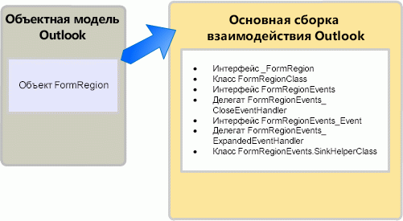

# <a name="objects-in-the-outlook-pia"></a><span data-ttu-id="4a11b-102">Объекты в Outlook PIA</span><span class="sxs-lookup"><span data-stu-id="4a11b-102">Objects in the Outlook PIA</span></span>

<span data-ttu-id="4a11b-103">При просмотре основной сборки взаимодействия Outlook (PIA) в обозревателе объектов можно заметить, что имена многих интерфейсов и классов ссылаются на знакомые объекты в объектной модели Outlook.</span><span class="sxs-lookup"><span data-stu-id="4a11b-103">When browsing the Outlook Primary Interop Assembly (PIA) in an object browser, you may notice that many interfaces and classes have names referencing familiar objects in the Outlook object model.</span></span> <span data-ttu-id="4a11b-104">Некоторые объекты в объектной модели взаимно однозначно сопоставлены интерфейсам в PIA.</span><span class="sxs-lookup"><span data-stu-id="4a11b-104">Some objects in the object model have a one-to-one mapping to interfaces in the PIA.</span></span> 

<span data-ttu-id="4a11b-105">Например, **AddressEntry** сопоставляется интерфейсу [AddressEntry](https://msdn.microsoft.com/library/bb609728\(v=office.15\)) , а объект **AddressList** сопоставляется интерфейсу [AddressList](https://msdn.microsoft.com/library/bb623538\(v=office.15\)) в PIA.</span><span class="sxs-lookup"><span data-stu-id="4a11b-105">For example, the **AddressEntry** is mapped to the [AddressEntry](https://msdn.microsoft.com/library/bb609728\(v=office.15\)) interface and the **AddressList** object is mapped to the [AddressList](https://msdn.microsoft.com/library/bb623538\(v=office.15\)) interface in the PIA.</span></span> 

<span data-ttu-id="4a11b-106">Но большинство других объектов сопоставляются PIA как один-ко-многим.</span><span class="sxs-lookup"><span data-stu-id="4a11b-106">However, most other objects have a one-to-many mapping in the PIA.</span></span> <span data-ttu-id="4a11b-107">Это сопоставление один-ко-многим применяется к некоторым объектам, существовавшим до Microsoft Office Outlook 2007, и всем объектам, добавленным, начиная с версии Outlook 2007.</span><span class="sxs-lookup"><span data-stu-id="4a11b-107">This one-to-many mapping applies to some objects that existed before Microsoft Office Outlook 2007, and all objects added since Outlook 2007.</span></span> <span data-ttu-id="4a11b-108">В этом разделе перечислены все типичные интерфейсы, классы и делегаты .NET, сопоставленные объекту COM, и описывается получение доступа к объекту в Outlook PIA.</span><span class="sxs-lookup"><span data-stu-id="4a11b-108">This topic lists the typical .NET interfaces, classes, and delegates that are mapped to a COM object and describes how to access an object in the Outlook PIA.</span></span> <span data-ttu-id="4a11b-109">Здесь также описываются некоторые исключения в Outlook PIA, в которых имеются скрытые объекты или устаревшие в объектной модели на основе COM.</span><span class="sxs-lookup"><span data-stu-id="4a11b-109">It also describes a few exceptions in the Outlook PIA where the objects are hidden or deprecated in the COM-based object model.</span></span>

## <a name="helper-objects"></a><span data-ttu-id="4a11b-110">Объекты модуля поддержки</span><span class="sxs-lookup"><span data-stu-id="4a11b-110">Helper Objects</span></span>

<span data-ttu-id="4a11b-p103">В этом разделе на примере использования объекта **FormRegion** показываются типичные классы модуля поддержки для объекта в Outlook PIA. Объект **FormRegion** был добавлен в объектную модель в Outlook 2007. С объектом **FormRegion** в PIA связаны интерфейсы, классы и делегаты, показанные на рисунке 1.</span><span class="sxs-lookup"><span data-stu-id="4a11b-p103">This section illustrates the typical helper classes for an object in the Outlook PIA by using the **FormRegion** object as an example. The **FormRegion** object was added to the object model in Outlook 2007. Related to the **FormRegion** object in the PIA are the interfaces, classes, and delegates, illustrated in Figure 1.</span></span>

<span data-ttu-id="4a11b-114">**Рисунок 1. Объект FormRegion, представленный в объектной модели Outlook и в Outlook PIA**</span><span class="sxs-lookup"><span data-stu-id="4a11b-114">**Figure 1. The FormRegion object represented in the Outlook object model and in the Outlook PIA**</span></span>



<span data-ttu-id="4a11b-116">Интерфейсом, который чаще всего используется для доступа к объекту **FormRegion** и его членам — методам, свойствам и событиям, является интерфейс [FormRegion](https://msdn.microsoft.com/library/bb652633\(v=office.15\)) .</span><span class="sxs-lookup"><span data-stu-id="4a11b-116">The one interface that you most often use to access the **FormRegion** object and its method, property, and event members is the [FormRegion](https://msdn.microsoft.com/library/bb652633\(v=office.15\)) interface.</span></span> <span data-ttu-id="4a11b-117">Однако нельзя рассматривать .NET интерфейс **FormRegion** как точный зеркальный образ COM-объекта **FormRegion**; если воспользоваться обозревателем объектов в Visual Studio, будет видно, что интерфейс **FormRegion** наследуется от другого интерфейса, [\_FormRegion](https://msdn.microsoft.com/library/bb645761\(v=office.15\)).</span><span class="sxs-lookup"><span data-stu-id="4a11b-117">However, you should not consider the FormRegion.NET interface as an exact mirror image of the FormRegion COM object; if you look at the Object Browser in Visual Studio, you will find that the FormRegion interface inherits from another interface, the _FormRegion interface.</span></span> <span data-ttu-id="4a11b-118">Фактически, интерфейс **FormRegion** является одним из нескольких интерфейсов и классов, появившихся в результате создания Outlook PIA на основе библиотеки типов COM.</span><span class="sxs-lookup"><span data-stu-id="4a11b-118">In fact, the **FormRegion** interface is just one of the few interfaces and classes that result from creating the Outlook PIA based on the COM type library.</span></span>

<span data-ttu-id="4a11b-p105">Чтобы создать Outlook PIA, Outlook использует программу импорта библиотек типов (TLBIMP) в .NET Framework для преобразования определений типов библиотеки типов COM в эквивалентные определения в сборке CLR. В COM объект **FormRegion** фактически является компонентным классом, состоящим из двух следующих интерфейсов, определяющих интерфейсы, реализуемые объектом **FormRegion**:</span><span class="sxs-lookup"><span data-stu-id="4a11b-p105">To create the Outlook PIA, Outlook uses the Type Library Importer (TLBIMP) in the .NET Framework to convert type definitions in the COM type library into equivalent definitions in a Common Language Runtime assembly. In COM, the **FormRegion** object is actually a coclass that consists of the following two interfaces defining the interfaces that the **FormRegion** object implements:</span></span>

- <span data-ttu-id="4a11b-121">Основной интерфейс **\_FormRegion**</span><span class="sxs-lookup"><span data-stu-id="4a11b-121">The primary interface _FormRegion</span></span>

- <span data-ttu-id="4a11b-122">Интерфейс события [FormRegionEvents](https://msdn.microsoft.com/library/bb611940\(v=office.15\))</span><span class="sxs-lookup"><span data-stu-id="4a11b-122">The event interface [FormRegionEvents](https://msdn.microsoft.com/library/bb611940\(v=office.15\))</span></span>

<span data-ttu-id="4a11b-123">TLBIMP непосредственно импортирует **\_FormRegion** и **FormRegionEvents** из библиотеки типов.</span><span class="sxs-lookup"><span data-stu-id="4a11b-123">TLBIMP directly imports _FormRegion and FormRegionEvents from the type library.</span></span>

<span data-ttu-id="4a11b-p106">Кроме импорта основного интерфейса и интерфейса событий, TLBIMP создает интерфейс .NET с тем же именем, что и у COM-объекта, и класс .NET, использующий имя объекта с дополнением "Class". В случае объекта **FormRegion** TLBIMP создает следующее.</span><span class="sxs-lookup"><span data-stu-id="4a11b-p106">Other than importing the primary interface and event interface, TLBIMP creates a .NET interface that has the same name as the COM object, and a .NET class that uses the name of the object and appends it with "Class". In the case of the **FormRegion** object, TLBIMP creates the following:</span></span>

- <span data-ttu-id="4a11b-126">Интерфейс .NET **FormRegion**</span><span class="sxs-lookup"><span data-stu-id="4a11b-126">The .NET interface **FormRegion**</span></span>

- <span data-ttu-id="4a11b-127">Класс .NET [FormRegionClass](https://msdn.microsoft.com/library/bb624204\(v=office.15\))</span><span class="sxs-lookup"><span data-stu-id="4a11b-127">The .NET class [FormRegionClass](https://msdn.microsoft.com/library/bb624204\(v=office.15\))</span></span>

<span data-ttu-id="4a11b-p107">Из создаваемых TLBIMP интерфейсов .NET и класса .NET, упоминаемых в этом разделе, для доступа к объекту всегда используется интерфейс .NET. Например, для доступа к объекту **FormRegion** в VB всегда используется интерфейс **FormRegion**, как показано в следующем примере кода.</span><span class="sxs-lookup"><span data-stu-id="4a11b-p107">Of the .NET interfaces and .NET class mentioned in this topic, you always use the .NET interface that TLBIMP creates to access an object. For example, to access a **FormRegion** object in VB, you always use the **FormRegion** interface, as in the following code example:</span></span>

```vb
Imports Outlook = Microsoft.Office.Interop.Outlook
Sub DemoFormRegion(ByVal Region As Outlook.FormRegion)
    Dim MyFormRegion As Outlook.FormRegion = Region
    ' Additional method code here
End Sub
```

<br/>

```csharp
using Outlook = Microsoft.Office.Interop.Outlook; 
void DemoFormRegion(Outlook.FormRegion region) 
{
    Outlook.FormRegion myFormRegion = region; 
    // Additional method code here
}
```

<span data-ttu-id="4a11b-130">Сведения о назначении основного интерфейса и класса .NET, которые TLBIMP импортирует и создает соответственно, см. в статье [Методы и свойства в Outlook PIA](methods-and-properties-in-the-outlook-pia.md).</span><span class="sxs-lookup"><span data-stu-id="4a11b-130">For information about the purpose of the primary interface and the .NET class that TLBIMP imports and creates respectively, see [Methods and Properties in the Outlook PIA](methods-and-properties-in-the-outlook-pia.md). For information about the purpose of the event-related interfaces, delegates, and sink helper classes, see Events in the Outlook PIA.</span></span> <span data-ttu-id="4a11b-131">Сведения о назначении связанных с событиями интерфейсов, делегатов и классов модуля поддержки приемника см. в статье [События в Outlook](events-in-the-outlook-pia.md).</span><span class="sxs-lookup"><span data-stu-id="4a11b-131">For information about the purpose of the primary interface and the .NET class that TLBIMP imports and creates respectively, see Methods and Properties in the Outlook PIA. For information about the purpose of the event-related interfaces, delegates, and sink helper classes, see [Events in the Outlook PIA](events-in-the-outlook-pia.md).</span></span>

## <a name="deprecated-objects"></a><span data-ttu-id="4a11b-132">Устаревшие объекты</span><span class="sxs-lookup"><span data-stu-id="4a11b-132">Deprecated Objects</span></span>

<span data-ttu-id="4a11b-133">Объекты, устаревшие в библиотеке типов, показаны в Outlook PIA.</span><span class="sxs-lookup"><span data-stu-id="4a11b-133">Objects deprecated in the type library are exposed in the Outlook PIA.</span></span> <span data-ttu-id="4a11b-134">Например, объекты **\_DDocSiteControl** и **\_DRecipientControl** скрыты в библиотеке типов, но показаны в PIA.</span><span class="sxs-lookup"><span data-stu-id="4a11b-134">For example, the _DDocSiteControl and _DRecipientControl objects are hidden in the type library but are exposed in the PIA.</span></span>

<span data-ttu-id="4a11b-135">Другим примером устаревшего объекта является объект **MAPIFolder**.</span><span class="sxs-lookup"><span data-stu-id="4a11b-135">Another example of a deprecated object is the **MAPIFolder** object.</span></span> <span data-ttu-id="4a11b-136">Начиная с Outlook 2007, объект **Folder** заменил в объектной модели объект **MAPIFolder**.</span><span class="sxs-lookup"><span data-stu-id="4a11b-136">Starting in Outlook 2007, the **Folder** object has replaced the **MAPIFolder** object in the object model.</span></span> <span data-ttu-id="4a11b-137">Существующие решения должны заменить ссылки на **MAPIFolder** на **Folder**, а все новые решения для Outlook 2007 и последующих версий должны использовать объект **Folder**.</span><span class="sxs-lookup"><span data-stu-id="4a11b-137">Existing solutions should replace references to **MAPIFolder** by **Folder**, and all solutions new for Outlook 2007 and after should use only the **Folder** object.</span></span> <span data-ttu-id="4a11b-138">Для неуправляемых решений в обозревателе объектов редактора Visual Basic объект **MAPIFolder** больше не показывается, даже как скрытый объект.</span><span class="sxs-lookup"><span data-stu-id="4a11b-138">For unmanaged solutions, the Object Browser of the Visual Basic Editor no longer lists the **MAPIFolder** object, not even as a hidden object.</span></span> 

<span data-ttu-id="4a11b-139">Для управляемых решений, несмотря на то, что в Outlook PIA показывается интерфейс [Folder](https://msdn.microsoft.com/library/bb645774\(v=office.15\)) , используемый для доступа к объекту **Folder** и его членам, в Outlook PIA показывается и [MAPIFolder](https://msdn.microsoft.com/library/bb624369\(v=office.15\)) как интерфейс, определяющий члены объекта **Folder**.</span><span class="sxs-lookup"><span data-stu-id="4a11b-139">For managed solutions, even though the Outlook PIA exposes a [Folder](https://msdn.microsoft.com/library/bb645774\(v=office.15\)) interface through which you access the **Folder** object and its members, the Outlook PIA also exposes [MAPIFolder](https://msdn.microsoft.com/library/bb624369\(v=office.15\)) as an interface that defines the members of the **Folder** object.</span></span>

## <a name="see-also"></a><span data-ttu-id="4a11b-140">См. также</span><span class="sxs-lookup"><span data-stu-id="4a11b-140">See also</span></span>

- [<span data-ttu-id="4a11b-141">Связывание Outlook PIA с объектной моделью</span><span class="sxs-lookup"><span data-stu-id="4a11b-141">Relating the Outlook PIA with the Object Model</span></span>](relating-the-outlook-pia-with-the-object-model.md)


