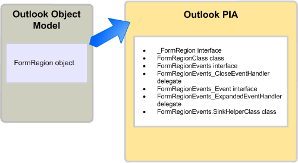

# <a name="objects-in-the-outlook-pia"></a>Объекты в Outlook PIA

При просмотре основной сборки взаимодействия Outlook (PIA) в обозревателе объектов можно заметить, что имена многих интерфейсов и классов ссылаются на знакомые объекты в объектной модели Outlook. Некоторые объекты в объектной модели взаимно однозначно сопоставлены интерфейсам в PIA. 

Например, **AddressEntry** сопоставляется интерфейсу [AddressEntry](https://msdn.microsoft.com/library/bb609728\(v=office.15\)) , а объект **AddressList** сопоставляется интерфейсу [AddressList](https://msdn.microsoft.com/library/bb623538\(v=office.15\)) в PIA. 

Но большинство других объектов сопоставляются PIA как один-ко-многим. Это сопоставление один-ко-многим применяется к некоторым объектам, существовавшим до Microsoft Office Outlook 2007, и всем объектам, добавленным, начиная с версии Outlook 2007. В этом разделе перечислены все типичные интерфейсы, классы и делегаты .NET, сопоставленные объекту COM, и описывается получение доступа к объекту в Outlook PIA. Здесь также описываются некоторые исключения в Outlook PIA, в которых имеются скрытые объекты или устаревшие в объектной модели на основе COM.

## <a name="helper-objects"></a>Объекты модуля поддержки

В этом разделе на примере использования объекта **FormRegion** показываются типичные классы модуля поддержки для объекта в Outlook PIA. Объект **FormRegion** был добавлен в объектную модель в Outlook 2007. С объектом **FormRegion** в PIA связаны интерфейсы, классы и делегаты, показанные на рисунке 1.

**Рисунок 1. Объект FormRegion, представленный в объектной модели Outlook и в Outlook PIA**



Интерфейсом, который чаще всего используется для доступа к объекту **FormRegion** и его членам — методам, свойствам и событиям, является интерфейс [FormRegion](https://msdn.microsoft.com/library/bb652633\(v=office.15\)) . Однако нельзя рассматривать .NET интерфейс **FormRegion** как точный зеркальный образ COM-объекта **FormRegion**; если воспользоваться обозревателем объектов в Visual Studio, будет видно, что интерфейс **FormRegion** наследуется от другого интерфейса, [\_FormRegion](https://msdn.microsoft.com/library/bb645761\(v=office.15\)). Фактически, интерфейс **FormRegion** является одним из нескольких интерфейсов и классов, появившихся в результате создания Outlook PIA на основе библиотеки типов COM.

Чтобы создать Outlook PIA, Outlook использует программу импорта библиотек типов (TLBIMP) в .NET Framework для преобразования определений типов библиотеки типов COM в эквивалентные определения в сборке CLR. В COM объект **FormRegion** фактически является компонентным классом, состоящим из двух следующих интерфейсов, определяющих интерфейсы, реализуемые объектом **FormRegion**:

- Основной интерфейс **\_FormRegion**

- Интерфейс события [FormRegionEvents](https://msdn.microsoft.com/library/bb611940\(v=office.15\))

TLBIMP непосредственно импортирует **\_FormRegion** и **FormRegionEvents** из библиотеки типов.

Кроме импорта основного интерфейса и интерфейса событий, TLBIMP создает интерфейс .NET с тем же именем, что и у COM-объекта, и класс .NET, использующий имя объекта с дополнением "Class". В случае объекта **FormRegion** TLBIMP создает следующее.

- Интерфейс .NET **FormRegion**

- Класс .NET [FormRegionClass](https://msdn.microsoft.com/library/bb624204\(v=office.15\))

Из создаваемых TLBIMP интерфейсов .NET и класса .NET, упоминаемых в этом разделе, для доступа к объекту всегда используется интерфейс .NET. Например, для доступа к объекту **FormRegion** в VB всегда используется интерфейс **FormRegion**, как показано в следующем примере кода.

```vb
Imports Outlook = Microsoft.Office.Interop.Outlook
Sub DemoFormRegion(ByVal Region As Outlook.FormRegion)
    Dim MyFormRegion As Outlook.FormRegion = Region
    ' Additional method code here
End Sub
```

<br/>

```csharp
using Outlook = Microsoft.Office.Interop.Outlook; 
void DemoFormRegion(Outlook.FormRegion region) 
{
    Outlook.FormRegion myFormRegion = region; 
    // Additional method code here
}
```

Сведения о назначении основного интерфейса и класса .NET, которые TLBIMP импортирует и создает соответственно, см. в статье [Методы и свойства в Outlook PIA](methods-and-properties-in-the-outlook-pia.md). Сведения о назначении связанных с событиями интерфейсов, делегатов и классов модуля поддержки приемника см. в статье [События в Outlook](events-in-the-outlook-pia.md).

## <a name="deprecated-objects"></a>Устаревшие объекты

Объекты, устаревшие в библиотеке типов, показаны в Outlook PIA. Например, объекты **\_DDocSiteControl** и **\_DRecipientControl** скрыты в библиотеке типов, но показаны в PIA.

Другим примером устаревшего объекта является объект **MAPIFolder**. Начиная с Outlook 2007, объект **Folder** заменил в объектной модели объект **MAPIFolder**. Существующие решения должны заменить ссылки на **MAPIFolder** на **Folder**, а все новые решения для Outlook 2007 и последующих версий должны использовать объект **Folder**. Для неуправляемых решений в обозревателе объектов редактора Visual Basic объект **MAPIFolder** больше не показывается, даже как скрытый объект. 

Для управляемых решений, несмотря на то, что в Outlook PIA показывается интерфейс [Folder](https://msdn.microsoft.com/library/bb645774\(v=office.15\)) , используемый для доступа к объекту **Folder** и его членам, в Outlook PIA показывается и [MAPIFolder](https://msdn.microsoft.com/library/bb624369\(v=office.15\)) как интерфейс, определяющий члены объекта **Folder**.

## <a name="see-also"></a>См. также

- [Связывание Outlook PIA с объектной моделью](relating-the-outlook-pia-with-the-object-model.md)


