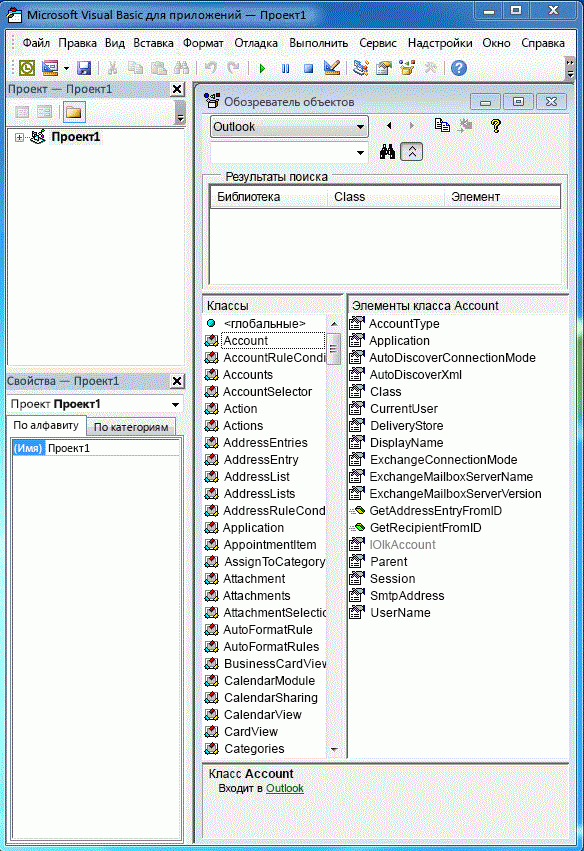
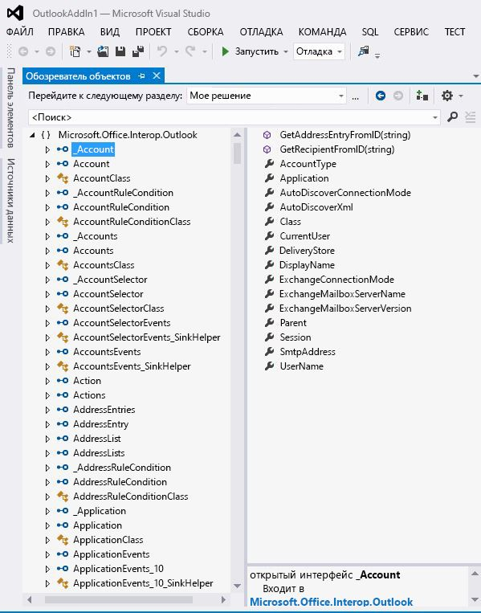

# Связывание Outlook PIA с объектной моделью

Основная сборка взаимодействия Outlook (PIA) — это сборка взаимодействия, официально опубликованная Outlook и определяющая управляемый интерфейс для управляемых надстроек, взаимодействующих с объектной моделью Outlook на основе COM. Раздел [Введение во взаимодействие между COM и .NET](introduction-to-interoperability-between-com-and-net.md) содержит техническое описание поддержки программирования управляемого клиента библиотеки типов на основе COM. В настоящем разделе приведены общие сведения о сопоставлении объектов и членов объектной модели Outlook на основе COM соответствующим управляемым интерфейсам и классам PIA.

## Объекты модуля поддержки

При сравнении объектов библиотеки типов Outlook, отображаемых в обозревателе объектов редактора Visual Basic (рисунок 1), с объектами PIA, отображаемыми в обозревателе объектов Visual Studio (рисунок 2), может удивить большое количество дополнительных объектов модуля поддержки, существующих в PIA. Можно заметить, что некоторые объекты, такие как объект **Action**, сопоставляются одному интерфейсу, [Action](https://msdn.microsoft.com/library/bb646971\(v=office.15\)) , а другие объекты, например объект **Account**, необязательно сопоставляются в точности одному соответствующему интерфейсу в PIA.

**Рисунок 1. Обозреватель объектов, содержащий объекты библиотеки типов Outlook на основе COM**

**Рисунок 2. Обозреватель объектов, содержащий объекты Outlook**

Многие из этих интерфейсов имеют имена, начинающиеся с символа подчеркивания ("\_") перед именем объекта. Например, объект **Account** сопоставляется с открытым интерфейсом \_Account и открытым классом Account в обозревателе объектов Visual Studio. Хотя это не отображено явным образом в обозревателе объектов Visual Studio, на самом деле объект **Account** сопоставляется с двумя интерфейсами и одним классом в PIA: интерфейсом [\_Account](https://msdn.microsoft.com/library/bb609471\(v=office.15\)), компонентным классом [Account](https://msdn.microsoft.com/library/bb645103\(v=office.15\)) и классом [AccountClass](https://msdn.microsoft.com/library/bb645768\(v=office.15\)). 

Дополнительные сведения об этих интерфейсах, компонентных классах и классах, их источниках, а также о сопоставлении объектов из библиотеки типов с PIA см. в статье [Объекты в Outlook PIA](objects-in-the-outlook-pia.md).

## Отдельные интерфейсы событий

События в PIA не группируются вместе с другими методами и элементами свойств объекта, а объединяются с созданием собственных интерфейсов, обработчиков событий и классов. 

Дополнительные сведения о сопоставлении методов и свойств из библиотеки типов с PIA см. в статье [Методы и свойства в Outlook PIA](methods-and-properties-in-the-outlook-pia.md). Дополнительные сведения об интерфейсах событий, делегатах и классах см. в статье [События в Outlook PIA](events-in-the-outlook-pia.md).

## Скрытые и устаревшие объекты

PIA также содержит объекты, элементы и перечисления, которые устарели и выборочно помечаются как скрытые в объектной модели COM. Большинство этих объектов, элементов и перечислений представлены в PIA. Они представлены для обеспечения полноты PIA. Они больше не предназначены для использования разработчиками решений, поэтому описаны очень кратко. Существует несколько исключений, например объекты **\_DocSiteControl** и **\_RecipientControl**, которые скрыты в библиотеке типов, но представлены как объекты первого класса в справочнике PIA. 

Дополнительные сведения об объекте **\_DocSiteControl** см. в статье [\_DDocSiteControl](https://msdn.microsoft.com/library/bb609520\(v=office.15\)). Дополнительные сведения об объекте **\_RecipientControl** см. в статье [\_DRecipientControl](https://msdn.microsoft.com/library/bb609501\(v=office.15\)).

