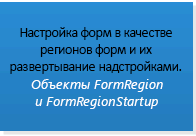

# Выбор API или технологии для разработки решений для Outlook

В этой статье описаны API и технологии, которые можно использовать для расширения Outlook 2013 и Outlook 2016. Кроме того, статья поможет вам решить, какие именно API или технологии больше подходят для выбранного вами сценария.
  
Майкрософт поддерживает различные API и технологии, расширяющие возможности Outlook: 
  
- Начиная с Office 2013 приложения для платформы Office открывают возможности для расширения функциональности Outlook в клиентах Outlook на компьютере, планшете и смартфоне. Эта платформа содержит API JavaScript для Office и схему манифестов приложений.
    
- В решениях Outlook чаще всего использовались такие API, как объектная модель, соответствующая основная сборка взаимодействия Outlook (PIA), а также API обмена сообщениями (MAPI).
    
- В некоторых сферах применения используются вспомогательные API, дополняющие MAPI.
    
- Расширяемость поставщика Outlook Social Connector (OSC) и расширяемость панели прогноза погоды обслуживают конкретные сценарии своих нишевых рынков.
    
В этой статье описаны критерии выбора объектной модели, PIA и MAPI для платформы надстроек Office. Надо учесть, что надстройки Office, использующие API JavaScript для Office, не обращаются к объектной модели, и наоборот. В решениях, использующих другие API, можно использовать один или несколько API-интерфейсов. Например, надстройка COM, написанная на C++, может использовать объектную модель, MAPI и вспомогательные API в одном и том же решении.
  
Для наиболее эффективного использования этой статьи вы должны быть знакомы с Outlook на уровне пользователя и обладать общими знаниями о разработке программного обеспечения. Однако вы не обязаны до тонкостей знать функции, поддерживаемые этими API или технологиями. Эта статья поможет вам ответить на следующие вопросы:
  
- Если у вас есть только общее представление о целях решения,предполагаемом рынке и доступных ресурсах, то какие другие критерии следует использовать для выбора API?
    
- Зачем надо рассматривать надстройки Office и когда надо выбирать создание приложений вместо надстроек?
    
- Если решение нужно запускать в более ранних версиях Outlook, включая Outlook 2003, как это влияет на выбор API?
    
- Если решение должно обрабатывать папки Outlook, содержащие тысячи элементов, и предлагать возможность изменения этих элементов, какой API-интерфейс лучше всего использовать?
    
- Если в решении интенсивно используется бизнес-логика Outlook и взаимодействие с другими приложениями Office, оптимальный выбор — объектная модель Outlook.
    
- Что дают объектная модель и MAPI для расширения возможностей Outlook?
    
- Если задачу можно выполнить с помощью как объектной модели, так и MAPI, как выбрать API для использования?

## Критерии объективной оценки

В данном разделе описаны критерии, по которым можно сравнивать платформу надстроек Office, объектную модель, PIA и MAPI для выбора инструментов, которые лучше всего соответствуют вашим потребностям. Другие критерии могут быть более или менее важными, в зависимости от проектов и доступных ресурсов.
  
В таблицах данного раздела представлены критерии оценки по следующим категориям:
  
- Функциональные критерии — описание того, что можно и чего нельзя реализовать с помощью данной технологии.
    
- Критерии разработки — описание средств разработки или сведений, необходимых для использования технологии.
    
- Критерии безопасности — описание проблем безопасности и доступа, связанных с этой технологией.
    
- Критерии развертывания — описание рекомендуемых методов развертывания и распространения технологии.

### Критерии объективной оценки приложений для платформы Office

Начиная с Office 2013, разработчики могут использовать платформу надстроек Office для расширения веб-служб и контента в контексте полнофункциональных клиентов и веб-клиентов Office. Надстройка Office — это веб-страница, которая разработана при помощи стандартных веб-технологий, размещена в клиентском приложении Office (например, Outlook) и может выполняться локально или в облаке. Из нескольких типов надстроек Office тот тип, который поддерживается в Outlook, называется почтовыми приложениями. Хотя объектная модель, PIA и MAPI часто используются для автоматизации Outlook на уровне приложений, на уровне отдельного элемента для работы с содержимым и свойствами сообщения электронной почты, приглашения на собрание или встречи также можно использовать API JavaScript для Office. Почтовые приложения можно публиковать в магазине Office или во внутреннем каталоге Exchange. 
  
Пользователи и администраторы могут устанавливать почтовые приложения в почтовом ящике Exchange, а также использовать их в полнофункциональном клиенте Outlook и в Outlook Web App. Разработчик может сделать так, чтобы почтовое приложение было доступно только на компьютере, или также разрешить доступ на планшете или смартфоне. На рисунке 1 показан пример почтового приложения YouTube, которое подробно описано в статье [Создание почтовой надстройки для просмотра видео YouTube в Outlook](https://docs.microsoft.com/samples/browse/?redirectedfrom=MSDN-samples). Почтовое приложение YouTube позволяет выбрать URL-адрес видео на сайте YouTube и посмотреть видео в Outlook или Outlook Web App на компьютере или планшете.
  
**Рис. 1. Почтовое приложение YouTube активно для выбранного сообщения, которое содержит URL-адрес видео на сайте YouTube.com**

  
После того как пользователь установит почтовое приложение, оно будет доступно для использования на панели приложения, если текущий контекст соответствует условиям активации, заданным в приложении. Почтовое приложение позволяет задать правила, применяемые к выбранному элементу, которые активируют почтовое приложение только при выполнении определенных условий. Например, почтовое приложение YouTube, которое воспроизводит видео YouTube в Outlook, срабатывает только в том случае, если выбранный элемент Outlook содержит URL-адрес видео на сайте YouTube.com. В этом случае можно указать, что приложение должно быть активным только в том случае, если выбранное сообщение содержит такой URL-адрес.
  
В приведенных ниже таблицах показаны критерии оценки для платформы надстроек Office.
  
#### Функциональные критерии

|**Criteria**|**Поддержка почтовых приложений в приложениях для платформы Office**|
|:-----|:-----|
|Домен приложения    |Область действия почтового приложения — практически все поддерживаемые сообщения или встречи в почтовом ящике Exchange, выбранном пользователем и удовлетворяющем условиям активации. Разрешения почтового приложения определяют его доступ к свойствам и определенным объектам (например, адресу электронной почты или номеру телефона), которые существуют для данного элемента. Например, почтовое приложение, которое запрашивает разрешение на **чтение и запись в почтовый ящик**, может просматривать и записывать все свойства любого элемента в почтовом ящике пользователя; создавать любую папку или элемент, считывать и записывать данные в них, а также отправлять элементы из этого почтового ящика.    |
|Основные объекты    |API JavaScript для Office предоставляет несколько объектов верхнего уровня, которые являются общими для всех типов надстроек Office: [Office](https://msdn.microsoft.com/library/c490b13d-ee52-4291-af5d-f4a5a11d3af0%28Office.15%29.aspx), [Context](https://msdn.microsoft.com/library/662883d5-b86f-4bdc-99f0-9ee9129ed16c%28Office.15%29.aspx) и [AsyncResult](https://msdn.microsoft.com/library/540c114f-0398-425c-baf3-7363f2f6bc47%28Office.15%29.aspx). Следующий уровень API, применимый к почтовым приложениям и зависимый от них, включает объекты [Mailbox](https://msdn.microsoft.com/library/a3880d3b-8a09-4cf9-9274-f2682cb3b769%28Office.15%29.aspx), [Item](https://msdn.microsoft.com/library/ad288df1-3ca2-474c-bea4-c51f46e6fc43%28Office.15%29.aspx) и [UserProfile](https://msdn.microsoft.com/library/6d0a36ec-0d5c-40e3-9f6f-9a7fcf0ac3d8%28Office.15%29.aspx), которые обеспечивают доступ к сведениям о пользователе и элементу, выбранному в его почтовом ящике. На уровне данных объекты [CustomProperties](https://msdn.microsoft.com/library/95a69bd6-c4dc-429a-8b27-e2b68f74f3e3%28Office.15%29.aspx) и [RoamingSettings](https://msdn.microsoft.com/library/cf21bb08-7274-4ad6-ae9e-b2c12f92abc9%28Office.15%29.aspx) поддерживают постоянные свойства, заданные почтовым приложением для выбранного элемента и для почтового ящика пользователя соответственно. К объектам уровня элемента относятся [Appointment](https://msdn.microsoft.com/library/08ebffff-eb52-4e21-9d4e-8f79e426f992%28Office.15%29.aspx) и [Message](https://msdn.microsoft.com/library/909ad9eb-a1bc-4caa-b51e-fd59a02b9569%28Office.15%29.aspx), наследующие объект **Item**, и объект [MeetingRequest](https://msdn.microsoft.com/library/c658fa3d-1138-4a67-9a4b-c9edd11f8385%28Office.15%29.aspx), наследующий объект **Message**. Они представляют типы элементов Outlook, поддерживающих почтовые приложения: элементы встреч и собраний в календаре, а также элементы сообщений, такие как сообщения электронной почты, приглашения на собрания, ответы и отмены. Ниже этого уровня в API имеются свойства уровня элемента (например, [Appointment.subject](https://msdn.microsoft.com/library/ffa6812c-34b8-4b0a-8f92-22c3580c8379%28Office.15%29.aspx)), а также объекты и свойства, которые поддерживают определенные объекты [Entities](https://msdn.microsoft.com/library/1a06c8d1-dafe-46f4-967e-dd9b1d5b20e9%28Office.15%29.aspx) (например, [Contact](https://msdn.microsoft.com/library/2604b44c-7b79-47f0-ac3e-7d99bc9e6751%28Office.15%29.aspx), [MeetingSuggestion](https://msdn.microsoft.com/library/9726fbff-0f4f-4b70-8deb-effc14607d4e%28Office.15%29.aspx), [PhoneNumber](https://msdn.microsoft.com/library/cc86426a-2730-4774-9067-0611e5c8e9c1%28Office.15%29.aspx) и [TaskSuggestion](https://msdn.microsoft.com/library/16b0c3d6-adf4-4a88-ad09-4bb5565816b1%28Office.15%29.aspx)).    Сводка функций, поддерживаемых в почтовых приложениях, приводится в статье [Обзор архитектуры и функций надстроек Outlook](https://msdn.microsoft.com/library/2cd5641b-492b-4431-8388-7fc589163e9c%28Office.15%29.aspx).    |
|Модель доступа к данным    |API JavaScript для Office представляет перечисленные ниже функции в виде иерархического набора объектов: среды выполнения приложения, почтового ящика пользователя и его профиля, а также данных об элементе.    |
|Модели потоков    |Каждое почтовое приложение выполняется в своем собственном процессе отдельно от процесса Outlook.    |
|Архитектуры приложений    |Почтовое приложение в Outlook — это набор веб-страниц HTML и JavaScript, размещенных как отдельный процесс внутри элемента управления браузера, который, в свою очередь, размещен внутри процесса среды выполнения приложения, обеспечивающего безопасность и изоляцию.    |
|Удаленное использование    |Почтовые приложения используют API JavaScript для Office для доступа к данным о текущем пользователе, почтовом ящике и выбранном элементе, которые хранятся на соответствующем сервере Exchange. При условии, что у них есть соответствующие разрешения и для междоменного доступа используется подходящий способ, почтовые приложения также могут обращаться к веб-службам Exchange и другим сторонним веб-службам для расширения их функциональности.    |
|Транзакции    |API JavaScript для Office не поддерживает транзакции.    |
|Доступность    |API-интерфейс JavaScript для Office доступен для почтовых ящиков на сервере Exchange Server 2013, начиная с Outlook 2013.    |
   
#### Критерии разработки

|**Criteria**|**Поддержка почтовых приложений в приложениях для платформы Office**|
|:-----|:-----|
|Языки и инструменты    |Почтовые приложения можно реализовать с помощью любой распространенной веб-технологии, включая HTML5, JavaScript, CSS3, XML и REST API. Можно использовать рекомендуемое средство разработки веб-приложений, или же Napa, Visual Studio 2012 и более поздние версии этих инструментов, оснащенных средствами экономии времени при разработке.    |
|Управляемая реализация    |Можно использовать управляемые страницы ASPX для реализации серверного кода для почтовых приложений, если это допустимо в данной области применения.    |
|Scriptable    |API JavaScript для Office непосредственно используется в сценариях.    |
|Средства тестирования и отладки    |Используйте любые удобные вам инструменты веб-разработки. Napa и Visual Studio предлагают интегрированную среду разработки, которая облегчает тестирование и отладку приложений. В статьях [Устранение неполадок при активации надстроек Outlook](https://msdn.microsoft.com/library/da5b56c9-7fd1-4556-8c0e-f489c4c9e9b6%28Office.15%29.aspx) и [Пример: отладка свойств элементов Outlook](https://code.msdn.microsoft.com/office/Mail-apps-for-Outlook-faca78cd) приведены дополнительные сведения по устранению неполадок и отладке почтовых приложений.    |
|Доступность специалистов    |Программистов с необходимым уровнем квалификации в веб-разработке для надстроек Office относительно легко найти. Платформа предназначена как для профессиональных, так и для непрофессиональных разработчиков.    |
|Доступные сведения    |Сведения о разработке и публикации надстроек Office можно найти в статье [Создание приложений сборки для Office и SharePoint](https://msdn.microsoft.com/office/apps/fp160950.aspx). Специальная документация по почтовым приложениям доступна в [надстройках Outlook](https://msdn.microsoft.com/library/71e64bc9-e347-4f5d-8948-0a47b5dd93e6%28Office.15%29.aspx).    |
|Лицензирование для разработчиков и развертывания    |О платформе лицензирования приложений для Office можно прочитать в статье [Лицензирование надстроек Office и SharePoint](https://msdn.microsoft.com/library/3e0e8ff6-66d6-44ff-b0c2-59108ebd9181%28Office.15%29.aspx).    |
   
#### Security criteria

|**Criteria**|**Поддержка почтовых приложений в приложениях для платформы Office**|
|:-----|:-----|
|Разрешения времени разработки    |Для разработки почтовых приложений не требуются специальные разрешения.    |
|Разрешения при установке    |По умолчанию конечные пользователи и администраторы могут устанавливать почтовые приложения с низким уровнем доверия, для которых требуется **ограниченный** доступ или разрешение на **чтение элемента**, и администраторы могут устанавливать приложения с высоким уровнем доверия, для которых требуется **разрешение на чтение и запись** в почтовом ящике.    |
|Разрешения времени выполнения    |Почтовые приложения запрашивают разрешения определенного уровня, основанные на трехуровневой модели разрешений: **ограниченный доступ**, **чтение элемента** и **чтение и запись почтового ящика**.    |
|Встроенные функции безопасности    | Среда выполнения надстроек Office предлагает следующие меры, предотвращающие повреждение приложением среды конечного пользователя.     Изолирует процесс, в котором работает надстройка.     Не предусматривает замены DLL- или EXE-файлов, а также компонентов ActiveX.     Упрощает установку или удаление приложений пользователем.     Администраторы и пользователи могут управлять доступными почтовыми приложениями, а также указывать, надо ли перед установкой почтового приложения предоставлять требуемое разрешение.     При использовании полнофункциональных клиентов управляет использованием памяти и ЦП, чтобы предотвратить атаки типа "отказ в обслуживании".    |
|Security monitoring features    | For mail apps, the following resources are monitored:     CPU core usage.     Memory usage.     Number of crashes.     Length of time blocking an application.     Regular expression response time.     Number of times re-evaluating regular expressions.     Administrators can override default settings that govern the resource usage.    |
   
#### Deployment criteria

|**Criteria**|**Поддержка почтовых приложений в приложениях для платформы Office**|
|:-----|:-----|
|Требования к платформе сервера    |Почтовый ящик пользователя, для которого устанавливается почтовое приложение, должен размещаться в Exchange Server 2013 или более поздней версии.    |
|Требования к платформе клиента    |Для работы почтового приложения в полнофункциональном клиенте Outlook на компьютере необходимо установить Outlook 2013 и Internet Explorer 9 или более поздней версии этих приложений.    |
|Методы развертывания    |Почтовые приложения можно публиковать в магазине Office или в каталоге Exchange, чтобы приложение стало доступно для пользователей на этом сервере Exchange. Администраторы и пользователи могут затем установить почтовое приложение из магазина Office или каталога Exchange, используя Центр администрирования Exchange (EAC) или запуская удаленные командлеты Windows PowerShell. Обратиться к EAC можно в представлении Outlook Backstage или в Outlook Web App, или же либо непосредственно войти в EAC для вашего почтового ящика.    Дополнительные сведения см. в статье [Развертывание и установка надстроек Outlook для тестирования](https://msdn.microsoft.com/library/d6eea4c4-bb21-4f24-bcba-1eccbb4e12dd%28Office.15%29.aspx).    |
|Deployment notes    |После установки почтового приложения в Outlook или Outlook Web App оно будет доступно для этого почтового ящика в обоих клиентах Outlook.    |

### Критерии объективной оценки приложений для объектной модели и PIA

В решениях, выполняемых на клиентском компьютере, может использоваться объектная модель Outlook или PIA для программного доступа к элементам Outlook, таким как контакты, сообщения, элементы календаря, приглашения на собрания и задачи. В отличие от MAPI, объектная модель Outlook и PIA могут уведомлять о событиях в пользовательском интерфейсе Outlook, таких как изменение текущей папки или отображение инспектора Outlook.
  
> [!NOTE]
> Чтобы решение могло обращаться к данным, хранящимся в почтовом ящике Microsoft Exchange или в PST-файле личных папок, на клиентском компьютере, на котором запущено приложение, необходимо установить и настроить Outlook. > Объектная модель Outlook и PIA обеспечивают одно и то же расширение возможностей Outlook. PIA определяет управляемые интерфейсы, которые сопоставляются с объектной моделью COM и с которым может взаимодействовать управляемое решение. В остальной части данного раздела большая часть критериев применения, защиты и развертывания применима как к объектной модели, так и к PIA. Дополнительную информацию о том, как PIA обеспечивает взаимодействие между COM и .NET Framework см. в статьях [Введение во взаимодействие между COM и .NET](https://msdn.microsoft.com/library/6b2d099a-ec6f-4099-aaf6-e61003fe5a32%28Office.15%29.aspx) и [Архитектура PIA Outlook](https://msdn.microsoft.com/library/89577d14-e6e2-4270-8e72-b0adba378667%28Office.15%29.aspx). 
  
В приведенных ниже таблицах перечислены условия оценки для объектной модели Outlook и PIA.
  
#### Функциональные критерии

|**Criteria**|**Объектная модель Outlook или PIA**|
|:-----|:-----|
|Application domain    |Надстройки и автономные приложения, которые используют объектную модель Outlook или PIA, обычно обрабатывают сообщения для конкретного пользователя, видоизменяют пользовательский интерфейс Outlook или создают элементы пользовательских типов для специализированных решений, таких как системы управления отношениями с клиентами (CRM), которые интегрируются с Outlook. Объектная модель Outlook и PIA иногда используются для обработки сообщений в неформальном рабочем процессе, особенно в том случае, если развертывание приложений на сервере Microsoft Exchange не разрешено. В отличие от браузерных клиентов, режим кэширования позволяет решениям Outlook работать, когда пользователь находится в автономном режиме или отключен от корпоративной сети.    |
|Основные объекты    |Объект верхнего уровня в объектной модели Outlook и PIA — это объект Outlook [Application](https://msdn.microsoft.com/library/797003e7-ecd1-eccb-eaaf-32d6ddde8348%28Office.15%29.aspx). Объекты [Explorers](https://msdn.microsoft.com/library/8398532a-1fad-7390-6778-109ac5e6c67c%28Office.15%29.aspx), [Conversation](https://msdn.microsoft.com/library/2705d38a-ebc0-e5a7-208b-ffe1f5446b1b%28Office.15%29.aspx), [Inspectors](https://msdn.microsoft.com/library/b65475d6-a212-fc96-459d-47390dfe5ee5%28Office.15%29.aspx), [Views](https://msdn.microsoft.com/library/5dd7edc2-12a2-f4c2-d158-8053d80e8dc9%28Office.15%29.aspx), [NavigationPane](https://msdn.microsoft.com/library/b6538c72-6115-99fc-c926-e0532a747823%28Office.15%29.aspx), [SolutionsModule](https://msdn.microsoft.com/library/4597765e-a95d-bf07-2ac4-103218ebc696%28Office.15%29.aspx), [FormRegion](https://msdn.microsoft.com/library/3a0b83eb-4076-9cb3-86a9-68f9e44df89f%28Office.15%29.aspx) и подобные представляют элементы пользовательского интерфейса Outlook. Объекты [NameSpace](https://msdn.microsoft.com/library/f0dcaa19-07f5-5d42-a3bf-2e42b7885644%28Office.15%29.aspx), [Stores](https://msdn.microsoft.com/library/8915a8e4-9c22-21d5-c492-051d393ce5f7%28Office.15%29.aspx), [Folders](https://msdn.microsoft.com/library/0c814c3c-74fc-414c-982d-a0097fcb35c2%28Office.15%29.aspx), [Accounts](https://msdn.microsoft.com/library/2510b7d7-5062-8ea3-dda4-b544d2882a2b%28Office.15%29.aspx), [AccountSelector](https://msdn.microsoft.com/library/846f176e-5680-a214-7624-75f3a524c989%28Office.15%29.aspx), [AddressEntries](https://msdn.microsoft.com/library/db91b717-07c6-d1f2-c545-b766ee1f0c6b%28Office.15%29.aspx), [ExchangeUser](https://msdn.microsoft.com/library/6ec117d1-7fdb-aa36-b567-1242f8238df0%28Office.15%29.aspx) и подобные поддерживают расширение сеансов, профилей, учетных записей пользователей, хранилищ сообщений и папок Outlook. На уровне данных ряд объектов уровня элементов, такие как [MailItem](https://msdn.microsoft.com/library/14197346-05d2-0250-fa4c-4a6b07daf25f%28Office.15%29.aspx), [AppointmentItem](https://msdn.microsoft.com/library/204a409d-654e-27aa-643a-8344c631b82d%28Office.15%29.aspx), [ContactItem](https://msdn.microsoft.com/library/8e32093c-a678-f1fd-3f35-c2d8994d166f%28Office.15%29.aspx) и [TaskItem](https://msdn.microsoft.com/library/5df8cfa5-5460-a5a1-a130-ba5bca1a0091%28Office.15%29.aspx), представляют встроенные элементы Outlook. Объекты [PropertyAccessor](https://msdn.microsoft.com/library/2fc91e13-703c-3ec9-9066-ffee7144306c%28Office.15%29.aspx), [Table](https://msdn.microsoft.com/library/0affaafd-93fe-227a-acee-e09a86cadc20%28Office.15%29.aspx), [Search](https://msdn.microsoft.com/library/226a5d49-3caf-90dd-725c-265404d1939f%28Office.15%29.aspx), [ItemProperties](https://msdn.microsoft.com/library/34a110ed-6617-72da-1e98-a9773c705b40%28Office.15%29.aspx), [UserDefinedProperties](https://msdn.microsoft.com/library/196e5d4c-22be-02d3-95e0-3ea7594c2e4b%28Office.15%29.aspx), [Attachments](https://msdn.microsoft.com/library/4cc96a5f-a822-8ad5-6f61-e996bee8ba22%28Office.15%29.aspx), [Categories](https://msdn.microsoft.com/library/319efa26-269d-9f2f-c8ec-33082e80a9e2%28Office.15%29.aspx), [Recipients](https://msdn.microsoft.com/library/774f56b7-4de8-9584-60cd-4fbf361f4c85%28Office.15%29.aspx), [RecurrencePattern](https://msdn.microsoft.com/library/36c098f7-59fb-879a-5173-ed0260d13fa4%28Office.15%29.aspx), [Reminders](https://msdn.microsoft.com/library/66b94251-7fe4-886b-7c29-7feac4440dee%28Office.15%29.aspx), [Rules](https://msdn.microsoft.com/library/dd41b4de-bf5f-5532-46c9-394a5d078bec%28Office.15%29.aspx) и подобные поддерживают видоизменение объектов уровня элементов и операции с ними.    |
|Модель доступа к данным    |Объектная модель Outlook и PIA представляют все данные в виде иерархического набора объектов и коллекций.    |
|Модели потоков    |Все обращения к объектной модели Outlook и PIA выполняются в основном потоке переднего плана Outlook. Единственная потоковая модель, поддерживаемая объектной моделью Outlook, — является однопотоковое подразделение (STA). Обращение к объектной модели Outlook или PIA из фонового потока не поддерживается и может привести к ошибкам и неожиданным результатам работы решения.    |
|Архитектуры приложений    |Как правило, в надстройках COM и других приложениях Office для расширения возможностей Outlook используется объектная модель Outlook. В управляемых решениях для доступа к объектной модели Outlook можно использовать PIA Outlook и уровень взаимодействия COM в Visual Studio и платформу .NET Framework. В Visual Studio имеются шаблоны и дополнительные библиотеки классов и манифесты, упрощающие настройку документов и приложений Office. Дополнительные сведения об использовании Visual Studio для разработки управляемых надстроек для Outlook см. в статьях [Архитектура надстроек уровня приложения](https://msdn.microsoft.com/library/978f102f-15c6-44e4-84e8-80b161408324.aspx) и [Решения Outlook](https://msdn.microsoft.com/library/2ae3cd9c-bf31-4efa-8b18-b6b1c34a8d93.aspx). Объектная модель Outlook также поддерживает макросы Visual Basic для приложений (VBA) и сервер сценариев Windows (WSH), но не поддерживает приложения служб Windows.    |
|Удаленное использование    |Объектную модель Outlook и PIA можно использовать только на том компьютере, на котором установлено приложение Outlook. Объектную модель Outlook можно использовать для доступа к информации, хранящейся в Exchange, которая доступна в приложении Outlook.    |
|Транзакции    |Объектная модель Outlook и PIA не поддерживают транзакции.    |
|Доступность    |Объектная модель Outlook в настоящее время доступна во всех версиях Outlook. Сборка PIA доступна в версиях Outlook, начиная с Outlook 2003. В каждой новой версии Outlook появляются расширения и усовершенствования.    |
   
#### Критерии разработки

|**Criteria**|**Объектная модель Outlook или PIA**|
|:-----|:-----|
|Языки и инструменты    |Приложения объектной модели Outlook можно реализовать на любом языке, совместимом с COM или автоматизацией, например Visual Basic или C#, а также на других языках, например C или C++. Для разработки управляемых надстроек для Outlook 2010 и Outlook 2007 рекомендуется использовать инструменты разработки Microsoft Office в Microsoft Visual Studio 2010. Рекомендуемые инструменты для Outlook 2003 — Microsoft Visual Studio 2005 Tools для Microsoft Office. Кроме того, можно использовать средства разработки Office в Visual Studio 2010 для создания решений для 32-и 64-разрядных версий Outlook. При создании решения в средствах разработки Office в Visual Studio 2010 или Microsoft Visual Studio Tools для Microsoft Office, если указать целевую платформу **Any CPU** (Любой ЦП), будет получено управляемое решение, пригодное как для 32-разрядной, так и для 64-разрядной версии Outlook 2010.    |
|Управляемая реализация    |PIA Outlook обеспечивает использование объектной модели Outlook в среде управляемого кода, которая поддерживается множеством библиотек классов и технологий поддержки, устраняющих множество ограничений надстроек VBA и COM. PIA — это обертка COM, которая играет роль моста между управляемой средой и средой COM. Дополнительные сведения см. в статье [Причины использования PIA Outlook](https://msdn.microsoft.com/library/5cc9085e-7c97-4698-8cb9-e33e427c02e7%28Office.15%29.aspx).    |
|Scriptable    |Объектную модель Outlook можно использовать в сценариях.    |
|Средства тестирования и отладки    |Для использования объектной модели Outlook или PIA не требуются специальные инструменты отладки. С другой стороны, можно средствами Visual Studio создать интегрированную среду разработки, облегчающую тестирование и отладку приложений.    |
|Доступность специалистов    |Программистов, способных успешно разрабатывать приложения с помощью объектной модели Outlook или PIA, относительно легко найти. Объектная модель Outlook и PIA предназначены для надстроек, созданных с помощью общедоступных инструментов разработки, например Visual Studio. Эти инструменты предлагают среды разработки, которая упрощает процесс разработки.    |
|Доступные сведения    |Сведения о программировании с помощью объектной модели Outlook доступны как в корпорации Майкрософт, так и в сторонних ресурсах. Дополнительные сведения о объектной модели Outlook см. в [Справочнике разработчика Outlook 2010](https://msdn.microsoft.com/library/75e4ad96-62a2-49d2-bc51-48ceab50634c%28Office.15%29.aspx). Дополнительные сведения о PIA в Outlook см. в [Справочнике по основной сборке взаимодействия Outlook 2010](https://msdn.microsoft.com/library/54bdde85-8dc9-4498-a1ac-f72eaf8f0cd3%28Office.15%29.aspx). Примеры управляемых решений Outlook, разработанных с помощью средств разработки Office в Visual Studio, см в статье [Решения Outlook в среде Visual Studio](https://msdn.microsoft.com/vsto/dd162450.aspx).    |
|Лицензирование для разработчиков и развертывания    |Чтобы узнать, требуются ли дополнительные лицензии для использования Outlook и объектной модели Outlook в приложениях, обратитесь к лицензионным соглашениям для Microsoft Exchange и подписки на Microsoft Developer Network (MSDN).    |
   
#### Security criteria

|**Criteria**|**Объектная модель Outlook или PIA**|
|:-----|:-----|
|Разрешения времени разработки    |Для разработки приложений с помощью объектной модели Outlook или PIA не требуются специальные разрешения.    |
|Разрешения при установке    |Для установки приложений, использующих объектную модель Outlook или PIA, не требуются специальные разрешения. Однако для установки Office и Outlook требуются права локального администратора.    |
|Разрешения времени выполнения    |Для запуска приложений, использующих объектную модель Outlook или PIA, не требуются специальные разрешения.    |
|Встроенные функции безопасности    |Объектная модель Outlook и PIA обмениваются данными с Exchange с помощью MAPI, а с Active Directory — с помощью интерфейсов службы Active Directory (ADSI). Для определения ресурсов, доступ к которым может получить код приложения, используется текущий контекст безопасности пользователя, который запустил приложение. По умолчанию надстройки являются доверенными для полного доступа ко всем объектам, свойствам и методам объектной модели Outlook или PIA. ИТ-администраторы могут осуществлять контроль над тем, какие надстройки и объекты могут получить доступ к объектной модели Outlook или PIA. Объектная модель Outlook и PIA запрещают доступ к защищенным объектам и методам коду, который выполняется вне процесса Outlook.    |
|Security monitoring features    | Outlook monitors the following metrics of an add-in to determine whether it should disable the add-in:     Startup     Shutdown     Folder switch     Item open    **Invoke** frequency     Administrators can use group policy to override user settings and control the add-ins that run on the user's computers.     For more information, see [Performance criteria for keeping add-ins enabled](https://msdn.microsoft.com/library/office/4c6d44d2-238b-42d8-896b-51d513c9e14c#ol15WhatsNew_AddinDisabling).    |
   
#### Deployment criteria

|**Criteria**|**Объектная модель Outlook или PIA**|
|:-----|:-----|
|Требования к платформе сервера    |Объектная модель Outlook и PIA представляют собой клиентские технологии.    |
|Требования к платформе клиента    |Приложения, которые используют объектную модель Outlook или PIA для доступа к данным Exchange, требуют, чтобы на локальном компьютере было установлено приложение Outlook.    |
|Методы развертывания    |Приложения, использующие объектную модель Outlook или PIA, распространяются с использованием стандартного программного обеспечения для установки приложений.    |
|Deployment notes    |Так как на сервере Exchange нельзя устанавливать Outlook, приложения, использующие объектную модель Outlook или PIA, невозможно запускать на сервере Exchange.    |

### Критерии объективной оценки для MAPI

MAPI можно использовать для доступа к элементам и папкам в общедоступных и частных хранилищах, а также для доступа к свойствам, хранящимся в каждом из них. Все версии Outlook используют MAPI. Можно создавать клиенты, использующие MAPI, а также создавать серверы MAPI и обработчики форм MAPI. Сведения, приведенные в этом разделе, относятся только к клиентским приложениям MAPI.
  
> [!NOTE]
> MAPI — это испытанная технология, которая используется для доступа к информации в Exchange или в PST-файле личных папок и предоставляет некоторые возможности, недоступные в других API-интерфейсах. Однако MAPI не работает за пределами интрасети, поддерживает открытое подключение в течение всего сеанса MAPI и может представлять трудности для изучения. MAPI не требует использования бизнес-логики Outlook, поэтому, если необходимо применять бизнес-логику Outlook, ее следует обеспечить другими средствами. 
  
В следующих таблицах показаны критерии для MAPI.
  
#### Функциональные критерии

|**Criteria**|**MAPI**|
|:-----|:-----|
|Домен приложения    |Клиентские приложения, использующие MAPI, получают доступ к информации почтового ящика пользователя или общей папки, хранящихся в Exchange, а также информацию каталога пользователей, который хранится в службе Active Directory. Как правило, клиентские приложения, использующие MAPI, — это клиенты электронной почты, такие как Outlook, и приложения, в которых требуется сложная обработка электронной почты.    |
|Основные объекты    |Объекты MAPI можно получить через интерфейс [IMAPISession : IUnknown](https://msdn.microsoft.com/library/5650fa2a-6e62-451c-964e-363f7bee2344%28Office.15%29.aspx). Объект сеанса предоставляет клиентский доступ к объектам для работы с профилями MAPI, состоянием, администрированием поставщика службы сообщений, таблицами хранилища сообщений и адресными книгами. Таблица хранилища сообщений содержит объекты для хранилища сообщений, папки, сообщений, вложений и получателей. Таблицы адресных книг содержат объекты для пользователей службы сообщений и списков рассылки.    |
|Модель доступа к данным    |MAPI представляет сообщения и пользователей в виде иерархического набора объектов.    |
|Модели потоков    |Особых запретов на использование потоков нет. Однако приложения, использующие модель свободных потоков, не должны предоставлять общий доступ к объектам MAPI в разных потоках из-за высоких затрат на маршалинг объекта. Поставщики услуг MAPI и MAPI используют модель свободных потоков.    |
|Архитектуры приложений    |Клиентские приложения MAPI, как правило, представляют собой клиентские приложения на основе Windows Forms. Однако можно использовать MAPI и для написания многоуровневых приложений.    |
|Удаленное использование    |MAPI использует удаленные вызовы процедур (RPC) для связи с сервером Exchange. Как правило, передача таких вызовов через брандмауэры Интернета запрещается.    |
|Транзакции    |MAPI не поддерживает транзакции.    |
|Доступность    |В настоящий момент заглушка MAPI поставляется со всеми версиями Windows. При установке Outlook в Office устанавливается отдельная подсистема MAPI. На данный момент изменения в MAPI не принимаются.    |
   
#### Критерии разработки

|**Criteria**|**MAPI**|
|:-----|:-----|
|Языки и инструменты    |Можно обращаться к MAPI напрямую, используя C или C++. Другие языки, использующие соглашение о вызовах C/C++, также могут обращаться к MAPI. Использование управляемых языков, таких как Visual Basic или C#, не поддерживается. Решения MAPI для 32- и 64-разрядных версий Outlook необходимо компилировать отдельно.    |
|Managed implementation    |MAPI — это неуправляемый компонент. Использование MAPI не поддерживается на уровне COM-совместимости Visual Studio и в .NET Framework. Дополнительные сведения о поддержке MAPI для управляемых компонентов см. в статье базы знаний [KB 266353: рекомендации поддержки для разработки клиентской системы обмена сообщениями](https://go.microsoft.com/fwlink/?LinkId=133254).    |
|Scriptable    |MAPI нельзя использовать в сценариях напрямую.    |
|Средства тестирования и отладки    |Для отладки приложений, использующих MAPI, не требуются специальные инструменты отладки. Также можно использовать средство [MFCMAPI](https://mfcmapi.codeplex.com/). Это средство с помощью MAPI предоставляет доступ к хранилищу MAPI через графический пользовательский интерфейс, а также помогает исследовать проблемы, возникающие при расширении возможностей Outlook с помощью MAPI.    |
|Доступность специалистов    |Найти опытных программистов по MAPI может быть затруднительно, и изучение технологии может занять много времени. Кроме сообществ Майкрософт, существует лишь небольшое число высококачественных сторонних веб-сайтов, которые содержат полезные сведения о разработке MAPI.    |
|Доступные сведения    |Имеются как источники Microsoft, так и книги других издателей, в которых описывается программирование MAPI.    |
|Лицензирование для разработчиков и развертывания    |No special licensing is required for developing applications that use MAPI.    |
   
#### Security criteria

|**Criteria**|**MAPI**|
|:-----|:-----|
|Разрешения времени разработки    |Разработчик должен иметь разрешения на доступ к данным в хранилище Exchange. В Exchange информация пользователей и списков рассылки хранится в службе каталогов Active Directory, поэтому разработчики, создающие клиентские приложения MAPI с доступом к этой информации, должны иметь возможность чтения и записи этой информации.    |
|Разрешения при установке    |Для настройки приложений на основе MAPI обычно требуются права локального администратора или права на установку программного обеспечения.    |
|Разрешения времени выполнения    |Для запуска приложения на основе MAPI, как правило, достаточно, чтобы у пользователя были необходимые разрешения на доступ к данным в хранилище Exchange или в файле личных папок (PST).    |
|Встроенные функции безопасности    |Профили MAPI на большинстве платформ можно защищать паролями.    |
   
#### Deployment criteria

|**Criteria**|**MAPI**|
|:-----|:-----|
|Требования к платформе сервера    |Сервер Exchange, на котором хранятся пользовательские данные для пользователей клиентского приложения MAPI, должен быть правильно настроен, чтобы разрешить доступ клиентам MAPI.    |
|Требования к платформе клиента    |Установщик клиентского приложения должен убедиться в том, что на компьютере имеется требуемая версия MAPI и что она правильно настроена с помощью файла Mapisvc.inf.    |
|Методы развертывания    |Приложения, использующие MAPI, можно развертывать на клиентских компьютерах с помощью стандартных технологий распространения программного обеспечения.    |
|Deployment notes    |Установщик должен убедиться в наличии требуемой версии MAPI.    |

## Решающие факторы для приложений для платформы Office

Поскольку надстройки Office используют веб-технологии, они лучше всего подходят для подключения к службам в облаке или в локальной среде, а также для внесения служб в контекст полнофункционального клиента и веб-клиента. Запрашивая соответствующие разрешения, почтовые приложения также позволяют читать, записывать и отправлять элементы в почтовом ящике.
  
Ниже приведены распространенные причины, по которым почтовые приложения более удобны для разработчиков, чем надстройки.
  
- Можно использовать существующие знания и преимущества веб-технологий, таких как HTML, JavaScript и CSS. Для опытных пользователей и разработчиков-новичков XML, HTML и JavaScript требуют значительно меньше времени на освоение, чем API на базе COM, включая объектную модель и MAPI.
    
- Можно использовать простую модель веб-развертывания для обновления почтового приложения (в том числе веб-служб, используемых приложением) на веб-сервере без сложной процедуры установки в клиенте Outlook. По сути, любые обновления почтового приложения, за исключением манифеста приложения, не требуют обновления в клиенте Office. Можно обновлять код или пользовательский интерфейс почтового приложения лишь на веб-сервере. Это дает преимущество перед обновлением настроек, связанным со значительными административными издержками.
    
- Можно использовать стандартную платформу веб-разработки для почтовых приложений, которые могут размещаться в полнофункциональном клиенте Outlook и Outlook Web App на компьютере, планшете и смартфоне. С другой стороны, надстройки используют объектную модель полнофункционального клиента Outlook и, следовательно, могут работать только в таком многофункциональном клиенте на компьютере.
    
- Доступно быстрое создание приложений и их выпуск через магазин Office.
    
- Исходя из трехуровневой модели разрешений, пользователи и администраторы получают более высокий уровень безопасности и конфиденциальности в почтовых приложениях, чем в надстройках, которые имеют полный доступ к содержимому каждой учетной записи в профиле пользователя. Это, в свою очередь, способствует интересу пользователей к приложениям.
    
- В зависимости от ситуации применения могут существовать функции, доступные только в почтовых приложениях и не поддерживаемые надстройками:
    
  - Можно указать, чтобы почтовое приложение активировалось только в определенных контекстах (например, приложение отображается на панели приложения в Outlook, только если выбранная пользователем встреча имеет класс IPM.Appointment.Contoso или если текст сообщения электронной почты содержит номер отслеживания пакета или идентификатор клиента).
    
  - Можно активировать почтовое приложение, если выбранное сообщение содержит определенные известные объекты, такие как адрес, контакт, адрес электронной почты, предложение встречи или предложение задачи.
    
  - Можно использовать проверку подлинности по маркерам удостоверения, а также веб-службы Exchange.
    
Однако указанные ниже функции имеются только в надстройках, что в некоторых случаях может заставить сделать выбор в их пользу перед почтовыми приложениями.
  
- Надстройки можно использовать для расширения или автоматизации Outlook на уровне приложений, так как объектная модель и PIA более тесно интегрированы с функциями Outlook (такими как все типы элементов Outlook, пользовательский интерфейс, сеансы и правила). На уровне элементов надстройки могут взаимодействовать с элементами в режиме чтения или создания. В почтовых приложениях невозможна автоматизация Outlook на уровне приложений, и функциональные возможности Outlook можно расширять только в контексте режима чтения поддерживаемых элементов (сообщений и встреч) в почтовом ящике пользователя.
    
- Можно указать нестандартную бизнес-логику для нового типа элементов.
    
- Можно изменять и добавлять собственные команды на ленте и в представлении Backstage.
    
- Можно создать настраиваемую страницу формы или область формы.
    
- Можно обнаруживать события, такие как отправка элемента или изменение его свойств.
    
- Вы можете использовать надстройки в Outlook 2013 и Exchange Server 2013, так же, как в более ранних версиях Outlook и Exchange. С другой стороны, почтовые приложения работают с Outlook и Exchange, начиная с Outlook 2013 и Exchange Server 2013 (более ранние версии не поддерживаются).
    
Дополнительные сведения о сценариях использование объектной модели и PIA, см. в следующем разделе: [Факторы, влияющие на выбор объектной модели или PIA](#OLSelectAPI_FactorsOM). Сравнение платформы надстроек Office с другими технологиями расширения Office см. в статье [Общие сведения о приложениях для Office и SharePoint](https://blogs.msdn.com/b/officeapps/archive/2012/07/23/introducing-apps-for-the-new-office-and-sharepoint.aspx).

## Решающие факторы для объектной модели или PIA

### Сценарии базового плана, которые поддерживает объектная модель Outlook или PIA

Как правило, объектная модель или PIA используется для решений, которые видоизменяют пользовательский интерфейс Outlook или используют бизнес-логику Outlook. Ниже перечислены основные сценарии, в которых решения Outlook используют объектная модель или PIA. 
  
- [Настройка пользовательского интерфейса Outlook](#OLSelectAPI_CustomizeTheOutlookInterface)
- [Добавление, удаление, чтение, запись, фильтрация, поиск и сортировка элементов Outlook](https://docs.microsoft.com/office/vba/outlook/How-to/Items-Folders-and-Stores/outlook-item-objects)
- [Настройка полей, форм и свойств элемента](#OLSelectAPI_ItemPropFieldsForms)
- [Обработка таких событий Outlook, как переключение между папками или открытие элемента](#OLSelectAPI_Events)
- [Автоматизация Outlook и интеграция с другими приложениями Office](#OLSelectAPI_AutomateOutlook)

<!--Images removed because we can't add a link to the images. If someone figures out a way to do this, you can add them back in but they're not really needed; I replaced them with a bulleted list here and after the next paragraph: 

-->

### Сценарии, которые поддерживает объектная модель или PIA, начиная с Outlook 2007

В дополнение к основным сценариям, если решение Outlook поддерживает какие-либо из приведенных в следующем списке сценариев, а ваше решение предназначено для работы в Outlook 2007 или более поздней версии, но не в более ранних версиях, можно использовать как объектную модель, так и PIA. На рисунке 3 показаны основные объекты или члены, которые можно использовать в объектной модели Outlook для расширения каждого сценария (за исключением интерфейса [IDTExtensibility2](https://docs.microsoft.com/dotnet/api/extensibility.idtextensibility2?view=visualstudiosdk-2017) в модели объектов автоматизации Visual Studio и интерфейса [IRibbonExtensibility](https://docs.microsoft.com/office/vba/api/Office.IRibbonExtensibility) в объектной модели Office, которые можно интегрировать с объектной моделью Outlook). 

- [Настройка пользовательского интерфейса — лента Office Fluent, область навигации, область задач](#OLSelectAPI_CustomizeTheOutlookInterface)
- [Настройка форм в качестве регионов форм и их развертывание надстройками](#OLSelectAPI_CustomFormRegions)
- [Установка и получение встроенных свойств на уровне элемента, которые не предоставляются в объектной модели](#OLSelectAPI_CustomizingProperties)
- [Перечисление и просмотр множества элементов в папке](#OLSelectAPI_Enumerating)
- [Пометка элементов как задач](#OLSelectAPI_ItemsFlag)
- [Общий доступ к календарям, RSS-каналам и папкам](#OLSelectAPI_Sharing)
- [Добавление, удаление, сохранение и получение уровня блокировки, пути, размера и типа вложения](#OLSelectAPI_Attachments)
- [Управление правилами, часовыми поясами и представлениями](#OLSelectAPI_Misc)
- [Добавление или удаление категории в основном списке категорий для текущего профиля](#OLSelectAPI_Categories)
- [Получение подробных сведений для учетной записи в текущем профиле](#OLSelectAPI_PrimaryAccount)
- [Получение подробных сведений о списке рассылки Exchange или пользователе Exchange в качестве записи адреса](#OLSelectAPI_AddressBook)
- [Хранение частных данных для решений](#OLSelectAPI_StoringData)

<!--More removed images

-->

### Сценарии, которые поддерживает объектная модель или PIA, начиная с Outlook 2010

Если решение Outlook предназначено для работы в Outlook 2010, а не в более ранних версиях, можно использовать объектную модель или PIA для поддержки сценариев, приведенных в следующем разделе. На рисунке 3 показаны основные объекты или члены, которые можно использовать в объектной модели Outlook для расширения каждого сценария (за исключением интерфейсов [IRibbonControl](https://docs.microsoft.com/office/vba/api/Office.IRibbonControl), [IRibbonExtensibility](https://docs.microsoft.com/office/vba/api/Office.IRibbonExtensibility) и [IRibbonUI](https://docs.microsoft.com/office/vba/api/Office.IRibbonUI) в объектной модели Office, которые можно интегрировать с объектной моделью Outlook). 
   
- [Настройка пользовательского интерфейса Outlook 2010, например представления Office Backstage и контекстных меню](#OLSelectAPI_CustomizingUIOutlook2010)
- [Управление разнородными элементами беседы и доступ к ним](#OLSelectAPI_Conversations)
- [Управление выбором элементов в проводнике или поиск выделенного фрагмента](#OLSelectAPI_ItemSelection)
- [Управление выбором вложений в инспекторе](#OLSelectAPI_AttachmentSelection)
- [Поддержка нескольких учетных записей Exchange в одном профиле](#OLSelectAPI_MultipleAccounts)
- [Создание карточки контакта для адресной записи](https://docs.microsoft.com/office/vba/api/Outlook.NameSpace.CreateContactCard)
- [Упорядочение папок конкретных решений в модуле "Решения"](#OLSelectAPI_Folders)

<!--more removed images:

-->

### Сценарии, которые поддерживает объектная модель или PIA, начиная с Outlook 2013

Если решение предназначено для работы в Outlook 2013, а не в более ранних версиях, можно использовать объектную модель или PIA для поддержки сценариев, описанных в перечисленных ниже ресурсах.

- [Представление просмотра для всех контактов в текущей папке](https://docs.microsoft.com/office/vba/api/Outlook.peopleview)
- [Выбор встроенного ответа в области чтения](#OLSelectAPI_InlineResponse)
- [Отображение диалогового окна проверки адреса или полного имени для контакта](#OLSelectAPI_ContactCheckDialogs)
- [Определение того, что свойства элемента прочитаны](https://docs.microsoft.com/office/vba/outlook/How-to/Items-Folders-and-Stores/outlook-item-objects)

<!--more removed images:

-->

## Решающие факторы для MAPI

В общем случае MAPI используется для доступа к данным на MAPI-сервере, например Microsoft Exchange Server, и выполнения таких задач, как:
  
- Создание настраиваемого поставщика услуг, например поставщика адресных книг, поставщика транспорта или поставщика хранилища.
    
- Создание процесса-приемника.
    
- Создание профиля и операции с ним.
    
- Запуск приложения в качестве службы Windows NT.
    
- Выполнение задач в фоновом потоке; например, перечисление многочисленных элементов в папке и изменение свойств элементов в фоновом потоке может повысить производительность.
    
Дополнительные сведения и примеры кода см. в [Справочнике по Outlook MAPI](https://msdn.microsoft.com/library/3d980b86-7001-4869-9780-121c6bfc7275%28Office.15%29.aspx) и [MFCMAPI](https://mfcmapi.codeplex.com/).
  
Кроме того, если ваше решение работает в более ранней версии Outlook, чем Outlook 2007, а в решении применяются перечисленные ниже сценарии, используйте MAPI для расширения этих сценариев.
  
- Установка и получение встроенных свойств на уровне элемента, которые не предоставляются в объектной модели.
    
- Управление учетными записями, вложениями, списками рассылки Exchange, пользователями Exchange и хранилищами.
    
- Хранение частных данных для решений.
    
- Управление хранилищем сообщений для учетной записи.
    
Начиная с Outlook 2007 объектная модель поддерживает ряд функций, за которыми до Outlook 2007 разработчикам приходилось обращаться к MAPI или другим API-интерфейсам, таким как Microsoft Collaboration Data Objects (CDO) 1.2.1 и клиентские расширения Microsoft Exchange. Поэтому, если хотя бы один из сценариев, приведенных в предыдущем списке, подходит для вашего решения, но оно работает в Outlook 2007 или Outlook 2010, для поддержки этих сценариев можно использовать объектную модель Outlook или PIA. Дополнительные сведения о новых возможностях Outlook 2007, которые унифицируют технологии разработки Outlook, см. в статье [Новые возможности для разработчиков в Outlook 2007 (часть 1 из 2)](https://msdn.microsoft.com/library/76e3f0b7-ef2b-4e9f-8515-3002d75d7721%28Office.15%29.aspx).

## Решающие факторы для вспомогательных API

В некоторых ситуациях, когда объектная модель или MAPI не дает решения, можно интегрировать вспомогательные API Outlook с бизнес-логикой Outlook или MAPI. Используйте вспомогательные API Outlook в следующих случаях:
  
- Управление учетными записями: управление информацией учетной записи, операции с учетными записями, уведомление об изменениях учетной записи и защита учетных записей от спама. 
    
- Замедление данных: обтекание объекта в предпочтительном символьном формате, а не предоставление объекта в его исходном формате.
    
- Перевод времени календарей и поддержка часовых поясов: перевод календарей Outlook на летнее время.
    
- Состояние доступности: предоставление сведений о доступности в календарях.
    
- Изображения контактов: определение вида изображения контакта в Outlook.
    
- Действительность элемента: определение наличия несохраненных изменений в элементе Outlook.
    
- Классификация элемента: выбор категории для элемента Outlook после его отправки.
    
Дополнительные сведения о вспомогательных API см. в разделе [Дополнительные ресурсы — вспомогательные API](#OLSelectAPI_AdditionalResourcesAuxAPIs). 

## Автоматизация Outlook с помощью внутрипроцессных или внепроцессных решений

> [!NOTE]
> Описание автоматизации Outlook в этом и следующем разделах выходит за рамки надстроек Office, которые предназначены для расширения функциональности клиента или веб-приложения Office, но не для их автоматизации. 
  
Outlook поддерживает автоматизацию путем использования надстроек, которые выполняются в том же основном процессе, что и процесс Outlook, а также с помощью автономных решений, которые выполняются в отдельном процессе вне процесса Outlook. Как правило, для автоматизации Outlook надстройка используется для взаимодействия с Outlook через объектную модель, PIA или MAPI и, в менее распространенных сценариях, через вспомогательный API-интерфейс (например, [HrProcessConvActionForSentItem](auxiliary/hrprocessconvactionforsentitem.md)). Внепроцессное решение следует использовать только в том случае, когда это необходимо (например, при создании клиентского приложения MAPI, в котором используется файл Tzmovelib.dll для перевода времени календарей Outlook для клиентов, или при перечислении многочисленных элементов в папке и изменении их свойств в фоновом потоке для повышения производительности). 
  
Надстройки — это оптимальное решение для автоматизации Outlook, потому что Outlook доверяет только объекту [Application](https://msdn.microsoft.com/library/797003e7-ecd1-eccb-eaaf-32d6ddde8348%28Office.15%29.aspx), переданному в надстройку во время события [OnConnection(Object, ext_ConnectMode, Object, Array)](https://msdn.microsoft.com/library/Extensibility.IDTExtensibility2.OnConnection.aspx) в надстройке. Можно избежать появления предупреждений системы безопасности объектной модели, наследуя все объекты, свойства и методы из этого объекта **Application**. Если надстройка создает новый экземпляр объекта **Application**, Outlook не будет доверять этому объекту, даже если надстройка присутствует в списке надежных надстроек. Все объекты, свойства и методы, унаследованные от такого объекта **Application**, не будут доверенными, а заблокированные свойства и методы будут вызывать предупреждения системы безопасности. Дополнительные сведения см. в статье [Режим безопасности объектной модели Outlook](https://msdn.microsoft.com/library/4aa3b7c7-5f3f-41ce-bbf3-75d8ecbd6d4f%28Office.15%29.aspx).

## Автоматизация Outlook с помощью управляемых и неуправляемых решений

Outlook поддерживает автоматизацию с помощью надстроек и автономных приложений, написанных на управляемых или неуправляемых языках. Чаще всего используются управляемые языки C# и Visual Basic. Инструменты C++ и Delphi чаще всего используются в неуправляемой среде. Это одно из соображений, которые следует учитывать при выборе между управляемой и неуправляемой разработкой. 
  
Если в решении используется только объектная модель, можно разработать управляемое решение с помощью PIA или средств разработки Office в Visual Studio. Средства разработки Office в Visual Studio предлагают шаблоны проектов и визуальные конструкторы, упрощающие создание нестандартных пользовательских интерфейсов и разработку решений Office.

С другой стороны, поскольку технология MAPI была разработана гораздо раньше, чем .NET Framework, а корпорация Майкрософт не предоставляет управляемых оболочек для MAPI, корпорация Майкрософт не поддерживает использование MAPI в управляемом коде. В случае использования MAPI необходимо разрабатывать неуправляемое решение. Дополнительные сведения см. в статье [Рекомендации поддержки для разработки клиентской системы обмена сообщениями](https://support.office.com/article/Best-practices-for-Outlook-f90e5f69-8832-4d89-95b3-bfdf76c82ef8).
  
## Niche APIs and technologies

## Нишевые API и технологии

Outlook Social Connector (OSC) и панель прогноза погоды поддерживают очень специфичные сценарии использования Outlook. 
  
### Расширяемость поставщика Outlook Social Connector (OSC)

Расширяемость поставщика Outlook Social Connector (OSC) поддерживает разработку поставщика социальных сетей, который позволяет пользователям просматривать в Outlook и других клиентских приложениях Office обновления друзей и событий в этой социальной сети. На рисунке 6 показано, как OSC отображает в области "Люди" события для определенного лица на сайтах социальных сетей.
  
**Рис. 6. OSC с отображением данных из социальной сети в области "Люди"**

  
OSC в Outlook позволяет пользователям просматривать в области "Люди" сводку сообщений электронной почты, вложений и приглашений на собрания от определенного лица в Outlook. В организационной среде пользователи, которые совместно работают на сайте SharePoint, могут просматривать обновления документов и другие действия этого лица на сайте SharePoint. Расширяемость поставщика услуг Outlook Social Connector поддерживает разработку поставщика для OSC, предназначенного для синхронизации и отображения обновлений социальных сетей в Outlook. Стандартные поставщики OSC (например, Facebook и LinkedIn) устанавливаются в Outlook по умолчанию. В зависимости от сайтов социальных сетей, на которые вошел пользователь Outlook выполнил вход, он будет видеть в области "Люди" такие обновления, как фотографии, статус и действия в соответствующих социальных сетях. 
  
### Weather Bar extensibility

Начиная с Outlook 2013 панель прогноза погоды позволяет разработчикам добавлять сторонние веб-службы для показа прогноза погоды в выбранном пользователем месте. На панели прогноза погоды в Outlook отображаются погодные условия и прогноз для заданного местоположения. Пользователь может выбрать одно или несколько местоположений, а также просмотреть данные о погоде на панели прогноза погоды в модуле календаря. На рисунке 7 показана панель прогноза погоды с прогнозом на три дня для Нью-Йорка. 
  
**Figure 7. Weather Bar in Outlook**

  
По умолчанию в Outlook используются данные прогноза погоды, предоставляемые службой "MSN Погода". Панель прогноза погоды поддерживает сторонние погодные веб-службы, использующие определенный протокол для связи с Outlook. Если сторонняя служба данных погоды поддерживает такой протокол, пользователи могут выбрать эту службу для показа данных погоды на панели прогноза погоды.
  
Дополнительные сведения об использовании расширяемости поставщика OSC и расширяемости панели прогноза погоды см. в статье [Дополнительные ресурсы: основные ссылки, ресурсы и примеры кода](#OLSelectAPI_AdditionalResourcesRefCode). 

## Заключение

Чтобы определить оптимальные API или технологии для решения, нужно сначала установить цели вашего решения. 
  
- Версии Outlook, которые должно поддерживать решение.
    
- Высокоприоритетные сценарии вашего решения. Будет ли решение в основном работать с контентом и свойствами сообщения или встречи? Или решение автоматизирует Outlook на уровне приложения? Если да, предусматривают ли эти сценарии перечисление, фильтрацию или изменение папок, содержащих множество элементов Outlook?
    
Сначала убедитесь в том, что поддержка почтового приложения на платформе надстроек Office соответствует вашим нуждам. Ознакомьтесь с разделом "Функциональные критерии" статьи [Критерии объективной оценки приложений для платформы Office](#OLSelectAPI_ObjectiveEvalCritApps) и определите, поддерживают ли ваши сценарии основные объекты и компоненты. Ознакомьтесь с разделом [Решающие факторы для приложений платформы Office](#OLSelectAPI_FactorsApps) и установите, действительно ли почтовые приложения лучше надстроек для ваших сценариев. Как правило, разрабатывайте свое решение как приложение, если это возможно, чтобы использовать поддержку платформы в клиентах Outlook различного форм-фактора. 
  
Если ваши сценарии требуют не ограничиваться сообщениями и встречами или автоматизировать Outlook на уровне приложения, попробуйте сопоставить эти сценарии с описанными в разделе [Решающие факторы для объектной модели или PIA](#OLSelectAPI_FactorsOM). Если объектная модель (или PIA) целевых версий Outlook поддерживает ваши сценарии, а решение не управляет папками с большим количеством элементов, следует реализовать решение в виде надстройки, с использованием как управляемого, так и неуправляемого языка. 
  
Если объектная модель (или PIA) целевой версии Outlook не поддерживает некоторые из этих сценариев, проверьте, соответствуют ли вашим нуждам сценарии, приведенные в разделах [Решающие факторы для MAPI](#OLSelectAPI_FactorsMAPI) или [Решающие факторы для вспомогательных API](#OLSelectAPI_FactorsAux). Если MAPI удовлетворяет вашим потребностям, следует реализовать решение в неуправляемом коде. Если вспомогательный API-интерфейс выполняет один из сценариев, можно использовать управляемый или неуправляемый код. 
  
Если в решении используется MAPI, его необходимо реализовать в неуправляемом коде, например на C++. В ином случае решение об использовании управляемого или неуправляемого кода для создания решения обычно зависит от доступных ресурсов и знаний. Рассуждая, следует ли реализовать решение как надстройку или отдельное приложение, выберите надстройку, чтобы пользователи не сталкивались с постоянными предупреждениями системы безопасности объектной модели Outlook, если только вашему сценарию не требуется работать с папками, содержащими множество элементов. В последнем случае реализация решения для работы в фоновом потоке может оптимизировать производительность Outlook.
  
Если сценарии предусматривают отображение информации или обновлений из социальных сетей в Outlook, используйте расширяемость поставщика OSC для создания DLL с видимостью COM. Это можно сделать с помощью как управляемого, так и неуправляемого языка.
  
Если вас интересует подключение сторонней службы погодных данных к панели прогноза погоды, можно воспользоваться протоколом, определенным расширяемостью панели прогноза погоды, и указать соответствующие веб-службы. Такие веб-службы можно создавать на управляемом языке.
  
Выбрав API или технологии для использования в решении, вы можете обратиться к дополнительной документации и примерам кода в разделе [Дополнительные ресурсы: основные ссылки, ресурсы и примеры кода](#OLSelectAPI_AdditionalResourcesRefCode). 

[Обзор платформы надстроек Office](https://docs.microsoft.com/office/dev/add-ins/overview/office-add-ins?redirectedfrom=MSDN) provides a good introduction of Надстройки Office, including the architecture and development life cycle. 
  
Подробный план ресурсов, посвященных разработке почтовых приложений, см. в статье [Надстройки Outlook](https://docs.microsoft.com/outlook/add-ins/?redirectedfrom=MSDN). 
  
## См. также: "Объектная модель и PIA"

## См. также: "Объектная модель и PIA"

В приведенных ниже ресурсах можно найти дополнительные сведения об использовании объектной модели и PIA.

- [Account](https://docs.microsoft.com/office/vba/api/Outlook.Account) object 

    
- Свойство [NameSpace.Accounts](https://msdn.microsoft.com/library/80e969ea-d2cc-966d-5fe4-68d59951b5c9%28Office.15%29.aspx) 

### Учетные записи: несколько учетных записей в профиле

- Объект [Account](https://msdn.microsoft.com/library/f624438c-4e45-2822-18b6-bfe8074a33c0%28Office.15%29.aspx) 
    
- [Использование нескольких учетных записей для одного профиля в Outlook](https://msdn.microsoft.com/library/9e06e076-d62a-37c8-4502-709da5a0b104%28Office.15%29.aspx)
    
- [Получение информации для нескольких учетных записей](https://msdn.microsoft.com/library/af587ee2-429a-252f-ecb6-2f058b9a37a8%28Office.15%29.aspx)
    
- [Управление несколькими учетными записями Exchange в Outlook 2010](https://msdn.microsoft.com/library/b5a80da9-102d-4617-8a06-49ded01a237a%28Office.15%29.aspx) 

### Адресная книга и пользователи Exchange

- [Отображение имен из адресной книги](https://msdn.microsoft.com/library/32e7179c-8133-ee20-ecf6-52c9275f205f%28Office.15%29.aspx)
    
- [Доступ к информации о пользователе или списке рассылки Exchange из адресной книги](https://msdn.microsoft.com/library/077a8666-09c5-e641-0b9b-7d83133d931f%28Office.15%29.aspx)
    
- [Отображение групп, в которых состоит руководитель](https://msdn.microsoft.com/library/2f0ff92c-e026-4f62-c039-fbda9aaf1546%28Office.15%29.aspx)
    
- [Отображение имени и расположения офиса каждого руководителя из списка рассылки Exchange](https://msdn.microsoft.com/library/abc26854-62db-be7f-4025-46acbcb42541%28Office.15%29.aspx)
    
- Объект [AddressEntries](https://msdn.microsoft.com/library/db91b717-07c6-d1f2-c545-b766ee1f0c6b%28Office.15%29.aspx) 
    
- Объект [AddressLists](https://msdn.microsoft.com/library/b8c5ce75-3030-0179-45bb-f44fe6628074%28Office.15%29.aspx) 
    
- Объект [ExchangeDistributionList](https://msdn.microsoft.com/library/2830dfba-6c0a-a81f-6b98-92ac2aafb59d%28Office.15%29.aspx) 
    
- Объект [ExchangeUser](https://msdn.microsoft.com/library/6ec117d1-7fdb-aa36-b567-1242f8238df0%28Office.15%29.aspx) 
    
- Объект [SelectNamesDialog](https://msdn.microsoft.com/library/1522736a-3cad-9f1c-4da9-b52a3a01731c%28Office.15%29.aspx) 

### Вложения

- [Вложение файла в почтовый элемент](https://msdn.microsoft.com/library/1d94629b-e713-92cb-32de-c8910612e861%28Office.15%29.aspx)
    
- [Типы вложенных файлов, ограниченных Outlook 2010](https://technet.microsoft.com/ru-RU/library/cc179163.aspx)
    
- Объект [Attachment](https://msdn.microsoft.com/library/3e11582b-ac90-0948-bc37-506570bb287b%28Office.15%29.aspx) 
    
- Объект [AttachmentSelection](https://msdn.microsoft.com/library/398cf106-a904-9048-e627-e47aaadf1105%28Office.15%29.aspx) 
    
- Событие **AttachmentAdd** для объекта элемента 
    
- Событие **AttachmentRead** для объекта элемента 
    
- Событие **AttachmentRemove** для объекта элемента 
    
- Событие **BeforeAttachmentAdd** для объекта элемента 
    
- Событие **BeforeAttachmentPreview** для объекта элемента 
    
- Событие **BeforeAttachmentRead** для объекта элемента 
    
- Событие **BeforeAttachmentSave** для объекта элемента 
    
- Событие **BeforeAttachmentWrite** для объекта элемента 

### Вложения: выбор в инспекторе

- Свойство [Inspector.AttachmentSelection](https://msdn.microsoft.com/library/19466ce7-def8-4cce-1776-dcea1df9f15d%28Office.15%29.aspx) 
    
- Событие [Inspector.AttachmentSelectionChange](https://msdn.microsoft.com/library/1250045d-bcb3-b823-31d5-ec31c64ad59e%28Office.15%29.aspx) 

### Автоматизация Outlook

- [Настройка Outlook с помощью надстроек COM](https://msdn.microsoft.com/library/84a4f616-3ace-0139-57d5-f0c070064ab2%28Office.15%29.aspx)
    
- [Создание надстройки C++ для Outlook 2010](https://msdn.microsoft.com/library/70b308e7-d713-4a26-9892-5021f7320674%28Office.15%29.aspx)
    
- [Знакомство со взаимодействием между COM и .NET](https://msdn.microsoft.com/library/6b2d099a-ec6f-4099-aaf6-e61003fe5a32%28Office.15%29.aspx)
    
- [Причины использования PIA Outlook](https://msdn.microsoft.com/library/5cc9085e-7c97-4698-8cb9-e33e427c02e7%28Office.15%29.aspx)
    
- [Рекомендации по разработке управляемых надстроек Outlook](https://msdn.microsoft.com/library/a03246f6-2ca5-4fcb-8e63-a11cfbc8d9a0%28Office.15%29.aspx)
    
- [Получение экземпляра Outlook и вход в него](https://msdn.microsoft.com/library/ef369364-6500-2759-3ef4-ed4411112e96%28Office.15%29.aspx)
    
- [Автоматизация Outlook из приложения Visual Basic](https://msdn.microsoft.com/library/623f91af-cd50-1ff0-9519-5a39cbcf5d18%28Office.15%29.aspx)
    
- [Автоматизация Outlook из других приложений Office](https://msdn.microsoft.com/library/d3e44f80-df67-2d28-94dc-14d7a8c8c26c%28Office.15%29.aspx)

### Категории

- [Классификация элементов Outlook](https://msdn.microsoft.com/library/e8cfb450-b8b0-bee6-fdf0-d0a92bf9af56%28Office.15%29.aspx)
    
- Объект [Category](https://msdn.microsoft.com/library/143ef095-54b0-cbe2-e356-632029061ac2%28Office.15%29.aspx) 
    
- Свойство [NameSpace.Categories](https://msdn.microsoft.com/library/3963afca-3a7e-38d7-1347-7e1467be3a10%28Office.15%29.aspx) 

### Контакты: проверка адреса и полного имени

- Метод [ContactItem.ShowCheckAddressDialog](https://msdn.microsoft.com/library/773a1a3c-1247-fd48-399a-728766e56570%28Office.15%29.aspx) 
    
- Метод [ContactItem.ShowCheckFullNameDialog](https://msdn.microsoft.com/library/d42632e3-6f50-cce7-80c6-cf846be1f925%28Office.15%29.aspx) 

### Беседы

- [Управление элементами Outlook как беседами](https://msdn.microsoft.com/library/d91959d7-07b2-7952-8e6d-a39422d355e0%28Office.15%29.aspx)
    
- [Получение и перечисление выделенных бесед](https://msdn.microsoft.com/library/3bba1e98-b2eb-c53d-354a-bdd899b65a59%28Office.15%29.aspx)
    
- Объект [Conversation](https://msdn.microsoft.com/library/2705d38a-ebc0-e5a7-208b-ffe1f5446b1b%28Office.15%29.aspx) 
    
- Объект [ConversationHeader](https://msdn.microsoft.com/library/5142d5f7-55c1-4d9d-3a11-d25c8763fcb7%28Office.15%29.aspx) 
    
- Объект [SimpleItems](https://msdn.microsoft.com/library/b929ae28-fe5f-607e-37b5-ed6a304d4896%28Office.15%29.aspx) 
    
- Свойство **ConversationID** объекта элемента 

### События

- [Работа с событиями Outlook](https://msdn.microsoft.com/library/514f8f31-8047-2a9f-cbac-d0a23218f49c%28Office.15%29.aspx)
    
- [Реализация оболочки для инспекторов и отслеживание событий уровня элемента в каждом инспекторе](https://msdn.microsoft.com/library/8021dd2b-c36c-492b-b281-783e85140ad8%28Office.15%29.aspx)

### Проводник: ответ в тексте

- Свойство [Explorer.ActiveInlineResponse](https://msdn.microsoft.com/library/fc38314d-7cff-44f4-9151-6129f918a721%28Office.15%29.aspx) 
    
- [Explorer.ActiveInlineResponseWordEditor](https://msdn.microsoft.com/library/b9058694-ab8f-4962-ab7d-afac1704dd29%28Office.15%29.aspx) property 
    
- Свойство [Explorer.InlineResponse](https://msdn.microsoft.com/library/5dbaddbd-e6cd-4776-b417-c67f51b12812%28Office.15%29.aspx) 

### Элементы: основные свойства, поля и формы

- [Объекты элементов Outlook](https://msdn.microsoft.com/library/6ea4babf-facf-4018-ef5a-4a484e55153a%28Office.15%29.aspx)
    
- Объект [ItemProperties](https://msdn.microsoft.com/library/34a110ed-6617-72da-1e98-a9773c705b40%28Office.15%29.aspx) 
    
- Объект [UserProperties](https://msdn.microsoft.com/library/20b49c86-d74f-9bda-382c-559af278c148%28Office.15%29.aspx) 
    
- [Standard Fields Overview](https://msdn.microsoft.com/library/f0d903a3-f404-8511-af3d-d4f3e30f0779%28Office.15%29.aspx)
    
- [Поля Outlook и эквивалентные свойства](https://msdn.microsoft.com/library/acc5d2c5-f579-0a60-5676-3faa63f26c0e%28Office.15%29.aspx)
    
- [Custom Fields and Data Types Overview](https://msdn.microsoft.com/library/a85a7bc2-2b85-1782-04a3-0104e0df32aa%28Office.15%29.aspx)
    
- [Настройка страниц и областей форм](https://msdn.microsoft.com/library/c8c2d080-66a8-b761-bdc0-527b209e0bd1%28Office.15%29.aspx)

### Элементы: настройка свойств

- [Обзор свойств](https://msdn.microsoft.com/library/242c9e89-a0c5-ff89-0d2a-410bd42a3461%28Office.15%29.aspx)
    
- [Эффективное получение и задание пользовательских свойств в папке контактов в Outlook 2010 (машинный перевод)](https://msdn.microsoft.com/library/bb49f7a6-ec0a-483a-a27e-e843c6af781b%28Office.15%29.aspx)
    
- Объект [PropertyAccessor](https://msdn.microsoft.com/library/2fc91e13-703c-3ec9-9066-ffee7144306c%28Office.15%29.aspx) 

### Элементы: перечисление, фильтрация и сортировка

- [Хранение элементов Outlook](https://msdn.microsoft.com/library/e4a639a4-10b2-7665-9261-19d6e7707e48%28Office.15%29.aspx)
    
- [Свойства, отображаемые по умолчанию в объекте Table](https://msdn.microsoft.com/library/649c64f3-2d1e-23f1-bf13-3368da79e62b%28Office.15%29.aspx)
    
- [Эффективность фильтрации элементы типа контакт в папке Контакты в Outlook 2010 (машинный перевод)](https://msdn.microsoft.com/library/b8dd39e7-d716-4acd-873b-d2b0faaff30d%28Office.15%29.aspx)
    
- [Перечисление, поиск и фильтрация элементов в папке](https://msdn.microsoft.com/library/d786d292-7a0e-0e1a-e132-affbfde37744%28Office.15%29.aspx)
    
- [Сортировка элементов в папке](https://msdn.microsoft.com/library/bc3651da-cfdb-4301-4034-bb848f371e55%28Office.15%29.aspx)
    
- Объект [Table](https://msdn.microsoft.com/library/0affaafd-93fe-227a-acee-e09a86cadc20%28Office.15%29.aspx) 

### Элементы: пометка как задач

См. следующие свойства, связанные с задачами, в некоторых объектах элементов, таких как объект [MailItem](https://msdn.microsoft.com/library/14197346-05d2-0250-fa4c-4a6b07daf25f%28Office.15%29.aspx): 
  
- [TaskCompleteDate](https://msdn.microsoft.com/library/4bee35d4-1f1e-0b77-2021-84d4916bef8e%28Office.15%29.aspx) property 
    
- [TaskDueDate](https://msdn.microsoft.com/library/161ed0ed-0e3f-2e4c-7e63-daad4e918dd6%28Office.15%29.aspx) property 
    
- [TaskStartDate](https://msdn.microsoft.com/library/76b7109f-55fc-b7e2-63dc-bf7804a709f5%28Office.15%29.aspx) property 
    
- [TaskSubject](https://msdn.microsoft.com/library/f7e4629f-ad47-b455-9fee-b5e537602a34%28Office.15%29.aspx) property 
    
- Свойство [ToDoTaskOrdinal](https://msdn.microsoft.com/library/d1ccb01a-0792-3779-3f94-eb5195a39bb0%28Office.15%29.aspx) 

### Элементы: выбор в проводнике

- Метод [Selection.GetSelection](https://msdn.microsoft.com/library/c6af6665-d97d-3833-1014-5b43282bafc2%28Office.15%29.aspx) 
    
- Свойство [Selection.Location](https://msdn.microsoft.com/library/8a2db72a-8db0-840e-349e-5d9d22f3affb%28Office.15%29.aspx) 

### Разное: визитные карточки, правила и представления

- [Настройка визитных карточек и предоставление доступа к ним](https://msdn.microsoft.com/library/d29fd962-ea5f-040d-e9af-e8ab70595832%28Office.15%29.aspx)
    
- [Управление правилами в объектной модели Outlook](https://msdn.microsoft.com/library/05ddd643-e9bd-a37d-b680-b8519960a5f6%28Office.15%29.aspx)
    
- [Создание правила для перемещения определенных электронных сообщений в папку](https://msdn.microsoft.com/library/e72fa307-8224-c2d2-1318-a18cd8e9f22f%28Office.15%29.aspx)
    
- Объект [Rules](https://msdn.microsoft.com/library/dd41b4de-bf5f-5532-46c9-394a5d078bec%28Office.15%29.aspx) 
    
- Объект [RuleActions](https://msdn.microsoft.com/library/82ba76cd-86a4-3372-cb51-2df1d58c8b71%28Office.15%29.aspx) 
    
- Объект [RuleConditions](https://msdn.microsoft.com/library/b2af6ebf-f9f8-8106-20a3-1725c3b78174%28Office.15%29.aspx) 
    
- Объект [TimeZones](https://msdn.microsoft.com/library/c68f8589-44e9-3c12-45c1-96943fa9bcb7%28Office.15%29.aspx) 
    
- [Представления Outlook](https://msdn.microsoft.com/library/cbaa3192-6c27-26c0-ebd6-f6489c2e812e%28Office.15%29.aspx)
    
- Объект [Views](https://msdn.microsoft.com/library/5dd7edc2-12a2-f4c2-d158-8053d80e8dc9%28Office.15%29.aspx) 

### Безопасность

- [Режим безопасности объектной модели Outlook](https://msdn.microsoft.com/library/4aa3b7c7-5f3f-41ce-bbf3-75d8ecbd6d4f%28Office.15%29.aspx)
    
- [Изменения завершения работы Outlook 2010](https://msdn.microsoft.com/library/1b154d46-8d13-4c65-91e3-180b22603d03%28Office.15%29.aspx)
    
- [Attachment file types restricted by Outlook 2010](https://technet.microsoft.com/ru-RU/library/cc179163.aspx)
    
- [Application Shutdown Changes in Outlook 2007 SP2](https://msdn.microsoft.com/library/795a8237-7804-4da4-9d04-2bb663d300d9%28Office.15%29.aspx)
    
- [Изменения безопасности кода в Outlook 2007](https://msdn.microsoft.com/library/26a9fd8f-6277-48ac-a92f-3ff46e1d883a%28Office.15%29.aspx)

### Общий доступ

- [Совместное использование календарей](https://msdn.microsoft.com/library/03e0b693-5446-ca62-f868-69a583087966%28Office.15%29.aspx)
    
- [Совместное использование интернет-календарей, RSS-каналов, а также папок Microsoft SharePoint Foundation и Exchange](https://msdn.microsoft.com/library/e579e026-bd10-37bb-eb3e-5c9f042fa0fa%28Office.15%29.aspx)
    
- Объект [SharingItem](https://msdn.microsoft.com/library/63dd3451-44f3-7cc4-c6e2-7dad5835a7d2%28Office.15%29.aspx) 

### Решения: папки для определенных решений

- [Программирование модуля "Решения" Outlook 2010](https://msdn.microsoft.com/library/5989a3da-2f2a-4abd-87b0-cc0e1560dd59%28Office.15%29.aspx)
    
- Объект [SolutionsModule](https://msdn.microsoft.com/library/4597765e-a95d-bf07-2ac4-103218ebc696%28Office.15%29.aspx) 

### Решения: хранение данных

- [Хранение данных для решений](https://msdn.microsoft.com/library/58e69983-5718-4dde-64fc-858abd80c9e5%28Office.15%29.aspx)
    
- Объект [StorageItem](https://msdn.microsoft.com/library/41776bc3-b838-2755-fd6b-3b5012fb9ae5%28Office.15%29.aspx) 

### Пользовательский интерфейс: настройка областей формы

- [Настройка страниц и областей форм](https://msdn.microsoft.com/library/c8c2d080-66a8-b761-bdc0-527b209e0bd1%28Office.15%29.aspx)
    
- [Области форм](https://msdn.microsoft.com/library/66e80f83-60db-e3b1-47e9-097f855f6512%28Office.15%29.aspx)
    
- [Создание области формы](https://msdn.microsoft.com/library/695b95a5-c795-cb4a-8d35-ba12b0007b1f%28Office.15%29.aspx)
    
- [Пошаговое руководство. Добавление области формы на существующую страницу в форме](https://msdn.microsoft.com/library/3c988dac-f171-966d-cf9a-17139353d604%28Office.15%29.aspx)
    
- [Building an Outlook 2007 Form Region with a Managed Add-In](https://msdn.microsoft.com/library/cc8503c2-9e17-4718-a757-9f0b7d42f0ee%28Office.15%29.aspx)
    
- [Реализация области формы для отображения заголовков сообщений электронной почты в Outlook 2010 (машинный перевод)](https://msdn.microsoft.com/library/243a4e64-d4ea-4cfc-871e-af19d622fb1b%28Office.15%29.aspx)
    
- Объект [FormRegion](https://msdn.microsoft.com/library/3a0b83eb-4076-9cb3-86a9-68f9e44df89f%28Office.15%29.aspx) 
    
- Объект [FormRegionStartup](https://msdn.microsoft.com/library/948ea6b7-2962-57e7-618d-fa0977b65651%28Office.15%29.aspx) 

### Пользовательский интерфейс: настройка в Outlook 2007

- [Общие сведения о настройке ленты](https://msdn.microsoft.com/library/ee49751d-9eae-357c-5fa9-0b2dd4ff0890%28Office.15%29.aspx)
    
- [Customizing the Ribbon in Outlook 2007](https://msdn.microsoft.com/library/946e97ea-f556-4e84-8fac-01cd9214e170%28Office.15%29.aspx)
    
- [Developing Interfaces in Outlook 2007](https://msdn.microsoft.com/library/e50257a3-98dd-498f-b9ff-dbfb6705a95a%28Office.15%29.aspx)
    
- [Custom Task Panes Overview](https://msdn.microsoft.com/library/9a415109-5333-433e-95c6-3d59ce9c4d02.aspx)
    
- [Ориентация решений пользовательского интерфейса на выпуски 2007 и 2010 системы Microsoft Office](https://msdn.microsoft.com/library/98726fb2-5d5c-44be-80c3-cfef926471f9%28Office.15%29.aspx)
    
- [Настройка области навигации](https://msdn.microsoft.com/library/426c3d1c-13b5-cac5-702d-87dfe71f2478%28Office.15%29.aspx)
    
- [Справочник по объектной модели элемента управления представления Outlook](https://msdn.microsoft.com/library/36fa9303-2135-6fcc-b93c-05eef37af3ec%28Office.15%29.aspx)
    
- [IDTExtensibility2](https://msdn.microsoft.com/library/Extensibility.IDTExtensibility2.aspx) interface 
    
- Объект [IRibbonExtensibility](https://msdn.microsoft.com/library/b27a7576-b6f5-031e-e307-78ef5f8507e0%28Office.15%29.aspx) 
    
- Объект [NavigationPane](https://msdn.microsoft.com/library/b6538c72-6115-99fc-c926-e0532a747823%28Office.15%29.aspx) 

### Пользовательский интерфейс: настройка в Outlook 2010

- [Расширение интерфейса пользователя в Outlook 2010](https://msdn.microsoft.com/library/00b504b0-e897-43b9-8615-44276166823f%28Office.15%29.aspx)
    
- [Расширение пользовательского интерфейса Office Fluent для Outlook](https://msdn.microsoft.com/library/8496c52e-1f9d-16ef-2fd8-c1bca1a96816%28Office.15%29.aspx)
    
- [Программирование модуля "Решения" Outlook 2010](https://msdn.microsoft.com/library/5989a3da-2f2a-4abd-87b0-cc0e1560dd59%28Office.15%29.aspx)
    
- [Настройка контекстного меню карточки контакта в Outlook 2010 (машинный перевод)](https://msdn.microsoft.com/library/8513c8de-15d7-4396-8ced-f5f56f4cd9b3%28Office.15%29.aspx)
    
- Объект [IRibbonControl](https://msdn.microsoft.com/library/63aef709-e1d3-b1a6-76af-b568ad0e69ae%28Office.15%29.aspx) 
    
- Объект [IRibbonExtensibility](https://msdn.microsoft.com/library/b27a7576-b6f5-031e-e307-78ef5f8507e0%28Office.15%29.aspx) 
    
- Объект [IRibbonUI](https://msdn.microsoft.com/library/d323aa21-de74-e821-c914-db71ef3b9c5e%28Office.15%29.aspx) 

### Пользовательский интерфейс: папки с определенными решениями

- [Программирование модуля "Решения" Outlook 2010](https://msdn.microsoft.com/library/5989a3da-2f2a-4abd-87b0-cc0e1560dd59%28Office.15%29.aspx)
    
- [Добавление папки для решения конкретных решениях модулю в Outlook 2010 (машинный перевод)](https://msdn.microsoft.com/library/9709af57-1577-4497-8c9c-3d239353e2ed%28Office.15%29.aspx)
    
- Объект [SolutionsModule](https://msdn.microsoft.com/library/4597765e-a95d-bf07-2ac4-103218ebc696%28Office.15%29.aspx) 

## См. также: Вспомогательные API

В приведенных ниже ресурсах можно найти дополнительные сведения об использовании вспомогательных API Outlook.
  
### Account management

- [About the Account Management API](auxiliary/about-the-account-management-api.md)
    
- [Account management API reference](auxiliary/account-management-api-reference.md)
    
- [About anti-spam settings](auxiliary/about-anti-spam-settings.md)
    
### Categorizing items

- [HrProcessConvActionForSentItem](auxiliary/hrprocessconvactionforsentitem.md)
    
### Изображения контактов

- [Указание на необходимость отображать изображение контакта в Outlook (Дополнительная справка по Outlook)](https://msdn.microsoft.com/library/office/gg262879.aspx)
    
### Замедление данных

- [About the Data Degradation Layer API](auxiliary/about-the-data-degradation-layer-api.md)
    
- [Data degradation layer API reference](auxiliary/data-degradation-layer-api-reference.md)
    
### сведения о занятости

- [О доступности API](auxiliary/about-the-free-busy-api.md)
    
- [Использование относительного времени для доступа к данным о доступности](auxiliary/how-to-use-relative-time-to-access-free-busy-data.md)
    
- [Справочник по доступности API](auxiliary/free-busy-api-reference.md)
    
### Элемент валюты

- [Определение того, был ли элемент Outlook изменен, но не сохранен (Вспомогательная справка по Outlook)](auxiliary/how-to-determine-if-outlook-item-has-been-modified-but-not-saved.md)  
    
### Перемещение календарей

- [About rebasing calendars programmatically for Daylight Saving Time](auxiliary/about-rebasing-calendars-programmatically-for-daylight-saving-time.md)
    
- [Сведения о сохранении TZDEFINITION в потоке для помещения в двоичное свойство](auxiliary/about-persisting-tzdefinition-to-a-stream-to-commit-to-a-binary-property.md)
    
- [Анализ потока из двоичного свойства для считывания структуры TZDEFINITION](auxiliary/how-to-parse-stream-from-binary-property-to-read-tzdefinition-structure.md)
    
- [Анализ потока из двоичного свойства для считывания структуры TZREG](auxiliary/how-to-parse-a-stream-from-a-binary-property-to-read-the-tzreg-structure.md)
    
- [Считывание свойств часового пояса встречи](auxiliary/how-to-read-time-zone-properties-from-an-appointment.md)

## См. также: "Основные ссылки, ресурсы и примеры кода"

В приведенных ниже ресурсах можно найти дополнительные сведения о основных ресурсах и примерах кода для Outlook.
  
### Major references and resources

- [Надстройки Office](https://docs.microsoft.com/office/dev/add-ins/overview/office-add-ins)   
- [Outlook 2013 developer reference](https://docs.microsoft.com/office/vba/api/overview/outlook)   
- [Outlook 2010 Primary Interop Assembly Reference](https://docs.microsoft.com/office/client-developer/outlook/pia/welcome-to-the-outlook-primary-interop-assembly-reference)   
- [Справочник по MAPI для Outlook](https://docs.microsoft.com/office/client-developer/outlook/mapi/outlook-mapi-reference)   
- [Outlook 2013 Auxiliary Reference](auxiliary/welcome-to-the-outlook-auxiliary-reference.md)   
- [Outlook Social Connector provider reference](social-connector/outlook-social-connector-provider-reference.md)   
- [Extending the Weather Bar in Outlook](weather/extending-the-weather-bar-in-outlook.md)   
- [Outlook Weather Information XML Schema](weather/outlook-weather-information-xml-schema.md)   
- [Outlook Weather Location XML Schema](weather/outlook-weather-location-xml-schema.md)   
- [What's New in XML Schemas for Outlook 2010](https://docs.microsoft.com/previous-versions/office/developer/office-2010/ff697175(v=office.14))   
- [Outlook 2010: XML Schema Reference](https://www.microsoft.com/download/details.aspx?id=22609)   
- [Developing Outlook 2010 Solutions for 32-Bit and 64-Bit Systems](https://docs.microsoft.com/previous-versions/office/developer/office-2010/gg549122(v=office.14))
    
### Примеры кода

- [Mail apps samples](https://developer.microsoft.com/outlook/gallery/?filterBy=Outlook,Samples)   
- Примеры кода объектной модели: [Как это сделать в Outlook](https://docs.microsoft.com/office/vba/outlook/concepts/miscellaneous/how-do-i-outlook-vba-reference)  
- PIA code samples: [Инструкции (справочник по основной сборке взаимодействия для Outlook 2013)](https://docs.microsoft.com/office/client-developer/outlook/pia/how-do-i-outlook-2013-pia-reference?redirectedfrom=MSDN)  
- [Примеры MAPI](https://docs.microsoft.com/office/client-developer/outlook/mapi/mapi-samples)
- Auxiliary API code samples: [Sample tasks](auxiliary/sample-tasks.md)
    

