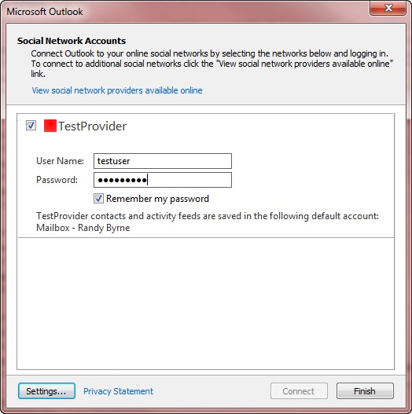

# Элементы XML возможностей

В таблицах в этом разделе  описываются детские элементы XML-возможностей, которые группуются по областям, которые они поддерживают. Значение по умолчанию для каждого **элемента возможностей** является **ложным.** Если элемент не указан в  возможностях XML, возвращенных методом [ISocialProvider::GetCapabilities,](isocialprovider-getcapabilities.md) значение элемента равно значением **false**.
  
Описание возможностей **XML** см. в описании [XML для возможностей.](xml-for-capabilities.md) Пример возможностей XML **см.** в [примере Capabilities XML.](capabilities-xml-example.md) Полное определение схемы XML Outlook поставщика социальных соединителем (OSC), в том числе необходимых или необязательных элементов, см. в Outlook [Social Connector Provider XML Schema.](outlook-social-connector-provider-xml-schema.md)
  
## Возможности для поддержки друзей

В следующей таблице показаны элементы, применимые к любой форме синхронизации друзей или не друзей.
  
|**Элемент**|**Описание**|
|:-----|:-----|
|**doNotFollowPerson**   |Указывает, поддерживает ли поставщик вызов [метода ISocialSession::UnFollowPerson.](isocialsession-unfollowperson.md)    **followPerson** и **doNotFollowPerson являются** независимыми функциями поставщика OSC. Поставщик OSC может указать возможность добавления человека в качестве друга (настройка **followPerson** для **true)** или возможность удаления пользователя в качестве друга в учетной записи социальной сети (настройка **doNotFollowPerson** до **true).** В общем, возможность следовать не означает, что она может перестать следовать. **followPerson** — это возможность, которая не должна быть неправильно истолкована в качестве действия, чтобы следовать за определенным человеком или каждым человеком в учетной записи социальной сети. **followPerson** быть **верным** не означает **doNotFollowPerson** является **ложным**.    |
|**followPerson**   |Указывает, поддерживает ли поставщик вызов [метода ISocialSession::FollowPerson.](isocialsession-followperson.md) OsC проверяет **followPerson,** если cacheFriends является верным (кэширование синхронизации друзей), **dynamicContactsLookup** является верным **(по** требованию синхронизации друзей и не-друзей), или как  **cacheFriends** и **dynamicContactsLookup** являются истинными (гибридная синхронизация друзей и не-друзей).  Если поставщик задает **followPerson** как **true,** OSC отображает сетевой значок в области людей, за пользователями которых следует пользователь, и включает команду **on \< NetworkName \>** в меню Добавить **(+)** в области людей. Если поставщик задает **followPerson как** **ложный,** сетевой значок не отображается, а команда **\< \> networkName** скрыта.    |
|**getFriends**   |Указывает, поддерживает ли поставщик вызов [метода ISocialPerson::GetFriendsAndColleagues](isocialperson-getfriendsandcolleagues.md) или [ISocialSession2::GetPeopleDetails.](isocialsession2-getpeopledetails.md) Если поставщик задает **getFriends** как **true,** OSC использует значение **cacheFriends** или **dynamicContactsLookup,** чтобы определить, позволяет ли социальная сеть хранить друзей в качестве контактных элементов Outlook или в памяти. Если поставщик задает **getFriends** как **ложный,** социальная сеть не поддерживает друзей и **ISocialPerson::GetFriendsAndColleagues** и **ISocialSession2::GetPeopleDetails** методы, и OSC игнорирует значения **cacheFriends** и **dynamicContactsLookup**.    |
   
Следующие элементы применяются только к кэшированием синхронизации друзей или гибридной синхронизации друзей и не друзей. Дополнительные сведения о синхронизации друзей см. в этой [работе.](synchronizing-friends-and-activities.md)
  
|**Элемент**|**Описание**|
|:-----|:-----|
|**cacheFriends**   |Указывает, разрешает ли поставщик OSC хранить друзей в Outlook контактных элементов. OsC проверяет **cacheFriends** только в том случае, если **getFriends** является **правдой.** Если поставщик задает **кэшФринды** как **истинные,** OSC синхронизирует друзей с помощью кэшинга и создает папку контактов для сетевых контактов в хранилище по умолчанию пользователя для контактов с друзьями. Имя папки контактов для сети — это значение свойства [ISocialProvider::SocialNetworkName.](isocialprovider-socialnetworkname.md) Если поставщик задает **кэшФринды** как **ложные,** OSC не создает папку контактов для контактов друзей для хранения друзей.    |
|**contactSyncRestartInterval**   |Определяет интервал повторной оценки в минутах между попытками синхронизировать сведения друзей из социальной сети, если возникает ошибка синхронизации. OsC использует этот элемент только в том случае, если поставщик OSC поддерживает кэширование синхронизации или гибридную синхронизацию друзей с папкой контактов для социальных сетей **(cacheFriends** это **правда).**    Интервал повторной настройки по умолчанию составляет 30 минут, если по умолчанию не переопределен  `ContactSyncRestartInterval` клавишей под  `HKEY_CURRENT_USER\Software\Microsoft\Office\Outlook\SocialConnector` . Если поставщик задает **contactSyncRestartInterval,** значение поставщика переопределит интервал повторной записи по умолчанию в 30 минут или ключевое значение реестра.    Дополнительные сведения о синхронизации сведений о друзьях и не друзьях по запросу см. в этой информации.     |
   
Следующие элементы применяются только к синхронизации по запросу или гибридной синхронизации друзей и не друзей.
  
|**Элемент**|**Описание**|
|:-----|:-----|
|**dynamicContactsLookup**   |Указывает, поддерживает ли поставщик OSC вызов [ISocialSession2::GetPeopleDetails](isocialsession2-getpeopledetails.md) для синхронизации друзей и не-друзей по запросу.    OsC проверяет **dynamicContactsLookup** только в том случае, если **getFriends** является **правдой.** Параметр по умолчанию **для dynamicContactsLookup является** **ложным.**    Если поставщик OSC указывает динамическийContactsLookup как истинный и **getFriends** как истинный, OSC вызывает **ISocialSession2::GetPeopleDetails** каждый раз, когда обновляется people Pane.    Окно People обновляется, когда пользователь выбирает другого пользователя в области people pane или другой элемент в окне обозревателя Outlook или открывает окно Outlook инспектора. Динамический просмотр контактов гарантирует, что пользователь всегда видит последние фотографии пользователей и сведения о профиле в области people, но увеличивает число звонков от поставщика в социальную сеть.    Если поставщик задает **динамическийContactsLookup** как **ложный,** OSC не звонит **iSocialSession2::GetPeopleDetails** для обновления области people.    |
|**showOnDemandContactsWhenMinimized**   |Указывает, должна ли OSC выполнять синхронизацию по запросу для друзей и не-друзей, если свести к минимуму области людей.    |
   
## Возможности для поддержки действий

Следующий элемент применяется к любой форме синхронизации действий, поддерживаемых поставщиком OSC.
  
|**Элемент**|**Описание**|
|:-----|:-----|
|**getActivities**   |Указывает, поддерживает ли поставщик [вызовы метода ISocialSession2::GetActivitiesEx](isocialsession2-getactivitiesex.md) или [ISocialPerson::GetActivities.](isocialperson-getactivities.md) Если поставщик задает **getActivities** как **true,** OSC использует значение **cacheActivities** или **dynamicActivitiesLookupEx,** чтобы определить, позволяет ли сайт социальной сети хранить действия в качестве элементов RSS Outlook или в качестве действий в памяти. Если поставщик задает **getActivities** как ложные, социальная сеть не поддерживает действия и методы **ISocialSession2::GetActivitiesEx** и **ISocialPerson::GetActivities,** а OSC игнорирует значения **кэшАтивов** и **dynamicActivitiesLookupEx**.    |
   
Следующий элемент применяется только к кэшной синхронизации или гибридной синхронизации действий.
  
|**Элемент**|**Описание**|
|:-----|:-----|
|**cacheActivities**   |Начиная с Outlook Social Connector 2013, OSC игнорирует этот элемент, так как поставщики больше не могут синхронизировать действия, кэшировать их в скрытой папке в магазине пользователя.    Если поставщик поддерживает действия, поставщик должен поддерживать синхронизацию действий по требованию. Поставщик задает **кэшАктивы** как **ложные** и **задает dynamicActivitesLookupEx как** **true**. OsC синхронизирует действия по запросу и кэширует действия в памяти. Кэш памяти действий обновляется с интервалом в 30 минут.    |
   
Следующие элементы применяются только к синхронизации действий по запросу или гибридной синхронизации действий.
  
|**Элемент**|**Описание**|
|:-----|:-----|
|**dynamicActivitiesLookup**   |Обесценилось в OSC 1.1.    Начиная с OSC 1.1, OSC больше не вызывает [ISocialSession::GetActivities](isocialsession-getactivities.md) и игнорирует значение **dynamicActivitiesLookup**. Чтобы поддерживать просмотр действий по запросу,  установите **cacheActivities** как false и **getActivities** и **dynamicActivitiesLookupEx** как **true,** и OSC будет вызывать **ISocialSession2::GetActivitiesEx**.    |
|**dynamicActivitiesLookupEx**   |Указывает, поддерживает ли поставщик OSC вызов **ISocialSession2::GetActivitiesEx** для синхронизации действий по запросу.    Если поставщик OSC поддерживает синхронизацию действий по запросу, он задает **getActivities** и **dynamicActivitiesLookupEx** как истинные, а **кэшАктивы** как **ложные**. OsC вызывает **ISocialSession2::GetActivitiesEx при** каждом обновлении области people. Окно People обновляется, когда пользователь изменяет выбранный элемент в окне Outlook обозревателя или открывает окно Outlook инспектора. Динамический просмотр действий гарантирует, что пользователь всегда будет видеть последние действия в области людей, но увеличит количество вызовов от поставщика в социальную сеть.    Если поставщик задает **dynamicActivitiesLookupEx** как **ложный,** OSC не называет **ISocialSession2::GetActivitiesEx** для людей, отображаемых в области людей.    |
|**showOnDemandActivitiesWhenMinimized**   |Указывает, должна ли OSC выполнять синхронизацию действий по запросу при минимизации области людей.    |
   
## Общие возможности для поддержки синхронизации друзей, не друзей и действий по запросу или гибридной синхронизации

|**Элемент**|**Описание**|
|:-----|:-----|
|**hashFunction**   | Указывает функцию hash, поддерживаемую поставщиком OSC. Чтобы защитить персональные данные пользователей, которые не находятся в социальной сети или бизнес-приложении поставщика, OSC передает хашированную электронную почту **iSocialSession2::GetPeopleDetails** и **ISocialSession2::GetActivitiesEx**.     Если **значение dynamicContactsLookup** задано значением true или  **dynamicActivitiesLookupEx,** поставщик должен задать значение **hashFunction** одному из разрешенных значений: **SHA1,** **MD5** или **CRC32MD5.**  Если **hashFunction** отсутствует или указывает неправильное значение, OSC возвращает ошибку.    **SHA1** — это целевая группа по интернет-инженерии (IETF) в США, которая использует алгоритм безопасного хаша 1, определенный [[RFC3174].](https://www.rfc-editor.org/rfc/rfc3174.txt) Например, значение **hashed sha1** адреса электронной почты melissa@contoso.com  `bb81577b567262a21a4df5f6e335c1250acd7b50` .    **MD5** — это целевая группа по интернет-инженерии (IETF) MD5 Message-Digest Алгоритм, определенный [[RFC1321].](https://www.rfc-editor.org/rfc/rfc1321.txt) Например, значение **адреса электронной почты MD5** с melissa@contoso.com  `c8c39e61ca1662477b39b83d7b0a0615` .    **CRC32MD5** — это сочетание **CRC32** и **MD5,** определяемого следующим образом:     Нормализуй адрес электронной почты, удалив ведущее и отставащее белое пространство и преобразуя все символы в нижний регистр.     Вычисляйте значение **CRC32** для нормализуемого адреса электронной почты и используйте десятичной integer представление этого значения. Если ваша реализация возвращает подписанные integers, необходимо преобразовать подписанный integer в неподписаный integer.     Вычислять **значение MD5** для нормализуемого адреса электронной почты и использовать hex-представление этого значения (с помощью нижнего регистра для A через F).     Объединяйте эти два значения с подчеркиваемой.     Например, значение **CRC32MD5** для адреса электронной почты melissa@contoso.com  `2149665315_c8c39e61ca1662477b39b83d7b0a0615` .    |
   
## Возможности для поддержки проверки подлинности и конфигурации учетной записи

|**Элемент**|**Описание**|
|:-----|:-----|
|**allowChangesToAutoConfigure**   |Указывает, позволяет ли социальная сеть пользователю изменять параметры автоматической конфигурации, например предоставлять другой URL-адрес для входа в систему.    |
|**createAccountUrl**   |Если поставщик задает **hideHyperlinks** как ложные,  при нажатии  кнопки нажмите здесь, чтобы создать учетную запись в диалоговом окне конфигурации учетной записи, URL-адрес, указанный **createAccountUrl,** открывается в браузере по умолчанию.    |
|**displayUrl**   |Указывает, должен ли OSC отображать текстовое окно **URL-адреса** для социальной сети в диалоговом окне конфигурации учетной записи.    |
|**forgotPasswordUrl**   |Если поставщик задает **hideHyperlinks** как ложные, когда пользователь щелкает Забыли **пароль?** в диалоговом окне конфигурации учетной записи url-адрес, указанный **в forgotPasswordUrl,** открывается в браузере по умолчанию.      |
|**hideHyperlinks**   |Указывает, должен ли OSC скрывать кнопку **Нажмите** здесь, чтобы создать учетную запись и забыл **пароль?** гиперссылки в диалоговом окне конфигурации учетной записи.    OSC 1.0 игнорирует этот параметр, и гиперссылки всегда скрыты. OSC 1.1 наблюдает значение этого параметра.    |
|**hideRememberMyPassword**   |Указывает, следует ли OSC скрывать в диалоговом окне конфигурации учетной записи поле **"Запомнить** мой пароль".    Если поставщик задает **hideRememberMyPassword** как истинное, OSC  будет действовать так, как если бы поле Запомнить мой пароль неконтранжироваться и не сохранит пароль.     Если поставщик задает **hideRememberMyPassword** как ложное, в диалоговом окне конфигурации учетной записи будет отображаться поле Запомнить мой пароль.      |
|**supportsAutoConfigure**   |Указывает, следует ли OSC вызывать функцию **GetAutoConfiguredSession** в **интерфейсе ISocialProvider** для попытки автоматической настройки и входа в социальную сеть для пользователя.    |
|**useLogonCached**   |Указывает, поддерживает ли поставщик OSC вызов [ISocialSession2::LogonCached](isocialsession2-logoncached.md) для входа с кэшными учетными данными.    Если поставщик задает **параметры useLogonCached** как **true,** OSC игнорирует параметр **useLogonWebAuth,** а OSC вызывает **ISocialSession2::LogonCached** для проверки подлинности.    Если поставщик задает **dynamicActivitiesLookupEx** как **ложный,** OSC не вызывает **ISocialSession2::LogonCached** для проверки подлинности.    |
|**useLogonWebAuth**   |Указывает, следует ли OSC использовать проверку подлинности на основе форм и [метод ISocialSession::LogonWeb.](isocialsession-logonweb.md) Если поставщик задает **использованиеLogonWebAuth** как **ложное,** OSC использует базовую проверку подлинности и вызывает [метод ISocialSession::Logon.](isocialsession-logon.md) Если поставщик задает **использоватьLogonWebAuth** как **true,** OSC использует проверку подлинности на основе форм и вызывает **ISocialSession::LogonWeb**.    |
   
В зависимости  от возможностей XML, возвращенных поставщиком в **методе ISocialProvider::GetCapabilities,** диалоговое окно конфигурации учетной записи изменяется. Например, на рисунке 1 показан диалоговое окно конфигурации учетной записи для примера TestProvider. 
  
**Рис. 1. Пример TestProvider в диалоговом окне конфигурации учетной записи**

  
## См. также

- [XML для возможностей](xml-for-capabilities.md)

