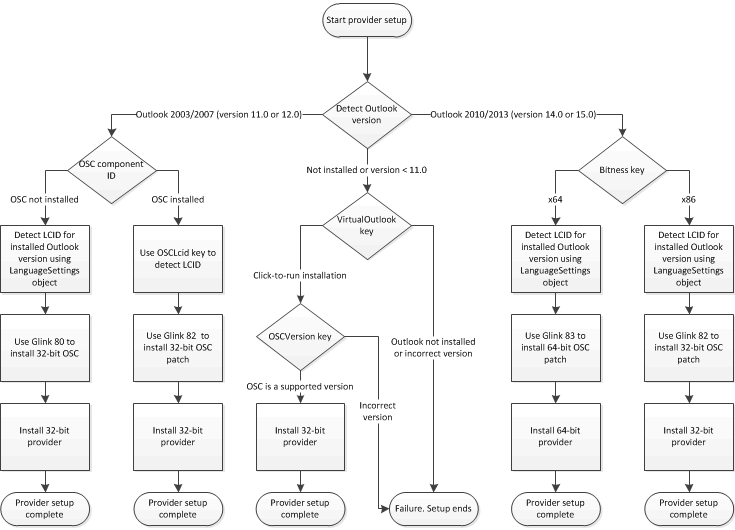

# <a name="installation-checklist"></a><span data-ttu-id="6f838-103">Контрольный список установки</span><span class="sxs-lookup"><span data-stu-id="6f838-103">Installation checklist</span></span>

<span data-ttu-id="6f838-104">В этом разделе описываются предварительные требования для успешной установки поставщика Outlook Social Connector (OSC) и установки проверяет, что установщик поставщика необходимо выполнить для правильной работы.</span><span class="sxs-lookup"><span data-stu-id="6f838-104">This topic describes prerequisites for successfully installing an Outlook Social Connector (OSC) provider, and the installation checks that your provider installer should complete to work correctly.</span></span>
  
## <a name="installation-overview"></a><span data-ttu-id="6f838-105">Общие сведения об установке</span><span class="sxs-lookup"><span data-stu-id="6f838-105">Installation overview</span></span>

<span data-ttu-id="6f838-106">Пользователям следует установить поставщики OSC, только в том случае, если присутствует вспомогательные версии Outlook и OSC установлена и включена на клиентском компьютере.</span><span class="sxs-lookup"><span data-stu-id="6f838-106">Users should install OSC providers only if a supporting version of Outlook is present and the OSC is installed and enabled on the client computer.</span></span> <span data-ttu-id="6f838-107">Вспомогательные версии Outlook, Microsoft Office Outlook 2003, Office Outlook 2007, Outlook 2010 и Outlook 2013 (устанавливается на клиентском компьютере или в случае Outlook 2010 и Outlook 2013, Click-to-Run, предоставляемых на клиентском компьютере).</span><span class="sxs-lookup"><span data-stu-id="6f838-107">Supporting versions of Outlook are Office Outlook 2003, Office Outlook 2007, Outlook 2010 and Outlook 2013 (installed on the client computer or, in the case of Outlook 2010 and Outlook 2013, delivered by Click-to-Run on the client computer).</span></span> <span data-ttu-id="6f838-108">Чтобы убедиться, что установка прошла успешно, установщик поставщика необходимо выполните следующее:</span><span class="sxs-lookup"><span data-stu-id="6f838-108">To ensure a successful installation, your provider installer should do the following:</span></span>
  
- <span data-ttu-id="6f838-109">Проверьте, присутствует ли поддерживаемая версия Outlook.</span><span class="sxs-lookup"><span data-stu-id="6f838-109">Verify whether a supported version of Outlook is present.</span></span>
    
- <span data-ttu-id="6f838-110">Проверьте, установлен ли OSC.</span><span class="sxs-lookup"><span data-stu-id="6f838-110">Verify whether the OSC is installed.</span></span>
    
> [!NOTE]
> <span data-ttu-id="6f838-111">Click-to-Run является виртуальной среды, в которой можно запустить Outlook 2010 (32-разрядная версия) или Outlook 2013 (32-разрядная версия).</span><span class="sxs-lookup"><span data-stu-id="6f838-111">Click-to-Run is a virtual environment in which Outlook 2010 (32-bit) or Outlook 2013 (32-bit) can run.</span></span> <span data-ttu-id="6f838-112">Для Outlook 2013 проверьте, существует ли раздел VirtualOutlook в HKEY_LOCAL_MACHINE\Software\Microsoft\Office\15.0\Common\InstallRoot\Virtual\VirtualOutlook реестра Windows.</span><span class="sxs-lookup"><span data-stu-id="6f838-112">For Outlook 2013, verify if the VirtualOutlook key exists in HKEY_LOCAL_MACHINE\Software\Microsoft\Office\15.0\Common\InstallRoot\Virtual\VirtualOutlook of the Windows registry.</span></span> <span data-ttu-id="6f838-113">Дополнительные сведения о доставке Outlook как продукт Click-to-Run на клиентском компьютере Узнайте, [как проверить доступность на компьютере по технологии Click-to-Run продукта Outlook](https://blogs.msdn.com/b/officedevdocs/archive/2010/03/09/how-to-verify-if-outlook-is-available-on-a-computer-as-a-click-to-run-product.aspx).</span><span class="sxs-lookup"><span data-stu-id="6f838-113">For more information about delivering Outlook as a Click-to-Run product on a client computer, see [How to Verify if Outlook is Available on a Computer as a Click-to-Run Product](https://blogs.msdn.com/b/officedevdocs/archive/2010/03/09/how-to-verify-if-outlook-is-available-on-a-computer-as-a-click-to-run-product.aspx).</span></span> 
  
<span data-ttu-id="6f838-114">Тем не менее, есть у пользователя для убедитесь, что OSC включена перед установкой поставщика.</span><span class="sxs-lookup"><span data-stu-id="6f838-114">The user, however, has to ensure that the OSC is enabled before installing the provider.</span></span>
  
<span data-ttu-id="6f838-115">Сторонние производители, включая поставщиков OSC не подлежит распространению OSC.</span><span class="sxs-lookup"><span data-stu-id="6f838-115">Third parties, including OSC providers, cannot redistribute the OSC.</span></span> <span data-ttu-id="6f838-116">Тем не менее если OSC не установлен, программа установки поставщика можно использовать соответствующие g ссылки для установки OSC на клиентском компьютере.</span><span class="sxs-lookup"><span data-stu-id="6f838-116">However, if the OSC is not installed, the provider installer can use appropriate g-links to install the OSC on the client computer.</span></span> <span data-ttu-id="6f838-117">G-link — специально созданный URL-адрес на https://g.live.com , который перенаправляет пользователя на соответствующем веб-страницу для загрузки OSC.</span><span class="sxs-lookup"><span data-stu-id="6f838-117">A g-link is a specially constructed URL on https://g.live.com that forwards a user to a corresponding webpage to download the OSC.</span></span> <span data-ttu-id="6f838-118">OSC g-link представлен в формате https://g.live.com/0CR _LCID_/ _Glink_, где _LCID_ и _Glink_ укажите языкового стандарта, версии и разрядности версий Outlook на клиентском компьютере.</span><span class="sxs-lookup"><span data-stu-id="6f838-118">An OSC g-link is formatted as https://g.live.com/0CR _LCID_/ _Glink_, where  _LCID_ and  _Glink_ specify the locale, version, and bitness of Outlook on the client computer.</span></span> <span data-ttu-id="6f838-119">Каждая из g ссылок указывает исполняемого файла и специально для указанного значения _LCID_ и _Glink_ .</span><span class="sxs-lookup"><span data-stu-id="6f838-119">Each g-link points to an executable and is specific to the specified  _LCID_ and  _Glink_ values.</span></span> 
  
<span data-ttu-id="6f838-120">Например g ссылку для установки последней версии OSC для Outlook 2003 или Outlook 2007 для идентификатора LCID 1033 (английский (США)) выглядит следующим образом:</span><span class="sxs-lookup"><span data-stu-id="6f838-120">For example, the g-link to install the latest version of the OSC for Outlook 2003 or Outlook 2007 for the LCID 1033 (US English) is as follows:</span></span>
  
https://g.live.com/0CR1033/80
  
<span data-ttu-id="6f838-121">Для получения дополнительных сведений о значениях _Glink_ для разных версий и разрядности версий Outlook и значения _LCID_ для поддерживаемых языковых стандартов видеть #7 в разделе [Контрольный список установки](#olosc_InstallationOverview_InstallationChecklist) ниже.</span><span class="sxs-lookup"><span data-stu-id="6f838-121">For details about  _Glink_ values for different versions and bitness of Outlook, and  _LCID_ values for supported locales, see #7 in the section [Installation Checklist](#olosc_InstallationOverview_InstallationChecklist) below.</span></span> 

<span data-ttu-id="6f838-122"><a name="olosc_InstallationOverview_InstallationChecklist"> </a></span><span class="sxs-lookup"><span data-stu-id="6f838-122"></span></span>

## <a name="installation-checklist"></a><span data-ttu-id="6f838-123">Контрольный список установки</span><span class="sxs-lookup"><span data-stu-id="6f838-123">Installation checklist</span></span>

<span data-ttu-id="6f838-124">Пакет установки поставщика необходимо выполнить ряд проверок установки, как показано на рисунке 1, чтобы убедиться, что поставщик устанавливает успешно.</span><span class="sxs-lookup"><span data-stu-id="6f838-124">The provider setup package should perform a series of installation checks, as shown in Figure 1, to ensure that the provider installs successfully.</span></span>
  
<span data-ttu-id="6f838-125">**На рисунке 1. Логика установки поставщика**</span><span class="sxs-lookup"><span data-stu-id="6f838-125">**Figure 1. Provider installation logic**</span></span>


  
<span data-ttu-id="6f838-127">В следующей процедуре описывается установка проверки, описанные на рисунке 1.</span><span class="sxs-lookup"><span data-stu-id="6f838-127">The following procedure describes the installation checks outlined in Figure 1.</span></span>
  
1. <span data-ttu-id="6f838-128">Всего, обнаружение установленного Outlook или представления и если установленная или этот параметр указан, определить, поддерживает ли версии Outlook OSC.</span><span class="sxs-lookup"><span data-stu-id="6f838-128">As a prerequisite, detect whether Outlook is installed or present, and if installed or present, determine whether the version of Outlook supports the OSC.</span></span> <span data-ttu-id="6f838-129">Дополнительные сведения об обнаружении установленная версия Outlook в разделе [Проверка версии Outlook](https://msdn.microsoft.com/library/672fc380-a29b-4e99-9211-949fd5065723%28Office.15%29.aspx).</span><span class="sxs-lookup"><span data-stu-id="6f838-129">For more information about detecting the installed version of Outlook, see [Check the Version of Outlook](https://msdn.microsoft.com/library/672fc380-a29b-4e99-9211-949fd5065723%28Office.15%29.aspx).</span></span>
    
   - <span data-ttu-id="6f838-130">Если установленная версия Outlook является более ранней, чем Outlook 2003, не удается выполнить процедуру установки поставщика.</span><span class="sxs-lookup"><span data-stu-id="6f838-130">If the installed version of Outlook is earlier than Outlook 2003, the provider installation procedure cannot complete.</span></span> <span data-ttu-id="6f838-131">Чтобы получить поддерживаемая версия Outlook и OSC перед продолжением установки поставщика OSC сообщения.</span><span class="sxs-lookup"><span data-stu-id="6f838-131">Inform the user to obtain a supported version of Outlook and the OSC before proceeding to install the OSC provider.</span></span>
    
   - <span data-ttu-id="6f838-132">Если Outlook не установлен, перейдите к шагу 2.</span><span class="sxs-lookup"><span data-stu-id="6f838-132">If Outlook is not installed, proceed to step 2.</span></span>
    
   - <span data-ttu-id="6f838-133">Если установлен Outlook 2003 или Outlook 2007, перейдите к шагу 3.</span><span class="sxs-lookup"><span data-stu-id="6f838-133">If Outlook 2003 or Outlook 2007 is installed, proceed to step 3.</span></span> 
    
   - <span data-ttu-id="6f838-134">При установке Outlook 2010 или Outlook 2013, перейдите к шагу 4.</span><span class="sxs-lookup"><span data-stu-id="6f838-134">If Outlook 2010 or Outlook 2013 is installed, proceed to step 4.</span></span>
    
2. <span data-ttu-id="6f838-135">**Продолжите этот шаг, если Outlook не установлен на клиентском компьютере:**</span><span class="sxs-lookup"><span data-stu-id="6f838-135">**Proceed with this step if Outlook is not installed on the client computer:**</span></span>
    
   1. <span data-ttu-id="6f838-136">Проверьте, установлен ли OSC как компонент по умолчанию установка Click-to-Run Outlook 2010 или Outlook 2013.</span><span class="sxs-lookup"><span data-stu-id="6f838-136">Check whether the OSC is installed as a default component of a Click-to-Run installation of Outlook 2010 or Outlook 2013.</span></span> <span data-ttu-id="6f838-137">Изучите `VirtualOutlook` ключ в следующем расположении в реестре Windows:</span><span class="sxs-lookup"><span data-stu-id="6f838-137">Examine the  `VirtualOutlook` key in the following location in the Windows registry:</span></span> 
      
      - <span data-ttu-id="6f838-138">Для Outlook 2010`HKEY_LOCAL_MACHINE\Software\Microsoft\Office\14.0\Common\InstallRoot\Virtual\VirtualOutlook`</span><span class="sxs-lookup"><span data-stu-id="6f838-138">For Outlook 2010,  `HKEY_LOCAL_MACHINE\Software\Microsoft\Office\14.0\Common\InstallRoot\Virtual\VirtualOutlook`</span></span>
      
      - <span data-ttu-id="6f838-139">Для Outlook Social Connector 2013 г`HKEY_LOCAL_MACHINE\Software\Microsoft\Office\15.0\Common\InstallRoot\Virtual\VirtualOutlook`</span><span class="sxs-lookup"><span data-stu-id="6f838-139">For Outlook Social Connector 2013,  `HKEY_LOCAL_MACHINE\Software\Microsoft\Office\15.0\Common\InstallRoot\Virtual\VirtualOutlook`</span></span>
      
      <span data-ttu-id="6f838-140">`VirtualOutlook` Ключа является значением типа REG_SZ, которое содержит тег языка, например, «en-us», установленного продукта.</span><span class="sxs-lookup"><span data-stu-id="6f838-140">The  `VirtualOutlook` key is a REG_SZ value that contains the locale tag, such as "en-us", of the installed product.</span></span> 
      
   2. <span data-ttu-id="6f838-141">Если `VirtualOutlook` ключа не существует, Outlook не установлена на клиентском компьютере и не удается выполнить процедуру установки поставщика.</span><span class="sxs-lookup"><span data-stu-id="6f838-141">If the  `VirtualOutlook` key does not exist, Outlook is not present on the client computer, and the provider installation procedure cannot complete.</span></span> <span data-ttu-id="6f838-142">Чтобы получить поддерживаемая версия Outlook и OSC перед продолжением установки поставщика OSC сообщения.</span><span class="sxs-lookup"><span data-stu-id="6f838-142">Inform the user to obtain a supported version of Outlook and the OSC before proceeding to install the OSC provider.</span></span> 
      
   3. <span data-ttu-id="6f838-143">Если `VirtualOutlook` ключ существует, Outlook было доставлено, Click-to-Run на клиентском компьютере.</span><span class="sxs-lookup"><span data-stu-id="6f838-143">If the  `VirtualOutlook` key does exist, Outlook was delivered by Click-to-Run on the client computer.</span></span> <span data-ttu-id="6f838-144">Перейти к Проверьте установленную версию библиотеки типов OSC, изучив `OSCVersion` ключ в следующем расположении в реестре Windows:</span><span class="sxs-lookup"><span data-stu-id="6f838-144">Proceed to check the installed version of the OSC type library by examining the  `OSCVersion` key in the following location in the Windows registry:</span></span> 
      
      `HKEY_LOCAL_MACHINE\Software\Microsoft\Office\Outlook\SocialConnector\OSCVersion`
      
      <span data-ttu-id="6f838-145">Значение `OSCVersion` — это строка, которая указывает номер версии библиотеки типов Socialprovider.dll (например, «1.0», «1.1» или «15»).</span><span class="sxs-lookup"><span data-stu-id="6f838-145">The value of  `OSCVersion` is a string that specifies the type library version number of Socialprovider.dll (for example, "1.0", "1.1", or "15").</span></span> 
      
   4. <span data-ttu-id="6f838-146">Если `OSCVersion` — «1.0», «1.1» или «15», соответствующую версию OSC установлен.</span><span class="sxs-lookup"><span data-stu-id="6f838-146">If  `OSCVersion` is "1.0", "1.1" or "15", an appropriate version of OSC is installed.</span></span> <span data-ttu-id="6f838-147">Перейти к шагу 6, чтобы найти текущего языка интерфейса пользователя Outlook для подготовки к установке последней версии OSC.</span><span class="sxs-lookup"><span data-stu-id="6f838-147">Proceed to step 6 to find the current Outlook user interface locale to prepare for installing the latest version of the OSC.</span></span> 
      
   5. <span data-ttu-id="6f838-148">В противном случае `OSCVersion` не содержит ожидаемым значением.</span><span class="sxs-lookup"><span data-stu-id="6f838-148">Otherwise,  `OSCVersion` does not contain an expected value.</span></span> <span data-ttu-id="6f838-149">Перейти к шагу 6, чтобы найти текущего языка интерфейса пользователя Outlook для подготовки к установке соответствующую версию OSC.</span><span class="sxs-lookup"><span data-stu-id="6f838-149">Proceed to step 6 to find the current Outlook user interface locale to prepare for installing an appropriate version of the OSC.</span></span> 
    
3. <span data-ttu-id="6f838-150">**Продолжите этот шаг, если на клиентском компьютере установлен Outlook 2003 или Outlook 2007:**</span><span class="sxs-lookup"><span data-stu-id="6f838-150">**Proceed with this step if Outlook 2003 or Outlook 2007 is installed on the client computer:**</span></span>
    
   1. <span data-ttu-id="6f838-151">Проверьте, установлен ли OSC, написав Установщик настраиваемого действия для проверки наличия идентификатор следующий компонент:</span><span class="sxs-lookup"><span data-stu-id="6f838-151">Verify whether the OSC is installed by writing an installer custom action to test for the existence of the following qualified component ID:</span></span>
      
      `{A3B82DA3-8AD9-4935-AEA8-54B754459483}`
      
      <span data-ttu-id="6f838-152">Идентификатор компонент — это идентификатор GUID, который предоставляет метод одноуровневая косвенности аналог указателя.</span><span class="sxs-lookup"><span data-stu-id="6f838-152">The qualified component ID is a GUID that provides a method of single-level indirection, similar to a pointer.</span></span> <span data-ttu-id="6f838-153">Дополнительные сведения о установщика Windows содержатся в разделе [Схема документации установщика Windows](https://docs.microsoft.com/windows/desktop/msi/roadmap-to-windows-installer-documentation).</span><span class="sxs-lookup"><span data-stu-id="6f838-153">For more information about Windows Installer, see [Roadmap to Windows Installer Documentation](https://docs.microsoft.com/windows/desktop/msi/roadmap-to-windows-installer-documentation).</span></span>
      
   2. <span data-ttu-id="6f838-154">Если указанный компонент, OSC версии.</span><span class="sxs-lookup"><span data-stu-id="6f838-154">If the specified qualified component exists, a version of the OSC is installed.</span></span> <span data-ttu-id="6f838-155">Перейти к шагу 5, чтобы найти текущего языка интерфейса пользователя Outlook для подготовки к установке последней версии OSC.</span><span class="sxs-lookup"><span data-stu-id="6f838-155">Proceed to step 5 to find the current Outlook user interface locale to prepare for installing the latest version of the OSC.</span></span>
      
   3. <span data-ttu-id="6f838-156">В противном случае OSC не установлен.</span><span class="sxs-lookup"><span data-stu-id="6f838-156">Otherwise, the OSC is not installed.</span></span> <span data-ttu-id="6f838-157">Перейти к шагу 6, чтобы найти текущего языка интерфейса пользователя Outlook для подготовки к установке соответствующую версию OSC.</span><span class="sxs-lookup"><span data-stu-id="6f838-157">Proceed to step 6 to find the current Outlook user interface locale to prepare for installing an appropriate version of the OSC.</span></span>
      
4. <span data-ttu-id="6f838-158">**Если на клиентском компьютере установлен Outlook 2010 или Outlook 2013 продолжите с этого этапа:**</span><span class="sxs-lookup"><span data-stu-id="6f838-158">**Proceed with this step if Outlook 2010 or Outlook 2013 is installed on the client computer:**</span></span>
    
   1. <span data-ttu-id="6f838-159">Определите разрядности установленной версии Outlook, изучив `Bitness` ключ в следующем расположении в реестре Windows:</span><span class="sxs-lookup"><span data-stu-id="6f838-159">Determine the bitness of the installed version of Outlook by examining the  `Bitness` key in the following location in the Windows registry:</span></span> 
      
      - <span data-ttu-id="6f838-160">Для Outlook 2010 просмотрите`HKEY_LOCAL_MACHINE\SOFTWARE\Microsoft\Office\14.0\Outlook`</span><span class="sxs-lookup"><span data-stu-id="6f838-160">For Outlook 2010, look at  `HKEY_LOCAL_MACHINE\SOFTWARE\Microsoft\Office\14.0\Outlook`</span></span>
      
      - <span data-ttu-id="6f838-161">Для Outlook 2013 откроете`HKEY_LOCAL_MACHINE\SOFTWARE\Microsoft\Office\15.0\Outlook`</span><span class="sxs-lookup"><span data-stu-id="6f838-161">For Outlook 2013, look at  `HKEY_LOCAL_MACHINE\SOFTWARE\Microsoft\Office\15.0\Outlook`</span></span>
      
      <span data-ttu-id="6f838-162">`Bitness` Ключ является «x86» для 32-разрядная версия Outlook или «x64"для 64-разрядного приложения Outlook.</span><span class="sxs-lookup"><span data-stu-id="6f838-162">The  `Bitness` key is "x86" for 32-bit Outlook, or "x64" for 64-bit Outlook.</span></span> 
      
   2. <span data-ttu-id="6f838-163">Если ваш поставщик является управляемым поставщиком и скомпилированный компонент поставщика, указав целевой платформы в качестве **Любой ЦП**, перейдите к пункту 6, чтобы найти текущего языка интерфейса пользователя Outlook для подготовки к установке последней версии OSC.</span><span class="sxs-lookup"><span data-stu-id="6f838-163">If your provider is a managed provider, and you compiled the provider component specifying the target platform as **Any CPU**, proceed with step 6 to find the current Outlook user interface locale to prepare for installing the latest version of the OSC.</span></span> <span data-ttu-id="6f838-164">Ваш поставщик работает на 32-разрядной и 64-разрядных версиях OSC.</span><span class="sxs-lookup"><span data-stu-id="6f838-164">Your provider will work on both 32-bit and 64-bit versions of the OSC.</span></span>
      
   3. <span data-ttu-id="6f838-165">Если ваш поставщик собственного COM-компонентом, проанализируйте разрядности установленной версии Outlook:</span><span class="sxs-lookup"><span data-stu-id="6f838-165">If your provider is a native COM component, examine the bitness of the installed version of Outlook:</span></span>
      
      - <span data-ttu-id="6f838-166">Если установленная версия Outlook 32-разрядная версия, процедуры установки необходимо установить 32-разрядная версия поставщика (в шаге 8), убедитесь, что установлен соответствующий OSC.</span><span class="sxs-lookup"><span data-stu-id="6f838-166">If the installed version of Outlook is 32-bit, your installation procedure will have to install a 32-bit provider (in step 8), after ensuring that an appropriate OSC is installed.</span></span>
      
      - <span data-ttu-id="6f838-167">В противном случае установленная версия Outlook 64-разрядная версия, и процедура установки необходимо установить 64-разрядного поставщика (в шаге 8), убедитесь, что установлен соответствующий OSC.</span><span class="sxs-lookup"><span data-stu-id="6f838-167">Otherwise, the installed version of Outlook is 64-bit, and your installation procedure will have to install a 64-bit provider (in step 8), after ensuring that an appropriate OSC is installed.</span></span> 
      
   4. <span data-ttu-id="6f838-168">Перейдите к пункту 6, чтобы найти текущего языка интерфейса пользователя Outlook для подготовки к установке соответствующую версию OSC.</span><span class="sxs-lookup"><span data-stu-id="6f838-168">Proceed with step 6 to find the current Outlook user interface locale to prepare for installing an appropriate version of the OSC.</span></span>
    
5. <span data-ttu-id="6f838-169">**Продолжить этот шаг, если установлен Outlook 2003 или Outlook 2007 и OSC устанавливается на клиентском компьютере:** Проверка текущего языка интерфейса пользователя Outlook, изучив `OSCLcid` ключ в следующем расположении в реестре Windows:</span><span class="sxs-lookup"><span data-stu-id="6f838-169">**Proceed with this step if Outlook 2003 or Outlook 2007 is installed, and the OSC is installed on the client computer:** Check the current Outlook user interface locale by examining the  `OSCLcid` key in the following location in the Windows registry:</span></span> 
    
   `HKEY_LOCAL_MACHINE\Software\Microsoft\Office\Outlook\SocialConnector\OSCLcid`
    
   <span data-ttu-id="6f838-170">`OSCLcid` Ключ — это значение DWORD значение, задающее языкового тега Task Force IETF (Internet Engineering) (определяется с помощью [[RFC4646]](https://www.ietf.org/rfc/rfc4646.txt) и [[RFC4647]](https://www.ietf.org/rfc/rfc4647.txt)), который представляет текущего языка интерфейса пользователя Outlook.</span><span class="sxs-lookup"><span data-stu-id="6f838-170">The  `OSCLcid` key is a DWORD value that specifies the Internet Engineering Task Force (IETF) locale tag (defined by [[RFC4646]](https://www.ietf.org/rfc/rfc4646.txt) and [[RFC4647]](https://www.ietf.org/rfc/rfc4647.txt)), that represents the current Outlook user interface locale.</span></span> <span data-ttu-id="6f838-171">Перейдите к пункту 7, чтобы установить последние OSC на клиентском компьютере.</span><span class="sxs-lookup"><span data-stu-id="6f838-171">Proceed with step 7 to install the latest OSC on the client computer.</span></span>
    
6. <span data-ttu-id="6f838-172">**Продолжите этот шаг, если установлены Outlook 2003 или Outlook 2007 или Outlook 2010 или Outlook 2013, но последние OSC обязательно не установлен на клиентском компьютере:**</span><span class="sxs-lookup"><span data-stu-id="6f838-172">**Proceed with this step if Outlook 2003 or Outlook 2007 is installed, or Outlook 2010 or Outlook 2013 is present, but the latest OSC is not necessarily installed on the client computer:**</span></span>
    
   <span data-ttu-id="6f838-173">Используйте объект **LanguageSettings** для определения языка пользовательского интерфейса Outlook.</span><span class="sxs-lookup"><span data-stu-id="6f838-173">Use the **LanguageSettings** object to determine the LCID of the Outlook user interface locale.</span></span> <span data-ttu-id="6f838-174">В следующем фрагменте кода Visual Basic Scripting Edition (VBScript) показано, как получить языка пользовательского интерфейса Outlook.</span><span class="sxs-lookup"><span data-stu-id="6f838-174">The following Visual Basic Scripting Edition (VBScript) code snippet demonstrates how to obtain the LCID of the Outlook user interface locale.</span></span> 
    
   ```vb
    Function GetOutlookUI_LCID()
        ' Declare variables.
        Dim msoLanguageIDUI, olApp
        msoLanguageIDUI = 2
        Set olApp = CreateObject("Outlook.Application")
        ' Return Outlook UI LCID.
        GetOutlookUI_LCID = olApp.LanguageSettings.LanguageID(msoLanguageIDUI)
    End Function
   ```

7. <span data-ttu-id="6f838-175">**Продолжите этот шаг, если программа установки не имеет LCID установленной версии Outlook, но последние OSC обязательно не установлен на клиентском компьютере:**</span><span class="sxs-lookup"><span data-stu-id="6f838-175">**Proceed with this step if the installer has the LCID of the installed version of Outlook, but the latest OSC is not necessarily installed on the client computer:**</span></span>
    
   <span data-ttu-id="6f838-176">Объединение g ссылка в ваш пакет установки, чтобы убедиться, что последние версии OSC устанавливается на клиентском компьютере.</span><span class="sxs-lookup"><span data-stu-id="6f838-176">Chain a g-link into your installation package to ensure that the latest version of the OSC is installed on the client computer.</span></span> <span data-ttu-id="6f838-177">Формат g ссылки выглядит следующим образом:</span><span class="sxs-lookup"><span data-stu-id="6f838-177">The g-link format is as follows:</span></span>
    
   <span data-ttu-id="6f838-178">https://g.live.com/0CR_Код языка_ /  _Glink_</span><span class="sxs-lookup"><span data-stu-id="6f838-178">https://g.live.com/0CR _LCID_/ _Glink_</span></span>
    
   <span data-ttu-id="6f838-179">Обратитесь к таблице 1 для поддерживаемых значений _LCID_ и в таблице 2 для поддерживаемых значений _Glink_ .</span><span class="sxs-lookup"><span data-stu-id="6f838-179">Refer to Table 1 below for the supported  _LCID_ values, and Table 2 for the supported  _Glink_ values.</span></span> <span data-ttu-id="6f838-180">Например g ссылку для установки последней версии OSC 32-разрядная версия для 32-разрядная версия Outlook Social Connector 2013 (английский язык) выглядит следующим образом:</span><span class="sxs-lookup"><span data-stu-id="6f838-180">For example, the g-link to install the latest version of the 32-bit OSC for 32-bit Outlook Social Connector 2013 (US English) is as follows:</span></span> 
    
   https://g.live.com/0CR1033/82
    
8. <span data-ttu-id="6f838-181">Установка поставщика.</span><span class="sxs-lookup"><span data-stu-id="6f838-181">Install the provider.</span></span> <span data-ttu-id="6f838-182">Процедура установки поставщика необходимо зарегистрировать программный идентификатор (ProgID) в соответствующий раздел реестра Windows.</span><span class="sxs-lookup"><span data-stu-id="6f838-182">The provider installation procedure must register the programmatic identifier (ProgID) in the appropriate Windows registry location.</span></span> <span data-ttu-id="6f838-183">Для получения дополнительных сведений см. [Регистрация поставщика](registering-a-provider.md).</span><span class="sxs-lookup"><span data-stu-id="6f838-183">For more information, see [Registering a Provider](registering-a-provider.md).</span></span> <span data-ttu-id="6f838-184">Кроме того обязательно разрядности поставщика для установки — это то же, что разрядности версии Outlook, этот параметр указан на клиентском компьютере.</span><span class="sxs-lookup"><span data-stu-id="6f838-184">Also, be sure that the bitness of the provider to be installed is the same as the bitness of the version of Outlook present on the client computer.</span></span> <span data-ttu-id="6f838-185">К примеру Установка поставщика 32-разрядная версия, при наличии 32-разрядная версия Outlook 2013 и 64-разрядная версия поставщика, если установлен 64-разрядная версия Outlook 2013.</span><span class="sxs-lookup"><span data-stu-id="6f838-185">For example, install a 32-bit provider if 32-bit Outlook 2013 is present, and a 64-bit provider if 64-bit Outlook 2013 is installed.</span></span> <span data-ttu-id="6f838-186">Для Outlook 2003 или 2007 применяется только 32-разрядная версия ваш поставщик.</span><span class="sxs-lookup"><span data-stu-id="6f838-186">For Outlook 2003 or 2007, only the 32-bit version of your provider applies.</span></span> 
    
<span data-ttu-id="6f838-187">**Таблица 1: Поддерживаемые языковой стандарт и соответствующие значения LCID в шестнадцатеричном представлении для OSC**</span><span class="sxs-lookup"><span data-stu-id="6f838-187">**Table 1: Supported locale and corresponding LCID values in hexadecimal for the OSC**</span></span>
  
|<span data-ttu-id="6f838-188">**Языковой стандарт**</span><span class="sxs-lookup"><span data-stu-id="6f838-188">**Locale**</span></span>|<span data-ttu-id="6f838-189">**КОД ЯЗЫКА**</span><span class="sxs-lookup"><span data-stu-id="6f838-189">**LCID**</span></span>|
|:-----|:-----|
|<span data-ttu-id="6f838-190">ar-sa</span><span class="sxs-lookup"><span data-stu-id="6f838-190">ar-sa</span></span>  <br/> |<span data-ttu-id="6f838-191">1025</span><span class="sxs-lookup"><span data-stu-id="6f838-191">1025</span></span>  <br/> |
|<span data-ttu-id="6f838-192">bg-bg</span><span class="sxs-lookup"><span data-stu-id="6f838-192">bg-bg</span></span>  <br/> |<span data-ttu-id="6f838-193">1026</span><span class="sxs-lookup"><span data-stu-id="6f838-193">1026</span></span>  <br/> |
|<span data-ttu-id="6f838-194">CA-es</span><span class="sxs-lookup"><span data-stu-id="6f838-194">ca-es</span></span>  <br/> |<span data-ttu-id="6f838-195">1027</span><span class="sxs-lookup"><span data-stu-id="6f838-195">1027</span></span>  <br/> |
|<span data-ttu-id="6f838-196">cs-cz</span><span class="sxs-lookup"><span data-stu-id="6f838-196">cs-cz</span></span>  <br/> |<span data-ttu-id="6f838-197">ѕ</span><span class="sxs-lookup"><span data-stu-id="6f838-197">1029</span></span>  <br/> |
|<span data-ttu-id="6f838-198">da-dk</span><span class="sxs-lookup"><span data-stu-id="6f838-198">da-dk</span></span>  <br/> |<span data-ttu-id="6f838-199">1030</span><span class="sxs-lookup"><span data-stu-id="6f838-199">1030</span></span>  <br/> |
|<span data-ttu-id="6f838-200">de-de</span><span class="sxs-lookup"><span data-stu-id="6f838-200">de-de</span></span>  <br/> |<span data-ttu-id="6f838-201">1031</span><span class="sxs-lookup"><span data-stu-id="6f838-201">1031</span></span>  <br/> |
|<span data-ttu-id="6f838-202">el-gr</span><span class="sxs-lookup"><span data-stu-id="6f838-202">el-gr</span></span>  <br/> |<span data-ttu-id="6f838-203">1032</span><span class="sxs-lookup"><span data-stu-id="6f838-203">1032</span></span>  <br/> |
|<span data-ttu-id="6f838-204">en-us</span><span class="sxs-lookup"><span data-stu-id="6f838-204">en-us</span></span>  <br/> |<span data-ttu-id="6f838-205">1033</span><span class="sxs-lookup"><span data-stu-id="6f838-205">1033</span></span>  <br/> |
|<span data-ttu-id="6f838-206">es-es</span><span class="sxs-lookup"><span data-stu-id="6f838-206">es-es</span></span>  <br/> |<span data-ttu-id="6f838-207">3082</span><span class="sxs-lookup"><span data-stu-id="6f838-207">3082</span></span>  <br/> |
|<span data-ttu-id="6f838-208">et-ee</span><span class="sxs-lookup"><span data-stu-id="6f838-208">et-ee</span></span>  <br/> |<span data-ttu-id="6f838-209">1061</span><span class="sxs-lookup"><span data-stu-id="6f838-209">1061</span></span>  <br/> |
|<span data-ttu-id="6f838-210">es ЕС</span><span class="sxs-lookup"><span data-stu-id="6f838-210">eu-es</span></span>  <br/> |<span data-ttu-id="6f838-211">1069</span><span class="sxs-lookup"><span data-stu-id="6f838-211">1069</span></span>  <br/> |
|<span data-ttu-id="6f838-212">fi-fi</span><span class="sxs-lookup"><span data-stu-id="6f838-212">fi-fi</span></span>  <br/> |<span data-ttu-id="6f838-213">1035</span><span class="sxs-lookup"><span data-stu-id="6f838-213">1035</span></span>  <br/> |
|<span data-ttu-id="6f838-214">fr-fr</span><span class="sxs-lookup"><span data-stu-id="6f838-214">fr-fr</span></span>  <br/> |<span data-ttu-id="6f838-215">1036</span><span class="sxs-lookup"><span data-stu-id="6f838-215">1036</span></span>  <br/> |
|<span data-ttu-id="6f838-216">финансовом es</span><span class="sxs-lookup"><span data-stu-id="6f838-216">gl-es</span></span>  <br/> |<span data-ttu-id="6f838-217">1110</span><span class="sxs-lookup"><span data-stu-id="6f838-217">1110</span></span>  <br/> |
|<span data-ttu-id="6f838-218">he-il</span><span class="sxs-lookup"><span data-stu-id="6f838-218">he-il</span></span>  <br/> |<span data-ttu-id="6f838-219">1037</span><span class="sxs-lookup"><span data-stu-id="6f838-219">1037</span></span>  <br/> |
|<span data-ttu-id="6f838-220">hi-in</span><span class="sxs-lookup"><span data-stu-id="6f838-220">hi-in</span></span>  <br/> |<span data-ttu-id="6f838-221">1081</span><span class="sxs-lookup"><span data-stu-id="6f838-221">1081</span></span>  <br/> |
|<span data-ttu-id="6f838-222">hr-hr</span><span class="sxs-lookup"><span data-stu-id="6f838-222">hr-hr</span></span>  <br/> |<span data-ttu-id="6f838-223">1050</span><span class="sxs-lookup"><span data-stu-id="6f838-223">1050</span></span>  <br/> |
|<span data-ttu-id="6f838-224">hu-hu</span><span class="sxs-lookup"><span data-stu-id="6f838-224">hu-hu</span></span>  <br/> |<span data-ttu-id="6f838-225">1038</span><span class="sxs-lookup"><span data-stu-id="6f838-225">1038</span></span>  <br/> |
|<span data-ttu-id="6f838-226">it-it</span><span class="sxs-lookup"><span data-stu-id="6f838-226">it-it</span></span>  <br/> |<span data-ttu-id="6f838-227">1040</span><span class="sxs-lookup"><span data-stu-id="6f838-227">1040</span></span>  <br/> |
|<span data-ttu-id="6f838-228">ja-jp</span><span class="sxs-lookup"><span data-stu-id="6f838-228">ja-jp</span></span>  <br/> |<span data-ttu-id="6f838-229">1041</span><span class="sxs-lookup"><span data-stu-id="6f838-229">1041</span></span>  <br/> |
|<span data-ttu-id="6f838-230">kk-kz</span><span class="sxs-lookup"><span data-stu-id="6f838-230">kk-kz</span></span>  <br/> |<span data-ttu-id="6f838-231">1087</span><span class="sxs-lookup"><span data-stu-id="6f838-231">1087</span></span>  <br/> |
|<span data-ttu-id="6f838-232">ko-kr</span><span class="sxs-lookup"><span data-stu-id="6f838-232">ko-kr</span></span>  <br/> |<span data-ttu-id="6f838-233">1042</span><span class="sxs-lookup"><span data-stu-id="6f838-233">1042</span></span>  <br/> |
|<span data-ttu-id="6f838-234">lt-lt</span><span class="sxs-lookup"><span data-stu-id="6f838-234">lt-lt</span></span>  <br/> |<span data-ttu-id="6f838-235">1063</span><span class="sxs-lookup"><span data-stu-id="6f838-235">1063</span></span>  <br/> |
|<span data-ttu-id="6f838-236">lv-lv</span><span class="sxs-lookup"><span data-stu-id="6f838-236">lv-lv</span></span>  <br/> |<span data-ttu-id="6f838-237">1062</span><span class="sxs-lookup"><span data-stu-id="6f838-237">1062</span></span>  <br/> |
|<span data-ttu-id="6f838-238">nb-no</span><span class="sxs-lookup"><span data-stu-id="6f838-238">nb-no</span></span>  <br/> |<span data-ttu-id="6f838-239">1044</span><span class="sxs-lookup"><span data-stu-id="6f838-239">1044</span></span>  <br/> |
|<span data-ttu-id="6f838-240">nl-nl</span><span class="sxs-lookup"><span data-stu-id="6f838-240">nl-nl</span></span>  <br/> |<span data-ttu-id="6f838-241">1043</span><span class="sxs-lookup"><span data-stu-id="6f838-241">1043</span></span>  <br/> |
|<span data-ttu-id="6f838-242">pl-pl</span><span class="sxs-lookup"><span data-stu-id="6f838-242">pl-pl</span></span>  <br/> |<span data-ttu-id="6f838-243">1045</span><span class="sxs-lookup"><span data-stu-id="6f838-243">1045</span></span>  <br/> |
|<span data-ttu-id="6f838-244">pt-br</span><span class="sxs-lookup"><span data-stu-id="6f838-244">pt-br</span></span>  <br/> |<span data-ttu-id="6f838-245">1046</span><span class="sxs-lookup"><span data-stu-id="6f838-245">1046</span></span>  <br/> |
|<span data-ttu-id="6f838-246">pt-pt</span><span class="sxs-lookup"><span data-stu-id="6f838-246">pt-pt</span></span>  <br/> |<span data-ttu-id="6f838-247">2070</span><span class="sxs-lookup"><span data-stu-id="6f838-247">2070</span></span>  <br/> |
|<span data-ttu-id="6f838-248">ro-ro</span><span class="sxs-lookup"><span data-stu-id="6f838-248">ro-ro</span></span>  <br/> |<span data-ttu-id="6f838-249">1048</span><span class="sxs-lookup"><span data-stu-id="6f838-249">1048</span></span>  <br/> |
|<span data-ttu-id="6f838-250">ru-ru</span><span class="sxs-lookup"><span data-stu-id="6f838-250">ru-ru</span></span>  <br/> |<span data-ttu-id="6f838-251">1049</span><span class="sxs-lookup"><span data-stu-id="6f838-251">1049</span></span>  <br/> |
|<span data-ttu-id="6f838-252">sk-sk</span><span class="sxs-lookup"><span data-stu-id="6f838-252">sk-sk</span></span>  <br/> |<span data-ttu-id="6f838-253">1051</span><span class="sxs-lookup"><span data-stu-id="6f838-253">1051</span></span>  <br/> |
|<span data-ttu-id="6f838-254">sl-si</span><span class="sxs-lookup"><span data-stu-id="6f838-254">sl-si</span></span>  <br/> |<span data-ttu-id="6f838-255">1060</span><span class="sxs-lookup"><span data-stu-id="6f838-255">1060</span></span>  <br/> |
|<span data-ttu-id="6f838-256">SR-cyrl-cs</span><span class="sxs-lookup"><span data-stu-id="6f838-256">sr-cyrl-cs</span></span>  <br/> |<span data-ttu-id="6f838-257">3098</span><span class="sxs-lookup"><span data-stu-id="6f838-257">3098</span></span>  <br/> |
|<span data-ttu-id="6f838-258">SR-latn-cs</span><span class="sxs-lookup"><span data-stu-id="6f838-258">sr-latn-cs</span></span>  <br/> |<span data-ttu-id="6f838-259">2074</span><span class="sxs-lookup"><span data-stu-id="6f838-259">2074</span></span>  <br/> |
|<span data-ttu-id="6f838-260">sv-se</span><span class="sxs-lookup"><span data-stu-id="6f838-260">sv-se</span></span>  <br/> |<span data-ttu-id="6f838-261">1053</span><span class="sxs-lookup"><span data-stu-id="6f838-261">1053</span></span>  <br/> |
|<span data-ttu-id="6f838-262">th-th</span><span class="sxs-lookup"><span data-stu-id="6f838-262">th-th</span></span>  <br/> |<span data-ttu-id="6f838-263">1054</span><span class="sxs-lookup"><span data-stu-id="6f838-263">1054</span></span>  <br/> |
|<span data-ttu-id="6f838-264">tr-tr</span><span class="sxs-lookup"><span data-stu-id="6f838-264">tr-tr</span></span>  <br/> |<span data-ttu-id="6f838-265">1055</span><span class="sxs-lookup"><span data-stu-id="6f838-265">1055</span></span>  <br/> |
|<span data-ttu-id="6f838-266">uk-ua</span><span class="sxs-lookup"><span data-stu-id="6f838-266">uk-ua</span></span>  <br/> |<span data-ttu-id="6f838-267">1058</span><span class="sxs-lookup"><span data-stu-id="6f838-267">1058</span></span>  <br/> |
|<span data-ttu-id="6f838-268">zh-cn</span><span class="sxs-lookup"><span data-stu-id="6f838-268">zh-cn</span></span>  <br/> |<span data-ttu-id="6f838-269">2052</span><span class="sxs-lookup"><span data-stu-id="6f838-269">2052</span></span>  <br/> |
|<span data-ttu-id="6f838-270">zh-tw</span><span class="sxs-lookup"><span data-stu-id="6f838-270">zh-tw</span></span>  <br/> |<span data-ttu-id="6f838-271">1028</span><span class="sxs-lookup"><span data-stu-id="6f838-271">1028</span></span>  <br/> |
   
<span data-ttu-id="6f838-272">**В таблице 2: Поддерживаемые значения Glink для OSC**</span><span class="sxs-lookup"><span data-stu-id="6f838-272">**Table 2: Supported Glink values for the OSC**</span></span>
  
|<span data-ttu-id="6f838-273">**Значение Glink**</span><span class="sxs-lookup"><span data-stu-id="6f838-273">**Glink value**</span></span>|<span data-ttu-id="6f838-274">**Функция**</span><span class="sxs-lookup"><span data-stu-id="6f838-274">**Function**</span></span>|
|:-----|:-----|
|<span data-ttu-id="6f838-275">80</span><span class="sxs-lookup"><span data-stu-id="6f838-275">80</span></span>  <br/> |<span data-ttu-id="6f838-276">Установка последней версии OSC для Outlook 2003 или Outlook 2007.</span><span class="sxs-lookup"><span data-stu-id="6f838-276">Installs the latest version of OSC for Outlook 2003 or Outlook 2007.</span></span>  <br/> |
|<span data-ttu-id="6f838-277">82</span><span class="sxs-lookup"><span data-stu-id="6f838-277">82</span></span>  <br/> |<span data-ttu-id="6f838-278">Устанавливает последние исправление OSC 32-разрядная версия для Outlook 2007, Outlook 2010 или Outlook Social Connector 2013.</span><span class="sxs-lookup"><span data-stu-id="6f838-278">Installs the latest patch of 32-bit OSC for Outlook 2007, Outlook 2010, or Outlook Social Connector 2013.</span></span>  <br/> |
|<span data-ttu-id="6f838-279">83</span><span class="sxs-lookup"><span data-stu-id="6f838-279">83</span></span>  <br/> |<span data-ttu-id="6f838-280">Устанавливает последние исправление OSC 64-разрядная версия для Outlook 2010 или Outlook Social Connector 2013.</span><span class="sxs-lookup"><span data-stu-id="6f838-280">Installs the latest patch of 64-bit OSC for Outlook 2010 or Outlook Social Connector 2013.</span></span>  <br/> |
   
## <a name="see-also"></a><span data-ttu-id="6f838-281">См. также</span><span class="sxs-lookup"><span data-stu-id="6f838-281">See also</span></span>

- [<span data-ttu-id="6f838-282">Регистрация поставщика</span><span class="sxs-lookup"><span data-stu-id="6f838-282">Registering a Provider</span></span>](registering-a-provider.md) 
- [<span data-ttu-id="6f838-283">Быстрый шаги, необходимые для разработки поставщика</span><span class="sxs-lookup"><span data-stu-id="6f838-283">Quick Steps for Learning to Develop a Provider</span></span>](quick-steps-for-learning-to-develop-a-provider.md)
- [<span data-ttu-id="6f838-284">Развертывание поставщика</span><span class="sxs-lookup"><span data-stu-id="6f838-284">Deploying a Provider</span></span>](deploying-a-provider.md)

