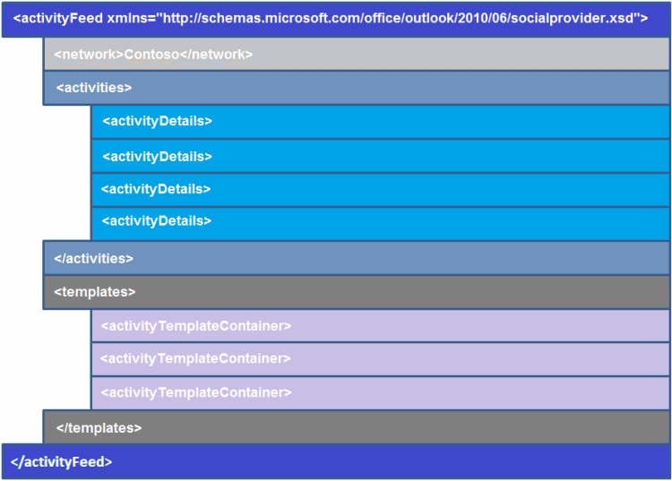

# Обзор XML для элемента веб-канала активностиOverview of XML for an activity feed item

Канал действий состоит из одной или нескольких действий, происходящих в социальной сети.An activity feed consists of one or more activities occurring on a social network. Каждая лента действий представлена элементом **activityFeed** и характеризуется этими тремя частями информации:Each activity feed is represented by an **activityFeed** element, and is characterized by these three pieces of information: 
  
- **network**—Name of the social network from which the activities originated.**network**—Name of the social network from which the activities originated.
    
- **действия**— контейнер для действий, происходящих в учетной записи пользователя в этой социальной сети.**activities**—Container for activities happening on the logged on user's account on that social network.
    
- **шаблоны**— контейнер для шаблонов, используемых для отображения соответствующего элемента активности в **действиях.****templates**—Container for templates that are used to display the corresponding activity item in **activities**.
    
Чтобы создать элемент ленты действий, необходимо соответствовать схеме XML Outlook поставщика Outlook (OSC).To create an activity feed item, you must conform to the Outlook Social Connector (OSC) provider extensibility XML schema. На рисунке 1 показана структура XML-канала активности.Figure 1 shows the activity feed XML structure.
  
**Рис. 1. Структура XML-канала активности****Figure 1. Activity feed XML structure**

  
Для каждого элемента ленты действий наиболее важными частями этой схемы являются элементы **activityDetails** и **activityTemplateContainer:**For each activity feed item, the two most important parts of this schema are the **activityDetails** and **activityTemplateContainer** elements: 
  
- Элемент **activityDetails** хранит определенные сведения для каждого элемента ленты действий, например имя владельца действия или URL-адрес для загруженных изображений.The **activityDetails** element stores specific information for each activity feed item, such as the activity owner's name or the URL for the pictures uploaded. 
    
- Элемент **activityTemplateContainer** сохраняет формат или макет для каждого элемента ленты действий.The **activityTemplateContainer** element stores the format or layout for each activity feed item. Он состоит из шаблонов, представленных отдельными элементами **activityTemplate,** которые можно повторно использовать для нескольких элементов питания.It consists of templates, represented by individual **activityTemplate** elements, that can be reused for multiple feed items. 
    
Для отдельного элемента ленты действий элемент **activityTemplate** указывает следующие четыре части информации:For an individual activity feed item, the **activityTemplate** element specifies the following four pieces of information: 
  
- **значок**— указывает URL-адрес для значка для отображения элемента ленты действий.**icon**—Specifies the URL for the icon to display the activity feed item.
    
- **заголовок**—Описывает элемент ленты действий.**title**—Describes the activity feed item.
    
- **тип**— указывает тип действий, таких как обновление состояния, фотографии или документа.**type**—Specifies the type of activity, such as a status, photo, or document update.
    
- **данные**— указывает любую дополнительную информацию, отображаемую с помощью элемента ленты действий.**data**—Specifies any extra information displayed with activity feed item.
    
> [!TIP]
> Значок, отображаемый в ленте действий, всегда такой же, как и значок поставщика, возвращенный свойством **ISocialProvider::SocialNetworkIcon.**The icon displayed in the activity feed is always the same as the provider icon returned by the **ISocialProvider::SocialNetworkIcon** property. 
  
Дополнительные сведения о элементе **activityDetails,** **элементе activityTemplateContainer,** маркерах шаблонов и переменных шаблонов см. ниже.See the following topics for more information about the **activityDetails** element, the **activityTemplateContainer** element, template tokens, and template variables: 
  
- [элемент activityDetailsactivityDetails Element](activitydetails-element.md)
    
- [элемент activityTemplateContaineractivityTemplateContainer Element](activitytemplatecontainer-element.md)
    
- [Переменные шаблонаTemplate Variables](template-variables.md)
    
- [Рекомендации для правильного отображения действийGuidelines for Properly Displaying Activities](guidelines-for-properly-displaying-activities.md)
    
Пример XML-канала активности см. в [примере Activity Feed XML.](activity-feed-xml-example.md)For an example of activity feed XML, see [Activity Feed XML Example](activity-feed-xml-example.md).
  
## См. такжеSee also

- [XML для действийXML for Activities](xml-for-activities.md) 
- [Outlook Схема поставщика социальных соединителем XMLOutlook Social Connector Provider XML Schema](outlook-social-connector-provider-xml-schema.md)
- [Разработка поставщика с помощью схемы XML OSCDeveloping a Provider with the OSC XML Schema](developing-a-provider-with-the-osc-xml-schema.md)

