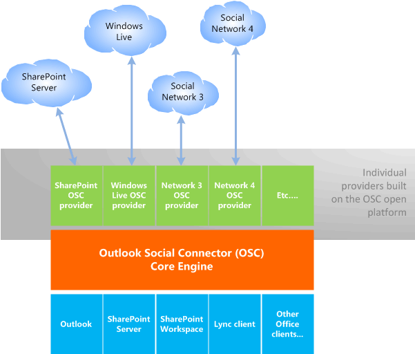

# Связывание OSC с Outlook и социальными сетямиRelating the OSC with Outlook and social networks

Социальный соединитатель Outlook (OSC) может отображаться в Office контактной карточке и Outlook people Pane, состоянии или обновлении фотографий для сотрудника, друга или любого связанного с вами лица.The Outlook Social Connector (OSC) can display in the Office Contact Card and Outlook People Pane activities, status, or photo updates for a coworker, friend, or any person you are associated with. По умолчанию в OSC отображаются Outlook, вложения и запросы на собрания, полученные от выбранного лица.By default, the OSC displays the Outlook emails, attachments, and meeting requests received from a selected person. Если выбранный пользователь и Office сотрудничают на SharePoint сайте, OSC также отображает обновления документов и другие действия сайта с этого SharePoint сайта.If the selected person and the Office user collaborate on a SharePoint site, the OSC also displays document updates and other site activities from that SharePoint site. В зависимости от контекстов связи, в которых заинтересован пользователь Office, пользователь Office может установить поставщики OSC для бизнес-приложений, внутренних корпоративных веб-сайтов или различных профессиональных и социальных сетей, таких как LinkedIn, Facebook и Windows Live.Depending on the contexts of association that the Office user is interested in, the Office user can install OSC providers for line-of-business applications, internal corporate websites, or a variety of professional and social network sites, such as LinkedIn, Facebook, and Windows Live.
  
Чтобы поддерживать общий доступ к Office клиентских приложений, базовый двигатель OSC реализуется в составе общего компонента Office, а в области Outlook реализована надстройка.To support sharing of functionality across Office client applications, the OSC core engine is implemented as part of an Office shared component, and the People Pane is implemented as an Outlook add-in. Чтобы использовать OSC, Office должен установить Outlook на клиентский компьютер и настроить Outlook с профилем, чтобы osC мог кэшировать контакты в папке Контакты.To use the OSC, an Office user must have installed Outlook on that client computer and configured Outlook with a profile, so that the OSC can cache contacts in a Contacts folder. 
  
Поставщик osc — это DLL-объектная модель компонентов , которая позволяет OSC получать доступ к данным социальной сети таким образом, чтобы он не зависит от API каждой социальной сети.An OSC provider is a Component Object Model (COM) DLL that allows the OSC to access social network data in a way that is independent of the APIs of each social network. DLL поставщика OSC должен быть установлен локально на клиентский компьютер.An OSC provider DLL must be installed locally on a client computer. Поставщик osC социальной сети соединяет osC, которая является частью Outlook, с социальной сетью в Интернете.A social network's OSC provider connects the OSC, which is part of Outlook, with the social network on the Internet.
  
Поставщик OSC должен реализовать набор интерфейсов, определенных как часть extensibility поставщика OSC, для связи с OSC.An OSC provider must implement a set of interfaces, defined as part of the OSC provider extensibility, to communicate with the OSC. Доступность поставщика OSC доступна в качестве открытой платформы.OSC provider extensibility is available as an open platform.
  
Архитектура поставщика OSC позволяет нескольким поставщикам работать с основным двигателем OSC и агрегировать социальную информацию, например друзей и действия.The provider architecture of the OSC enables multiple providers to work with the OSC core engine and aggregate social information such as friends and activities. На рисунке 1 иллюстрирует архитектуру поставщика OSC.Figure 1 illustrates the OSC provider architecture.
  
**Рис. 1. Outlook Архитектура поставщика социальных соединители****Figure 1. Outlook Social Connector provider architecture**

  
## ТерминологияTerminology

В этом Outlook ссылке поставщика социальных соединителонов социальная сеть используется для ссылки на следующие типы сайтов:In this Outlook Social Connector Provider Reference, a social network is used to refer to the following types of sites: 
  
- Совместные сайты, такие как SharePoint.Collaborative sites such as SharePoint.
    
- Сайты социальных сетей, такие как Facebook и Windows Live.Social network sites such as Facebook and Windows Live.
    
- Professional сетевых сайтов, таких как LinkedIn.Professional network sites such as LinkedIn.
    
- Другие бизнес-приложения или корпоративные внутренние веб-сайты, используемые для сетей.Other line-of-business applications or corporate internal websites used for networking.
    
Термин friend обычно используется для использования друзей, семей, коллег, подключений и всех других пользователей, с Office, связанных с пользователем в совместном контексте, например SharePoint, или добавленного в учетную запись социальной сети пользователя.The term friend is used generally to include friends, family, colleagues, connections, and anyone else an Office user is associated with in a collaborative context like SharePoint, or has added to the user's social network account. Не-друзья — это люди, ссылаясь на обновления действий друзей, но не друзья, которые были добавлены Office учетной записи социальной сети пользователя.Non-friends are people referenced in friends' activity updates but are not friends who have been added to the Office user's social network account. Контакты — это люди в папке Outlook контактов.Contacts are people in an Outlook contact folder. 
  
## См. такжеSee also

- [Начало работы с разработкой Outlook поставщика социальных соединителиGetting Started with Developing an Outlook Social Connector Provider](getting-started-with-developing-an-outlook-social-connector-provider.md)

