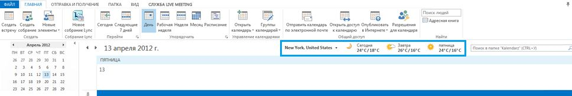
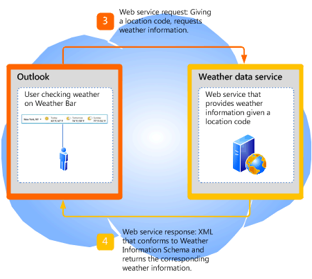

# <a name="extending-the-weather-bar-in-outlook"></a>Extending the Weather Bar in Outlook

Learn how to plug in a third-party weather web service for the Weather Bar in Outlook 2013, to provide weather conditions data for a user-chosen location.
  
## <a name="weather-bar-overview"></a>Weather Bar overview
<a name="ol15_weatherbar_overview"> </a>

The Weather Bar in Outlook displays weather conditions and forecast for a geographic location. A user can choose one or multiple locations, and conveniently see weather data in the Weather Bar in the calendar module. Figure 1 shows the Weather Bar displaying a three-day forecast for New York, NY. 
  
**Figure 1. Weather Bar in Outlook**


  
Settings for the Weather Bar are saved with the user's profile. Depending on the type of Outlook account, the settings may roam with the user on all computers that the user logs on to with the same profile, as in the case of Exchange accounts. Alternatively, the user can customize settings on each computer, as in the case of IMAP/POP accounts.
  
By default, Outlook uses weather data provided by MSN Weather. The Weather Bar supports third-party weather data web services that follow a defined protocol to communicate with Outlook. As long as a third-party weather data service supports this protocol, users can choose that weather data service to provide weather data in the Weather Bar. This article describes the protocol for third-party weather services to integrate with Outlook in the Weather Bar.
  
## <a name="weather-bar-protocol"></a>Weather Bar protocol
<a name="ol15_weatherbar_theprotocol"> </a>

A user can specify a different weather data service for the Weather Bar, as long as that weather data service implements a web service that supports the following protocol to communicate with Outlook:
  
1. The weather data service supports a base URL to a web service. For example, a Contoso Weather web service can have a base URL of https://service.contoso.com/data.aspx.
    
2. The web service allows Outlook to append the following parameters to the base URL, to request a location code: 
    
   - outputview=search: этот параметр указывает, что запрос является поиском расположения.
    
   - weasearchstr= _city_: этот параметр указывает  _расположение,_ город, для которого пользователю нужен прогноз погоды (например, в Лондоне).
    
   - culture= _LCID_: этот параметр указывает культуру версии Office, установленной для пользователя на этом компьютере. The LCID value is defined in [[RFC4646] Tags for Identifying Languages](https://www.ietf.org/rfc/rfc4646.txt)
    
   - src=outlook: этот параметр указывает, что Outlook — это клиентский приложение, запрашивающий службу.
    
   These parameters allow Outlook to take the location that the user is interested in and search for the associated location code as supported by the weather data service. The web service should respond to Outlook with a location code in XML that follows the [Outlook Weather Location XML Schema](outlook-weather-location-xml-schema.md). Figure 2 summarizes the web service request and response for a location code.
    
   **Figure 2. Web service request and response for a location code**

   
  
3. The web service also allows Outlook to append the following parameters, to request forecast information for a location code:
    
   - wealocations= _code_: _code_ in this parameter is a location code that Outlook obtains from Step 2, and that maps to the location that the user is interested in. 
    
   - weadegreetype= _degreetype_: этот параметр указывает, использовать ли метрику или единицы измерения для температуры. Specify c for metric, f for imperial for  _degreetype_. This parameter is optional and does not always exist in the web service request.
    
   - culture= _LCID_: этот параметр указывает культуру версии Office, установленной для пользователя на этом компьютере. The LCID value is defined in [[RFC4646] Tags for Identifying Languages](https://www.ietf.org/rfc/rfc4646.txt)
    
   - src=outlook: этот параметр указывает, что Outlook — это клиентский приложение, запрашивающий службу.
    
   These parameters allow Outlook to take the location code returned from Step 2 and request the weather data service for the forecast. The web service should respond to Outlook with the corresponding weather data in XML that follows the [Outlook Weather Information XML Schema](outlook-weather-information-xml-schema.md). Figure 3 summarizes the web service request and response for weather data given a location code.
    
   **Figure 3. Web service request and response for weather information**

   
  
## <a name="setting-the-weather-bar-to-use-a-weather-service"></a>Setting the Weather Bar to use a weather service
<a name="ol15_weatherbar_setting"> </a>

The administrator or power user can use the **WeatherServiceUrl** registry key to customize the Weather Bar to use a specific weather service. For example, if the base URL for a Contoso weather service is https://service.contoso.com/data.aspx, you can set the **WeatherServiceUrl** key to that URL. 
  
The following table describes the **WeatherServiceUrl** key. 
  
|||
|:-----|:-----|
|**Key** <br/> |HKCU\Software\Microsoft\Office\15.0\Outlook\Options\Calendar  <br/> |
|**Value name** <br/> |**WeatherServiceUrl** <br/> |
|**Value type** <br/> |REG_SZ  <br/> |
|**Default value** <br/> |EMPTY_STRING  <br/> |
|**Description** <br/> |URL to a weather data service.  <br/> |
   
## <a name="dependent-conditions"></a>Dependent conditions
<a name="ol15_weatherbar_dependentconditions"> </a>

Outlook 2013 displays the Weather Bar by default. This section describes a few reasons why the Weather Bar might not be visible.
  
### <a name="weather-bar-is-disabled"></a>Weather Bar is disabled

First, verify that **Show weather on the calendar** is selected in the **Calendar** tab in the **Outlook Options** dialog box. 
  
Note that an administrator can also use Group Policy to disable the Weather Bar in Outlook 2013 entirely by setting the following key in the Windows registry:
  
|||
|:-----|:-----|
|**Key** <br/> |HKCU\Software\Microsoft\Office\15.0\Outlook\Options\Calendar  <br/> |
|**Value name** <br/> |**DisableWeather** <br/> |
|**Value type** <br/> |REG_DWORD  <br/> |
|**Default value** <br/> |0  <br/> |
|**Description** <br/> |A value of 0 enables the Weather Bar; any other value disables the Weather Bar.  <br/> |
   
If the Weather Bar feature has been disabled by Group Policy, the **Calendar** tab does not include the **Show weather on the calendar** check box. Consult with the administrator to turn the feature back on. 
  
### <a name="office-is-disconnected-from-the-internet"></a>Office is disconnected from the Internet

Verify that Office is enabled to connect to the Internet—go to the **Privacy options** tab of the **Trust Center** in the Backstage view, and ensure that **Allow Office to connect to the Internet** is selected. 
  
If the user has chosen to not receive updates for Office, the Weather Bar is also disabled.
  
An administrator can also use Group Policy to disable all online content, including the Weather Bar, by setting the following key in the Windows registry:
  
|||
|:-----|:-----|
|**Key** <br/> |HKCU\Software\Microsoft\Office\15.0\Common\Internet  <br/> |
|**Value name** <br/> |**UseOnlineContent** <br/> |
|**Value type** <br/> |REG_DWORD  <br/> |
|**Default value** <br/> |2   <br/> |
|**Description** <br/> |A value of 2 enables the Weather Bar; any other value disables the Weather Bar.  <br/> |
   
If the Weather Bar feature has been disabled by Group Policy, the **Calendar** tab does not include the **Show weather on the calendar** check box. Consult with the administrator to turn the feature back on. 
  
## <a name="weather-bar-example"></a>Weather Bar example
<a name="ol15_weatherbar_example"> </a>

This section shows an example of a Contoso Weather service that follows the preceding protocol to communicate with Outlook. For any location that the user selects, Outlook first gets a location code for that location from Contoso Weather, then using that location code, calls the Contoso Weather service to get the weather data.
  
### <a name="base-url"></a>Базовый URL-адрес

Contoso Weather provides the following base URL for their weather data service:
  
https://service.contoso.com/data.aspx
  
### <a name="getting-a-location-code"></a>Getting a location code

Outlook appends the parameters described in Step 2 above to the base URL to obtain the location code for a geographic location  _city_:
  
https://service.contoso.com/data.aspx?outputview=search&amp;weasearchstr= _city_
  
As an example, if the user has selected Tokyo in the Weather Bar, Outlook uses the following URL to obtain the location code for Tokyo from Contoso Weather: 
  
https://weather.service.contoso.com/data.aspx?outputview=search&amp;weasearchstr=tokyo
  
Contoso Weather responds with the following XML to provide the location code for Tokyo. The XML conforms to the Outlook Weather Location XML Schema. Note that it is common for weather services to return data for more than one location (for example, if the selected location is a greater metropolitan area). In this example, the response for Tokyo includes two locations, each enclosed in a [weather](weather-element-weatherdata-elementoutlook-weather-location-schema.md) element. The corresponding location codes are as follows: 
  
- wc:JAXX0085 for the **weatherlocationname** attribute being  `Tokyo, JPN`
    
- wc:10038604 for the **weatherlocationname** attribute being  `Shinjuku-ku, Tokyo, Japan`
    
```XML
<?xml version="1.0" ?>
<weatherdata>
  <weather weatherlocationcode="wc:JAXX0085" 
    weatherlocationname="Tokyo, JPN">
  </weather>
  <weather weatherlocationcode="wc:10038604" 
    weatherlocationname="Shinjuku-ku, JPN">
  </weather>
</weatherdata>

```

### <a name="getting-weather-information-for-a-location-code"></a>Getting weather information for a location code

After obtaining the location code for a location, Outlook appends the parameters described in Step 3 above to the base URL to obtain weather information for that location code.
  
https://service.contoso.com/data.aspx?wealocations= _code_
  
As an example, if Outlook has obtained the location code wc:JAXX0085 from Contoso Weather for Tokyo, Outlook uses this location code in the following URL to get the weather information.
  
https://service.contoso.com/data.aspx?wealocations=wc:JAXX0085
  
Contoso Weather responds with the following XML to provide the weather information for the location code for Tokyo. The XML conforms to the Outlook Weather Information XML Schema.
  
```XML
<?xml version="1.0"?>
<weatherdata>
  <weather timezone="9" attribution="Data provided by Trey Research" 
    degreetype="F" imagerelativeurl="https://contoso.com/images/en-us/" 
    url="https://contoso.com/weather.aspx?eid=33568&amp;q=Tokyo-JPN" 
    weatherlocationname="Tokyo, JPN" 
    weatherlocationcode="wc:JAXX0085">
      <current winddisplay="9 mph NNW" windspeed="9" humidity="90" feelslike="44" 
        observationpoint="Tokyo" observationtime="06:00:00" 
        shortday="Sat" day="Saturday" date="2012-04-14" skytext="Rain" skycode="11" 
        temperature="48"/>
      <forecast shortday="Sat" day="Saturday" date="2012-04-14" precip="95" skytextday="Rain"
        skycodeday="11" high="55" low="47"/>
      <forecast shortday="Sun" day="Sunday" date="2012-04-15" precip="5" skytextday="Partly Cloudy" 
        skycodeday="30" high="65" low="43"/>
      <forecast shortday="Mon" day="Monday" date="2012-04-16" precip="5" skytextday="Partly Cloudy" 
        skycodeday="30" high="64" low="52"/>
      <forecast shortday="Tue" day="Tuesday" date="2012-04-17" precip="70" skytextday="Showers / Clear" 
        skycodeday="39" high="66" low="53"/>
      <forecast shortday="Wed" day="Wednesday" date="2012-04-18" precip="55" skytextday="Showers / Clear" 
        skycodeday="39" high="68" low="51"/>
  </weather>
</weatherdata>

```

### <a name="resetting-outlook-to-use-msn-weather"></a>Resetting Outlook to use MSN Weather

Even though Outlook uses MSN Weather by default, if a user has customized the Weather Bar to use a different weather service and subsequently wants to use MSN Weather again, the user can simply delete the **WeatherServiceUrl** key in the Windows Registry. Deleting that registry key resets Outlook to use MSN Weather. 
  
## <a name="conclusion"></a>Заключение
<a name="ol15_weatherbar_conclusion"> </a>

The Weather Bar in the Outlook calendar uses MSN Weather by default to provide the weather forecast for a specified location. Users can conveniently see weather information for the locations they care about. Third-party weather data services can also integrate with the Weather Bar by supporting the Outlook Weather Location XML Schema and Outlook Weather Information XML Schema and following a simple web service protocol with Outlook.
  
## <a name="see-also"></a>См. также

- [Outlook Weather Location XML Schema](outlook-weather-location-xml-schema.md)   
- [Outlook Weather Information XML Schema](outlook-weather-information-xml-schema.md)
    

