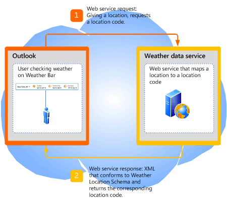

# <a name="extending-the-weather-bar-in-outlook"></a><span data-ttu-id="4dd1d-103">Extending the Weather Bar in Outlook</span><span class="sxs-lookup"><span data-stu-id="4dd1d-103">Extending the Weather Bar in Outlook</span></span>

<span data-ttu-id="4dd1d-104">Learn how to plug in a third-party weather web service for the Weather Bar in Outlook 2013, to provide weather conditions data for a user-chosen location.</span><span class="sxs-lookup"><span data-stu-id="4dd1d-104">Learn how to plug in a third-party weather web service for the Weather Bar in Outlook 2013, to provide weather conditions data for a user-chosen location.</span></span>
  
## <a name="weather-bar-overview"></a><span data-ttu-id="4dd1d-105">Weather Bar overview</span><span class="sxs-lookup"><span data-stu-id="4dd1d-105">Weather Bar overview</span></span>
<span data-ttu-id="4dd1d-106"><a name="ol15_weatherbar_overview"> </a></span><span class="sxs-lookup"><span data-stu-id="4dd1d-106"><a name="ol15_weatherbar_overview"> </a></span></span>

<span data-ttu-id="4dd1d-p101">The Weather Bar in Outlook displays weather conditions and forecast for a geographic location. A user can choose one or multiple locations, and conveniently see weather data in the Weather Bar in the calendar module. Figure 1 shows the Weather Bar displaying a three-day forecast for New York, NY.</span><span class="sxs-lookup"><span data-stu-id="4dd1d-p101">The Weather Bar in Outlook displays weather conditions and forecast for a geographic location. A user can choose one or multiple locations, and conveniently see weather data in the Weather Bar in the calendar module. Figure 1 shows the Weather Bar displaying a three-day forecast for New York, NY.</span></span> 
  
<span data-ttu-id="4dd1d-110">**Figure 1. Weather Bar in Outlook**</span><span class="sxs-lookup"><span data-stu-id="4dd1d-110">**Figure 1. Weather Bar in Outlook**</span></span>


  
<span data-ttu-id="4dd1d-p102">Settings for the Weather Bar are saved with the user's profile. Depending on the type of Outlook account, the settings may roam with the user on all computers that the user logs on to with the same profile, as in the case of Exchange accounts. Alternatively, the user can customize settings on each computer, as in the case of IMAP/POP accounts.</span><span class="sxs-lookup"><span data-stu-id="4dd1d-p102">Settings for the Weather Bar are saved with the user's profile. Depending on the type of Outlook account, the settings may roam with the user on all computers that the user logs on to with the same profile, as in the case of Exchange accounts. Alternatively, the user can customize settings on each computer, as in the case of IMAP/POP accounts.</span></span>
  
<span data-ttu-id="4dd1d-p103">By default, Outlook uses weather data provided by MSN Weather. The Weather Bar supports third-party weather data web services that follow a defined protocol to communicate with Outlook. As long as a third-party weather data service supports this protocol, users can choose that weather data service to provide weather data in the Weather Bar. This article describes the protocol for third-party weather services to integrate with Outlook in the Weather Bar.</span><span class="sxs-lookup"><span data-stu-id="4dd1d-p103">By default, Outlook uses weather data provided by MSN Weather. The Weather Bar supports third-party weather data web services that follow a defined protocol to communicate with Outlook. As long as a third-party weather data service supports this protocol, users can choose that weather data service to provide weather data in the Weather Bar. This article describes the protocol for third-party weather services to integrate with Outlook in the Weather Bar.</span></span>
  
## <a name="weather-bar-protocol"></a><span data-ttu-id="4dd1d-119">Weather Bar protocol</span><span class="sxs-lookup"><span data-stu-id="4dd1d-119">Weather Bar protocol</span></span>
<span data-ttu-id="4dd1d-120"><a name="ol15_weatherbar_theprotocol"> </a></span><span class="sxs-lookup"><span data-stu-id="4dd1d-120"><a name="ol15_weatherbar_theprotocol"> </a></span></span>

<span data-ttu-id="4dd1d-121">A user can specify a different weather data service for the Weather Bar, as long as that weather data service implements a web service that supports the following protocol to communicate with Outlook:</span><span class="sxs-lookup"><span data-stu-id="4dd1d-121">A user can specify a different weather data service for the Weather Bar, as long as that weather data service implements a web service that supports the following protocol to communicate with Outlook:</span></span>
  
1. <span data-ttu-id="4dd1d-p104">The weather data service supports a base URL to a web service. For example, a Contoso Weather web service can have a base URL of https://service.contoso.com/data.aspx.</span><span class="sxs-lookup"><span data-stu-id="4dd1d-p104">The weather data service supports a base URL to a web service. For example, a Contoso Weather web service can have a base URL of https://service.contoso.com/data.aspx.</span></span>
    
2. <span data-ttu-id="4dd1d-124">The web service allows Outlook to append the following parameters to the base URL, to request a location code:</span><span class="sxs-lookup"><span data-stu-id="4dd1d-124">The web service allows Outlook to append the following parameters to the base URL, to request a location code:</span></span> 
    
   - <span data-ttu-id="4dd1d-125">аутпутвиев = Search: этот параметр указывает на то, что запрос является поиском расположения.</span><span class="sxs-lookup"><span data-stu-id="4dd1d-125">outputview=search: This parameter indicates that the request is a location search.</span></span>
    
   - <span data-ttu-id="4dd1d-126">веасеарчстр = _City_: этот параметр указывает расположение ( _город_), для которого пользователь хочет создать прогноз погоды (например, Лондон).</span><span class="sxs-lookup"><span data-stu-id="4dd1d-126">weasearchstr= _city_: This parameter indicates the location,  _city_, for which the user wants a weather forecast (for example, London).</span></span>
    
   - <span data-ttu-id="4dd1d-127">Culture = _LCID_: этот параметр указывает язык и региональные параметры версии Office, установленной для пользователя на этом компьютере.</span><span class="sxs-lookup"><span data-stu-id="4dd1d-127">culture= _LCID_: This parameter indicates the culture of the version of Office installed for the user on that computer.</span></span> <span data-ttu-id="4dd1d-128">The LCID value is defined in [[RFC4646] Tags for Identifying Languages](https://www.ietf.org/rfc/rfc4646.txt)</span><span class="sxs-lookup"><span data-stu-id="4dd1d-128">The LCID value is defined in [[RFC4646] Tags for Identifying Languages](https://www.ietf.org/rfc/rfc4646.txt)</span></span>
    
   - <span data-ttu-id="4dd1d-129">src = Outlook: этот параметр указывает, что Outlook является клиентским приложением, запрашивающим службу.</span><span class="sxs-lookup"><span data-stu-id="4dd1d-129">src=outlook: This parameter indicates that Outlook is the client application requesting the service.</span></span>
    
   <span data-ttu-id="4dd1d-p106">These parameters allow Outlook to take the location that the user is interested in and search for the associated location code as supported by the weather data service. The web service should respond to Outlook with a location code in XML that follows the [Outlook Weather Location XML Schema](outlook-weather-location-xml-schema.md). Figure 2 summarizes the web service request and response for a location code.</span><span class="sxs-lookup"><span data-stu-id="4dd1d-p106">These parameters allow Outlook to take the location that the user is interested in and search for the associated location code as supported by the weather data service. The web service should respond to Outlook with a location code in XML that follows the [Outlook Weather Location XML Schema](outlook-weather-location-xml-schema.md). Figure 2 summarizes the web service request and response for a location code.</span></span>
    
   <span data-ttu-id="4dd1d-133">**Figure 2. Web service request and response for a location code**</span><span class="sxs-lookup"><span data-stu-id="4dd1d-133">**Figure 2. Web service request and response for a location code**</span></span>

   
  
3. <span data-ttu-id="4dd1d-135">The web service also allows Outlook to append the following parameters, to request forecast information for a location code:</span><span class="sxs-lookup"><span data-stu-id="4dd1d-135">The web service also allows Outlook to append the following parameters, to request forecast information for a location code:</span></span>
    
   - <span data-ttu-id="4dd1d-136">веалокатионс = _код_. _код_ в этом параметре — это код расположения, который Outlook получает с шага 2 и который соответствует расположению, в котором заинтересен пользователь.</span><span class="sxs-lookup"><span data-stu-id="4dd1d-136">wealocations= _code_: _code_ in this parameter is a location code that Outlook obtains from Step 2, and that maps to the location that the user is interested in.</span></span> 
    
   - <span data-ttu-id="4dd1d-137">веадегритипе = _дегритипе_: этот параметр указывает, следует ли использовать метрику или Империал единиц измерения для температуры.</span><span class="sxs-lookup"><span data-stu-id="4dd1d-137">weadegreetype= _degreetype_: This parameter specifies whether to use metric or imperial units of measurement for temperature.</span></span> <span data-ttu-id="4dd1d-138">Specify c for metric, f for imperial for  _degreetype_.</span><span class="sxs-lookup"><span data-stu-id="4dd1d-138">Specify c for metric, f for imperial for  _degreetype_.</span></span> <span data-ttu-id="4dd1d-139">This parameter is optional and does not always exist in the web service request.</span><span class="sxs-lookup"><span data-stu-id="4dd1d-139">This parameter is optional and does not always exist in the web service request.</span></span>
    
   - <span data-ttu-id="4dd1d-140">Culture = _LCID_: этот параметр указывает язык и региональные параметры версии Office, установленной для пользователя на этом компьютере.</span><span class="sxs-lookup"><span data-stu-id="4dd1d-140">culture= _LCID_: This parameter indicates the culture of the version of Office installed for the user on that computer.</span></span> <span data-ttu-id="4dd1d-141">The LCID value is defined in [[RFC4646] Tags for Identifying Languages](https://www.ietf.org/rfc/rfc4646.txt)</span><span class="sxs-lookup"><span data-stu-id="4dd1d-141">The LCID value is defined in [[RFC4646] Tags for Identifying Languages](https://www.ietf.org/rfc/rfc4646.txt)</span></span>
    
   - <span data-ttu-id="4dd1d-142">src = Outlook: этот параметр указывает, что Outlook является клиентским приложением, запрашивающим службу.</span><span class="sxs-lookup"><span data-stu-id="4dd1d-142">src=outlook: This parameter indicates that Outlook is the client application requesting the service.</span></span>
    
   <span data-ttu-id="4dd1d-p109">These parameters allow Outlook to take the location code returned from Step 2 and request the weather data service for the forecast. The web service should respond to Outlook with the corresponding weather data in XML that follows the [Outlook Weather Information XML Schema](outlook-weather-information-xml-schema.md). Figure 3 summarizes the web service request and response for weather data given a location code.</span><span class="sxs-lookup"><span data-stu-id="4dd1d-p109">These parameters allow Outlook to take the location code returned from Step 2 and request the weather data service for the forecast. The web service should respond to Outlook with the corresponding weather data in XML that follows the [Outlook Weather Information XML Schema](outlook-weather-information-xml-schema.md). Figure 3 summarizes the web service request and response for weather data given a location code.</span></span>
    
   <span data-ttu-id="4dd1d-146">**Figure 3. Web service request and response for weather information**</span><span class="sxs-lookup"><span data-stu-id="4dd1d-146">**Figure 3. Web service request and response for weather information**</span></span>

   
  
## <a name="setting-the-weather-bar-to-use-a-weather-service"></a><span data-ttu-id="4dd1d-148">Setting the Weather Bar to use a weather service</span><span class="sxs-lookup"><span data-stu-id="4dd1d-148">Setting the Weather Bar to use a weather service</span></span>
<span data-ttu-id="4dd1d-149"><a name="ol15_weatherbar_setting"> </a></span><span class="sxs-lookup"><span data-stu-id="4dd1d-149"><a name="ol15_weatherbar_setting"> </a></span></span>

<span data-ttu-id="4dd1d-p110">The administrator or power user can use the **WeatherServiceUrl** registry key to customize the Weather Bar to use a specific weather service. For example, if the base URL for a Contoso weather service is https://service.contoso.com/data.aspx, you can set the **WeatherServiceUrl** key to that URL.</span><span class="sxs-lookup"><span data-stu-id="4dd1d-p110">The administrator or power user can use the **WeatherServiceUrl** registry key to customize the Weather Bar to use a specific weather service. For example, if the base URL for a Contoso weather service is https://service.contoso.com/data.aspx, you can set the **WeatherServiceUrl** key to that URL.</span></span> 
  
<span data-ttu-id="4dd1d-152">The following table describes the **WeatherServiceUrl** key.</span><span class="sxs-lookup"><span data-stu-id="4dd1d-152">The following table describes the **WeatherServiceUrl** key.</span></span> 
  
|||
|:-----|:-----|
|<span data-ttu-id="4dd1d-153">**Key**</span><span class="sxs-lookup"><span data-stu-id="4dd1d-153">**Key**</span></span> <br/> |<span data-ttu-id="4dd1d-154">HKCU\Software\Microsoft\Office\15.0\Outlook\Options\Calendar</span><span class="sxs-lookup"><span data-stu-id="4dd1d-154">HKCU\Software\Microsoft\Office\15.0\Outlook\Options\Calendar</span></span>  <br/> |
|<span data-ttu-id="4dd1d-155">**Имя значения**</span><span class="sxs-lookup"><span data-stu-id="4dd1d-155">**Value name**</span></span> <br/> |<span data-ttu-id="4dd1d-156">**WeatherServiceUrl**</span><span class="sxs-lookup"><span data-stu-id="4dd1d-156">**WeatherServiceUrl**</span></span> <br/> |
|<span data-ttu-id="4dd1d-157">**Тип значения**</span><span class="sxs-lookup"><span data-stu-id="4dd1d-157">**Value type**</span></span> <br/> |<span data-ttu-id="4dd1d-158">REG_SZ</span><span class="sxs-lookup"><span data-stu-id="4dd1d-158">REG_SZ</span></span>  <br/> |
|<span data-ttu-id="4dd1d-159">**Значение, используемое по умолчанию**</span><span class="sxs-lookup"><span data-stu-id="4dd1d-159">**Default value**</span></span> <br/> |<span data-ttu-id="4dd1d-160">EMPTY_STRING</span><span class="sxs-lookup"><span data-stu-id="4dd1d-160">EMPTY_STRING</span></span>  <br/> |
|<span data-ttu-id="4dd1d-161">**Описание**</span><span class="sxs-lookup"><span data-stu-id="4dd1d-161">**Description**</span></span> <br/> |<span data-ttu-id="4dd1d-162">URL to a weather data service.</span><span class="sxs-lookup"><span data-stu-id="4dd1d-162">URL to a weather data service.</span></span>  <br/> |
   
## <a name="dependent-conditions"></a><span data-ttu-id="4dd1d-163">Dependent conditions</span><span class="sxs-lookup"><span data-stu-id="4dd1d-163">Dependent conditions</span></span>
<span data-ttu-id="4dd1d-164"><a name="ol15_weatherbar_dependentconditions"> </a></span><span class="sxs-lookup"><span data-stu-id="4dd1d-164"><a name="ol15_weatherbar_dependentconditions"> </a></span></span>

<span data-ttu-id="4dd1d-p111">Outlook 2013 displays the Weather Bar by default. This section describes a few reasons why the Weather Bar might not be visible.</span><span class="sxs-lookup"><span data-stu-id="4dd1d-p111">Outlook 2013 displays the Weather Bar by default. This section describes a few reasons why the Weather Bar might not be visible.</span></span>
  
### <a name="weather-bar-is-disabled"></a><span data-ttu-id="4dd1d-167">Weather Bar is disabled</span><span class="sxs-lookup"><span data-stu-id="4dd1d-167">Weather Bar is disabled</span></span>

<span data-ttu-id="4dd1d-168">First, verify that **Show weather on the calendar** is selected in the **Calendar** tab in the **Outlook Options** dialog box.</span><span class="sxs-lookup"><span data-stu-id="4dd1d-168">First, verify that **Show weather on the calendar** is selected in the **Calendar** tab in the **Outlook Options** dialog box.</span></span> 
  
<span data-ttu-id="4dd1d-169">Note that an administrator can also use Group Policy to disable the Weather Bar in Outlook 2013 entirely by setting the following key in the Windows registry:</span><span class="sxs-lookup"><span data-stu-id="4dd1d-169">Note that an administrator can also use Group Policy to disable the Weather Bar in Outlook 2013 entirely by setting the following key in the Windows registry:</span></span>
  
|||
|:-----|:-----|
|<span data-ttu-id="4dd1d-170">**Key**</span><span class="sxs-lookup"><span data-stu-id="4dd1d-170">**Key**</span></span> <br/> |<span data-ttu-id="4dd1d-171">HKCU\Software\Microsoft\Office\15.0\Outlook\Options\Calendar</span><span class="sxs-lookup"><span data-stu-id="4dd1d-171">HKCU\Software\Microsoft\Office\15.0\Outlook\Options\Calendar</span></span>  <br/> |
|<span data-ttu-id="4dd1d-172">**Имя значения**</span><span class="sxs-lookup"><span data-stu-id="4dd1d-172">**Value name**</span></span> <br/> |<span data-ttu-id="4dd1d-173">**DisableWeather**</span><span class="sxs-lookup"><span data-stu-id="4dd1d-173">**DisableWeather**</span></span> <br/> |
|<span data-ttu-id="4dd1d-174">**Value type**</span><span class="sxs-lookup"><span data-stu-id="4dd1d-174">**Value type**</span></span> <br/> |<span data-ttu-id="4dd1d-175">REG_DWORD</span><span class="sxs-lookup"><span data-stu-id="4dd1d-175">REG_DWORD</span></span>  <br/> |
|<span data-ttu-id="4dd1d-176">**Default value**</span><span class="sxs-lookup"><span data-stu-id="4dd1d-176">**Default value**</span></span> <br/> |<span data-ttu-id="4dd1d-177">нуль</span><span class="sxs-lookup"><span data-stu-id="4dd1d-177">0</span></span>  <br/> |
|<span data-ttu-id="4dd1d-178">**Описание**</span><span class="sxs-lookup"><span data-stu-id="4dd1d-178">**Description**</span></span> <br/> |<span data-ttu-id="4dd1d-179">A value of 0 enables the Weather Bar; any other value disables the Weather Bar.</span><span class="sxs-lookup"><span data-stu-id="4dd1d-179">A value of 0 enables the Weather Bar; any other value disables the Weather Bar.</span></span>  <br/> |
   
<span data-ttu-id="4dd1d-p112">If the Weather Bar feature has been disabled by Group Policy, the **Calendar** tab does not include the **Show weather on the calendar** check box. Consult with the administrator to turn the feature back on.</span><span class="sxs-lookup"><span data-stu-id="4dd1d-p112">If the Weather Bar feature has been disabled by Group Policy, the **Calendar** tab does not include the **Show weather on the calendar** check box. Consult with the administrator to turn the feature back on.</span></span> 
  
### <a name="office-is-disconnected-from-the-internet"></a><span data-ttu-id="4dd1d-182">Office is disconnected from the Internet</span><span class="sxs-lookup"><span data-stu-id="4dd1d-182">Office is disconnected from the Internet</span></span>

<span data-ttu-id="4dd1d-183">Verify that Office is enabled to connect to the Internet—go to the **Privacy options** tab of the **Trust Center** in the Backstage view, and ensure that **Allow Office to connect to the Internet** is selected.</span><span class="sxs-lookup"><span data-stu-id="4dd1d-183">Verify that Office is enabled to connect to the Internet—go to the **Privacy options** tab of the **Trust Center** in the Backstage view, and ensure that **Allow Office to connect to the Internet** is selected.</span></span> 
  
<span data-ttu-id="4dd1d-184">If the user has chosen to not receive updates for Office, the Weather Bar is also disabled.</span><span class="sxs-lookup"><span data-stu-id="4dd1d-184">If the user has chosen to not receive updates for Office, the Weather Bar is also disabled.</span></span>
  
<span data-ttu-id="4dd1d-185">An administrator can also use Group Policy to disable all online content, including the Weather Bar, by setting the following key in the Windows registry:</span><span class="sxs-lookup"><span data-stu-id="4dd1d-185">An administrator can also use Group Policy to disable all online content, including the Weather Bar, by setting the following key in the Windows registry:</span></span>
  
|||
|:-----|:-----|
|<span data-ttu-id="4dd1d-186">**Key**</span><span class="sxs-lookup"><span data-stu-id="4dd1d-186">**Key**</span></span> <br/> |<span data-ttu-id="4dd1d-187">HKCU\Software\Microsoft\Office\15.0\Common\Internet</span><span class="sxs-lookup"><span data-stu-id="4dd1d-187">HKCU\Software\Microsoft\Office\15.0\Common\Internet</span></span>  <br/> |
|<span data-ttu-id="4dd1d-188">**Value name**</span><span class="sxs-lookup"><span data-stu-id="4dd1d-188">**Value name**</span></span> <br/> |<span data-ttu-id="4dd1d-189">**UseOnlineContent**</span><span class="sxs-lookup"><span data-stu-id="4dd1d-189">**UseOnlineContent**</span></span> <br/> |
|<span data-ttu-id="4dd1d-190">**Value type**</span><span class="sxs-lookup"><span data-stu-id="4dd1d-190">**Value type**</span></span> <br/> |<span data-ttu-id="4dd1d-191">REG_DWORD</span><span class="sxs-lookup"><span data-stu-id="4dd1d-191">REG_DWORD</span></span>  <br/> |
|<span data-ttu-id="4dd1d-192">**Default value**</span><span class="sxs-lookup"><span data-stu-id="4dd1d-192">**Default value**</span></span> <br/> |<span data-ttu-id="4dd1d-193">2</span><span class="sxs-lookup"><span data-stu-id="4dd1d-193">2</span></span>  <br/> |
|<span data-ttu-id="4dd1d-194">**Description**</span><span class="sxs-lookup"><span data-stu-id="4dd1d-194">**Description**</span></span> <br/> |<span data-ttu-id="4dd1d-195">A value of 2 enables the Weather Bar; any other value disables the Weather Bar.</span><span class="sxs-lookup"><span data-stu-id="4dd1d-195">A value of 2 enables the Weather Bar; any other value disables the Weather Bar.</span></span>  <br/> |
   
<span data-ttu-id="4dd1d-p113">If the Weather Bar feature has been disabled by Group Policy, the **Calendar** tab does not include the **Show weather on the calendar** check box. Consult with the administrator to turn the feature back on.</span><span class="sxs-lookup"><span data-stu-id="4dd1d-p113">If the Weather Bar feature has been disabled by Group Policy, the **Calendar** tab does not include the **Show weather on the calendar** check box. Consult with the administrator to turn the feature back on.</span></span> 
  
## <a name="weather-bar-example"></a><span data-ttu-id="4dd1d-198">Weather Bar example</span><span class="sxs-lookup"><span data-stu-id="4dd1d-198">Weather Bar example</span></span>
<span data-ttu-id="4dd1d-199"><a name="ol15_weatherbar_example"> </a></span><span class="sxs-lookup"><span data-stu-id="4dd1d-199"><a name="ol15_weatherbar_example"> </a></span></span>

<span data-ttu-id="4dd1d-p114">This section shows an example of a Contoso Weather service that follows the preceding protocol to communicate with Outlook. For any location that the user selects, Outlook first gets a location code for that location from Contoso Weather, then using that location code, calls the Contoso Weather service to get the weather data.</span><span class="sxs-lookup"><span data-stu-id="4dd1d-p114">This section shows an example of a Contoso Weather service that follows the preceding protocol to communicate with Outlook. For any location that the user selects, Outlook first gets a location code for that location from Contoso Weather, then using that location code, calls the Contoso Weather service to get the weather data.</span></span>
  
### <a name="base-url"></a><span data-ttu-id="4dd1d-202">Base URL</span><span class="sxs-lookup"><span data-stu-id="4dd1d-202">Base URL</span></span>

<span data-ttu-id="4dd1d-203">Contoso Weather provides the following base URL for their weather data service:</span><span class="sxs-lookup"><span data-stu-id="4dd1d-203">Contoso Weather provides the following base URL for their weather data service:</span></span>
  
https://service.contoso.com/data.aspx
  
### <a name="getting-a-location-code"></a><span data-ttu-id="4dd1d-204">Getting a location code</span><span class="sxs-lookup"><span data-stu-id="4dd1d-204">Getting a location code</span></span>

<span data-ttu-id="4dd1d-205">Outlook appends the parameters described in Step 2 above to the base URL to obtain the location code for a geographic location  _city_:</span><span class="sxs-lookup"><span data-stu-id="4dd1d-205">Outlook appends the parameters described in Step 2 above to the base URL to obtain the location code for a geographic location  _city_:</span></span>
  
<span data-ttu-id="4dd1d-206">https://service.contoso.com/data.aspx?outputview=search&amp;weasearchstr= _city_</span><span class="sxs-lookup"><span data-stu-id="4dd1d-206">https://service.contoso.com/data.aspx?outputview=search&amp;weasearchstr= _city_</span></span>
  
<span data-ttu-id="4dd1d-207">As an example, if the user has selected Tokyo in the Weather Bar, Outlook uses the following URL to obtain the location code for Tokyo from Contoso Weather:</span><span class="sxs-lookup"><span data-stu-id="4dd1d-207">As an example, if the user has selected Tokyo in the Weather Bar, Outlook uses the following URL to obtain the location code for Tokyo from Contoso Weather:</span></span> 
  
<span data-ttu-id="4dd1d-208">https://weather.service.contoso.com/data.aspx?outputview=search&amp;weasearchstr=tokyo</span><span class="sxs-lookup"><span data-stu-id="4dd1d-208">https://weather.service.contoso.com/data.aspx?outputview=search&amp;weasearchstr=tokyo</span></span>
  
<span data-ttu-id="4dd1d-p115">Contoso Weather responds with the following XML to provide the location code for Tokyo. The XML conforms to the Outlook Weather Location XML Schema. Note that it is common for weather services to return data for more than one location (for example, if the selected location is a greater metropolitan area). In this example, the response for Tokyo includes two locations, each enclosed in a [weather](weather-element-weatherdata-elementoutlook-weather-location-schema.md) element. The corresponding location codes are as follows:</span><span class="sxs-lookup"><span data-stu-id="4dd1d-p115">Contoso Weather responds with the following XML to provide the location code for Tokyo. The XML conforms to the Outlook Weather Location XML Schema. Note that it is common for weather services to return data for more than one location (for example, if the selected location is a greater metropolitan area). In this example, the response for Tokyo includes two locations, each enclosed in a [weather](weather-element-weatherdata-elementoutlook-weather-location-schema.md) element. The corresponding location codes are as follows:</span></span> 
  
- <span data-ttu-id="4dd1d-214">wc:JAXX0085 for the **weatherlocationname** attribute being  `Tokyo, JPN`</span><span class="sxs-lookup"><span data-stu-id="4dd1d-214">wc:JAXX0085 for the **weatherlocationname** attribute being  `Tokyo, JPN`</span></span>
    
- <span data-ttu-id="4dd1d-215">wc:10038604 for the **weatherlocationname** attribute being  `Shinjuku-ku, Tokyo, Japan`</span><span class="sxs-lookup"><span data-stu-id="4dd1d-215">wc:10038604 for the **weatherlocationname** attribute being  `Shinjuku-ku, Tokyo, Japan`</span></span>
    
```XML
<?xml version="1.0" ?>
<weatherdata>
  <weather weatherlocationcode="wc:JAXX0085" 
    weatherlocationname="Tokyo, JPN">
  </weather>
  <weather weatherlocationcode="wc:10038604" 
    weatherlocationname="Shinjuku-ku, JPN">
  </weather>
</weatherdata>

```

### <a name="getting-weather-information-for-a-location-code"></a><span data-ttu-id="4dd1d-216">Getting weather information for a location code</span><span class="sxs-lookup"><span data-stu-id="4dd1d-216">Getting weather information for a location code</span></span>

<span data-ttu-id="4dd1d-217">After obtaining the location code for a location, Outlook appends the parameters described in Step 3 above to the base URL to obtain weather information for that location code.</span><span class="sxs-lookup"><span data-stu-id="4dd1d-217">After obtaining the location code for a location, Outlook appends the parameters described in Step 3 above to the base URL to obtain weather information for that location code.</span></span>
  
<span data-ttu-id="4dd1d-218">https://service.contoso.com/data.aspx?wealocations= _code_</span><span class="sxs-lookup"><span data-stu-id="4dd1d-218">https://service.contoso.com/data.aspx?wealocations= _code_</span></span>
  
<span data-ttu-id="4dd1d-219">As an example, if Outlook has obtained the location code wc:JAXX0085 from Contoso Weather for Tokyo, Outlook uses this location code in the following URL to get the weather information.</span><span class="sxs-lookup"><span data-stu-id="4dd1d-219">As an example, if Outlook has obtained the location code wc:JAXX0085 from Contoso Weather for Tokyo, Outlook uses this location code in the following URL to get the weather information.</span></span>
  
https://service.contoso.com/data.aspx?wealocations=wc:JAXX0085
  
<span data-ttu-id="4dd1d-p116">Contoso Weather responds with the following XML to provide the weather information for the location code for Tokyo. The XML conforms to the Outlook Weather Information XML Schema.</span><span class="sxs-lookup"><span data-stu-id="4dd1d-p116">Contoso Weather responds with the following XML to provide the weather information for the location code for Tokyo. The XML conforms to the Outlook Weather Information XML Schema.</span></span>
  
```XML
<?xml version="1.0"?>
<weatherdata>
  <weather timezone="9" attribution="Data provided by Trey Research" 
    degreetype="F" imagerelativeurl="https://contoso.com/images/en-us/" 
    url="https://contoso.com/weather.aspx?eid=33568&amp;q=Tokyo-JPN" 
    weatherlocationname="Tokyo, JPN" 
    weatherlocationcode="wc:JAXX0085">
      <current winddisplay="9 mph NNW" windspeed="9" humidity="90" feelslike="44" 
        observationpoint="Tokyo" observationtime="06:00:00" 
        shortday="Sat" day="Saturday" date="2012-04-14" skytext="Rain" skycode="11" 
        temperature="48"/>
      <forecast shortday="Sat" day="Saturday" date="2012-04-14" precip="95" skytextday="Rain"
        skycodeday="11" high="55" low="47"/>
      <forecast shortday="Sun" day="Sunday" date="2012-04-15" precip="5" skytextday="Partly Cloudy" 
        skycodeday="30" high="65" low="43"/>
      <forecast shortday="Mon" day="Monday" date="2012-04-16" precip="5" skytextday="Partly Cloudy" 
        skycodeday="30" high="64" low="52"/>
      <forecast shortday="Tue" day="Tuesday" date="2012-04-17" precip="70" skytextday="Showers / Clear" 
        skycodeday="39" high="66" low="53"/>
      <forecast shortday="Wed" day="Wednesday" date="2012-04-18" precip="55" skytextday="Showers / Clear" 
        skycodeday="39" high="68" low="51"/>
  </weather>
</weatherdata>

```

### <a name="resetting-outlook-to-use-msn-weather"></a><span data-ttu-id="4dd1d-222">Resetting Outlook to use MSN Weather</span><span class="sxs-lookup"><span data-stu-id="4dd1d-222">Resetting Outlook to use MSN Weather</span></span>

<span data-ttu-id="4dd1d-p117">Even though Outlook uses MSN Weather by default, if a user has customized the Weather Bar to use a different weather service and subsequently wants to use MSN Weather again, the user can simply delete the **WeatherServiceUrl** key in the Windows Registry. Deleting that registry key resets Outlook to use MSN Weather.</span><span class="sxs-lookup"><span data-stu-id="4dd1d-p117">Even though Outlook uses MSN Weather by default, if a user has customized the Weather Bar to use a different weather service and subsequently wants to use MSN Weather again, the user can simply delete the **WeatherServiceUrl** key in the Windows Registry. Deleting that registry key resets Outlook to use MSN Weather.</span></span> 
  
## <a name="conclusion"></a><span data-ttu-id="4dd1d-225">Заключение</span><span class="sxs-lookup"><span data-stu-id="4dd1d-225">Conclusion</span></span>
<span data-ttu-id="4dd1d-226"><a name="ol15_weatherbar_conclusion"> </a></span><span class="sxs-lookup"><span data-stu-id="4dd1d-226"><a name="ol15_weatherbar_conclusion"> </a></span></span>

<span data-ttu-id="4dd1d-p118">The Weather Bar in the Outlook calendar uses MSN Weather by default to provide the weather forecast for a specified location. Users can conveniently see weather information for the locations they care about. Third-party weather data services can also integrate with the Weather Bar by supporting the Outlook Weather Location XML Schema and Outlook Weather Information XML Schema and following a simple web service protocol with Outlook.</span><span class="sxs-lookup"><span data-stu-id="4dd1d-p118">The Weather Bar in the Outlook calendar uses MSN Weather by default to provide the weather forecast for a specified location. Users can conveniently see weather information for the locations they care about. Third-party weather data services can also integrate with the Weather Bar by supporting the Outlook Weather Location XML Schema and Outlook Weather Information XML Schema and following a simple web service protocol with Outlook.</span></span>
  
## <a name="see-also"></a><span data-ttu-id="4dd1d-230">См. также</span><span class="sxs-lookup"><span data-stu-id="4dd1d-230">See also</span></span>

- [<span data-ttu-id="4dd1d-231">Outlook Weather Location XML Schema</span><span class="sxs-lookup"><span data-stu-id="4dd1d-231">Outlook Weather Location XML Schema</span></span>](outlook-weather-location-xml-schema.md)   
- [<span data-ttu-id="4dd1d-232">Outlook Weather Information XML Schema</span><span class="sxs-lookup"><span data-stu-id="4dd1d-232">Outlook Weather Information XML Schema</span></span>](outlook-weather-information-xml-schema.md)
    

