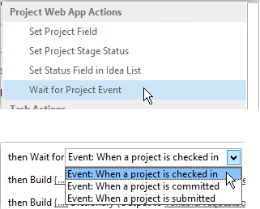

# Пакетное обновление настраиваемых полей и создание сайтов проектов из рабочего процесса в Project OnlineBulk update custom fields and create project sites from a workflow in Project Online

Чтобы помочь клиентам получить больше всего Project Online и повысить эластичность и гибкость службы, мы добавили два метода в клиентскую объектную модель, которую можно использовать в Project Online приложениях и рабочего процессах.To help customers get the most out of Project Online and improve our service extensibility and flexibility, we've added two methods to the client-side object model that you can use in Project Online apps and workflows.
  
|||
|:-----|:-----|
|**UpdateCustomFields****UpdateCustomFields**   |Объемные обновления проектируемых пользовательских полей.Bulk updates project custom fields. Только Project Online.For Project Online only. Доступно только в API REST.Available only in the REST API.    |
|**CreateProjectSite****CreateProjectSite**   | Создает сайт Project.Creates a Project site. Только Project Online.For Project Online only. Доступно в API REST, управляемой клиентской объектной модели и клиентской объектной модели JavaScript.Available in the REST API, managed client object model, and JavaScript client object model.    |
   
Помимо обеспечения большей гибкости, эти методы также обеспечивают значительные улучшения производительности при сохранении и публикации проектов в рабочего процесса.In addition to providing more flexibility, these methods also offer significant performance improvements when saving and publishing projects in a workflow. В этой статье описывается использование методов в API REST и содержится инструкция по созданию рабочего процесса, который массово обновляет настраиваемые поля и рабочий процесс, создаваемый Project сайте.This article describes how to use the methods in the REST API and provides instructions for creating a workflow that bulk updates custom fields and a workflow that creates a Project site.
  
> [!NOTE]
> Дополнительные информацию о вызове API REST из рабочего процесса SharePoint 2013 г. см. в публикации Using [SharePoint REST services from workflow with POST](https://mysharepointinsight.blogspot.com/2013/05/using-sharepoint-rest-services-from.mdl) method and Calling the SharePoint [2013 Rest API from a SharePoint Designer Workflow](https://sergeluca.wordpress.com/2013/04/09/calling-the-sharepoint-2013-rest-api-from-a-sharepoint-designer-workflow/).To learn more about calling REST APIs from SharePoint 2013 workflows, see [Using SharePoint REST services from workflow with POST method](https://mysharepointinsight.blogspot.com/2013/05/using-sharepoint-rest-services-from.mdl) and [Calling the SharePoint 2013 Rest API from a SharePoint Designer Workflow](https://sergeluca.wordpress.com/2013/04/09/calling-the-sharepoint-2013-rest-api-from-a-sharepoint-designer-workflow/). 
  
## Настраиваемые поля проекта bulk update из рабочего процессаBulk update project custom fields from a workflow

Ранее рабочий процесс мог обновлять только одно пользовательское поле одновременно.Previously, workflows could only update one custom field at a time. Обновление настраиваемого поля проекта по одному может привести к плохому интерфейсу конечных пользователей при переходе пользователей Project страниц детализации.Updating project custom fields one at a time can result in a poor end-user experience when users transition between Project Detail Pages. Каждое обновление требовало отдельного запроса сервера с помощью действия **Set Project Field,** а обновление нескольких пользовательских полей в сети с высокой задержкой и низкой пропускной способностью привело к нетривиальным накладным затратам.Each update required a separate server request using the **Set Project Field** action, and updating multiple custom fields on a high-latency, low-bandwidth network resulted in a non-trivial overhead. Чтобы устранить эту проблему, мы добавили метод **UpdateCustomFields** в API REST, который позволяет массово обновлять настраиваемые поля.To resolve this issue, we added the **UpdateCustomFields** method to the REST API that lets you bulk update custom fields. Чтобы использовать **UpdateCustomFields,** вы передаете в словарь, содержащий имена и значения всех пользовательских полей, которые необходимо обновить.To use **UpdateCustomFields**, you pass in a dictionary that contains the names and values of all the custom fields you want to update.
  
Метод REST можно найти в следующей конечной точке:The REST method can be found at the following endpoint:
  
`https://<site-url>/_api/ProjectServer/Projects('<guid>')/Draft/UpdateCustomFields()`
  
> [!NOTE]
> Замените местообладатель в примерах URL-адресом сайта Project Web App (PWA) и местообладателями вашего проекта `<site-url>` `<guid>` UID.Replace the  `<site-url>` placeholder in the examples with the URL of your Project Web App (PWA) site and the  `<guid>` placeholder with your project UID. 
  
В этом разделе описывается создание рабочего процесса, который массово обновляет настраиваемые поля для проекта.This section describes how to create a workflow that bulk updates custom fields for a project. Рабочий процесс следует следующим шагам высокого уровня:The workflow follows these high-level steps:
  
- Подождите, пока проект, который необходимо обновить, чтобы получить регистрациюWait for the project that you want to update to get checked in
    
- Создайте набор данных, определяемый всеми пользовательскими обновлениями поля для проектаBuild a data set that defines all your custom field updates for the project
    
- Ознакомьтесь с проектомCheck out the project
    
- Вызов **UpdateCustomFields** для применения пользовательских обновлений поля к проектуCall **UpdateCustomFields** to apply the custom field updates to the project 
    
- Войдите соответствующие сведения в список журналов рабочего процесса (при необходимости)Log relevant information to the workflow history list (if required)
    
- Публикация проектаPublish the project
    
- Регистрация в проектеCheck in the project
    
Конечный, конечный рабочий процесс выглядит так:The final, end-to-end workflow looks like this:
  

  
### Создание рабочего процесса, который массово обновляет настраиваемые поляTo create a workflow that bulk updates custom fields

1. Необязательный параметр.Optional. Храните полный URL-адрес проекта в переменной, которую можно использовать в течение рабочего процесса.Store the full URL of your project in a variable that you can use throughout the workflow.
    
    
  
2. Добавьте действие **Wait for Project event** в рабочий процесс и выберите время проверки проекта **в** событии.Add the **Wait for Project Event** action to the workflow and choose the **When a project is checked in** event. 
    
     проверки проекта
  
3. Создайте **словарь requestHeader** с помощью действия **словаря Сборка.**Create a **requestHeader** dictionary using the **Build dictionary** action. Для всех вызовов веб-служб в этом рабочего процесса используется один и тот же заголовок запросов.You'll use the same request header for all the web service calls in this workflow. 
    
    
  
4. Добавьте в словарь следующие два пункта.Add the following two items to the dictionary.
    
    |ИмяName|ТипType|ЗначениеValue|
    |:-----|:-----|:-----|
    |AcceptAccept    |StringString    |application/json; odata=verboseapplication/json; odata=verbose    |
    |Content-TypeContent-Type    |StringString    |application/json; odata=verboseapplication/json; odata=verbose    |
   
    
  
5. Создайте **словарь requestBody** с помощью действия **словаря Сборка.**Create a **requestBody** dictionary using the **Build dictionary** action. В этом словаре хранится все обновления поля, которые необходимо применить.This dictionary stores all the field updates that you want to apply. 
    
    Для каждого настраиваемого обновления поля требуется четыре строки: тип метаданных поля (1), ключ (2), значение (3) и (4) значение.Each custom field update requires four rows: the field's (1) metadata type, (2) key, (3) value, and (4) value type.
    
    - **__metadata/type** Тип метаданных поля.**__metadata/type** The field's metadata type. Эта запись всегда одно и то же и использует следующие значения:This record is always the same and uses the following values: 
    
       - Имя: customFieldDictionary(i)/__metadata/type (где **я** — индекс каждого настраиваемого поля в словаре, начиная с 0)Name: customFieldDictionary(i)/__metadata/type (where **i** is the index of each custom field in the dictionary, starting with 0) 
            
       - Тип: строкаType: String
            
       - Значение: SP. KeyValueValue: SP.KeyValue
    
       
  
    - **Клавиша** Внутреннее имя настраиваемого поля в формате: *Custom_ce23fbf43fa0e411941000155d3c8201***Key** The internal name of the custom field, in the format: *Custom_ce23fbf43fa0e411941000155d3c8201* 
    
       Внутреннее имя настраиваемого поля можно найти, переназначив его в конечную точку **InternalName:**`https://<site-url>/_api/ProjectServer/CustomFields('<guid>')/InternalName`You can find the internal name of a custom field by navigating to it's **InternalName** endpoint: `https://<site-url>/_api/ProjectServer/CustomFields('<guid>')/InternalName`
    
       Если вы создали настраиваемые поля вручную, значения будут отличаться от сайта к сайту.If you created your custom fields manually, the values will differ from site to site. Если планируется повторное использование рабочего процесса на нескольких сайтах, убедитесь, что пользовательские ИД поля правильны.If you plan to reuse the workflow across multiple sites, make sure the custom field IDs are correct.
    
    - **Значение** Значение, необходимое для назначения настраиваемой области.**Value** The value to assign to the custom field. Для пользовательских полей, связанных со таблицами lookup, необходимо использовать внутренние имена записей таблицы lookup вместо фактических значений таблицы проверки.For custom fields that are linked to lookup tables, you need to use the internal names of the lookup table entries instead of the actual lookup table values. 
    
       Внутреннее имя записи таблицы поиска можно найти в следующей конечной точке: `https://<site-url>/_api/ProjectServer/CustomFields('<guid>')/LookupEntries('<guid>')/InternalName`You can find the internal name of the lookup table entry at the following endpoint: `https://<site-url>/_api/ProjectServer/CustomFields('<guid>')/LookupEntries('<guid>')/InternalName`
    
       Если у вас есть настраиваемое поле таблицы lookup, настроенное для пользования несколькими значениями, используйте для одновременного определения значений (как показано в приведенной ниже словаре  `;#` примера).If you have a lookup table custom field set up to accept multiple values, use  `;#` to concatenate values (as shown in the example dictionary below). 
    
    - **ValueType** Тип настраиваемого поля, который вы обновляете.**ValueType** The type of the custom field you are updating. 
    
       - Для полей Text, Duration, Flag и LookupTable используйте Edm.StringFor Text, Duration, Flag, and LookupTable fields, use Edm.String
    
       - Для полей номеров используйте Edm.Int32, Edm.Double или любой другой тип номеров, принятых в OData.For Number fields, use Edm.Int32, Edm.Double, or any other OData-accepted number type
    
       - Для полей Date используйте Edm.DateTimeFor Date fields, use Edm.DateTime
    
       В приведенном ниже словаре примера определяются обновления для трех настраиваемого поля.The example dictionary below defines updates for three custom fields. Первый — для настраиваемого поля таблицы просмотров нескольких значений, второй — для поля номеров, а третий — для поля дат.The first is for a multiple value lookup table custom field, the second is for a number field, and the third is for a date field. Обратите внимание, **как настраиваемый индексFieldDictionary** приращений.Note how the **customFieldDictionary** index increments. 
    
       > [!NOTE]
       > Эти значения только для иллюстрации.These values are for illustration purposes only. Пары значений ключа, которые вы будете использовать, зависят от PWA данных.The key-value pairs you'll use depend on your PWA data. 
  
       |ИмяName|ТипType|ЗначениеValue|
       |:-----|:-----|:-----|
       |customFieldDictionary(0)/__metadata/typecustomFieldDictionary(0)/__metadata/type    |StringString    |SP. KeyValueSP.KeyValue    |
       |customFieldDictionary(0)/KeycustomFieldDictionary(0)/Key    |StringString    |Custom \_ ce23fbf43fa0e411941000155d3c8201Custom\_ce23fbf43fa0e411941000155d3c8201    |
       |customFieldDictionary(0)/ValuecustomFieldDictionary(0)/Value    |StringString    |Запись \_ b9a2fd69279de411940f0155d3c8201;#Entry \_ baa2fd69279de411940f00155d3c8201Entry\_b9a2fd69279de411940f00155d3c8201;#Entry\_baa2fd69279de411940f00155d3c8201    |
       |customFieldDictionary(0)/ValueTypecustomFieldDictionary(0)/ValueType    |StringString    |Edm.StringEdm.String    |
       |customFieldDictionary (1)/__metadata/typecustomFieldDictionary(1)/__metadata/type    |StringString    |SP. KeyValueSP.KeyValue    |
       |customFieldDictionary (1)/KeycustomFieldDictionary(1)/Key    |StringString    |Custom_c7f114c97098e411940f00155d3c8201Custom_c7f114c97098e411940f00155d3c8201    |
       |customFieldDictionary (1)/ValuecustomFieldDictionary(1)/Value    |StringString    |90.590.5    |
       |customFieldDictionary (1)/ValueTypecustomFieldDictionary(1)/ValueType    |StringString    |Edm.DoubleEdm.Double    |
       |customFieldDictionary (2)/__metadata/typecustomFieldDictionary(2)/__metadata/type    |StringString    |SP. KeyValueSP.KeyValue    |
       |customFieldDictionary (2)/KeycustomFieldDictionary(2)/Key    |StringString    |Custom_c6fb67e0b9a1e411941000155d3c8201Custom_c6fb67e0b9a1e411941000155d3c8201    |
       |customFieldDictionary (2)/ValuecustomFieldDictionary(2)/Value    |StringString    |2015-04-01T00:00:002015-04-01T00:00:00.0000000    |
       |customFieldDictionary (2)/ValueTypecustomFieldDictionary(2)/ValueType    |StringString    |Edm.DateTimeEdm.DateTime    |
   
       
  
6. Добавьте действие **Call HTTP Web Service,** чтобы проверить проект.Add a **Call HTTP Web Service** action to check the project out. 
    
    
  
7. Изменить свойства вызова веб-службы, чтобы указать заглавную страницу запроса.Edit the properties of the web service call to specify the request header. Чтобы открыть **диалоговое окно Свойства,** щелкните правой кнопкой мыши действие и выберите **Свойства**.To open the **Properties** dialog box, right-click the action and choose **Properties**.
    
    ![Укажите заглавную]страницу запроса в свойствах вызовов веб-службы(media/d81e92b1-43df-42ad-9cd0-a693f93b164e.png "Укажите заглавную страницу запроса в свойствах вызовов веб-службы")
  
8. Добавьте действие **Call HTTP Web Service** для вызова метода **UpdateCustomFields.**Add a **Call HTTP Web Service** action to call the **UpdateCustomFields** method. 
    
    
  
    Обратите внимание  `/Draft/` на сегмент URL-адреса веб-службы.Note the  `/Draft/` segment in the web service URL. Полный URL-адрес должен выглядеть так: `https://<site-url>/_api/ProjectServer/Projects('<guid>')/Draft/UpdateCustomFields()`The full URL should look like this: `https://<site-url>/_api/ProjectServer/Projects('<guid>')/Draft/UpdateCustomFields()`
    
    
  
9. Изменить свойства вызова веб-службы, чтобы привязать параметры **RequestHeader** и **RequestContent** к созданным словарям.Edit the properties of the web service call to bind the **RequestHeader** and **RequestContent** parameters to the dictionaries you created. Вы также можете создать новую переменную для хранения **ResponseContent.**You can also create a new variable to store the **ResponseContent**.
    
    ![Привязать словари к загонам]запросов и контенту Привязать словари к загонам(media/f96bec92-138e-4eab-b1e7-1ab83d0428a5.png "и содержимому запроса")
  
10. Необязательный параметр.Optional. Ознакомьтесь со словарем ответов, чтобы проверить состояние задания очереди и войти в список журналов рабочего процесса.Read from the response dictionary to check the state of the queue job and log the information in the workflow history list.
    
    
  
11. Добавьте вызов веб-службы в конечную точку **Publish** для публикации проекта.Add a web service call to the **Publish** endpoint to publish the project. Всегда используйте один и тот же заглавной запрос.Always use the same request header. 
    
    
  
    
  
12. Добавьте последний вызов веб-службы в конечную точку **Checkin,** чтобы проверить проект.Add a final web service call to the **Checkin** endpoint to check the project in. 
    
    
  
    

## Создание Project сайта из рабочего процессаCreate a Project site from a workflow

Каждый проект может иметь собственные сайты SharePoint, на которых члены группы могут сотрудничать, обмениваться документами, поднимать проблемы и так далее.Every project can have its own dedicated SharePoint sites where team members can collaborate, share documents, raise issues, and so on. Ранее сайты могли создаваться автоматически только при первой публикации или вручную руководителем проекта в Project профессиональный или администратором в PWA параметрах, или они могут быть отключены.Previously, sites could only be created automatically on first publish or manually by the project manager in Project Professional or by the administrator in PWA settings, or they could be disabled.
  
Мы добавили метод **CreateProjectSite,** чтобы вы могли выбрать, когда создавать сайты проекта.We've added the **CreateProjectSite** method so you can choose when to create project sites. Это особенно полезно для организаций, которые хотят автоматически создавать свои сайты, когда предложение проекта достигает определенной стадии в предварительно заданном рабочего процесса, а не при первом публикации.This is particularly useful for organizations who want to create their sites automatically when a project proposal reaches a specific stage in a pre-defined workflow, rather than on first publish. Отсрочка создания сайта проекта значительно повышает производительность создания проекта.Postponing project site creation significantly improves the performance of creating a project. 
  
**Обязательное условие:** Прежде чем использовать **CreateProjectSite,** необходимо настроить параметр Allow users **to choose** setting for project site in **PWA Параметры** > \*\* Connected SharePoint Sites \*\* > **Параметры**.**Prerequisite:** Before you can use **CreateProjectSite**, the **Allow users to choose** setting must be set for project site creation in **PWA Settings** > \*\* Connected SharePoint Sites \*\* > **Settings**.
  
![Параметр "Разрешить пользователям выбирать"]в PWA параметры Позволяют пользователям выбирать в(media/6c6c8175-eb10-431d-8056-cea55718fdb4.png "PWA параметрах")
  
### Создание рабочего процесса, создаваемного Project сайтаTo create a workflow that creates a Project site

1. Создайте или отредактируете существующий рабочий процесс и выберите шаг, на котором необходимо создать Project сайтов.Create or edit an existing workflow and select the step where you want to create your Project sites.
    
2. Создайте **словарь requestHeader** с помощью действия **словаря Сборка.**Create a **requestHeader** dictionary using the **Build dictionary** action. 
    
    
  
3. Добавьте в словарь следующие два пункта.Add the following two items to the dictionary.
    
    |ИмяName|ТипType|ЗначениеValue|
    |:-----|:-----|:-----|
    |AcceptAccept    |StringString    |application/json; odata=verboseapplication/json; odata=verbose    |
    |Content-TypeContent-Type    |StringString    |application/json; odata=verboseapplication/json; odata=verbose    |
   
    
  
4. Добавьте действие **Call HTTP Web Service.**Add the **Call HTTP Web Service** action. Измените тип запроса на **использование POST** и установите URL-адрес в следующем формате:Change the request type to use **POST**, and set the URL using the following format:
    
    `https://<site-url>/_api/ProjectServer/Projects('<guid>')/CreateProjectSite('New web name')`
    
    Создание конечной точки 
  
    Передайте имя сайта Project **методу CreateProjectSite** в качестве строки.Pass the name of the Project site to the **CreateProjectSite** method as a string. Чтобы использовать имя проекта в качестве имени сайта, передай пустую строку.To use the project name as the site name, pass an empty string. Не забудьте использовать уникальные имена, чтобы следующий сайт проекта, который вы создали, работал.Be sure to use unique names so the next project site you create will work. 
    
5. Изменить свойства вызова веб-службы, чтобы привязать параметр **RequestHeader** к созданному словарю.Edit the properties of the web service call to bind the **RequestHeader** parameter to the dictionary you created. 
    
    
  
## См. такжеSee also

- [Задачи программирования ProjectProject programming tasks](project-programming-tasks.md)
- [Клиентская объектная модель (CSOM) для Project 2013Client-side object model (CSOM) for Project 2013](client-side-object-model-csom-for-project-2013.md)
- [Рабочие процессы в SharePoint 2013Workflows in SharePoint 2013](https://msdn.microsoft.com/library/e0602371-ae22-44be-8a7e-9e47e9f046d6%28Office.15%29.aspx)
    

