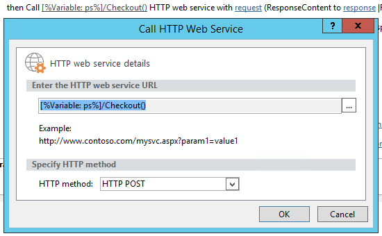

# Пакетное обновление настраиваемых полей и создание сайтов проектов из рабочего процесса в Project OnlineBulk update custom fields and create project sites from a workflow in Project Online

Чтобы помочь клиентам максимально эффективно использовать Project Online и повысить расширяемость и гибкость службы, мы добавили два метода в клиентскую объектную модель, которую можно использовать в приложениях Project Online и рабочих процессах.To help customers get the most out of Project Online and improve our service extensibility and flexibility, we've added two methods to the client-side object model that you can use in Project Online apps and workflows.
  
|||
|:-----|:-----|
|**Упдатекустомфиелдс****UpdateCustomFields**   |Массовое обновление настраиваемых полей проекта.Bulk updates project custom fields. Только для Project Online.For Project Online only. Доступно только в REST API.Available only in the REST API.    |
|**CreateProjectSite****CreateProjectSite**   | Создает сайт проекта.Creates a Project site. Только для Project Online.For Project Online only. Доступно в REST API, управляемой клиентской объектной модели и клиентской объектной модели JavaScript.Available in the REST API, managed client object model, and JavaScript client object model.    |
   
В дополнение к обеспечению большей гибкости эти методы также обеспечивают значительное улучшение производительности при сохранении и публикации проектов в рабочем процессе.In addition to providing more flexibility, these methods also offer significant performance improvements when saving and publishing projects in a workflow. В этой статье описывается, как использовать методы в REST API и приведены инструкции по созданию рабочего процесса, который обновляет настраиваемые поля и рабочий процесс, который создает сайт проекта.This article describes how to use the methods in the REST API and provides instructions for creating a workflow that bulk updates custom fields and a workflow that creates a Project site.
  
> [!NOTE]
> Чтобы узнать больше о вызовах REST API из рабочих процессов SharePoint 2013, ознакомьтесь со статьей [Использование служб REST SharePoint из рабочего процесса с методом POST](https://mysharepointinsight.blogspot.com/2013/05/using-sharepoint-rest-services-from.mdl) и [вызов REST API SharePoint 2013 из рабочего процесса SharePoint Designer](https://sergeluca.wordpress.com/2013/04/09/calling-the-sharepoint-2013-rest-api-from-a-sharepoint-designer-workflow/).To learn more about calling REST APIs from SharePoint 2013 workflows, see [Using SharePoint REST services from workflow with POST method](https://mysharepointinsight.blogspot.com/2013/05/using-sharepoint-rest-services-from.mdl) and [Calling the SharePoint 2013 Rest API from a SharePoint Designer Workflow](https://sergeluca.wordpress.com/2013/04/09/calling-the-sharepoint-2013-rest-api-from-a-sharepoint-designer-workflow/). 
  
## Массовое обновление настраиваемых полей проекта из рабочего процессаBulk update project custom fields from a workflow

Ранее рабочие процессы могли обновлять только одно настраиваемое поле за раз.Previously, workflows could only update one custom field at a time. Одновременное обновление настраиваемых полей проекта может привести к плохому взаимодействию с конечным пользователем при переходе пользователей между страницами сведений о проекте.Updating project custom fields one at a time can result in a poor end-user experience when users transition between Project Detail Pages. Каждое обновление требует отдельного запроса к серверу с помощью действия " **задать поле проекта** " и обновления нескольких настраиваемых полей в сети с низкой задержкой, которая привела к нетривиальной накладной.Each update required a separate server request using the **Set Project Field** action, and updating multiple custom fields on a high-latency, low-bandwidth network resulted in a non-trivial overhead. Чтобы устранить эту проблему, мы добавили метод **упдатекустомфиелдс** в REST API, который позволяет массово обновлять настраиваемые поля.To resolve this issue, we added the **UpdateCustomFields** method to the REST API that lets you bulk update custom fields. Чтобы использовать **упдатекустомфиелдс**, передается словарь, содержащий имена и значения всех настраиваемых полей, которые необходимо обновить.To use **UpdateCustomFields**, you pass in a dictionary that contains the names and values of all the custom fields you want to update.
  
Метод REST можно найти в следующей конечной точке:The REST method can be found at the following endpoint:
  
`https://<site-url>/_api/ProjectServer/Projects('<guid>')/Draft/UpdateCustomFields()`
  
> [!NOTE]
> Замените `<site-url>` заполнитель в ПРИМЕРах URL-адресом сайта Project Web App (PWA) и `<guid>` местозаполнителем проекта UID.Replace the  `<site-url>` placeholder in the examples with the URL of your Project Web App (PWA) site and the  `<guid>` placeholder with your project UID. 
  
В этом разделе описывается создание рабочего процесса, который выполняет массовое обновление настраиваемых полей для проекта.This section describes how to create a workflow that bulk updates custom fields for a project. Рабочий процесс соответствует следующим высокоуровневый процедуре:The workflow follows these high-level steps:
  
- Подождите, пока проект, который требуется обновить, будет возвращенWait for the project that you want to update to get checked in
    
- Создание набора данных, определяющего все обновления настраиваемых полей для проектаBuild a data set that defines all your custom field updates for the project
    
- Извлечение проектаCheck out the project
    
- Вызов **упдатекустомфиелдс** для применения обновлений настраиваемых полей к проектуCall **UpdateCustomFields** to apply the custom field updates to the project 
    
- Запись релевантных сведений в список журнала рабочего процесса (если требуется)Log relevant information to the workflow history list (if required)
    
- Публикация проектаPublish the project
    
- Возврат проектаCheck in the project
    
Конечный рабочий процесс выглядит следующим образом:The final, end-to-end workflow looks like this:
  
![Сквозной рабочий процесс] (media/8c0741f9-7f76-409d-8c00-e7a8c3ddb89f.png "Сквозной рабочий процесс")
  
### Создание рабочего процесса, который выполняет массовое обновление настраиваемых полейTo create a workflow that bulk updates custom fields

1. Необязательный атрибут.Optional. Сохраните полный URL-адрес проекта в переменной, которую можно использовать в рабочем процессе.Store the full URL of your project in a variable that you can use throughout the workflow.
    
    ![Сохранение URL-адреса проекта в переменной] (media/a880c5c6-8e7a-44dd-87e9-7e532169d489.png "Сохранение URL-адреса проекта в переменной")
  
2. Добавьте действие **ДождатьСя события проекта** в рабочий процесс и выберите **при возврате проекта** событие.Add the **Wait for Project Event** action to the workflow and choose the **When a project is checked in** event. 
    
    ДоЖдитесь, ![пока проект будет возвращен] ДоЖдитесь, (media/699aa9c7-b3c9-426e-a775-96993a13559c.png "пока проект будет возвращен")
  
3. Создайте словарь **рекуессеадер** с помощью действия " **Построение словаря** ".Create a **requestHeader** dictionary using the **Build dictionary** action. Вы будете использовать один и тот же заголовок запроса для всех вызовов веб-служб в этом рабочем процессе.You'll use the same request header for all the web service calls in this workflow. 
    
    ![Создание словаря рекуессеадер] (media/83b0aa10-9ab7-43dd-800d-a738bb815876.png "Создание словаря рекуессеадер")
  
4. Добавьте в словарь следующие два элемента:Add the following two items to the dictionary.
    
    |ИмяName|ТипType|ЗначениеValue|
    |:-----|:-----|:-----|
    |AcceptAccept    |СтрокаString    |приложение/JSON; OData = verboseapplication/json; odata=verbose    |
    |Content-TypeContent-Type    |СтрокаString    |приложение/JSON; OData = verboseapplication/json; odata=verbose    |
   
    ![Добавление заголовка Accept] (media/2f2e2016-3c49-4cac-b1e7-f2b8118b840c.png "Добавление заголовка Accept")
  
5. Создайте словарь **рекуестбоди** с помощью действия " **Построение словаря** ".Create a **requestBody** dictionary using the **Build dictionary** action. В этом словаре хранятся все обновления полей, которые требуется применить.This dictionary stores all the field updates that you want to apply. 
    
    Каждое обновление настраиваемого поля требует четыре строки: тип метаданных поля (1), (2), (3), а также (4) тип значения.Each custom field update requires four rows: the field's (1) metadata type, (2) key, (3) value, and (4) value type.
    
    - **__метадата/тип** Тип метаданных поля.**__metadata/type** The field's metadata type. Эта запись всегда одинакова и использует следующие значения:This record is always the same and uses the following values: 
    
       - Name: Кустомфиелддиктионари (i)/__метадата/типе (где **i** это индекс каждого настраиваемого поля в словаре, начиная с 0)Name: customFieldDictionary(i)/__metadata/type (where **i** is the index of each custom field in the dictionary, starting with 0) 
            
       - Тип: StringType: String
            
       - Значение: SP. КлючзначениеValue: SP.KeyValue
    
       ![Определение обновления настраиваемого поля] (media/a4423493-6603-42ee-ae50-1ef74c5c59bd.png "Определение обновления настраиваемого поля")
  
    - **Key (ключ** ) Внутреннее имя настраиваемого поля в формате: *Custom_ce23fbf43fa0e411941000155d3c8201* .**Key** The internal name of the custom field, in the format: *Custom_ce23fbf43fa0e411941000155d3c8201* 
    
       Внутреннее имя настраиваемого поля можно найти, перейдя к конечной точке **internalname —** .`https://<site-url>/_api/ProjectServer/CustomFields('<guid>')/InternalName`You can find the internal name of a custom field by navigating to it's **InternalName** endpoint: `https://<site-url>/_api/ProjectServer/CustomFields('<guid>')/InternalName`
    
       Если настраиваемые поля созданы вручную, значения будут отличаться от "сайт" до "сайт".If you created your custom fields manually, the values will differ from site to site. Если вы планируете повторно использовать рабочий процесс на нескольких сайтах, убедитесь, что идентификаторы настраиваемых полей указаны правильно.If you plan to reuse the workflow across multiple sites, make sure the custom field IDs are correct.
    
    - **Value (значение** ) Значение, присваиваемое настраиваемому полю.**Value** The value to assign to the custom field. Для настраиваемых полей, связанных с таблицами подстановки, необходимо использовать внутренние имена записей таблицы подстановки вместо фактических значений таблицы подстановки.For custom fields that are linked to lookup tables, you need to use the internal names of the lookup table entries instead of the actual lookup table values. 
    
       Внутреннее имя записи таблицы подстановки можно найти на следующей конечной точке:`https://<site-url>/_api/ProjectServer/CustomFields('<guid>')/LookupEntries('<guid>')/InternalName`You can find the internal name of the lookup table entry at the following endpoint: `https://<site-url>/_api/ProjectServer/CustomFields('<guid>')/LookupEntries('<guid>')/InternalName`
    
       Если вы настроили настраиваемое поле таблицы подстановки, чтобы принимать несколько `;#` значений, используйте для сцепления значений (как показано в примере ниже).If you have a lookup table custom field set up to accept multiple values, use  `;#` to concatenate values (as shown in the example dictionary below). 
    
    - **ValueType** Тип обновляемого настраиваемого поля.**ValueType** The type of the custom field you are updating. 
    
       - Для полей Text, Duration, Flag и LookupTable используйте модель EDM. String.For Text, Duration, Flag, and LookupTable fields, use Edm.String
    
       - Для числовых полей используйте модель EDM. Int32, EDM. Double или любой другой тип кода, поддерживаемый ODataFor Number fields, use Edm.Int32, Edm.Double, or any other OData-accepted number type
    
       - Для полей даты используйте модель EDM. DateTimeFor Date fields, use Edm.DateTime
    
       Приведенный ниже пример словаря определяет обновления трех настраиваемых полей.The example dictionary below defines updates for three custom fields. Первый — для настраиваемого поля таблицы подстановки с несколькими значениями, второй — для числового поля, а третья — для поля даты.The first is for a multiple value lookup table custom field, the second is for a number field, and the third is for a date field. Обратите внимание на то, как индекс **кустомфиелддиктионари** увеличивается.Note how the **customFieldDictionary** index increments. 
    
       > [!NOTE]
       > Эти значения предназначены только для наглядности.These values are for illustration purposes only. Используемые пары "ключ — значение" зависят от данных PWA.The key-value pairs you'll use depend on your PWA data. 
  
       |ИмяName|ТипType|ЗначениеValue|
       |:-----|:-----|:-----|
       |Кустомфиелддиктионари (0)/__метадата/типеcustomFieldDictionary(0)/__metadata/type    |СтрокаString    |Состав. КлючзначениеSP.KeyValue    |
       |Кустомфиелддиктионари (0)/КэйcustomFieldDictionary(0)/Key    |СтрокаString    |Настраиваемые\_ce23fbf43fa0e411941000155d3c8201Custom\_ce23fbf43fa0e411941000155d3c8201    |
       |Кустомфиелддиктионари (0)/ВалуеcustomFieldDictionary(0)/Value    |СтрокаString    |Запись\_b9a2fd69279de411940f00155d3c8201; #Entry\_baa2fd69279de411940f00155d3c8201Entry\_b9a2fd69279de411940f00155d3c8201;#Entry\_baa2fd69279de411940f00155d3c8201    |
       |Кустомфиелддиктионари (0)/ВалуетипеcustomFieldDictionary(0)/ValueType    |СтрокаString    |Edm.StringEdm.String    |
       |Кустомфиелддиктионари (1)/__метадата/типеcustomFieldDictionary(1)/__metadata/type    |СтрокаString    |Состав. КлючзначениеSP.KeyValue    |
       |Кустомфиелддиктионари (1)/КэйcustomFieldDictionary(1)/Key    |СтрокаString    |Custom_c7f114c97098e411940f00155d3c8201Custom_c7f114c97098e411940f00155d3c8201    |
       |Кустомфиелддиктионари (1)/ВалуеcustomFieldDictionary(1)/Value    |СтрокаString    |90,590.5    |
       |Кустомфиелддиктионари (1)/ВалуетипеcustomFieldDictionary(1)/ValueType    |СтрокаString    |Edm.DoubleEdm.Double    |
       |Кустомфиелддиктионари (2)/__метадата/типеcustomFieldDictionary(2)/__metadata/type    |СтрокаString    |Состав. КлючзначениеSP.KeyValue    |
       |Кустомфиелддиктионари (2)/КэйcustomFieldDictionary(2)/Key    |СтрокаString    |Custom_c6fb67e0b9a1e411941000155d3c8201Custom_c6fb67e0b9a1e411941000155d3c8201    |
       |Кустомфиелддиктионари (2)/ВалуеcustomFieldDictionary(2)/Value    |СтрокаString    |2015 – 04 – 01T00:00:00.00000002015-04-01T00:00:00.0000000    |
       |Кустомфиелддиктионари (2)/ВалуетипеcustomFieldDictionary(2)/ValueType    |СтрокаString    |Edm.DateTimeEdm.DateTime    |
   
       ![Словарь, определяющий обновление настраиваемых полей] (media/41a1f18f-a6b2-40ff-904b-437baf962621.png "Словарь, определяющий обновление настраиваемых полей")
  
6. Добавьте действие **Call HTTP Web Service** , чтобы вернуть проект.Add a **Call HTTP Web Service** action to check the project out. 
    
    ![Вызов метода Checkout] (media/8ce56014-0317-419b-afa7-229d05c86885.png "Вызов метода Checkout")
  
7. Измените свойства вызова веб-службы, чтобы указать заголовок запроса.Edit the properties of the web service call to specify the request header. Чтобы открыть диалоговое окно **Свойства** , щелкните действие правой кнопкой мыши и выберите пункт **свойства**.To open the **Properties** dialog box, right-click the action and choose **Properties**.
    
    ![Указание заголовка запроса в свойствах вызова веб-службы] (media/d81e92b1-43df-42ad-9cd0-a693f93b164e.png "Указание заголовка запроса в свойствах вызова веб-службы")
  
8. Добавьте действие **Call HTTP Web Service** , чтобы вызвать метод **упдатекустомфиелдс** .Add a **Call HTTP Web Service** action to call the **UpdateCustomFields** method. 
    
    ![Создание действия "вызов веб-службы HTTP] " (media/9a73a201-c035-41b4-8798-506ac48b90f8.png "Создание действия \"вызов веб-службы HTTP") "
  
    Обратите `/Draft/` внимание на сегмент в URL-адресе веб-службы.Note the  `/Draft/` segment in the web service URL. Полный URL-адрес должен выглядеть следующим образом:`https://<site-url>/_api/ProjectServer/Projects('<guid>')/Draft/UpdateCustomFields()`The full URL should look like this: `https://<site-url>/_api/ProjectServer/Projects('<guid>')/Draft/UpdateCustomFields()`
    
    ![Вызов метода упдатекустомфиелдс] (media/03b323f1-8e99-4b18-be18-be505d7cec7e.png "Вызов метода упдатекустомфиелдс")
  
9. Измените свойства вызова веб-службы, чтобы присоединить параметры **рекуессеадер** и **рекуестконтент** к созданным словарям.Edit the properties of the web service call to bind the **RequestHeader** and **RequestContent** parameters to the dictionaries you created. Кроме того, можно создать новую переменную для хранения **респонсеконтент**.You can also create a new variable to store the **ResponseContent**.
    
    ![Привязка словарей к заголовку и содержимому запроса] (media/f96bec92-138e-4eab-b1e7-1ab83d0428a5.png "Привязка словарей к заголовку и содержимому запроса")
  
10. Необязательный атрибут.Optional. ПроЧтите словарь ответа, чтобы проверить состояние задания в очереди и записать сведения в список журнала рабочего процесса.Read from the response dictionary to check the state of the queue job and log the information in the workflow history list.
    
    ![Настройка ведения журнала] (media/7d2f4936-61d7-4906-83e8-7478a5935af5.png "Настройка ведения журнала")
  
11. Добавьте вызов веб-службы в конечную точку **публикации** , чтобы опубликовать проект.Add a web service call to the **Publish** endpoint to publish the project. Всегда используйте один и тот же заголовок запроса.Always use the same request header. 
    
    ![Вызов метода Publish] (media/3b661091-ffae-4d7e-a0bb-5b96a6292731.png "Вызов метода Publish")
  
    ![Свойства для вызова веб-службы публикации] (media/6a80a5d3-7e29-4398-993c-f78b3faca8b1.png "Свойства для вызова веб-службы публикации")
  
12. Добавьте конечный вызов веб-службы в конечную точку **возврата** , чтобы проверить проект в.Add a final web service call to the **Checkin** endpoint to check the project in. 
    
    ![Вызов метода checkin] (media/430510cb-0774-4911-af7f-b565b83eba0e.png "Вызов метода checkin")
  
    ![Свойства для вызова веб-службы возврата] (media/485f48d6-bbb8-4568-9dc3-aae3218f6bd1.png "Свойства для вызова веб-службы возврата")

## Создание сайта проекта из рабочего процессаCreate a Project site from a workflow

Каждый проект может иметь собственные выделенные сайты SharePoint, на которых участники группы могут совместно работать, совместно использовать документы, создавать проблемы и т. д.Every project can have its own dedicated SharePoint sites where team members can collaborate, share documents, raise issues, and so on. Ранее сайты могли быть созданы автоматически только при первой публикации или вручную руководителем проекта в Project Professional или администратором в параметрах PWA, или они могут быть отключены.Previously, sites could only be created automatically on first publish or manually by the project manager in Project Professional or by the administrator in PWA settings, or they could be disabled.
  
Мы добавили метод **CreateProjectSite** , чтобы вы могли выбрать, когда следует создавать сайты проектов.We've added the **CreateProjectSite** method so you can choose when to create project sites. Это особенно полезно для организаций, которые хотят автоматически создавать свои сайты при достижении предложения проекта определенной стадией предварительно определенного рабочего процесса, а не при первой публикации.This is particularly useful for organizations who want to create their sites automatically when a project proposal reaches a specific stage in a pre-defined workflow, rather than on first publish. ОтКладывание создания сайта проекта значительно повышает производительность создания проекта.Postponing project site creation significantly improves the performance of creating a project. 
  
**Необходимые компоненты:** Прежде чем можно будет использовать **CreateProjectSite**, необходимо задать параметр **Разрешить пользователям выбирать** для создания сайта проекта в параметрах **PWA** _Гт_ \* \* подключенные сайты SharePoint \* \* _гт_ **Параметры**.**Prerequisite:** Before you can use **CreateProjectSite**, the **Allow users to choose** setting must be set for project site creation in **PWA Settings** > \*\* Connected SharePoint Sites \*\* > **Settings**.
  
![Настройка параметра "разрешить пользователям выбрать" в параметрАХ PWA] (media/6c6c8175-eb10-431d-8056-cea55718fdb4.png "Параметр, позволяющий пользователям выбирать в параметрАХ PWA")
  
### Создание рабочего процесса, который создает сайт проектаTo create a workflow that creates a Project site

1. Создайте или измените существующий рабочий процесс и выберите шаг, на котором необходимо создать сайты проекта.Create or edit an existing workflow and select the step where you want to create your Project sites.
    
2. Создайте словарь **рекуессеадер** с помощью действия " **Построение словаря** ".Create a **requestHeader** dictionary using the **Build dictionary** action. 
    
    ![Создание словаря рекуессеадер] (media/83b0aa10-9ab7-43dd-800d-a738bb815876.png "Создание словаря рекуессеадер")
  
3. Добавьте в словарь следующие два элемента:Add the following two items to the dictionary.
    
    |ИмяName|ТипType|ЗначениеValue|
    |:-----|:-----|:-----|
    |AcceptAccept    |СтрокаString    |приложение/JSON; OData = verboseapplication/json; odata=verbose    |
    |Content-TypeContent-Type    |СтрокаString    |приложение/JSON; OData = verboseapplication/json; odata=verbose    |
   
    ![Добавление заголовка Accept] (media/2f2e2016-3c49-4cac-b1e7-f2b8118b840c.png "Добавление заголовка Accept")
  
4. Добавьте действие **Call HTTP Web Service** .Add the **Call HTTP Web Service** action. Измените тип запроса, чтобы он использовал **POST**, и задайте URL-адрес в следующем формате:Change the request type to use **POST**, and set the URL using the following format:
    
    `https://<site-url>/_api/ProjectServer/Projects('<guid>')/CreateProjectSite('New web name')`
    
    ![Построение универсальнОГО кода ресурса (URI) конечной точки CreateProjectSite] (media/42a90a5e-8d1b-4667-a933-785175212847.png "Построение универсальнОГО кода ресурса (URI) конечной точки CreateProjectSite")
  
    Передайте имя сайта проекта методу **CreateProjectSite** в виде строки.Pass the name of the Project site to the **CreateProjectSite** method as a string. Чтобы использовать имя проекта в качестве имени сайта, передайте пустую строку.To use the project name as the site name, pass an empty string. Не забудьте использовать уникальные имена, чтобы созданный вами сайт проекта был работать.Be sure to use unique names so the next project site you create will work. 
    
5. Измените свойства вызова веб-службы, чтобы присоединить параметр **рекуессеадер** к созданному вами словарю.Edit the properties of the web service call to bind the **RequestHeader** parameter to the dictionary you created. 
    
    ![Привязка словаря к запросу] (media/61a5a0a8-405f-44eb-b5e7-80b11f7caec3.png "Привязка словаря к запросу")
  
## См. такжеSee also

- [Задачи программирования ProjectProject programming tasks](project-programming-tasks.md)
- [Клиентская объектная модель (CSOM) для Project 2013Client-side object model (CSOM) for Project 2013](client-side-object-model-csom-for-project-2013.md)
- [Рабочие процессы в SharePoint 2013Workflows in SharePoint 2013](https://msdn.microsoft.com/library/e0602371-ae22-44be-8a7e-9e47e9f046d6%28Office.15%29.aspx)
    

