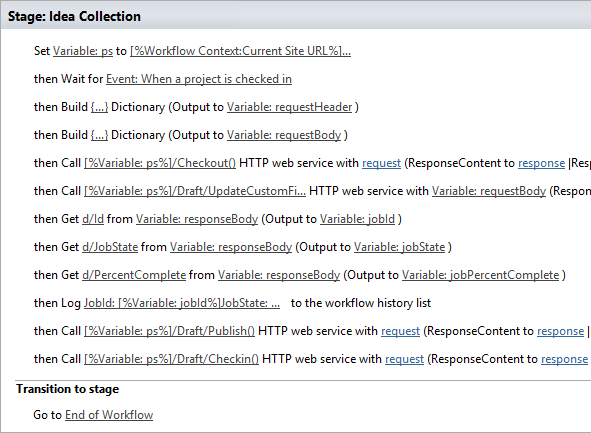
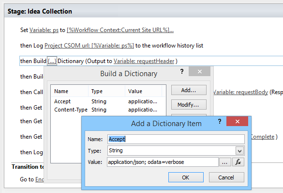
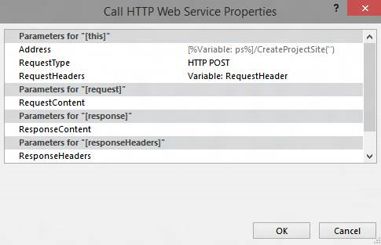

# Пакетное обновление настраиваемых полей и создание сайтов проектов из рабочего процесса в Project OnlineBulk update custom fields and create project sites from a workflow in Project Online

Чтобы помочь пользователям в эффективной Project Online, связанных с нашей службы расширяемость и гибкость, мы добавили два метода для клиентской объектной модели, которые можно использовать в Project Online приложений и рабочих процессов.To help customers get the most out of Project Online and improve our service extensibility and flexibility, we've added two methods to the client-side object model that you can use in Project Online apps and workflows.
  
|||
|:-----|:-----|
|**UpdateCustomFields****UpdateCustomFields**   |Массовое обновление настраиваемых полей проекта.Bulk updates project custom fields. Для Project Online только.For Project Online only. Доступно только в API-Интерфейс REST.Available only in the REST API.    |
|**CreateProjectSite****CreateProjectSite**   | Создание сайта проекта.Creates a Project site. Для Project Online только.For Project Online only. Доступно в API-Интерфейс REST, управляемая клиентская объектная модель и JavaScript клиентской объектной модели.Available in the REST API, managed client object model, and JavaScript client object model.    |
   
Помимо большая гибкость, эти методы также предоставляют значительное улучшение производительности при сохранение и публикация проектов в рабочем процессе.In addition to providing more flexibility, these methods also offer significant performance improvements when saving and publishing projects in a workflow. В этой статье описывается, как использовать методы в API-Интерфейс REST и содержит инструкции по созданию рабочего процесса, массового обновления настраиваемых полей и рабочего процесса, который создает сайта проекта.This article describes how to use the methods in the REST API and provides instructions for creating a workflow that bulk updates custom fields and a workflow that creates a Project site.
  
> [!NOTE]
> Для получения дополнительных сведений о вызове API-интерфейсы REST из рабочих процессов SharePoint 2013, видеть [служб с помощью SharePoint REST из рабочего процесса с помощью метода POST](http://mysharepointinsight.blogspot.com/2013/05/using-sharepoint-rest-services-from.mdl) и [вызов API SharePoint 2013 Rest из рабочего процесса SharePoint Designer](https://sergeluca.wordpress.com/2013/04/09/calling-the-sharepoint-2013-rest-api-from-a-sharepoint-designer-workflow/).To learn more about calling REST APIs from SharePoint 2013 workflows, see [Using SharePoint REST services from workflow with POST method](http://mysharepointinsight.blogspot.com/2013/05/using-sharepoint-rest-services-from.mdl) and [Calling the SharePoint 2013 Rest API from a SharePoint Designer Workflow](https://sergeluca.wordpress.com/2013/04/09/calling-the-sharepoint-2013-rest-api-from-a-sharepoint-designer-workflow/). 
  
## Массовое обновление проекта настраиваемых полей из рабочего процессаBulk update project custom fields from a workflow

Ранее состояние рабочего процесса может только один настраиваемого поля за раз.Previously, workflows could only update one custom field at a time. Обновление проекта настраиваемого поля во время может привести к низкого уровня для конечных пользователей при пользователей перехода между страницы сведений о проекте.Updating project custom fields one at a time can result in a poor end-user experience when users transition between Project Detail Pages. Каждое обновление требуется запроса на отдельном сервере, с использованием действие **Задать поля проекта** , и обновления нескольких настраиваемых полей на высоким уровнем задержки, низкой пропускной способностью сети вызвал необычный накладные расходы.Each update required a separate server request using the **Set Project Field** action, and updating multiple custom fields on a high-latency, low-bandwidth network resulted in a non-trivial overhead. Чтобы устранить эту проблему, мы добавили метод **UpdateCustomFields** API-Интерфейс REST, что позволяет вам массовое обновление настраиваемых полей.To resolve this issue, we added the **UpdateCustomFields** method to the REST API that lets you bulk update custom fields. Чтобы использовать **UpdateCustomFields**, передайте словарь, содержащий имена и значения настраиваемых полей, которые необходимо обновить.To use **UpdateCustomFields**, you pass in a dictionary that contains the names and values of all the custom fields you want to update.
  
Метод REST, можно найти в следующих конечной точки:The REST method can be found at the following endpoint:
  
`https://<site-url>/_api/ProjectServer/Projects('<guid>')/Draft/UpdateCustomFields()`
  
> [!NOTE]
> Замените `<site-url>` заполнитель в разделе примеры URL-адрес сайта Project Web App (PWA) и `<guid>` заполнитель с проектом ИД пользователя.Replace the  `<site-url>` placeholder in the examples with the URL of your Project Web App (PWA) site and the  `<guid>` placeholder with your project UID. 
  
В этом разделе описывается создание рабочего процесса, что массовое обновление настраиваемых полей для проекта.This section describes how to create a workflow that bulk updates custom fields for a project. Рабочий процесс выполняет следующие высокоуровневые действия:The workflow follows these high-level steps:
  
- Подождите для проекта, который необходимо обновить для получения возвратаWait for the project that you want to update to get checked in
    
- Создание набора данных, который определяет все обновления настраиваемого поля проектаBuild a data set that defines all your custom field updates for the project
    
- Извлечение проектаCheck out the project
    
- Вызовите **UpdateCustomFields** , чтобы применить обновления настраиваемого поля в проектCall **UpdateCustomFields** to apply the custom field updates to the project 
    
- Выполните вход информацию в списке журнала рабочего процесса (если необходимо)Log relevant information to the workflow history list (if required)
    
- Публикация проектаPublish the project
    
- Возврат проектаCheck in the project
    
Окончательный начала до конца рабочих процессов выглядит следующим образом:The final, end-to-end workflow looks like this:
  
![Рабочий процесс начала до конца] (media/8c0741f9-7f76-409d-8c00-e7a8c3ddb89f.png "Рабочий процесс начала до конца")
  
### Создание рабочего процесса, что массовое обновление настраиваемых полейTo create a workflow that bulk updates custom fields

1. Необязательный атрибут.Optional. Сохраните полный URL-адрес проекта в переменной, которые можно использовать во всем рабочего процесса.Store the full URL of your project in a variable that you can use throughout the workflow.
    
    ![Хранилище URL-адрес project в переменной] (media/a880c5c6-8e7a-44dd-87e9-7e532169d489.png "Хранилище URL-адрес project в переменной")
  
2. Добавление действия **Ожидание события проекта** в рабочем процессе и выберите событие, **при возврате проекта** .Add the **Wait for Project Event** action to the workflow and choose the **When a project is checked in** event. 
    
    ![Дождитесь проекта для возврата] (media/699aa9c7-b3c9-426e-a775-96993a13559c.png "Дождитесь проекта для возврата")
  
3. Создайте словарь **requestHeader** , с помощью действие при **построении словаря** .Create a **requestHeader** dictionary using the **Build dictionary** action. Для всех вызовов веб-службы в этом рабочем процессе используется один и тот же заголовок запроса.You'll use the same request header for all the web service calls in this workflow. 
    
    ![Создание словаря requestHeader] (media/83b0aa10-9ab7-43dd-800d-a738bb815876.png "Создание словаря requestHeader")
  
4. Добавьте следующие два элемента словаря.Add the following two items to the dictionary.
    
    |ИмяName|ТипType|ЗначениеValue|
    |:-----|:-----|:-----|
    |AcceptAccept    |СтрокаString    |приложение/json; OData = verboseapplication/json; odata=verbose    |
    |Content-TypeContent-Type    |СтрокаString    |приложение/json; OData = verboseapplication/json; odata=verbose    |
   
    ![Добавление заголовков Accept] (media/2f2e2016-3c49-4cac-b1e7-f2b8118b840c.png "Добавление заголовков Accept")
  
5. Создайте словарь **requestBody** , с помощью действие при **построении словаря** .Create a **requestBody** dictionary using the **Build dictionary** action. Данным словарем хранит все обновления поля, которые нужно применить.This dictionary stores all the field updates that you want to apply. 
    
    Каждое обновление настраиваемого поля требуется четыре строки: (1) метаданных типа поля, ключ (2), (3) значение и тип значения (4).Each custom field update requires four rows: the field's (1) metadata type, (2) key, (3) value, and (4) value type.
    
    - **__metadata/тип** Тип поля метаданных.**__metadata/type** The field's metadata type. Эта запись не изменяется и используются следующие значения:This record is always the same and uses the following values: 
    
       - Имя: customFieldDictionary (i) / __metadata/типа (где **i** — индекс каждого настраиваемого поля в словаре, начиная с 0)Name: customFieldDictionary(i)/__metadata/type (where **i** is the index of each custom field in the dictionary, starting with 0) 
            
       - Тип: StringType: String
            
       - Значение: SP. KeyValueValue: SP.KeyValue
    
       ![Определение обновления настраиваемого поля] (media/a4423493-6603-42ee-ae50-1ef74c5c59bd.png "Определение обновления настраиваемого поля")
  
    - **Ключ** Внутреннее имя настраиваемого поля, в формате: *Custom_ce23fbf43fa0e411941000155d3c8201***Key** The internal name of the custom field, in the format: *Custom_ce23fbf43fa0e411941000155d3c8201* 
    
       Внутреннее имя настраиваемого поля можно найти, перейдя к конечной **внутреннееимя** :`https://<site-url>/_api/ProjectServer/CustomFields('<guid>')/InternalName`You can find the internal name of a custom field by navigating to it's **InternalName** endpoint: `https://<site-url>/_api/ProjectServer/CustomFields('<guid>')/InternalName`
    
       При создании настраиваемых полей вручную, значения будут отличаться от сайта для сайта.If you created your custom fields manually, the values will differ from site to site. Если вы планируете повторно использовать рабочий процесс на нескольких сайтах, убедитесь, что настраиваемого поля идентификаторы верны.If you plan to reuse the workflow across multiple sites, make sure the custom field IDs are correct.
    
    - **Значение** Значение, задаваемое для настраиваемого поля.**Value** The value to assign to the custom field. Для настраиваемых полей, связанных с таблицами подстановки необходимо использовать вместо фактического значения таблицы внутренних имен записей в таблице подстановки.For custom fields that are linked to lookup tables, you need to use the internal names of the lookup table entries instead of the actual lookup table values. 
    
       Внутреннее имя записи таблицы подстановки можно найти на следующих конечной точки:`https://<site-url>/_api/ProjectServer/CustomFields('<guid>')/LookupEntries('<guid>')/InternalName`You can find the internal name of the lookup table entry at the following endpoint: `https://<site-url>/_api/ProjectServer/CustomFields('<guid>')/LookupEntries('<guid>')/InternalName`
    
       Если у вас есть настраиваемого поля таблицы подстановки настроен на прием несколько значений, используйте `;#` для объединения значения (как показано в примере словаре ниже).If you have a lookup table custom field set up to accept multiple values, use  `;#` to concatenate values (as shown in the example dictionary below). 
    
    - **Тип значения** Тип настраиваемого поля, которую требуется обновить.**ValueType** The type of the custom field you are updating. 
    
       - Для полей, текст, длительность, флаг и LookupTable используйте Edm.StringFor Text, Duration, Flag, and LookupTable fields, use Edm.String
    
       - Для полей число используйте Edm.Int32, Edm.Double или любой другой принятия OData числовой типFor Number fields, use Edm.Int32, Edm.Double, or any other OData-accepted number type
    
       - Для поля даты используйте Edm.DateTimeFor Date fields, use Edm.DateTime
    
       Ниже примере словаря определяет обновления для трех настраиваемых полей.The example dictionary below defines updates for three custom fields. Во-первых, для нескольких значение настраиваемого поля таблицы подстановки, второй — для числового поля и третий — для поля даты.The first is for a multiple value lookup table custom field, the second is for a number field, and the third is for a date field. Примечание как шагом **customFieldDictionary** индекса.Note how the **customFieldDictionary** index increments. 
    
       > [!NOTE]
       > Эти значения — только для иллюстрации.These values are for illustration purposes only. Пары ключ значение, которые будут использоваться зависят от данных веб-клиента Project.The key-value pairs you'll use depend on your PWA data. 
  
       |ИмяName|ТипType|ЗначениеValue|
       |:-----|:-----|:-----|
       |Тип/__metadata/customFieldDictionary (0)customFieldDictionary(0)/__metadata/type    |СтрокаString    |SP. KeyValueSP.KeyValue    |
       |customFieldDictionary (0) аудио- и ключаcustomFieldDictionary(0)/Key    |СтрокаString    |Настраиваемые\_ce23fbf43fa0e411941000155d3c8201Custom\_ce23fbf43fa0e411941000155d3c8201    |
       |customFieldDictionary (0) / стоимостиcustomFieldDictionary(0)/Value    |СтрокаString    |Запись\_b9a2fd69279de411940f00155d3c8201; #Entry\_baa2fd69279de411940f00155d3c8201Entry\_b9a2fd69279de411940f00155d3c8201;#Entry\_baa2fd69279de411940f00155d3c8201    |
       |customFieldDictionary (0) или тип значенияcustomFieldDictionary(0)/ValueType    |СтрокаString    |Edm.StringEdm.String    |
       |customFieldDictionary (1) / __metadata/типcustomFieldDictionary(1)/__metadata/type    |СтрокаString    |SP. KeyValueSP.KeyValue    |
       |customFieldDictionary (1) запись реестраcustomFieldDictionary(1)/Key    |СтрокаString    |Custom_c7f114c97098e411940f00155d3c8201Custom_c7f114c97098e411940f00155d3c8201    |
       |customFieldDictionary (1) и значенийcustomFieldDictionary(1)/Value    |СтрокаString    |90.590.5    |
       |customFieldDictionary (1) или тип значенияcustomFieldDictionary(1)/ValueType    |СтрокаString    |Edm.DoubleEdm.Double    |
       |customFieldDictionary (2) / __metadata/типcustomFieldDictionary(2)/__metadata/type    |СтрокаString    |SP. KeyValueSP.KeyValue    |
       |customFieldDictionary (2) запись реестраcustomFieldDictionary(2)/Key    |СтрокаString    |Custom_c6fb67e0b9a1e411941000155d3c8201Custom_c6fb67e0b9a1e411941000155d3c8201    |
       |customFieldDictionary (2)-значениеcustomFieldDictionary(2)/Value    |СтрокаString    |2015-04-01T00:00:00.00000002015-04-01T00:00:00.0000000    |
       |customFieldDictionary (2) / тип значенияcustomFieldDictionary(2)/ValueType    |СтрокаString    |Edm.DateTimeEdm.DateTime    |
   
       ![Словарь, который определяет обновления настраиваемых полей] (media/41a1f18f-a6b2-40ff-904b-437baf962621.png "Словарь, который определяет обновления настраиваемых полей")
  
6. Добавление действия **Вызова веб-службы HTTP** для извлечения проекта.Add a **Call HTTP Web Service** action to check the project out. 
    
    ![Вызовите метод Checkout] (media/8ce56014-0317-419b-afa7-229d05c86885.png "Вызовите метод Checkout")
  
7. Изменение свойств вызова веб-службы для указания заголовка запроса.Edit the properties of the web service call to specify the request header. Чтобы открыть диалоговое окно " **Свойства** ", щелкните правой кнопкой мыши действие и выберите **Свойства**.To open the **Properties** dialog box, right-click the action and choose **Properties**.
    
    ![Вызов свойства укажите заголовка запроса в веб-службе] (media/d81e92b1-43df-42ad-9cd0-a693f93b164e.png "Вызов свойства укажите заголовка запроса в веб-службе")
  
8. Добавление действия **Вызова веб-службы HTTP** для вызова метода **UpdateCustomFields** .Add a **Call HTTP Web Service** action to call the **UpdateCustomFields** method. 
    
    ![Создать действие вызова веб-службы HTTP] (media/9a73a201-c035-41b4-8798-506ac48b90f8.png "Создать действие вызова веб-службы HTTP")
  
    Примечание `/Draft/` сегмента в URL-адрес службы.Note the  `/Draft/` segment in the web service URL. Полный URL-адрес должен выглядеть следующим образом:`https://<site-url>/_api/ProjectServer/Projects('<guid>')/Draft/UpdateCustomFields()`The full URL should look like this: `https://<site-url>/_api/ProjectServer/Projects('<guid>')/Draft/UpdateCustomFields()`
    
    ![Вызовите метод UpdateCustomFields] (media/03b323f1-8e99-4b18-be18-be505d7cec7e.png "Вызовите метод UpdateCustomFields")
  
9. Изменение свойств вызова веб-службы для привязки параметров **RequestHeader** и **RequestContent** словарей, созданной.Edit the properties of the web service call to bind the **RequestHeader** and **RequestContent** parameters to the dictionaries you created. Кроме того, можно создать новую переменную для хранения **ResponseContent**.You can also create a new variable to store the **ResponseContent**.
    
    ![Привязка словарей для заголовка запроса и контента] (media/f96bec92-138e-4eab-b1e7-1ab83d0428a5.png "Привязка словарей для заголовка запроса и контента")
  
10. Необязательный атрибут.Optional. Чтение из словаря ответа для проверки состояния задания очереди и записи данных в списке журнала рабочего процесса.Read from the response dictionary to check the state of the queue job and log the information in the workflow history list.
    
    ![Настройка ведения журнала] (media/7d2f4936-61d7-4906-83e8-7478a5935af5.png "Настройка ведения журнала")
  
11. Добавьте вызов веб-службы в конечную точку **публикации** для публикации проекта.Add a web service call to the **Publish** endpoint to publish the project. Всегда используйте один и тот же заголовок запроса.Always use the same request header. 
    
    ![Вызовите метод публикации] (media/3b661091-ffae-4d7e-a0bb-5b96a6292731.png "Вызовите метод публикации")
  
    ![Вызов свойства для публикации веб-службы] (media/6a80a5d3-7e29-4398-993c-f78b3faca8b1.png "Вызов свойства для публикации веб-службы")
  
12. Добавьте последний вызов веб-службы в конечную точку **Checkin** возврат проекта.Add a final web service call to the **Checkin** endpoint to check the project in. 
    
    ![Вызовите метод Checkin] (media/430510cb-0774-4911-af7f-b565b83eba0e.png "Вызовите метод Checkin")
  
    ![Вызов свойства для возврата веб-службы] (media/485f48d6-bbb8-4568-9dc3-aae3218f6bd1.png "Вызов свойства для возврата веб-службы")

## Создание сайта проекта из рабочего процессаCreate a Project site from a workflow

Каждый проект может иметь собственный выделенный сайтов SharePoint, где участники группы можно совместно работать, совместно использовать документы, вызывает проблемы и т.д.Every project can have its own dedicated SharePoint sites where team members can collaborate, share documents, raise issues, and so on. Ранее, сайты могут быть созданы только автоматически в сначала опубликовать или вручную руководителем проекта в Project Professional или администратором в веб-клиента Project параметров или их может быть отключена.Previously, sites could only be created automatically on first publish or manually by the project manager in Project Professional or by the administrator in PWA settings, or they could be disabled.
  
Мы добавили метод **CreateProjectSite** , чтобы вы могли выбрать, когда следует создавать сайты проекта.We've added the **CreateProjectSite** method so you can choose when to create project sites. Это полезно для организаций, которым требуется автоматически создавать их сайты по достижении определенного этапа предварительно определенного рабочего процесса в предложении по проекту, а не при первой публикации.This is particularly useful for organizations who want to create their sites automatically when a project proposal reaches a specific stage in a pre-defined workflow, rather than on first publish. Отсрочка Создание сайта проекта значительно улучшает производительность для создания проекта.Postponing project site creation significantly improves the performance of creating a project. 
  
**Необходимых компонентов:** Прежде чем использовать **CreateProjectSite**, параметр **Разрешить пользователям выбирать,** должен быть задан для создания сайта проекта в **Настройках веб-клиента Project** > ** подключенные сайты SharePoint ** > **Параметры**.**Prerequisite:** Before you can use **CreateProjectSite**, the **Allow users to choose** setting must be set for project site creation in **PWA Settings** > ** Connected SharePoint Sites ** > **Settings**.
  
![Параметр «Разрешить пользователям выбирать» в параметрах веб-клиента Project] (media/6c6c8175-eb10-431d-8056-cea55718fdb4.png "Параметр Разрешить пользователям выбирать в настройках веб-клиента Project")
  
### Создание рабочего процесса, который создает сайта проектаTo create a workflow that creates a Project site

1. Создание или изменение существующих рабочих процессов и выберите действие, где вы хотите создать сайтов проектов.Create or edit an existing workflow and select the step where you want to create your Project sites.
    
2. Создайте словарь **requestHeader** , с помощью действие при **построении словаря** .Create a **requestHeader** dictionary using the **Build dictionary** action. 
    
    ![Создание словаря requestHeader] (media/83b0aa10-9ab7-43dd-800d-a738bb815876.png "Создание словаря requestHeader")
  
3. Добавьте следующие два элемента словаря.Add the following two items to the dictionary.
    
    |ИмяName|ТипType|ЗначениеValue|
    |:-----|:-----|:-----|
    |AcceptAccept    |СтрокаString    |приложение/json; OData = verboseapplication/json; odata=verbose    |
    |Content-TypeContent-Type    |СтрокаString    |приложение/json; OData = verboseapplication/json; odata=verbose    |
   
    ![Добавление заголовков Accept] (media/2f2e2016-3c49-4cac-b1e7-f2b8118b840c.png "Добавление заголовков Accept")
  
4. Добавление действия **Вызова веб-службы HTTP** .Add the **Call HTTP Web Service** action. Измените тип запроса для использования **POST**и задать URL-адрес в следующем формате:Change the request type to use **POST**, and set the URL using the following format:
    
    `https://<site-url>/_api/ProjectServer/Projects('<guid>')/CreateProjectSite('New web name')`
    
    ![Построение URI конечной точки CreateProjectSite] (media/42a90a5e-8d1b-4667-a933-785175212847.png "Построение URI конечной точки CreateProjectSite")
  
    Передайте имя сайта проекта в метод **CreateProjectSite** как строку.Pass the name of the Project site to the **CreateProjectSite** method as a string. Чтобы использовать имя проекта в качестве имени сайта, передайте пустую строку.To use the project name as the site name, pass an empty string. Необходимо использовать уникальные имена, поэтому следующего сайта проекта, вы создаете будут работать.Be sure to use unique names so the next project site you create will work. 
    
5. Изменение свойств вызова веб-службы для привязки параметр **RequestHeader** словаря, созданной.Edit the properties of the web service call to bind the **RequestHeader** parameter to the dictionary you created. 
    
    ![Привязка словаря для запроса] (media/61a5a0a8-405f-44eb-b5e7-80b11f7caec3.png "Привязка словаря для запроса")
  
## См. такжеSee also

- [Задачи программирования ProjectProject programming tasks](project-programming-tasks.md)
- [Клиентская объектная модель (CSOM) для Project 2013Client-side object model (CSOM) for Project 2013](client-side-object-model-csom-for-project-2013.md)
- [Рабочие процессы в SharePoint 2013Workflows in SharePoint 2013](http://msdn.microsoft.com/library/e0602371-ae22-44be-8a7e-9e47e9f046d6%28Office.15%29.aspx)
    

