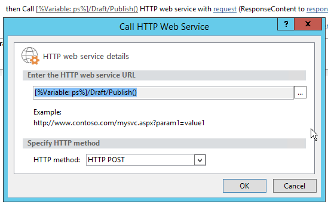

# Пакетное обновление настраиваемых полей и создание сайтов проектов из рабочего процесса в Project Online

Чтобы помочь клиентам получить больше всего Project Online и повысить эластичность и гибкость службы, мы добавили два метода в клиентскую объектную модель, которую можно использовать в Project Online приложениях и рабочего процессах.
  
|||
|:-----|:-----|
|**UpdateCustomFields**   |Объемные обновления проектируемых пользовательских полей. Только Project Online. Доступно только в API REST.    |
|**CreateProjectSite**   | Создает сайт Project. Только Project Online. Доступно в API REST, управляемой клиентской объектной модели и клиентской объектной модели JavaScript.    |
   
Помимо обеспечения большей гибкости, эти методы также обеспечивают значительные улучшения производительности при сохранении и публикации проектов в рабочего процесса. В этой статье описывается использование методов в API REST и содержится инструкция по созданию рабочего процесса, который массово обновляет настраиваемые поля и рабочий процесс, создаваемый Project сайте.
  
> [!NOTE]
> Дополнительные информацию о вызове API REST из рабочего процесса SharePoint 2013 г. см. в публикации Using [SharePoint REST services from workflow with POST](https://mysharepointinsight.blogspot.com/2013/05/using-sharepoint-rest-services-from.mdl) method and Calling the SharePoint [2013 Rest API from a SharePoint Designer Workflow](https://sergeluca.wordpress.com/2013/04/09/calling-the-sharepoint-2013-rest-api-from-a-sharepoint-designer-workflow/). 
  
## Настраиваемые поля проекта bulk update из рабочего процесса

Ранее рабочий процесс мог обновлять только одно пользовательское поле одновременно. Обновление настраиваемого поля проекта по одному может привести к плохому интерфейсу конечных пользователей при переходе пользователей Project страниц детализации. Каждое обновление требовало отдельного запроса сервера с помощью действия **Set Project Field,** а обновление нескольких пользовательских полей в сети с высокой задержкой и низкой пропускной способностью привело к нетривиальным накладным затратам. Чтобы устранить эту проблему, мы добавили метод **UpdateCustomFields** в API REST, который позволяет массово обновлять настраиваемые поля. Чтобы использовать **UpdateCustomFields,** вы передаете в словарь, содержащий имена и значения всех пользовательских полей, которые необходимо обновить.
  
Метод REST можно найти в следующей конечной точке:
  
`https://<site-url>/_api/ProjectServer/Projects('<guid>')/Draft/UpdateCustomFields()`
  
> [!NOTE]
> Замените местообладатель в примерах URL-адресом сайта Project Web App (PWA) и местообладателями вашего проекта `<site-url>` `<guid>` UID. 
  
В этом разделе описывается создание рабочего процесса, который массово обновляет настраиваемые поля для проекта. Рабочий процесс следует следующим шагам высокого уровня:
  
- Подождите, пока проект, который необходимо обновить, чтобы получить регистрацию
    
- Создайте набор данных, определяемый всеми пользовательскими обновлениями поля для проекта
    
- Ознакомьтесь с проектом
    
- Вызов **UpdateCustomFields** для применения пользовательских обновлений поля к проекту 
    
- Войдите соответствующие сведения в список журналов рабочего процесса (при необходимости)
    
- Публикация проекта
    
- Регистрация в проекте
    
Конечный, конечный рабочий процесс выглядит так:
  

  
### Создание рабочего процесса, который массово обновляет настраиваемые поля

1. Необязательный параметр. Храните полный URL-адрес проекта в переменной, которую можно использовать в течение рабочего процесса.
    
    
  
2. Добавьте действие **Wait for Project event** в рабочий процесс и выберите время проверки проекта **в** событии. 
    
     проверки проекта
  
3. Создайте **словарь requestHeader** с помощью действия **словаря Сборка.** Для всех вызовов веб-служб в этом рабочего процесса используется один и тот же заголовок запросов. 
    
    
  
4. Добавьте в словарь следующие два пункта.
    
    |Имя|Тип|Значение|
    |:-----|:-----|:-----|
    |Accept    |String    |application/json; odata=verbose    |
    |Content-Type    |String    |application/json; odata=verbose    |
   
    
  
5. Создайте **словарь requestBody** с помощью действия **словаря Сборка.** В этом словаре хранится все обновления поля, которые необходимо применить. 
    
    Для каждого настраиваемого обновления поля требуется четыре строки: тип метаданных поля (1), ключ (2), значение (3) и (4) значение.
    
    - **__metadata/type** Тип метаданных поля. Эта запись всегда одно и то же и использует следующие значения: 
    
       - Имя: customFieldDictionary(i)/__metadata/type (где **я** — индекс каждого настраиваемого поля в словаре, начиная с 0) 
            
       - Тип: строка
            
       - Значение: SP. KeyValue
    
       
  
    - **Клавиша** Внутреннее имя настраиваемого поля в формате: *Custom_ce23fbf43fa0e411941000155d3c8201* 
    
       Внутреннее имя настраиваемого поля можно найти, переназначив его в конечную точку **InternalName:**`https://<site-url>/_api/ProjectServer/CustomFields('<guid>')/InternalName`
    
       Если вы создали настраиваемые поля вручную, значения будут отличаться от сайта к сайту. Если планируется повторное использование рабочего процесса на нескольких сайтах, убедитесь, что пользовательские ИД поля правильны.
    
    - **Значение** Значение, необходимое для назначения настраиваемой области. Для пользовательских полей, связанных со таблицами lookup, необходимо использовать внутренние имена записей таблицы lookup вместо фактических значений таблицы проверки. 
    
       Внутреннее имя записи таблицы поиска можно найти в следующей конечной точке: `https://<site-url>/_api/ProjectServer/CustomFields('<guid>')/LookupEntries('<guid>')/InternalName`
    
       Если у вас есть настраиваемое поле таблицы lookup, настроенное для пользования несколькими значениями, используйте для одновременного определения значений (как показано в приведенной ниже словаре  `;#` примера). 
    
    - **ValueType** Тип настраиваемого поля, который вы обновляете. 
    
       - Для полей Text, Duration, Flag и LookupTable используйте Edm.String
    
       - Для полей номеров используйте Edm.Int32, Edm.Double или любой другой тип номеров, принятых в OData.
    
       - Для полей Date используйте Edm.DateTime
    
       В приведенном ниже словаре примера определяются обновления для трех настраиваемого поля. Первый — для настраиваемого поля таблицы просмотров нескольких значений, второй — для поля номеров, а третий — для поля дат. Обратите внимание, **как настраиваемый индексFieldDictionary** приращений. 
    
       > [!NOTE]
       > Эти значения только для иллюстрации. Пары значений ключа, которые вы будете использовать, зависят от PWA данных. 
  
       |Имя|Тип|Значение|
       |:-----|:-----|:-----|
       |customFieldDictionary(0)/__metadata/type    |String    |SP. KeyValue    |
       |customFieldDictionary(0)/Key    |String    |Custom \_ ce23fbf43fa0e411941000155d3c8201    |
       |customFieldDictionary(0)/Value    |String    |Запись \_ b9a2fd69279de411940f0155d3c8201;#Entry \_ baa2fd69279de411940f00155d3c8201    |
       |customFieldDictionary(0)/ValueType    |String    |Edm.String    |
       |customFieldDictionary (1)/__metadata/type    |String    |SP. KeyValue    |
       |customFieldDictionary (1)/Key    |String    |Custom_c7f114c97098e411940f00155d3c8201    |
       |customFieldDictionary (1)/Value    |String    |90.5    |
       |customFieldDictionary (1)/ValueType    |String    |Edm.Double    |
       |customFieldDictionary (2)/__metadata/type    |String    |SP. KeyValue    |
       |customFieldDictionary (2)/Key    |String    |Custom_c6fb67e0b9a1e411941000155d3c8201    |
       |customFieldDictionary (2)/Value    |String    |2015-04-01T00:00:00    |
       |customFieldDictionary (2)/ValueType    |String    |Edm.DateTime    |
   
       
  
6. Добавьте действие **Call HTTP Web Service,** чтобы проверить проект. 
    
    
  
7. Изменить свойства вызова веб-службы, чтобы указать заглавную страницу запроса. Чтобы открыть **диалоговое окно Свойства,** щелкните правой кнопкой мыши действие и выберите **Свойства**.
    
    ![Укажите заглавную]страницу запроса в свойствах вызовов веб-службы(media/d81e92b1-43df-42ad-9cd0-a693f93b164e.png "Укажите заглавную страницу запроса в свойствах вызовов веб-службы")
  
8. Добавьте действие **Call HTTP Web Service** для вызова метода **UpdateCustomFields.** 
    
    
  
    Обратите внимание  `/Draft/` на сегмент URL-адреса веб-службы. Полный URL-адрес должен выглядеть так: `https://<site-url>/_api/ProjectServer/Projects('<guid>')/Draft/UpdateCustomFields()`
    
    
  
9. Изменить свойства вызова веб-службы, чтобы привязать параметры **RequestHeader** и **RequestContent** к созданным словарям. Вы также можете создать новую переменную для хранения **ResponseContent.**
    
    ![Привязать словари к загонам]запросов и контенту Привязать словари к загонам(media/f96bec92-138e-4eab-b1e7-1ab83d0428a5.png "и содержимому запроса")
  
10. Необязательный параметр. Ознакомьтесь со словарем ответов, чтобы проверить состояние задания очереди и войти в список журналов рабочего процесса.
    
    
  
11. Добавьте вызов веб-службы в конечную точку **Publish** для публикации проекта. Всегда используйте один и тот же заглавной запрос. 
    
    
  
    
  
12. Добавьте последний вызов веб-службы в конечную точку **Checkin,** чтобы проверить проект. 
    
    
  
    

## Создание Project сайта из рабочего процесса

Каждый проект может иметь собственные сайты SharePoint, на которых члены группы могут сотрудничать, обмениваться документами, поднимать проблемы и так далее. Ранее сайты могли создаваться автоматически только при первой публикации или вручную руководителем проекта в Project профессиональный или администратором в PWA параметрах, или они могут быть отключены.
  
Мы добавили метод **CreateProjectSite,** чтобы вы могли выбрать, когда создавать сайты проекта. Это особенно полезно для организаций, которые хотят автоматически создавать свои сайты, когда предложение проекта достигает определенной стадии в предварительно заданном рабочего процесса, а не при первом публикации. Отсрочка создания сайта проекта значительно повышает производительность создания проекта. 
  
**Обязательное условие:** Прежде чем использовать **CreateProjectSite,** необходимо настроить параметр Allow users **to choose** setting for project site in **PWA Параметры** > ** Connected SharePoint Sites ** > **Параметры**.
  
![Параметр "Разрешить пользователям выбирать"]в PWA параметры Позволяют пользователям выбирать в(media/6c6c8175-eb10-431d-8056-cea55718fdb4.png "PWA параметрах")
  
### Создание рабочего процесса, создаваемного Project сайта

1. Создайте или отредактируете существующий рабочий процесс и выберите шаг, на котором необходимо создать Project сайтов.
    
2. Создайте **словарь requestHeader** с помощью действия **словаря Сборка.** 
    
    
  
3. Добавьте в словарь следующие два пункта.
    
    |Имя|Тип|Значение|
    |:-----|:-----|:-----|
    |Accept    |String    |application/json; odata=verbose    |
    |Content-Type    |String    |application/json; odata=verbose    |
   
    
  
4. Добавьте действие **Call HTTP Web Service.** Измените тип запроса на **использование POST** и установите URL-адрес в следующем формате:
    
    `https://<site-url>/_api/ProjectServer/Projects('<guid>')/CreateProjectSite('New web name')`
    
    Создание конечной точки 
  
    Передайте имя сайта Project **методу CreateProjectSite** в качестве строки. Чтобы использовать имя проекта в качестве имени сайта, передай пустую строку. Не забудьте использовать уникальные имена, чтобы следующий сайт проекта, который вы создали, работал. 
    
5. Изменить свойства вызова веб-службы, чтобы привязать параметр **RequestHeader** к созданному словарю. 
    
    
  
## См. также

- [Задачи программирования Project](project-programming-tasks.md)
- [Клиентская объектная модель (CSOM) для Project 2013](client-side-object-model-csom-for-project-2013.md)
- [Рабочие процессы в SharePoint 2013](https://msdn.microsoft.com/library/e0602371-ae22-44be-8a7e-9e47e9f046d6%28Office.15%29.aspx)
    

