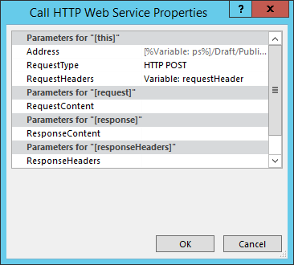

# Пакетное обновление настраиваемых полей и создание сайтов проектов из рабочего процесса в Project Online

Чтобы помочь клиентам использовать Project Online и улучшить возможности и гибкость службы, мы добавили два метода в клиентскую объектную модель, которые можно использовать в приложениях и бизнес-процессах Project Online.
  
|||
|:-----|:-----|
|**UpdateCustomFields**   |Массовое обновление настраиваемой области проекта. Только для Project Online. Доступно только в REST API.    |
|**CreateProjectSite**   | Создает сайт проекта. Только для Project Online. Доступно в REST API, управляемой клиентской объектной модели и клиентской объектной модели JavaScript.    |
   
Помимо повышения гибкости эти методы также обеспечивают значительное повышение производительности при сохранении и публикации проектов в рабочий процесс. В этой статье описано, как использовать методы в API REST, а также инструкции по созданию рабочего процесса, который массово обновляет настраиваемые поля, и рабочего процесса, который создает сайт Проекта.
  
> [!NOTE]
> Чтобы узнать больше о вызове REST API из sharePoint 2013 рабочего процесса, см. использование [служб REST SharePoint](https://mysharepointinsight.blogspot.com/2013/05/using-sharepoint-rest-services-from.mdl) из рабочего процесса с методом POST и вызов [Rest API SharePoint 2013](https://sergeluca.wordpress.com/2013/04/09/calling-the-sharepoint-2013-rest-api-from-a-sharepoint-designer-workflow/)из рабочего процесса SharePoint Designer . 
  
## Массовое обновление настраиваемой поля проекта из рабочего процесса

Ранее рабочий процесс мог обновлять только одно настраиваемые поля за раз. Обновление настраиваемого поля проекта по одному может привести к плохому пользовательскому интерфейсу при переходе пользователей между страницами подробных данных проекта. Для каждого обновления требовался отдельный запрос сервера с помощью действия "Настройка поля проекта", а обновление нескольких настраиваемых полей в сети с высокой задержкой с низкой пропускной способностью привело к нестандартным затратам.  Чтобы устранить эту проблему, мы добавили метод **UpdateCustomFields** в REST API, который позволяет массово обновлять настраиваемые поля. Чтобы использовать **UpdateCustomFields,** необходимо передать словарь, содержащий имена и значения всех настраиваемые поля, которые необходимо обновить.
  
Метод REST можно найти в следующей конечной точке:
  
`https://<site-url>/_api/ProjectServer/Projects('<guid>')/Draft/UpdateCustomFields()`
  
> [!NOTE]
> Замените замещатель в примерах URL-адресом сайта Project Web App (PWA) и замещать на  `<site-url>`  `<guid>` UID проекта. 
  
В этом разделе описывается создание рабочего процесса, который массово обновляет настраиваемые поля для проекта. Рабочий процесс следует следующим высокоуровневым шагам:
  
- Подождите, пока проект, который вы хотите обновить, не будет вернуться
    
- Создание набора данных, который определяет все обновления настраиваемой области для проекта
    
- Ознакомьтесь с проектом
    
- Вызов **UpdateCustomFields** для применения обновлений настраиваемой области к проекту 
    
- Занося соответствующие сведения в список журнала рабочего процесса (при необходимости)
    
- Публикация проекта
    
- Регистрация проекта
    
Конечный, конечный рабочий процесс выглядит так:
  
![Рабочий процесс]"от конца до(media/8c0741f9-7f76-409d-8c00-e7a8c3ddb89f.png "конца\"")
  
### Создание рабочего процесса, который массово обновляет настраиваемые поля

1. Необязательный параметр. Храните полный URL-адрес проекта в переменной, которую можно использовать в рамках рабочего процесса.
    
    
  
2. Добавьте действие **"Ожидание** события проекта" в рабочий процесс и выберите **"Когда проект зарегистрирован в** событии". 
    
    ![Дождись, пока проект не будет зарегистрирован,]дождись его(media/699aa9c7-b3c9-426e-a775-96993a13559c.png "регистрации.")
  
3. Создайте **словарь requestHeader** с помощью действия **"Создание словаря".** Для всех вызовов веб-служб в этом рабочий процесс будет применяться один и тот же заголовщик запросов. 
    
    
  
4. Добавьте в словарь следующие два пункта.
    
    |Имя|Тип|Значение|
    |:-----|:-----|:-----|
    |Accept    |String    |application/json; odata=verbose    |
    |Content-Type    |String    |application/json; odata=verbose    |
   
    
  
5. Создайте **словарь requestBody** с помощью действия **"Создать словарь".** В этом словаре хранится все обновления полей, которые необходимо применить. 
    
    Для каждого обновления настраиваемого поля требуется четыре строки: тип метаданных поля (1), ключ (2), (3) значение и (4) тип значения.
    
    - **__metadata/type** Тип метаданных поля. Эта запись всегда является одинаковой и использует следующие значения: 
    
       - Имя: customFieldDictionary(i)/__metadata/type (где **i** — индекс каждого настраиваемого поля в словаре, начиная с 0) 
            
       - Тип: строка
            
       - Значение: SP. KeyValue
    
       
  
    - **Ключ** Внутреннее имя настраиваемого поля в формате: *Custom_ce23fbf43fa0e411941000155d3c8201* 
    
       Чтобы найти внутреннее имя настраиваемого поля, перейдите к его конечной точке **InternalName:**`https://<site-url>/_api/ProjectServer/CustomFields('<guid>')/InternalName`
    
       Если вы создали настраиваемые поля вручную, значения будут отличаться от сайта к сайту. Если вы планируете повторно использовать рабочий процесс на нескольких сайтах, убедитесь в правильности пользовательских полей.
    
    - **Значение** Значение, назначаемые настраиваемом полю. Для настраиваемого поля, связанного с таблицами подсмотра, необходимо использовать внутренние имена записей таблицы подсмотра, а не фактические значения таблицы подсмотра. 
    
       Внутреннее имя записи таблицы подкачек можно найти в следующей конечной точке: `https://<site-url>/_api/ProjectServer/CustomFields('<guid>')/LookupEntries('<guid>')/InternalName`
    
       Если для настраиваемого поля таблицы подстроки настроено принятие нескольких значений, используйте их для конкатета (как показано в примере  `;#` словаря ниже). 
    
    - **ValueType** Тип обновляемого настраиваемого поля. 
    
       - Для полей Text, Duration, Flag и LookupTable используйте Edm.String
    
       - Для полей Number используйте Edm.Int32, Edm.Double или любой другой тип номера, принятый OData
    
       - Для полей Date используйте Edm.DateTime
    
       В приведенном ниже примере словаря определены обновления для трех настраиваемого поля. Первый — для настраиваемого поля таблицы подкатки с несколькими значениями, второй — для численного поля, а третий — для поля даты. Обратите внимание на то, как приращение индекса **customFieldDictionary.** 
    
       > [!NOTE]
       > Эти значения являются исключительно иллюстрациями. Пары "ключ-значение", которые вы будете использовать, зависят от данных PWA. 
  
       |Имя|Тип|Значение|
       |:-----|:-----|:-----|
       |customFieldDictionary(0)/__metadata/type    |String    |SP. KeyValue    |
       |customFieldDictionary(0)/Key    |String    |Custom \_ ce23fbf43fa0e411941000155d3c8201    |
       |customFieldDictionary(0)/Value    |String    |Запись \_ b9a2fd69279de411940f00155d3c8201;#Entry \_ baa2fd69279de411940f00155d3c8201    |
       |customFieldDictionary(0)/ValueType    |String    |Edm.String    |
       |customFieldDictionary(1)/__metadata/type    |String    |SP. KeyValue    |
       |customFieldDictionary(1)/Key    |String    |Custom_c7f114c97098e411940f00155d3c8201    |
       |customFieldDictionary(1)/Value    |String    |90.5    |
       |customFieldDictionary(1)/ValueType    |String    |Edm.Double    |
       |customFieldDictionary(2)/__metadata/type    |String    |SP. KeyValue    |
       |customFieldDictionary(2)/Key    |String    |Custom_c6fb67e0b9a1e411941000155d3c8201    |
       |customFieldDictionary(2)/Value    |String    |2015-04-01T00:00:00.0000000    |
       |customFieldDictionary(2)/ValueType    |String    |Edm.DateTime    |
   
       ![Словарь, определяемый словарем обновлений настраиваемого]поля, который(media/41a1f18f-a6b2-40ff-904b-437baf962621.png "определяет обновления настраиваемого поля")
  
6. Добавьте действие **"Вызов веб-службы HTTP",** чтобы проверить проект. 
    
    
  
7. Изменение свойств вызова веб-службы для указания загона запроса. Чтобы открыть **диалоговое окно** "Свойства", щелкните правой кнопкой мыши действие и выберите **"Свойства".**
    
    ![Указание заголала запроса в]свойствах вызова веб-службы. Укажите заглавную страницу запроса в свойствах(media/d81e92b1-43df-42ad-9cd0-a693f93b164e.png "вызова веб-службы")
  
8. Добавьте действие **"Вызов веб-службы HTTP"** для вызова метода **UpdateCustomFields.** 
    
    
  
    Обратите внимание  `/Draft/` на сегмент в URL-адресе веб-службы. Полный URL-адрес должен выглядеть так: `https://<site-url>/_api/ProjectServer/Projects('<guid>')/Draft/UpdateCustomFields()`
    
    
  
9. Изменение свойств вызова веб-службы для привязки параметров **RequestHeader** и **RequestContent** к созданным словарям. Вы также можете создать новую переменную для хранения **ResponseContent.**
    
    ![Привязка словарей к загоду]запроса и контенту Привязывать словари(media/f96bec92-138e-4eab-b1e7-1ab83d0428a5.png "к загоду запроса и содержимому")
  
10. Необязательный параметр. Прочитайте словарь ответов, чтобы проверить состояние задания в очереди и зайти в журнал рабочего процесса.
    
    
  
11. Добавьте вызов веб-службы в конечную **точку публикации** для публикации проекта. Всегда используйте один и тот же заголок запроса. 
    
    
  
    
  
12. Добавьте окончательный вызов веб-службы в конечную точку **checkin,** чтобы проверить проект. 
    
    
  
    

## Создание сайта проекта из рабочего процесса

Каждый проект может иметь собственные выделенные сайты SharePoint, где участники группы могут совместно работать, обмениваться документами, выдавать проблемы и так далее. Ранее сайты могли создаваться автоматически только при первой публикации или вручную руководителем проекта в Project профессиональный или администратором в параметрах PWA, или их можно было отключить.
  
Мы добавили метод **CreateProjectSite,** чтобы вы могли выбрать, когда создавать сайты проектов. Это особенно полезно для организаций, которые хотят автоматически создавать свои сайты, когда предложение проекта достигает определенной стадии предварительно определенного рабочего процесса, а не при первой публикации. Откладывание создания сайта проекта значительно повышает производительность при создании проекта. 
  
**Необходимые условия:** Перед использованием **CreateProjectSite**  параметр "Разрешить пользователям выбирать параметры" должен быть установлен для создания сайта проекта в параметрах **PWA** > ** Подключенные сайты SharePoint ** > **Параметры**.
  
![Параметр "Разрешить пользователям выбирать" в]параметрах PWA позволяет пользователям выбирать параметры(media/6c6c8175-eb10-431d-8056-cea55718fdb4.png "PWA")
  
### Создание рабочего процесса, который создает сайт Проекта

1. Создайте или отредактируете существующий рабочий процесс и выберите этап создания сайтов Project.
    
2. Создайте **словарь requestHeader** с помощью действия **"Создание словаря".** 
    
    
  
3. Добавьте в словарь следующие два пункта.
    
    |Имя|Тип|Значение|
    |:-----|:-----|:-----|
    |Accept    |String    |application/json; odata=verbose    |
    |Content-Type    |String    |application/json; odata=verbose    |
   
    
  
4. Добавьте действие **"Вызов веб-службы HTTP".** Измените тип запроса на использование **POST** и заведите URL-адрес в следующем формате:
    
    `https://<site-url>/_api/ProjectServer/Projects('<guid>')/CreateProjectSite('New web name')`
    
    ![Создание URI конечной точки CreateProjectSite,]создав URI конечной(media/42a90a5e-8d1b-4667-a933-785175212847.png "точки CreateProjectSite")
  
    Передайте имя сайта Проекта методу **CreateProjectSite** в качестве строки. Чтобы использовать имя проекта в качестве имени сайта, передав пустую строку. Используйте уникальные имена, чтобы следующий сайт проекта работал. 
    
5. Изменение свойств вызова веб-службы для привязки **параметра RequestHeader** к созданному словарю. 
    
    
  
## См. также

- [Задачи программирования Project](project-programming-tasks.md)
- [Клиентская объектная модель (CSOM) для Project 2013](client-side-object-model-csom-for-project-2013.md)
- [Рабочие процессы в SharePoint 2013](https://msdn.microsoft.com/library/e0602371-ae22-44be-8a7e-9e47e9f046d6%28Office.15%29.aspx)
    

